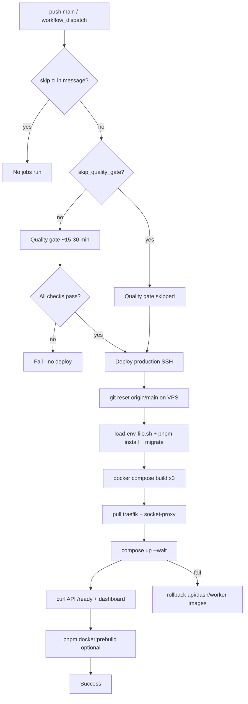

# GitHub Workflows & CI/CD Reference

**Last updated:** 2026-05-29 (pre-deploy verification pass)  
**Primary workflows:** [workflows/deploy.yml](workflows/deploy.yml), [workflows/deploy-staging.yml](workflows/deploy-staging.yml), [workflows/secret-scan.yml](workflows/secret-scan.yml)

This document describes what each `.github/` asset does, how production deploy works end-to-end, required secrets, operational runbooks, and known limitations. It reflects the **current** workflow files after the 2026-05-28 audit.

---

## Table of contents

1. [Workflow inventory](#workflow-inventory)
2. [Production deploy flow](#production-deploy-flow)
3. [Staging deploy flow](#staging-deploy-flow)
4. [Manual deploy (`workflow_dispatch`)](#manual-deploy-workflow_dispatch)
5. [Hotfix / skip quality gate](#hotfix--skip-quality-gate)
6. [`[skip ci]` commits](#skip-ci-commits)
7. [Required GitHub secrets](#required-github-secrets)
8. [Production stack (`infra/prod/docker-compose.yml`)](#production-stack-infraproddocker-composeyml)
9. [Technical decisions](#technical-decisions)
10. [Troubleshooting](#troubleshooting)
11. [Pre-deploy verification checklist](#pre-deploy-verification-checklist)
12. [Audit findings (2026-05-28)](#audit-findings-2026-05-28)
13. [Other `.github/` files](#other-github-files)

---

## Workflow inventory

| File | Triggers | Purpose |
|------|----------|---------|
| **deploy.yml** | `push` → `main`, all `pull_request`, `workflow_dispatch`, `workflow_call` | **Quality gate** (tests, builds, gitleaks, audits) + **Deploy production** (SSH to VPS) |
| **deploy-staging.yml** | `push` → `staging`, `workflow_dispatch` | Reuses **deploy.yml** for quality gate, then SSH deploy to staging (`infra/staging`) |
| **secret-scan.yml** | `push` → `main`, all `pull_request`, weekly cron (Mon 02:30 UTC), `workflow_dispatch` | Standalone **Gitleaks** + SARIF upload to GitHub Security tab |
| **dependabot.yml** | Scheduled (weekly) | npm + GitHub Actions version PRs |

**Not workflows:** [DEPLOYMENT.md](DEPLOYMENT.md), [DEPLOYMENT_FULL_GUIDE.md](DEPLOYMENT_FULL_GUIDE.md), [RUNBOOK_AFTER_CLOUDFLARE_ACTIVE.md](RUNBOOK_AFTER_CLOUDFLARE_ACTIVE.md) — human runbooks. [ISSUE_TEMPLATE/](ISSUE_TEMPLATE/) — issue forms. [PULL_REQUEST_TEMPLATE.md](PULL_REQUEST_TEMPLATE.md), [CODEOWNERS](CODEOWNERS).

---

## Production deploy flow



### Quality gate job (`quality-gate`)

Runs on **every pull request** and on **push to `main`** (unless skipped). Does **not** deploy.

| Step group | What it does |
|------------|----------------|
| Security | `pnpm audit --prod`, **gitleaks/gitleaks-action@v2** |
| Hygiene | Block tracked `.env` and `dist/` / `.next` artifacts |
| Typecheck | API, worker, dashboard, packages, PMS |
| API audits | `check:tenant-scope`, routes, known-paths, api-structure |
| Tests | API (incl. license stability x5), dashboard, PMS, POS, Finance |
| Build | API, infra worker bundle, dashboard |
| Architecture | `pnpm lint:boundaries`, `pnpm architecture:validate` |

**Runtime:** `timeout-minutes: 30` · Node **22.22.1** · pnpm **9.15.9**

### Deploy production job (`deploy`)

Runs only when:

- Not a pull request
- Branch is `main` **or** `workflow_dispatch`
- Quality gate **succeeded** or was **skipped** (hotfix path)
- Commit message does **not** contain `[skip ci]`

**Runtime:** `timeout-minutes: 45` · Environment: **production** · URL: `https://stockix.cloud`

#### SSH script steps (on VPS)

1. `cd` `/opt/stockix/stockixnew` or `/opt/stockix/app`
2. Save previous image IDs (`stockix-api`, `stockix-dashboard`, `stockix-infra-worker`)
3. `trap rollback ERR` — on failure, retag previous images and `compose up` app services only
4. `git fetch` / `checkout main` / `reset --hard origin/main`
5. Validate `apps/api/Dockerfile` and `api-bullmq` has no `build:`
6. `. scripts/load-env-file.sh infra/prod/.env` (never `source`)
7. `NODE_ENV=development pnpm install --frozen-lockfile --ignore-scripts`
8. `db:migrate` + `verify-schema.ts`
9. Fail if `BACKUP_B2_BUCKET` empty
10. `docker compose build` api, dashboard, infra-worker (`COMPOSE_PARALLEL_LIMIT=1`)
11. `docker image inspect` × 3 — fail fast if build produced no image
12. **`docker compose pull traefik socket-proxy`** — refresh pinned edge images
13. **`docker compose up -d --no-build --wait`** — full stack including db-backup
14. `curl` `https://${API_DOMAIN}/ready` and `https://${ROOT_DOMAIN}/`
15. Verify `api` and `infra-worker` running
16. `pnpm docker:prebuild` (non-fatal warning on failure)
17. `docker image prune` (images older than 7 days)

#### Rollback limitations

Rollback only restores **api**, **api-bullmq**, **dashboard**, **infra-worker** images. It does **not** roll back **traefik**, **socket-proxy**, **postgres**, or compose config changes. First deploy has no previous images → rollback logs *"No previous images"* and exits 1.

---

## Staging deploy flow

[deploy-staging.yml](workflows/deploy-staging.yml):

1. **quality-gate** — calls [deploy.yml](workflows/deploy.yml) via `workflow_call` (production deploy job inside deploy.yml is skipped because `github.ref != main`)
2. **deploy-staging** — SSH script parallel to production, but:
   - `git checkout staging` + `merge --ff-only origin/staging`
   - `infra/staging/.env` (includes prod compose via `include:`)
   - Health: `API_DOMAIN` + `DASHBOARD_URL` (not `ROOT_DOMAIN` for dashboard curl)
   - Same **pull**, **rollback**, **prune**, and **api/infra-worker** running checks as production
   - **`[skip ci]`** on push to `staging` skips both jobs (same as production)
3. **Verify staging health** — runner-side `curl https://staging-api.${ROOT_DOMAIN}/ready`

**Secrets:** `STAGING_SSH_PRIVATE_KEY`, `STAGING_EC2_HOST`, `STAGING_EC2_USER`, `ROOT_DOMAIN`

---

## Manual deploy (`workflow_dispatch`)

### Production

1. GitHub → **Actions** → **Deploy Stockix** → **Run workflow**
2. Branch: **`main`** (deploy script always `reset --hard origin/main` on the server)
3. Options:
   - **skip_quality_gate** — emergency deploy without CI (see below)
4. Run

### Staging

1. **Deploy Staging** → **Run workflow**
2. Branch: **`staging`**
3. Optional **skip_quality_gate**

---

## Hotfix / skip quality gate

Use only for **infra-only** or **production-down** emergencies (compose, env loader, Traefik flags). Code changes without tests are risky.

### Steps

1. Actions → **Deploy Stockix** → Run workflow
2. Check **skip_quality_gate: true**
3. Deploy job runs immediately (quality gate job **skipped**)

Staging: same input on **Deploy Staging**.

### What this does **not** skip

- Server-side migrate, build, health curls still run
- `[skip ci]` in commit message still skips **both** jobs on push

### Recommended hotfix path for compose-only

1. Fix `infra/prod/docker-compose.yml` on `main`
2. `workflow_dispatch` with **skip_quality_gate** if CI is blocked but change is verified on running server
3. Re-run full quality gate on next normal push

---

## `[skip ci]` commits

If the **push commit message** contains `[skip ci]`:

- **deploy.yml** (push to `main`): **quality-gate** and **deploy** jobs are skipped
- **deploy-staging.yml** (push to `staging`): **quality-gate** and **deploy-staging** jobs are skipped

Use sparingly (docs-only commits if you accept no deploy). Prefer PRs for docs so `main` stays deployable.

---

## Required GitHub secrets

### Production deploy (required)

| Secret | Used for |
|--------|----------|
| `EC2_SSH_PRIVATE_KEY` | SSH private key (PEM) for VPS |
| `EC2_HOST` | VPS hostname or IP |
| `EC2_USER` | SSH user (`root`, `ubuntu`, etc.) |

### Staging deploy (required for staging workflow)

| Secret | Used for |
|--------|----------|
| `STAGING_SSH_PRIVATE_KEY` | Staging VPS SSH key |
| `STAGING_EC2_HOST` | Staging host |
| `STAGING_EC2_USER` | Staging SSH user |
| `ROOT_DOMAIN` | External health check `staging-api.${ROOT_DOMAIN}` |

### Optional (Sentry release step)

| Secret | Used for |
|--------|----------|
| `SENTRY_AUTH_TOKEN` | Create/finalize release |
| `SENTRY_ORG` | Sentry org slug |
| `SENTRY_PROJECT` | Sentry project slug |
| `SENTRY_DSN` | Passed to step env (release metadata) |

If `SENTRY_AUTH_TOKEN`, `SENTRY_ORG`, and `SENTRY_PROJECT` are unset, the Sentry step is skipped.

**Not in GitHub:** All app secrets (`PLATFORM_API_SECRET`, `CF_DNS_API_TOKEN`, DB passwords, B2 keys) live in **`infra/prod/.env` on the VPS only** — never commit.

---

## Production stack (`infra/prod/docker-compose.yml`)

Verified against git on the pre-deploy pass. Staging uses the same file via `infra/staging/docker-compose.yml` → `include: ../prod/docker-compose.yml`.

| Check | Expected | In compose |
|-------|----------|------------|
| Traefik image | `traefik:v3.4` | ✅ `image: traefik:v3.4` |
| Docker provider endpoint | `tcp://socket-proxy:2375` | ✅ `--providers.docker.endpoint=tcp://socket-proxy:2375` |
| No Docker socket on Traefik | No `/var/run/docker.sock` mount | ✅ Only `traefik_letsencrypt`, `traefik_dynamic` volumes |
| Ping entrypoint | `traefik` (not `web`) | ✅ `--ping.entrypoint=traefik` |
| Internal ping listener | `:8080` | ✅ `--entrypoints.traefik.address=:8080` |
| socket-proxy image | `tecnativa/docker-socket-proxy:latest` | ✅ |
| socket-proxy networks | `socket_proxy_network` only | ✅ |
| Traefik networks | `stockix_public`, `stockix_internal`, `socket_proxy_network` | ✅ |
| API / api-bullmq healthcheck | `http://127.0.0.1:4000/health` | ✅ |
| socket-proxy | No `read_only`; tmpfs `/run`, `/tmp` | ✅ |

**Ops note:** Quote semicolons in `SECURITY_HSTS` / `SECURITY_CSP_BASE` in **`infra/prod/.env` on the VPS** (see `.env.example`). That is not enforced by the workflow.

---

## Technical decisions

### Why `tecnativa/docker-socket-proxy`?

Traefik’s Docker provider needs access to the Docker API. Mounting `/var/run/docker.sock` into Traefik directly is high risk. **socket-proxy** exposes a filtered, read-only HTTP API on port 2375 inside an internal network. Traefik uses `tcp://socket-proxy:2375`.

### Why `docker compose pull traefik socket-proxy` before `up`?

App images (`stockix-api`, etc.) are built on the VPS during deploy. **Traefik** and **socket-proxy** use upstream images (`traefik:v3.4`, `docker-socket-proxy:latest`). Explicit **pull** ensures security patches and `:latest` socket-proxy updates apply without rebuilding app images.

### Why `COMPOSE_PARALLEL_LIMIT=1`?

Serial builds on a small VPS avoid OOM and disk thrash when building API + dashboard + worker. Trade-off: longer deploy (~15–30 min).

### Why `load-env-file.sh` instead of `source .env`?

`SECURITY_HSTS` and `SECURITY_CSP_BASE` contain semicolons. Bash `source` treats `;` as command separators → **exit 127**. The loader exports `KEY=value` safely.

### Why `NODE_ENV=development` for `pnpm install` on VPS?

`infra/prod/.env` sets `NODE_ENV=production`, which makes pnpm skip devDependencies — but **`tsx`** is required for `db:migrate`.

### Why gitleaks in both deploy.yml and secret-scan.yml?

| | deploy.yml quality-gate | secret-scan.yml |
|--|-------------------------|-----------------|
| **When** | PR + pre-deploy on `main` | PR + `main` push + weekly schedule |
| **Tool** | gitleaks-action@v2 | gitleaks CLI 8.30.1 |
| **Output** | Fails job | SARIF → Security tab + artifact |
| **Scope** | Full scan in action | Incremental `log-opts` on PR/push |

**Intentional overlap** — deploy blocks bad merges; secret-scan provides ongoing monitoring and GitHub Security integration. Not redundant in purpose.

### Reusable workflow (`deploy-staging` → `deploy.yml`)

Staging imports the entire **Deploy Stockix** workflow. Production **deploy** job is gated by `github.ref == refs/heads/main`, so it does not run on staging branches. Consider splitting `quality-gate.yml` later if the coupling becomes confusing.

---

## Troubleshooting

### Traefik unhealthy / `compose up --wait` timeout

**Symptoms:** `dependency failed to start: container stockix-traefik-1 is unhealthy`

**Common causes:**

| Cause | Fix |
|-------|-----|
| `--ping.entrypoint=web` (HTTP→HTTPS redirect breaks ping) | Compose must use `--ping.entrypoint=traefik` and `--entrypoints.traefik.address=:8080` (current `main`) |
| socket-proxy down | `docker compose logs socket-proxy`; image `:latest`, tmpfs `/run` + `/tmp` |
| ACME / Cloudflare token | `CF_DNS_API_TOKEN`, DNS records |
| Traefik cannot reach Docker API | Ensure Traefik is on `socket_proxy_network` and endpoint is `tcp://socket-proxy:2375` (not host socket) |

**On server (temporary):** `docker compose logs traefik --tail 100`

### Rollback triggered

**Log:** `Deploy failed — attempting rollback to previous images.`

- Previous **api/dashboard/worker** tags restored
- **Traefik/socket-proxy/postgres** unchanged
- If first deploy: no previous images

Fix root cause, push to `main`, re-run workflow.

### DB migration failed

**Symptoms:** `pnpm --filter @repo/db db:migrate` exits non-zero in SSH log

| Cause | Fix |
|-------|-----|
| Postgres not reachable | `docker compose ps postgres`; port `127.0.0.1:54330` |
| `tsx` missing | Ensure `NODE_ENV=development pnpm install` in script |
| `pgcrypto` | Migration `0053` + `migrate.ts` ensure extension |

### `BACKUP_B2_BUCKET is empty`

Deploy **intentionally fails** — set bucket in `infra/prod/.env` on VPS.

### SSH / connection timeout

| Check | Action |
|-------|--------|
| `EC2_HOST` / key | GitHub secrets |
| Hostinger firewall | TCP 22, 80, 443 |
| `ssh root@host true` | From outside |

### API healthcheck failing after deploy

Container healthcheck uses **`http://127.0.0.1:4000/health`** (not `/ready`). External curl uses **`/ready`** (DB + Redis readiness).

### `pnpm` interactive prompt on VPS

Ensure `CI=true` and `PNPM_CONFIG_CONFIRM_MODULES_PURGE=false` in SSH script (already set).

### Staging deploy ran compose on runner (historical bug)

If `docker compose up` lines are not indented inside the SSH heredoc, they execute on the GitHub runner. **Fixed 2026-05-28** — lines must be indented with other `REMOTE` script lines (verify in [deploy-staging.yml](workflows/deploy-staging.yml) before each release).

---

## Pre-deploy verification checklist

Cross-check before pushing to `main`:

| Area | Verify |
|------|--------|
| **deploy.yml** | `[skip ci]` on push; `skip_quality_gate` input; deploy `if` allows `needs.quality-gate` skipped; `pull traefik socket-proxy`; Sentry `if` uses `secrets.SENTRY_*`; job timeouts 30 / 45 |
| **deploy-staging.yml** | `compose up` indented in heredoc; `skip_quality_gate`; timeout 45; pull + rollback + prune; `[skip ci]` on staging push |
| **secret-scan.yml** | Gitleaks **8.30.1**; SARIF upload; concurrency group |
| **compose** | Traefik **v3.4**, ping on **:8080** / entrypoint **traefik**, socket-proxy **:latest**, API health **/health** |
| **VPS `.env`** | `SECURITY_HSTS` / `SECURITY_CSP_BASE` quoted; `BACKUP_B2_BUCKET` set |

---

## Audit findings (2026-05-28)

### Fixed in this audit (workflows)

| Issue | Severity | Fix |
|-------|----------|-----|
| **deploy-staging.yml** `docker compose up` not indented in SSH heredoc | **Critical** | Indented; runs on VPS again |
| No **`[skip ci]`** support | Medium | Added to deploy.yml |
| No **hotfix / skip quality gate** path | Medium | `workflow_dispatch` input `skip_quality_gate` |
| **Sentry** step `if: env.SENTRY_DSN` never true | Low | `if: secrets.SENTRY_AUTH_TOKEN != ''` … |
| Staging missing **timeout**, **BACKUP_B2** check, **pull**, guards | Medium | Aligned with production script |
| Staging **trap** / prune order | Low | Matched production |

### Resolved since initial audit

| Issue | Status |
|-------|--------|
| Traefik `--ping.entrypoint=traefik` + `:8080` entrypoint | ✅ In `infra/prod/docker-compose.yml` |
| Traefik image `v3.4` | ✅ In compose |
| Staging `compose up` heredoc indentation | ✅ Fixed |

### Still ops-only (not in git)

| Issue | Location | Action |
|-------|----------|--------|
| `SECURITY_*` unquoted in `infra/prod/.env` | VPS / gitignored | Quote values per `.env.example` |

See [docs/deploy-final-audit.md](../docs/deploy-final-audit.md) for historical compose vs server notes.

### Professional standards checklist

| Practice | deploy.yml | deploy-staging | secret-scan |
|----------|------------|----------------|-------------|
| `timeout-minutes` on jobs | ✅ 30 / 45 | ✅ 45 | ✅ 10 |
| `concurrency` group | ✅ | ✅ | ✅ |
| `permissions` minimal | ✅ read | ✅ read | ✅ read + security-events |
| Pinned actions | ⚠️ `@v4` / `@v2` majors | same | same — Dependabot updates |
| Secrets in logs | ✅ heredoc quoted | ✅ | ✅ redact |
| `workflow_dispatch` | ✅ | ✅ | ✅ |

### Documentation drift

| Doc says | Workflow does |
|----------|----------------|
| DEPLOYMENT.md: `compose up --build` | `build` then `up --no-build --wait` |
| DEPLOYMENT.md: repo at `/opt/stockix/app` | Script prefers `/opt/stockix/stockixnew` |

---

## Other `.github/` files

| File | Notes |
|------|-------|
| **dependabot.yml** | Weekly npm + actions; groups minors; ignores React/Next majors |
| **CODEOWNERS** | `@iamtheghost69mess-byte` on critical paths |
| **ISSUE_TEMPLATE/** | Bug + feature forms; security via private advisory link |
| **PULL_REQUEST_TEMPLATE.md** | Test checklist; links `docs/ENV_REFERENCE.md` |
| **DEPLOYMENT*.md / RUNBOOK** | Operator guides; link from issue template config |

---

## Quick command reference (operators)

```bash
# On VPS after failed deploy
cd /opt/stockix/stockixnew/infra/prod
docker compose --env-file .env ps
docker compose --env-file .env logs traefik --tail 80
docker compose --env-file .env logs api --tail 80

# Local mirror of CI quality gate
pnpm quality-gate:local
```

---

*For VPS bootstrap and Cloudflare, start with [RUNBOOK_AFTER_CLOUDFLARE_ACTIVE.md](RUNBOOK_AFTER_CLOUDFLARE_ACTIVE.md).*
