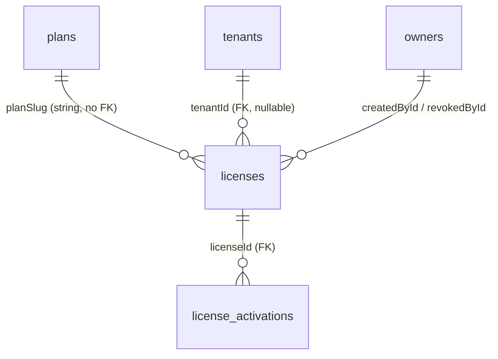

# Plans & Licenses Audit
Date: Friday, May 22, 2026

Read-only audit of plans and licenses across database schema, API, dashboard UI, worker, and finance server.

---

## 1. Database Schema

### Plans table (`plans`)

| Field | Type | Nullable | Default | Purpose |
|-------|------|----------|---------|---------|
| `id` | uuid | NO | `gen_random_uuid()` | Primary key |
| `name` | text | NO | — | Display name |
| `slug` | text | NO | — | Stable identifier; unique index `plans_slug_unique` |
| `description` | text | YES | null | Optional marketing/description text |
| `maxOrganizations` | integer | NO | `1` | Max orgs per tenant; `-1` = unlimited (comment in licenses table; same convention on plans) |
| `maxActivations` | integer | NO | `1` | Max POS/device activations (plan-level default; not auto-copied to licenses on generate) |
| `isActive` | boolean | NO | `true` | Soft-active flag; “delete” sets this to `false` |
| `sortOrder` | integer | NO | `0` | UI ordering |
| `createdAt` | timestamptz | NO | `now()` | Created timestamp |
| `updatedAt` | timestamptz | NO | `now()` | Updated timestamp |

**Not present on plans:** `price`, billing interval/duration, end date/expiry, `product`, `platform`.

**Allowed values (enforced in API, not DB CHECK):**
- `slug`: regex `^[a-z0-9]+(?:-[a-z0-9]+)*$` (create); immutable on edit
- `maxOrganizations`: integer `-1` … `9999` (`-1` = unlimited)
- `maxActivations`: integer `1` … `9999`
- `isActive`: boolean
- `sortOrder`: `0` … `9999`

**Seed data** (migration `0012_phase3_licensing.sql`): `starter`, `growth`, `pro`, `enterprise`.

---

### Licenses table (`licenses`)

| Field | Type | Nullable | Default | Purpose |
|-------|------|----------|---------|---------|
| `id` | uuid | NO | `gen_random_uuid()` | Primary key |
| `licenseKey` | text | NO | — | Unique key `STKX-XXXX-XXXX-XXXX`; see generation below |
| `product` | text | NO | `'platform'` | `platform` \| `pos_desktop` \| `bundle` (API enum) |
| `planSlug` | text | NO | `'starter'` | **String reference** to `plans.slug` (no FK) |
| `tenantId` | uuid | YES | null | FK → `tenants.id` ON DELETE SET NULL |
| `status` | text | NO | `'unassigned'` | `unassigned` \| `active` \| `revoked` \| `expired` (app-level; no DB enum) |
| `activatedAt` | timestamptz | YES | null | Set on assign / provision / generate-with-tenant |
| `validFrom` | timestamptz | YES | null | Optional start; checked on activate & org limits |
| `expiresAt` | timestamptz | YES | null | Null if perpetual |
| `isPerpetual` | boolean | NO | `false` | Bypasses expiry checks when true |
| `maxActivations` | integer | NO | `1` | Max devices; enforced on `/licenses/activate` |
| `maxOrganizations` | integer | NO | `1` | Enforced in `plan-limits.ts` for org creation (`-1` = unlimited) |
| `activationCount` | integer | NO | `0` | Denormalized counter; incremented/decremented on activate/deactivate/revoke |
| `gracePeriodDays` | integer | NO | `7` | Offline grace + finance grace calculation |
| `notes` | text | YES | null | Admin notes |
| `createdById` | uuid | YES | null | FK → `owners.id` ON DELETE SET NULL |
| `revokedAt` | timestamptz | YES | null | Set on revoke |
| `revokedById` | uuid | YES | null | FK → `owners.id` |
| `revokeReason` | text | YES | null | Optional revoke reason |
| `createdAt` | timestamptz | NO | `now()` | |
| `updatedAt` | timestamptz | NO | `now()` | |

**Indexes:** `licenses_key_unique`, `licenses_tenant_id_idx`, `licenses_status_idx`, `licenses_product_idx`, `licenses_expires_at_idx`.

**`licenseKey` generation** (`apps/api/src/license-utils.ts`):
- 12 random bytes → charset `A-Z0-9` → format `STKX-XXXX-XXXX-XXXX`
- Not JWT/UUID/hash of tenant data; collision retried up to 3 times on insert

**`planSlug` connection:** Copied as plain text at license create/generate/provision. Validated only that an **active** plan row exists with matching `slug` on generate and tenant provision. No FK; plan deactivation does not update existing licenses.

**`tenantId`:** Optional until assign. Multiple license rows per tenant are allowed (no unique constraint on `tenantId`). “Current” license for limits/sync is effectively “latest active non-expired” or “any `.limit(1)`” depending on code path (inconsistent).

**`status` values:**
| Status | Meaning |
|--------|---------|
| `unassigned` | Generated, no tenant |
| `active` | Assigned to tenant (or generated with `tenantId`) |
| `revoked` | Admin revoke; terminal |
| `expired` | Set by worker when `expiresAt` passed (status flip only) |

There is **no** `suspended` on `licenses`; tenant suspension is on `tenants.status` and mapped to finance `suspended`.

**`product` vs `platform`:** Only `product` exists on licenses (`platform`, `pos_desktop`, `bundle`). No separate `platform` column. Product drives POS activation UI and offline tokens; platform licenses skip activation UI counts in dashboard.

---

### `license_activations` table

| Field | Type | Nullable | Default | Purpose |
|-------|------|----------|---------|---------|
| `id` | uuid | NO | random | PK |
| `licenseId` | uuid | NO | — | FK → `licenses.id` CASCADE |
| `hardwareFingerprint` | text | NO | — | Device id; unique per license |
| `machineName` | text | YES | null | |
| `ipAddress` | text | YES | null | |
| `activationStatus` | text | NO | `'active'` | `active` \| `deactivated` \| `blacklisted` |
| `offlineToken` | text | YES | null | JWT (HS256) for offline POS |
| `offlineTokenExpiresAt` | timestamptz | YES | null | ~30 days from sign |
| `deactivatedAt` | timestamptz | YES | null | |
| `deactivatedById` | uuid | YES | null | FK → `owners` |
| `activatedAt` | timestamptz | NO | `now()` | |
| `createdAt` | timestamptz | NO | `now()` | |

Unique: `(licenseId, hardwareFingerprint)`.

---

### `blacklisted_fingerprints` table

Global device block list; blacklisting sets matching activations to `blacklisted`.

---

### Other related tables

| Table | Relation to licensing |
|-------|----------------------|
| `tenants.planSlug` | Denormalized plan on tenant; updated when license assigned/generated with tenant |
| `admin_audit_log` | Actions: `plan.*`, `license.*`, `license.auto_assigned_on_provision`, `fingerprint.blacklisted` — **not** a license history table |
| `tenant_deployments.financeTenantId` | Required for finance license sync |

**No** dedicated `license_history` or `license_audits` table.

---

### Relationship (plans ↔ licenses ↔ tenants)



- **Plans → licenses:** Logical link via `licenses.planSlug` = `plans.slug`. Plan limits on `plans` are **not** automatically copied to `licenses.maxOrganizations` / `maxActivations` on generate (defaults used unless UI/API overrides activations only).
- **Licenses → tenants:** Optional FK; assign sets `tenantId` + `status=active` + updates `tenants.planSlug`.
- **Finance:** Separate `tenant_licenses` in MySQL (finance stack), synced via HTTP POST.

---

## 2. API Routes

Auth: Most routes require platform secret, API key, or owner session + RBAC (`apps/api/src/middleware/rbac.ts`). Exceptions noted.

### Plan routes

| Method | Path | Purpose | Auth / role | Works? |
|--------|------|---------|-------------|--------|
| GET | `/plans` | List plans + `activeLicenseCount` per slug | **Public** (no auth) | ✅ |
| POST | `/plans` | Create plan | `super_admin` | ✅ |
| PATCH | `/plans/:planId` | Update plan (not slug) | `super_admin` | ✅ |
| DELETE | `/plans/:planId` | Soft-deactivate (`isActive=false`); blocks if active licenses | `super_admin` | ✅ |

**POST body:** `{ name, slug, description?, maxOrganizations, maxActivations, isActive, sortOrder }`  
**Response:** `{ plan: <row> }` (201)

**GET response:** `{ plans: [{ id, name, slug, description, maxOrganizations, maxActivations, isActive, sortOrder, activeLicenseCount, createdAt, updatedAt }] }`

---

### License routes

| Method | Path | Purpose | Auth / role | Works? |
|--------|------|---------|-------------|--------|
| POST | `/licenses/generate` | Bulk generate keys | `super_admin` | ⚠️ See bugs (plan limits not copied) |
| GET | `/licenses` | Paginated list + filters | `read_only` | ✅ |
| GET | `/licenses/analytics` | Counts by status/product/plan | `read_only` | ✅ |
| GET | `/licenses/export.csv` | CSV export | `read_only` | ✅ |
| GET | `/licenses/:licenseId` | Detail + activations | `read_only` | ✅ |
| PATCH | `/licenses/:licenseId` | Update `notes` only | `billing_manager` | ✅ |
| POST | `/licenses/:licenseId/assign` | Assign unassigned → tenant | `super_admin` | ✅ |
| POST | `/licenses/:licenseId/extend` | Extend expiry / perpetual | `billing_manager` | ✅ |
| POST | `/licenses/:licenseId/revoke` | Revoke + deactivate activations | `super_admin` | ✅ |
| POST | `/licenses/:licenseId/activations/:activationId/deactivate` | Deactivate device | `support_agent` | ✅ |
| POST | `/licenses/activate` | POS/hardware activation + offline JWT | **Public** | ⚠️ Allows `unassigned` status |
| POST | `/licenses/verify-offline` | Verify offline JWT | **Public** | ✅ |
| POST | `/fingerprints/blacklist` | Blacklist fingerprint | `super_admin` | ✅ |

**POST `/licenses/generate` body:**
```json
{
  "product": "platform" | "pos_desktop" | "bundle",
  "planSlug": "string",
  "count": 1-100,
  "isPerpetual": true,
  "expiresAt": "ISO datetime (optional)",
  "validFrom": "ISO datetime (optional)",
  "maxActivations": 1-50,
  "gracePeriodDays": 0-365,
  "notes": "optional",
  "tenantId": "uuid (optional)"
}
```
**Response:** `{ licenses: [{ id, licenseKey, product, planSlug, status }] }` (201)

**Assign body:** `{ tenantId, validFrom? }`  
**Revoke body:** `{ reason? }`  
**Extend body:** `{ expiresAt?, isPerpetual? }`

---

### License generation (summary)

| Question | Answer |
|----------|--------|
| Algorithm | `randomBytes(12)` → `STKX-XXXX-XXXX-XXXX` |
| Trigger | Manual: dashboard “Generate license”; auto: tenant provision complete (worker callback in API) |
| Automatic on tenant create? | Yes, on provision **complete** unless `assign_existing_license_id` |
| Data in key | None (opaque random) |

**Provision auto-license** (`apps/api/src/index.ts` ~1259): `product: platform`, `planSlug` from job payload (default `starter`), `isPerpetual: true`, `maxActivations: 1`, does **not** set `maxOrganizations` from plan (DB default `1`).

---

### `maxActivations` enforcement

| Layer | Enforced? | How |
|-------|-----------|-----|
| `/licenses/activate` | ✅ | Compares `activationCount` vs `maxActivations`; blocks with `max_activations_reached` |
| Reactivation of deactivated device | ✅ | Re-checks count before re-activating |
| Revoke | ✅ | Decrements count by number of active activations |
| Org creation (`canCreateOrganization`) | ❌ | Uses `maxOrganizations`, not activations |
| Finance sync | Uses **plan** `maxActivations` as `maxUsers` | Misaligned naming |

**Counter:** `licenses.activationCount` maintained in application code (not DB trigger).

---

### Product / platform

| Field | Where | Values |
|-------|-------|--------|
| `product` | `licenses` only | `platform`, `pos_desktop`, `bundle` |
| `platform` | N/A as column | “Platform” is a **product** value |
| Plan catalog | No product dimension | Same plans for all products |

Access impact:
- **Control plane:** `product` filters UI; platform hides activation counts.
- **POS:** `activate` / offline JWT include `product` + `planSlug`.
- **Finance:** Sync does not send `product`; uses `planSlug`, limits, status.

---

### Tenant provision (license-related)

| Method | Path | License behavior |
|--------|------|------------------|
| POST | `/tenants` | Body: `plan_slug`, optional `assign_existing_license_id`; validates plan + unassigned license |
| (internal) | Job complete handler | Auto-creates license or assigns existing; syncs finance if `financeTenantId` set |

---

## 3. Frontend UI

### Plans UI (`apps/dashboard/app/(dashboard)/plans/page.tsx`)

| Feature | Present? |
|---------|----------|
| Create form: name, slug, description | ✅ |
| maxOrganizations (+ unlimited -1) | ✅ |
| maxActivations | ✅ |
| sortOrder, isActive | ✅ |
| Price / billing interval | ❌ |
| Product selector | ❌ |
| End date on plan | ❌ |
| List: slug, max orgs, activations, active/inactive | ✅ |
| Edit plan | ✅ (slug read-only) |
| Delete | ✅ (labeled “Deactivate”; API DELETE) |
| Access | `canAccessSettings` (Super Admin) |

Proxies: `GET/POST /api/plans`, `PATCH/DELETE /api/plans/[planId]`.

---

### Licenses UI

**List** (`licenses/page.tsx`):
- Generate button → `LicenseGenerateDialog` → `POST /api/licenses/generate`
- Filters: status, product, plan (hardcoded starter/growth/pro/enterprise — **not** loaded from API)
- Assign / revoke from row menu
- Status badges, activations column (hidden for platform), expiry/perpetual
- Export CSV

**Generate dialog** (`license-generate-dialog.tsx`):
- Product, plan (from API), count, perpetual vs fixed expiry, validFrom, maxActivations (non-platform), grace days, optional tenant assign
- Does **not** expose `maxOrganizations` (not in API generate body anyway)

**Detail** (`licenses/[id]/page.tsx`):
- Full metadata, activations table, assign, extend, revoke, deactivate device, blacklist fingerprint
- Extend: `POST .../extend` (billing_manager capability)

**Tenant page** (`tenants/[id]/page.tsx`):
- Shows primary license (first from `GET /api/licenses?tenantId=&pageSize=1`)
- License history (pageSize 50)
- Generate & assign, assign existing unassigned, revoke
- Plan shown from `tenant.planSlug`

---

## 4. Worker Service (`infra/worker-service/src/worker.ts`)

| Behavior | Detail |
|----------|--------|
| Auto-assign license on provision? | Done in **API** job-complete handler, not worker TS directly |
| Default plan | `starter` (from job payload `planSlug`) |
| `expiresAt` on auto-license | Not set (perpetual) |
| Finance sync after provision | API calls `syncFinanceLicenseForStockixTenant` when `financeTenantId` known |
| License expiry cron | ✅ `expireDueLicenses` every 5 min when idle: sets `status='expired'` where `active` + non-perpetual + `expiresAt <= now` |
| Finance sync on expiry | ❌ Not triggered |
| Expired email | ❌ `sendLicenseExpiredEmail` never called |

Worker also references `syncFinanceLicense` adapter under `infra/worker-service/domain/provisioning/adapters/` for provision-time finance pushes (defaults: `owner-managed`, perpetual, etc.).

---

## 5. Finance Server Connection

### Model: `tenant_licenses` (MySQL, finance stack)

| Column | Type | Notes |
|--------|------|-------|
| `tenant_id` | bigint unique FK | Finance tenant id (numeric) |
| `plan_slug` | string | Default `owner-managed` |
| `status` | enum | `active`, `expired`, `suspended`, `grace` |
| `valid_from`, `expires_at` | timestamps | |
| `grace_period_days` | int | Default 30 in DB |
| `max_users` | int | Mapped from Stockix **plan.maxActivations** |
| `max_organizations` | int | From Stockix **plan.maxOrganizations** |
| `is_perpetual` | boolean | |
| `feature_flags` | json nullable | Always null from sync |

### Sync endpoint

- **URL:** `POST {tenantInternalBaseUrl}/api/internal/license/sync`
- **Auth:** Header `x-internal-secret` = `INTERNAL_API_SECRET`
- **Controller:** `InternalLicense.controller.ts` → `SyncLicense.service.ts` (upsert by `tenantId`)

### Triggers (Stockix control plane)

| Event | Sync? |
|-------|-------|
| Provision complete (finance tenant id known) | ✅ `syncFinanceLicenseForStockixTenant` |
| License assign | ✅ `triggerFinanceLicenseSync` |
| License extend | ✅ |
| License revoke | ✅ |
| Worker expiry scan | ❌ |
| Generate (unassigned) | ❌ |

### Payload source (`finance-license.client.ts`)

- Reads **first** license row for tenant (`.limit(1)`, no order)
- `planSlug` from license or tenant fallback
- `maxOrganizations` / `maxUsers` from **plans** table, not `licenses.maxOrganizations`
- `status`: maps `revoked` → `suspended`; tenant `suspended` → `suspended`; else largely `active` (does not map worker `expired` status unless license row status is `expired`)

### LicenseGuard (`LicenseGuard.middleware.ts`)

- Runs on finance API (except public prefixes)
- Resolves tenant by `organization-id` header
- Caches effective status 60s
- **active:** allow all
- **grace:** block POST/PUT/PATCH/DELETE (402)
- **expired / suspended:** block writes (402)
- No license row: **allows** request (permissive)

`License.service.resolveEffectiveStatus`: perpetual → always `active`; expired status may still be `grace` until grace end.

---

## 6. Bugs & Broken Connections

### Critical

| # | Description | Where | Expected vs actual | Severity |
|---|-------------|-------|-------------------|----------|
| C1 | **Plan `maxOrganizations` not copied to license on generate/provision** | `license-http.ts` generate ~275-292; provision ~1259-1272 | License should inherit plan limits for `getMaxOrganizations()` | `licenses.maxOrganizations` stays default `1`; org limits wrong for non-starter plans | **Critical** |
| C2 | **Finance sync uses plan limits; org gate uses license limits** | `finance-license.client.ts` 110-111 vs `plan-limits.ts` 60-68 | Single source of truth | Finance and control plane can disagree | **Critical** |
| C3 | **Expiry worker does not sync finance or notify** | `worker.ts` `expireDueLicenses` | Finance should show expired; tenant blocked | Status flips in Postgres only; finance may still show `active` until cache expires | **Critical** |

### High

| # | Description | Where | Expected vs actual | Severity |
|---|-------------|-------|-------------------|----------|
| H1 | **`/licenses/activate` allows `unassigned` licenses** | `license-http.ts` ~604-614 | Only `active` assigned licenses | No `status === 'active'` check | **High** |
| H2 | **Multiple licenses per tenant; sync/limit pick arbitrary row** | `finance-license.client.ts` 80-84; tenant page `pageSize=1` | One canonical active license | `.limit(1)` without `ORDER BY` | **High** |
| H3 | **`sendLicenseExpiredEmail` never invoked** | `mail/send.ts` | Email on expiry | Only grace warning on some sync paths | **High** |
| H4 | **GET `/plans` is public** | `index.ts` ~573-576 | Authenticated catalog | Unauthenticated plan enumeration | **High** |

### Medium

| # | Description | Where | Expected vs actual | Severity |
|---|-------------|-------|-------------------|----------|
| M1 | **No FK `licenses.planSlug` → `plans.slug`** | schema | Referential integrity | Orphan slugs if plan renamed (slug immutable anyway) | **Medium** |
| M2 | **Plan “delete” leaves licenses unchanged** | `license-http.ts` DELETE plan | Documented in UI | Inactive plan still on old licenses; generate blocked for inactive | **Medium** |
| M3 | **Dashboard plan filter hardcoded** | `licenses/page.tsx` ~354-357 | Dynamic from `/api/plans` | New plans missing from filter | **Medium** |
| M4 | **`maxUsers` in finance = plan activations** | `finance-license.client.ts` 110 | Users vs devices | Semantic mismatch | **Medium** |
| M5 | **Revoked mapped to finance `suspended`** | `finance-license.client.ts` 32-33 | Distinct revoked state | Finance treats as suspended | **Medium** |

### Low

| # | Description | Where | Severity |
|---|-------------|-------|----------|
| L1 | No `price` / subscription interval on plans | schema | **Low** (may be intentional) |
| L2 | `activation_count` can drift if DB edited manually | schema | **Low** |
| L3 | Public activate/verify routes (by design for POS) | rbac + index auth | **Low** (needs rate limiting review) |

---

## 7. Missing Features

- [ ] **Copy plan `maxOrganizations` / `maxActivations` to license** on generate, assign, and provision
- [ ] **Single active license per tenant** (or explicit “primary license” pointer)
- [ ] **Finance sync on worker expiry** (+ optional `grace` status push)
- [ ] **License expired notification** (template exists, not wired)
- [ ] **Require `status === 'active'`** on `/licenses/activate`
- [ ] **Plan pricing / billing period** fields and UI
- [ ] **Dynamic plan list** in license filters
- [ ] **License history table** (today: audit log + multi-row query only)
- [ ] **Reactivate revoked license** (not supported; must generate new)
- [ ] **Suspend license** as distinct from revoke (tenant suspend exists)
- [ ] **Authenticate GET `/plans`** or move to internal catalog
- [ ] **Order-by for “current license”** queries (e.g. `updatedAt DESC` where `status=active`)

---

## 8. End-to-End Flow Status

| Flow | Status | Broken at |
|------|--------|-----------|
| Create plan | ✅ | — |
| Generate license | ⚠️ | Plan limits not copied to license row |
| Assign to tenant | ✅ | Finance sync OK; multiple licenses ambiguous |
| License expiry | ⚠️ | Worker flips status; no finance sync/email |
| Revoke license | ✅ | Finance sync; UI warns “immediate” (finance cached 60s) |
| Finance sync | ⚠️ | Wrong limit source; missing on expiry; first-row ambiguity |
| maxActivations enforced | ✅ | POS activate path only |
| maxOrganizations enforced | ⚠️ | Uses license column, often default 1 not plan value |
| Tenant provision auto-license | ⚠️ | Perpetual starter-style defaults; plan org limits ignored |

### Flow traces

**Flow 1 — Create plan**  
Admin → Plans → POST `/api/plans` → row in `plans` → ✅

**Flow 2 — Generate license**  
Admin → Generate dialog → POST `/api/licenses/generate` → keys in `licenses` (`unassigned` or `active` if tenant picked) → ⚠️ `maxOrganizations` not from plan

**Flow 3 — Assign to tenant**  
Licenses or tenant page → POST `/api/licenses/:id/assign` → updates license + `tenants.planSlug` → finance sync async → ✅

**Flow 4 — License expires**  
Time passes → worker sets `expired` → ❌ finance still active until manual sync/cache; ❌ no expired email

**Flow 5 — Revoke**  
POST `/api/licenses/:id/revoke` → `revoked` + activations deactivated → finance sync → ✅ (with H4/M5 caveats)

---

## 9. Drizzle Migrations (licensing-related)

| Migration | Content |
|-----------|---------|
| `0012_phase3_licensing.sql` | Creates `plans`, `licenses`, `license_activations`, `blacklisted_fingerprints`; FKs; indexes; seeds 4 plans |
| `0015_license_valid_from.sql` | Adds `licenses.valid_from` |
| `0017_plans_org_activation_defaults.sql` | Adds `plans.max_organizations`, `plans.max_activations` |
| `0023_repair_licenses_max_organizations.sql` | Adds `licenses.max_organizations` default 1 |

**FKs:** `licenses.tenant_id` → `tenants`; `license_activations.license_id` → `licenses`; **no** FK `planSlug` → `plans`.

**Schema vs code:** Code expects `maxOrganizations` on both plans and licenses; generate path often leaves license at default.

---

## 10. Final Verdict

### What works

- Plan CRUD (soft deactivate) with org/activation limits on **plan** rows
- License key generation, list/filter/export, assign, revoke, extend, notes
- POS activation with `maxActivations`, offline JWT, fingerprint blacklist
- Tenant provision can attach or auto-create perpetual platform license
- Worker periodically marks expired licenses in control-plane DB
- Org creation gated on active non-expired license (`plan-limits.ts`)
- Finance `tenant_licenses` + internal sync + LicenseGuard (grace/expired/suspended behavior)
- Dashboard plans/licenses/tenant license sections largely wired to API proxies

### What is broken

- Plan limits not propagated to `licenses.maxOrganizations` (and activations only partially via UI)
- Split brain: org limits use **license** columns; finance sync uses **plan** columns
- Expiry does not push to finance or send expired emails
- Unassigned licenses can still be POS-activated
- Ambiguous “which license” when multiple rows per tenant

### What is missing

- Billing/price fields, subscription intervals
- Canonical single-license model and history table
- Authenticated plan catalog endpoint
- Full notification pipeline on expiry

### Critical issues before production

1. **Copy plan `maxOrganizations` (and optionally `maxActivations`) onto every license** at generate, assign, and provision — align `plan-limits.ts` and finance sync on the same fields.
2. **Finance sync when worker expires licenses** (and map status to `expired`/`grace` correctly).
3. **Define one active license per tenant** (constraint or selection rule) for sync, tenant UI, and limits.
4. **Block `/licenses/activate` unless `status === 'active'`** (and tenant assigned if product requires it).
5. **Remove or protect public GET `/plans`** if catalog is sensitive.

---
Summary of What Was Found

Total Issues: 12
3 Critical, 4 High, 5 Medium/Low

Critical (Must Fix Before Production)
1. Plan limits never reach the license
When you create a plan with maxOrganizations = 5, that number never gets copied to the license when you generate or assign it. The license always stays at default 1. So a tenant on the "Enterprise" plan still gets treated as if they have 1 organization allowed. The plan and the license are disconnected.
2. License expiry does nothing useful
The worker correctly marks a license as expired every 5 minutes. But it stops there. It never tells the finance server the license expired. It never sends the tenant an email. So the finance server keeps showing the license as active for up to 60 seconds of cache, and the tenant never gets warned. Expiry only exists on paper.
3. Finance and control plane use different sources for limits
The control plane checks org limits from the license table. The finance server gets limits from the plan table. They can disagree. A tenant could be blocked on one side and allowed on the other depending on which system is checking.

High (Serious Problems)
4. Unassigned licenses can activate POS devices
There is no check that a license must be in "active" status before a POS device can activate against it. A license that hasn't been assigned to any tenant yet can still activate hardware. This is a security gap.
5. Multiple licenses per tenant with no order
A tenant can have multiple license rows. When the system needs to find "the current license" it just grabs the first one with no ordering. Whichever row happens to come first wins. This is random and can cause wrong limits or wrong sync behavior.
6. License expiry email never sent
The email template exists. The send function exists. It is simply never called anywhere in the codebase when a license expires.
7. Plans page is publicly accessible
Anyone can call GET /plans without being logged in and see your entire plan catalog including slugs and limits.

Medium (Should Fix)
8. Dashboard plan filter is hardcoded
The license list page has starter, growth, pro, enterprise hardcoded in the filter dropdown. If you add a new plan it won't appear in the filter until someone edits the code.
9. Revoked maps to suspended in finance
When you revoke a license it shows as suspended in the finance server instead of revoked. They mean different things — one is permanent, one is temporary.
10. maxUsers in finance means devices not users
The finance server has a maxUsers field. The sync fills it with the plan's maxActivations value which counts POS device activations. The naming is misleading and causes confusion about what is being limited.
11. No price or billing fields on plans
Plans have no price, no billing interval, no subscription duration. If you ever want to charge for plans there is nowhere to store that information.
12. No license history table
There is no dedicated table tracking what happened to a license over time. You can only piece together history from audit logs and multiple license rows.


*Audit performed read-only. No application files were modified except this report.*
