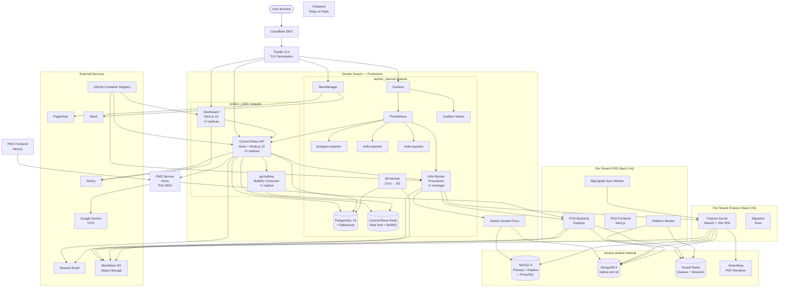

# WHAT_WE_HAVE — Stockix Architecture Reference

> **Authoritative architecture document** — generated from direct inspection of all source files, Docker configs, CI workflows, and environment examples. Do not guess; sections marked **Needs Verification** could not be confirmed from the code.

---

## 1. Executive Summary

**Stockix** is a multi-tenant SaaS *control plane* that lets platform operators (called "owners") provision and manage complete ERP/hospitality/retail software stacks for their business clients (called "tenants"). Each tenant gets an isolated set of Docker services spun up on demand by an infrastructure worker.

| Dimension | Value |
|-----------|-------|
| **Primary purpose** | SaaS operator platform — provision multi-product stacks (Finance, POS, PMS, Chat) per client |
| **Main language** | TypeScript (Node.js 22) throughout; Finance fork is NestJS; Chatwoot fork is Ruby on Rails |
| **Architecture style** | Multi-tenant Docker-per-tenant on a shared host; single-server Docker Swarm; monorepo (pnpm + Turborepo) |
| **Package manager** | pnpm 9.15.9 |
| **Build system** | Turborepo 2.x |
| **Deployment** | Docker Swarm on AWS EC2 via SSH, Traefik for TLS/routing |
| **Current maturity** | Pre-production / active development on `architecture2` branch; staging deployed automatically, production is manual |
| **Key observation** | Significant complexity: 5 distinct product stacks, 3 databases, 2 Redis instances, automated Docker-per-tenant provisioning, 72+ DB migrations |

---

## 2. Frontend

### Control-Plane Dashboard (`apps/dashboard`)

| Property | Value |
|----------|-------|
| **Framework** | Next.js 16.2.4 |
| **Router** | App Router |
| **Language** | TypeScript 5.x |
| **React** | 19.2.4 |
| **Styling** | Tailwind CSS v4 + `tailwind-merge` |
| **UI components** | shadcn/ui (`packages/ui-core`, `packages/ui-shared`) + Radix UI primitives via `@base-ui/react` |
| **State management** | React state + `react-hook-form` (no global store) |
| **Forms** | `react-hook-form` 7.75.0 + `@hookform/resolvers` 5.2.2 |
| **Validation** | Zod 3.x |
| **Tables** | `@tanstack/react-table` 8.21.3 |
| **Charts** | Recharts 3.8.0 |
| **Date picker** | `react-day-picker` 10.0.0 + `date-fns` 4.1.0 |
| **Toast/notifications** | Sonner 2.0.7 |
| **Drag and drop** | `@dnd-kit/core` |
| **OTP/MFA** | `otplib` + `input-otp` |
| **QR codes** | `qrcode` |
| **Drag-to-sort** | `@dnd-kit/sortable` |
| **Theme** | `next-themes` (dark/light) |
| **Icons** | Lucide React |
| **Fonts** | Geist |
| **Sheets/drawers** | `vaul` |
| **Command palette** | `cmdk` |
| **Error monitoring** | Sentry Next.js SDK (`@sentry/nextjs`) |
| **Analytics** | Not configured in dashboard (PostHog is optional via env var) |
| **Authentication** | Custom session cookies (`stockix-session`) + JWT, handled via API server-side |
| **API communication** | Direct `fetch` to control-plane API |
| **SEO** | Not applicable (auth-required operator dashboard) |
| **PWA** | Not configured |
| **Build output** | Next.js standalone mode (copied into Docker image) |
| **Test framework** | Vitest + Playwright (e2e) |

**Key env vars consumed:**
- `NEXT_PUBLIC_STOCKIX_API_URL` — API URL for browser-side requests
- `NEXT_PUBLIC_STOCKIX_ROOT_DOMAIN` — root domain for tenant URL derivation
- `NEXT_PUBLIC_STOCKIX_PUBLIC_SCHEME` — http/https
- `NEXT_PUBLIC_SENTRY_DSN` — Sentry DSN

---

### POS Frontend (`apps/pos-frontend2`)

| Property | Value |
|----------|-------|
| **Package name** | `studio-admin` |
| **Framework** | Next.js 16.x |
| **State management** | Zustand 5.x + TanStack Query 5.x |
| **UI** | Radix UI + shared `@repo/ui-core` + `@repo/ui-shared` |
| **Real-time** | Socket.IO client |
| **Linter** | Biome (not ESLint) |
| **Purpose** | Point-of-sale staff interface |
| **Build** | Per-tenant Docker image (built by `pnpm pos:images:build`) |
| **Key env var** | `NEXT_PUBLIC_POS_API_ORIGIN` — POS backend URL |

---

### PMS Frontend (`services/pms/frontend`)

| Property | Value |
|----------|-------|
| **Framework** | Next.js |
| **Purpose** | Property management system operator UI |
| **API** | Calls PMS Hono service via `NEXT_PUBLIC_PMS_API_URL` |
| **Auth** | `stockix-session` cookie forwarded as Bearer to PMS API |

---

### Finance/ERP Frontend (`services/stockix-finance/packages/webapp`)

| Property | Value |
|----------|-------|
| **Framework** | React (Vite, bundled into the server image) |
| **Purpose** | Full-featured accounting/ERP SPA |
| **Distribution** | Served as static SPA from the Finance NestJS server (`/webapp-dist` with SPA fallback) |

---

## 3. Backend

### Control-Plane API (`apps/api`)

| Property | Value |
|----------|-------|
| **Framework** | Hono 4.x |
| **Runtime** | Node.js 22 / `@hono/node-server` |
| **Language** | TypeScript (compiled via tsup, ESM output) |
| **Port** | 4000 |
| **Protocol** | REST + Server-Sent Events (provision streaming) |

**Route groups:**

| Registrar | Prefix | Notes |
|-----------|--------|-------|
| `registerAuthRoutes` | `/auth/*` | Before CORS |
| `registerWebhooks` | `/webhooks/*` | Resend delivery webhooks |
| `registerPublicRoutes` | `/ready`, `/health`, `/public/*` | No auth |
| `registerInternalRoutes` | `/internal/jobs/*`, `/internal/organizations/*` | Worker-only |
| `registerOwnerRoutes` | `/owners/*` | Owner management |
| `registerAdminRoutes` | `/admin/*`, `/audit-log` | Super admin |
| `registerApiKeyRoutes` | `/api-keys` | API key CRUD |
| `registerTenantRoutes` | `/tenants/*`, `/search` | Tenant lifecycle |
| `registerLicenseApi` | `/licenses/*`, `/plans/*` | License management |
| `registerTenantConfigApi` | tenant branding | White-label config |
| `registerNotificationsApi` | `/notifications` | In-app alerts |
| `registerTenantModulesRoutes` | module add/remove | Module gating |
| `registerProxyRoutes` | `/pos/*`, `/pms/*`, finance-users | Proxy to tenant services |

**Middleware stack:**
- Security headers (HSTS, X-Frame-Options, CSP, etc.)
- Rate limiting via `rate-limiter-flexible` + Redis (global + auth-specific)
- CORS with explicit allowlist
- Session-based auth (JWT + cookie)
- RBAC (`middleware/rbac.ts`)
- Idempotency (24h TTL via `api_idempotency_keys` table)
- Known-paths guard (no unknown paths reach handlers)
- Tenant scope guard (routes checked against permission matrix)

**Background jobs:**
- BullMQ (`jobs/license-expiry-queue.ts`, `jobs/owner-invite-mail-queue.ts`)
- The `api-bullmq` container runs with `RUN_BULLMQ_CONSUMERS=true`; the main `api` replicas do not

**Cron jobs:**
- `cron/reconciliation.ts` — periodic license/tenant reconciliation

**Email:**
- Nodemailer over Resend SMTP for control-plane transactional emails
- Resend API for org-invitation emails
- Templates: welcome, invite, password-reset, license alerts, provision-complete, security alerts

**Observability:**
- Prometheus metrics via `prom-client` at `GET /metrics`
- OpenTelemetry instrumentation (`@opentelemetry/sdk-node`) → Grafana Tempo (OTLP HTTP)
- Sentry Node SDK

---

### Infrastructure Worker (`infra/worker-service`)

| Property | Value |
|----------|-------|
| **Purpose** | Provision/deprovision/lifecycle manager for tenant Docker stacks |
| **Runtime** | Node.js 22, single bundled JS file (tsup) |
| **Port** | 9090 (health check) |
| **Prometheus** | Exports worker metrics at `/metrics` |
| **Docker access** | Via `socket-proxy` (tcp://socket-proxy:2375), not direct socket |
| **Concurrency** | `WORKER_CONCURRENCY` env var (default 2) |

**Provisioning workflow for a tenant:**
1. API enqueues a `tenant.provision` lifecycle job (Postgres table `tenant_lifecycle_jobs`)
2. Worker polls via `POST /internal/jobs/claim`
3. Worker runs a deterministic sequence:
   - Generate secrets (encrypted, stored in `tenant_deployments`)
   - Allocate a unique port from a sequence
   - Create MySQL database + user on shared MySQL
   - Run database migration container (`docker stack deploy` or `docker compose run`)
   - Start Finance server container
   - Bootstrap Finance tenant (admin user, org, warehouse)
   - Optionally: provision POS stack (4 containers)
   - Optionally: provision PMS entry
   - Optionally: provision Chatwoot account
   - Write Traefik dynamic config file for tenant subdomain routing
4. Worker calls `POST /internal/jobs/:id/complete` on completion
5. API broadcasts SSE event to waiting dashboard clients via Redis pub/sub

**Key adapters in `domain/provisioning/adapters/`:**
- `execa-docker-compose-runner.ts` — shells out to `docker stack deploy`
- `traefik-edge-publisher.ts` — writes YAML to Traefik dynamic config dir
- `finance-auth-client.ts` — logs into Finance API after bootstrap
- `crypto-tenant-secret-generator.ts` — derives secrets from `DEPLOYMENT_SECRET_KEY`

---

### POS Backend (`apps/pos-backend`)

| Property | Value |
|----------|-------|
| **Framework** | Express 4.x |
| **Language** | JavaScript (no TypeScript compilation) |
| **Port** | 8010 |
| **Database** | MongoDB (via Mongoose 8.x) |
| **Queue** | BullMQ + Redis |
| **Auth** | JWT (jsonwebtoken) + Passport |
| **Real-time** | Socket.IO 4.x + `@socket.io/redis-adapter` |
| **File uploads** | Multer |
| **PDF** | pdfkit |
| **S3** | AWS SDK v3 |
| **Email** | Resend SDK |
| **Payments** | Razorpay SDK |
| **Printing** | `node-thermal-printer`, `@node-escpos/core` |
| **RBAC** | `@rbac/rbac` |
| **Rate limiting** | `express-rate-limit` + `rate-limit-redis` |

**Workers (separate processes in same image):**
- `workers/platformWorker.js` — BullMQ worker for platform-level jobs
- `workers/bigcapitalSyncWorker.js` — Syncs POS transactions → Finance (BigCapital/Stockix Finance)
- `workers/printWorker.js` — Thermal printer queue

---

### Finance Server (`services/stockix-finance/packages/server`)

| Property | Value |
|----------|-------|
| **Framework** | NestJS 9.x |
| **Language** | TypeScript (strict) |
| **Database** | MySQL 8 (via Knex, one DB per tenant) |
| **Cache** | Redis (via `@liaoliaots/nestjs-redis`) |
| **Queue** | BullMQ + Agenda (legacy scheduler) |
| **Auth** | Passport + JWT (`@nestjs/jwt`) |
| **Rate limiting** | `@nestjs/throttler` + Redis storage |
| **Events** | `@nestjs/event-emitter` |
| **WebSockets** | `@nestjs/websockets` + `@nestjs/platform-socket.io` |
| **PDF** | Gotenberg (HTTP call to shared `stockix-gotenberg` container) |
| **S3** | AWS SDK v3 |
| **Email** | Nodemailer via Resend SMTP |
| **Monitoring** | Bull Board (`@bull-board/nestjs`) |
| **Serving frontend** | `@nestjs/serve-static` (Vite build at `/webapp-dist`) |
| **AI** | None directly (passport OCR is in PMS) |
| **Origin** | Fork of BigCapital open-source ERP |

---

### PMS Service (`services/pms`)

| Property | Value |
|----------|-------|
| **Framework** | Hono 4.x |
| **Language** | TypeScript (ESM) |
| **Port** | 3003 |
| **Database** | PostgreSQL (shared control-plane Postgres, `@repo/pms-db` Drizzle schema) |
| **Auth** | Shared `@repo/auth` JWT middleware |
| **Features** | Properties, rooms, bookings, guests, payments, channels, cleaning, staff, reports, calendar, iCal sync, guest forms |
| **AI** | Gemini API for passport OCR (`GEMINI_API_KEY`) |
| **iCal sync** | Periodic sync every 10 minutes (`PMS_ICAL_SYNC_INTERVAL_MS`) |

> **Note:** PMS currently shares the control-plane Postgres. A comment in `pms-db/schema.ts` flags this as a TODO before public launch (isolation needed).

---

### Chatwoot / Chatlive (`services/chatlive`)

| Property | Value |
|----------|-------|
| **Origin** | Fork of Chatwoot open-source live chat |
| **Language** | Ruby on Rails |
| **Purpose** | Shared chat instance; tenants get a Chatwoot *account* provisioned per their organization |
| **Integration** | Provisioner creates a Chatwoot account via API; account ID stored in `tenants.chatwoot_account_id` |
| **Port** | 3200 |
| **Config** | `CHATWOOT_*` env vars |

---

## 4. Database Layer

### PostgreSQL 16 — Control Plane

| Property | Value |
|----------|-------|
| **ORM** | Drizzle ORM 0.45.x |
| **Connection** | `postgres` driver + `DATABASE_URL` |
| **Pool** | PgBouncer (transaction mode, max 200 connections) in production |
| **Migrations** | 72+ sequential SQL migrations in `packages/db/drizzle/` |
| **Migration runner** | `packages/db/scripts/migrate.ts` → Drizzle migrate |

**Schema tables:**

| Table | Purpose |
|-------|---------|
| `platform_roles` | Configurable RBAC roles (system + custom) |
| `owners` | Platform operators (with MFA, invite tokens, password reset) |
| `tenants` | Customer tenants (slug, plan, modules, status) |
| `organizations` | Sub-units within a tenant (one primary + multiples) |
| `owner_organization_access` | Fine-grained per-owner org access |
| `tenant_config` | White-label branding per tenant |
| `tenant_deployments` | Docker stack metadata, encrypted secrets, port allocation |
| `branch_location_mappings` | Finance branch ↔ POS location mapping |
| `tenant_provision_events` | Append-only provisioning audit log |
| `admin_audit_log` | Admin action audit trail |
| `pms_audit_log` | PMS-specific audit trail |
| `api_keys` | Programmatic API keys (hashed) |
| `api_idempotency_keys` | Idempotency key cache (24h TTL) |
| `tenant_lifecycle_jobs` | Job queue for provisioning (claim/complete pattern) |
| `dead_letter_jobs` | Failed jobs for investigation |
| `tenant_deletion_logs` | Persists after tenant delete |
| `plans` | Subscription plan definitions |
| `licenses` | License keys, modules, expiry, activations |
| `license_activations` | Hardware fingerprint activations |
| `license_history` | License change log |
| `blacklisted_fingerprints` | Device blacklist |
| `feature_flags` | Per-tenant feature flag overrides |
| `owner_notifications` | In-app alerts for owners |
| `email_logs` | Outbound email tracking |
| `pms_properties` / `pms_rooms` / `pms_guests` / etc. | PMS domain tables (collocated in control-plane Postgres — **temporary**) |

**Notable constraints:**
- `tenants_slug_unique` — one slug per tenant
- `one_active_license_per_tenant` — enforced via partial unique index
- `tenant_deployments_compose_project_name_unique` — guarantees unique Docker projects
- Encrypted columns: `mysqlPassword`, `mysqlRootPassword`, `jwtSecret`, `financeAdminPassword` — stored as `enc:v1:*` ciphertext

---

### MySQL 8 — Tenant Finance

| Property | Value |
|----------|-------|
| **Image** | `mysql:8.0-bookworm` |
| **Auth plugin** | `mysql_native_password` |
| **Charset** | `utf8mb4_unicode_ci` |
| **Connection pooler** | ProxySQL 2.6.2 (tenants connect on `:6033`) |
| **Access pattern** | One database per tenant: `stockix_{slug}_finance` |
| **User per tenant** | `tenant_{slug}` with grants on their DB only |
| **Replication** | Async read replica (`stockix-mysql-replica`), triggered at ≥50 tenants or p95 > 3s |
| **Migration** | Per-tenant migration container runs on first deploy (Knex-based) |
| **ORM in Finance** | Knex (query builder) |
| **Slow query log** | Enabled (`long_query_time=2`) |

---

### MongoDB 6 — Tenant POS

| Property | Value |
|----------|-------|
| **Image** | `mongo:6.0` |
| **Replica set** | `rs0` (single-node, required for POS connection string) |
| **Access pattern** | One database per tenant: `{slug}_pos` |
| **Driver** | Mongoose 8.x |
| **WiredTiger cache** | 0.25 GB |

---

### PMS Database (Postgres, shared)

- PMS tables live in the control-plane Postgres under the `pms_*` prefix.
- Schema in `packages/pms-db/src/schema.ts` using Drizzle ORM.
- **Known issue**: Needs isolation per tenant before public launch.

---

## 5. Redis

Two distinct Redis instances serve different purposes:

### Control-Plane Redis (`control-plane-redis`)

| Property | Value |
|----------|-------|
| **Image** | `redis:7-alpine` |
| **Connection** | `CONTROL_PLANE_REDIS_URL` |
| **Max memory** | 64 MB (allkeys-lru eviction) |
| **Uses** | Rate limiting (global + auth), BullMQ (license expiry queue, invite queue), provision pub/sub (SSE fan-out across API replicas), API key validation caching |
| **Persistence** | None (`--save ""`) |

**Key packages:** `bullmq`, `ioredis`, `rate-limiter-flexible`

### Tenant Redis (`stockix-redis`)

| Property | Value |
|----------|-------|
| **Image** | `redis:7-alpine` |
| **Connection** | `TENANT_REDIS_HOST:6379` + password |
| **Max memory** | 512 MB (noeviction — data must not be lost) |
| **Persistence** | AOF + RDB snapshots |
| **Key namespacing** | `tenant:{slug}:queue:*` (BullMQ POS sync), `tenant:{slug}:agenda:*` (Finance Agenda), `tenant:{slug}:session:*` (Finance sessions) |
| **Uses** | All tenant-level queues, Finance Agenda scheduler, Socket.IO adapter for POS real-time, Finance session storage |

---

## 6. Docker

### Dockerfiles

| Service | Dockerfile Location | Base Image | Output |
|---------|--------------------|-----------:|--------|
| API | `apps/api/Dockerfile` | `node:22-alpine` | ~slim, tsup bundle |
| Dashboard | `apps/dashboard/Dockerfile` | `node:22-alpine` | Next.js standalone |
| Worker | `infra/worker-service/Dockerfile` | `node:22-alpine` | ~180 MB, tsup bundle + docker-cli |
| Finance Server | `services/stockix-finance/packages/server/Dockerfile` | `node:22-bookworm-slim` | NestJS + Vite SPA |
| POS Backend | `apps/pos-backend/Dockerfile` | **Needs Verification** | Express app |
| POS Frontend | `apps/pos-frontend2/Dockerfile` | **Needs Verification** | Next.js |

All approved base images: `node:22-alpine` or `node:22-bookworm-slim` (gate check enforced in CI).

### Docker Compose Files

| File | Purpose | Environment |
|------|---------|-------------|
| `infra/dev/docker-compose.yml` | Local dev: Postgres + Redis | Development |
| `infra/dev/docker-compose.full.yml` | Full local stack with API + worker | Development |
| `infra/shared/docker-compose.yml` | Shared tenant infra (MySQL, Mongo, Redis, ProxySQL, Gotenberg) | All environments |
| `infra/staging-shared/docker-compose.yml` | Staging copy of shared infra | Staging |
| `infra/prod/docker-compose.yml` | Main production stack | Production |
| `infra/staging/docker-compose.yml` | Staging overlay (merges on top of prod compose) | Staging |
| `infra/tenant-stack/docker-compose.yml` | Per-tenant Finance stack template | Production |
| `infra/pos-tenant-stack/docker-compose.yml` | Per-tenant POS stack template | Production |
| `infra/pms-tenant-stack/docker-compose.yml` | Per-tenant PMS stack | Production |
| `infra/preview/docker-compose.preview.yml` | PR preview environments | Preview |

### Production Services Table

| Service | Image | Purpose | Ports | Volumes | Depends On |
|---------|-------|---------|-------|---------|------------|
| `socket-proxy` | `tecnativa/docker-socket-proxy:latest` | Secure docker.sock proxy | internal:2375 | `/var/run/docker.sock:ro` | — |
| `traefik` | `traefik:v3.4` | Reverse proxy, TLS termination | 80, 443 | `traefik_letsencrypt`, traefik-dynamic dir | socket-proxy |
| `postgres` | `postgres:16-alpine` | Control-plane database | internal:5432 | `postgres_data` | — |
| `pgbouncer` | `pgbouncer/pgbouncer:1.23.1` | Postgres connection pooler | internal:5432 | — | postgres |
| `postgres-exporter` | `prometheuscommunity/postgres-exporter:v0.15.0` | Postgres metrics for Prometheus | internal:9187 | — | postgres |
| `control-plane-redis` | `redis:7-alpine` | Control-plane cache/queue | internal:6379 | `control_plane_redis_data` | — |
| `redis-exporter` | `oliver006/redis_exporter:v1.62.0` | Redis metrics | internal:9121 | — | — |
| `api` | `stockix-api:latest` | REST control-plane API (×2 replicas) | internal:4000 | — | pgbouncer, redis |
| `api-bullmq` | `stockix-api:latest` | BullMQ consumer (×1 replica) | internal:4001 | — | pgbouncer, redis |
| `dashboard` | `stockix-dashboard:latest` | Operator Next.js app (×2 replicas) | internal:3000 | — | api |
| `infra-worker` | `stockix-infra-worker:latest` | Tenant provisioning worker | internal:9090 | tenants dir, traefik-dynamic dir, repo:ro | api, socket-proxy |
| `node-exporter` | `prom/node-exporter:v1.8.0` | Host metrics | internal:9100 | proc, sys, rootfs | — |
| `prometheus` | `prom/prometheus:v2.51.0` | Metrics collection | internal:9090 | `prometheus_data` | — |
| `alertmanager` | `prom/alertmanager:v0.27.0` | Alert routing (Slack, PagerDuty) | internal:9093 | config | — |
| `tempo` | `grafana/tempo:2.5.0` | Distributed tracing | internal:4318 (OTLP) | `tempo_data` | — |
| `grafana` | `grafana/grafana:10.4.0` | Dashboards | internal:3000 | `grafana_data`, dashboards | tempo |
| `db-backup` | `alpine:3.20` | Cron backup to Backblaze B2 | — | docker.sock, backup scripts, tenant-envs | postgres |

### Shared Infra Services Table

| Service | Image | Purpose | Network |
|---------|-------|---------|---------|
| `stockix-mysql` | `mysql:8.0-bookworm` | Shared MySQL primary (all tenant Finance DBs) | `stockix-shared` |
| `stockix-mysql-replica` | `mysql:8.0-bookworm` | MySQL async read replica | `stockix-shared` |
| `stockix-mysql-proxy` | `proxysql/proxysql:2.6.2` | MySQL connection pooler | `stockix-shared` + `stockix_internal` |
| `stockix-mongo` | `mongo:6.0` | Shared MongoDB rs0 (all tenant POS DBs) | `stockix-shared` |
| `stockix-mongo-rs-init` | `mongo:6.0` | One-shot replica set initiator | `stockix-shared` |
| `stockix-redis` | `redis:7-alpine` | Shared tenant Redis (queues, sessions) | `stockix-shared` |
| `stockix-gotenberg` | `gotenberg/gotenberg:7` | Shared Chromium PDF renderer | `stockix-shared` |

### Per-Tenant Finance Stack

| Service | Image | Purpose |
|---------|-------|---------|
| `server` | `stockix-server:local` | NestJS Finance/ERP + bundled Vite SPA |
| `database_migration` | `stockix-database-migration:local` | One-shot migration container |

### Per-Tenant POS Stack

| Service | Image | Purpose |
|---------|-------|---------|
| `pos-backend` | `stockix-pos-backend:local` | Express POS API |
| `pos-platform-worker` | `stockix-pos-backend:local` | Platform-level BullMQ worker |
| `pos-bigcapital-worker` | `stockix-pos-backend:local` | Finance sync BullMQ worker |
| `pos-frontend` | `stockix-pos-frontend:local` | Next.js POS staff interface |

---

## 7. Docker Swarm

| Property | Value |
|----------|-------|
| **Mode** | Docker Swarm (single-manager) |
| **Stack names** | `stockix` (production), `stockix-staging` (staging), `stockix-shared` (shared infra), `stockix-staging-shared` (staging shared infra) |
| **Overlay networks** | `stockix_public` (Traefik ingress), `stockix_internal` (services), `stockix_socket_proxy_network` (worker ↔ socket-proxy), `stockix-shared` (tenant containers ↔ shared databases) |
| **Secrets** | `postgres_password`, `session_secret`, `auth_token_secret`, `jwt_secret`, `license_signing_secret`, `platform_api_secret`, `worker_secret`, `deployment_secret_key`, `backup_encryption_key`, `shared_mysql_root_password` |

**Service placement:**
- `socket-proxy`, `infra-worker`, `traefik`, `db-backup` → manager node only (constraint: `node.role == manager`)
- `node-exporter` → global mode (every node)
- `api` (2 replicas), `dashboard` (2 replicas) — replicated, any node

**Restart policies:** `condition: any, delay: 5–10s` for stateless services. `condition: none` for one-shot jobs.

**Resource limits:** All services have explicit `mem_limit` and `cpus` constraints.

**Health checks:** Every service has a health check; API and dashboard use `node -e "fetch(...)"`, databases use native client pings.

---

## 8. Monitoring & Observability

### Prometheus (`prom/prometheus:v2.51.0`)

- **Purpose:** Centralized metrics collection and alerting
- **Scrape targets:** API (`:4000/metrics`), worker (`:9090/metrics`), Postgres exporter, node-exporter, Redis exporter
- **Retention:** 15 days
- **Config:** `infra/prod/prometheus.yml`
- **Alerts:** `infra/prod/prometheus/alerts.yml`

**Active alert rules:**

| Alert | Condition | Severity |
|-------|-----------|----------|
| ApiDown | `up{job="api"} == 0` for 2m | p0 |
| PostgresDown | `pg_up == 0` for 5m | p1 |
| RedisDown | `redis_up == 0` for 5m | p1 |
| ProvisionFailureRate | failure rate > 20% over 10m | p1 |
| DeadJobsAccumulating | dead jobs > 10 | p2 |
| DiskUsageHigh | disk > 85% for 10m | p1 |
| BackupNotRunInLast26Hours | textfile collector metric | p1 |
| ApiLatencyHigh | p95 latency > 2s for 5m | p2 |

---

### Alertmanager (`prom/alertmanager:v0.27.0`)

- **Routes:** p0 → PagerDuty; all others → Slack `#stockix-alerts`
- **Config:** `infra/prod/alertmanager/alertmanager.yml`
- **Exposed via Traefik:** `https://alertmanager.{ROOT_DOMAIN}`

---

### Grafana (`grafana/grafana:10.4.0`)

- **Purpose:** Metrics dashboards + Tempo tracing UI
- **Dashboards:** 2 provisioned (`stockix-overview.json`, `stockix-infra.json`)
- **Datasources:** Prometheus (default) + Tempo (tracing)
- **Exposed via Traefik:** `https://grafana.{ROOT_DOMAIN}`
- **Config:** `infra/prod/grafana/`
- **Admin password:** `GRAFANA_ADMIN_PASSWORD`

---

### Grafana Tempo (`grafana/tempo:2.5.0`)

- **Purpose:** Distributed tracing backend (OTLP HTTP receiver)
- **Integration:** API and worker both instrument with OpenTelemetry (`@opentelemetry/sdk-node`) and export traces to `http://tempo:4318/v1/traces`
- **Config:** `infra/prod/monitoring/tempo.yaml`
- **Storage:** `tempo_data` volume

---

### Sentry

- **API:** `@sentry/node` (Node.js SDK)
- **Dashboard:** `@sentry/nextjs` (Next.js SDK with source maps)
- **Finance Server:** `@sentry/node`
- **POS Backend:** `@sentry/node`
- **Config:** `SENTRY_DSN`, `SENTRY_ENVIRONMENT`

---

### Health Checks

- `GET /health` — API liveness (Traefik load balancer check)
- `GET /ready` — API readiness (includes DB + Redis connectivity + release SHA)
- `GET /health` — Worker health (port 9090)
- `GET /api/ping` — Finance server liveness

---

### Custom Metrics (`prom-client`)

- `http_request_duration_seconds` — API request latency histogram
- `worker_jobs_total`, `worker_jobs_failed_total` — provisioning job counters
- `worker_dead_jobs_total` — dead letter queue depth
- `stockix_backup_last_success_timestamp` — written by backup cron via node-exporter textfile collector

---

## 9. Authentication

### Control-Plane (Owner/Operator) Authentication

**Session mechanism:** Custom JWT stored in `stockix-session` HTTP-only cookie, signed with `AUTH_TOKEN_SECRET` (HS256 via `jose`).

**Flow:**
1. Owner POSTs credentials to `POST /auth/login`
2. API validates password (bcrypt), checks account status, failed login count, lock state
3. If MFA enabled: issues challenge, requires `POST /auth/mfa/verify` with TOTP code
4. On success: signs JWT (`8h` access token) + refresh token (`7d`), sets `stockix-session` cookie
5. Session version in DB — bumped on password change to invalidate all active sessions

**Token payload (from `packages/auth/src/index.ts`):**
```
{ userId, tenantId?, organizationId?, modules[], roles[], planSlug }
```

**Additional auth features:**
- **Password reset:** token hashed and stored in `owners.password_reset_token_hash`, emailed via Resend
- **Owner invites:** token hashed in `owners.invite_token_hash`, expires via `invite_token_expires_at`
- **MFA:** TOTP via `otplib`, secret stored in `owners.mfa_secret` (encrypted at rest — **Needs Verification**)
- **API Keys:** `sk_live_*` prefix, only hash stored in `api_keys.key_hash`, optional permission scope
- **Bootstrap login:** break-glass `ALLOW_BOOTSTRAP_LOGIN=true` for local dev
- **Idempotency:** 24h TTL per (actor, key) pair via `api_idempotency_keys`

### Tenant Authentication

Tenant users authenticate directly against the Finance server (NestJS Passport + JWT) or POS backend (Express + jsonwebtoken). The `@repo/auth` package provides shared middleware (`createExpressAuthMiddleware`, `createHonoAuthMiddleware`, `createNestGuard`) used across services.

### RBAC

- Platform roles stored in `platform_roles` table (system + custom)
- Permissions are JSON arrays on role rows
- Per-route permission checks via `middleware/rbac.ts`
- Permission matrix: `packages/domain-access/control-plane-permission-matrix.ts`
- Owner organization access granularity: `owner_organization_access` table

---

## 10. Infrastructure

### Reverse Proxy — Traefik v3.4

- **TLS:** Cloudflare DNS-01 challenge via `CF_DNS_API_TOKEN`
- **Certificate storage:** `/letsencrypt/acme.json` (Docker volume)
- **Dynamic config:** Files in `TRAEFIK_DYNAMIC_DIR` (default `/opt/stockix/traefik-dynamic`) — written by worker on tenant provision
- **Swarm discovery:** `--providers.swarm` via socket-proxy (not direct docker.sock)
- **HTTP → HTTPS redirect:** Enabled on `:80`
- **Exposed services:** `api.{ROOT_DOMAIN}`, `app.{ROOT_DOMAIN}`, `grafana.{ROOT_DOMAIN}`, `alertmanager.{ROOT_DOMAIN}`, `traefik.{ROOT_DOMAIN}`, per-tenant subdomains

### Cloudflare

- DNS provider for ACME challenge
- **Needs Verification:** whether Cloudflare proxying (orange cloud) is active or DNS-only

### AWS EC2

- Single server for both staging and production (separate instances)
- Terraform configs in `infra/terraform/` provision the EC2 instance, security group, and Elastic IP
- AMI: Ubuntu 22.04 (Jammy)
- Security group: SSH (restricted CIDR), HTTP/HTTPS (0.0.0.0/0)

### Object Storage — Backblaze B2

- S3-compatible (`S3_ENDPOINT`, `S3_FORCE_PATH_STYLE=true`)
- Used by Finance + POS tenant stacks for file storage
- Used by `db-backup` service for encrypted database backups

### Backups

- `infra/prod/backup/backup.sh` — Postgres dump → gzip → B2 (via aws-cli)
- `infra/prod/backup/backup-runtime.sh` — Runtime config backups (Traefik dynamic, tenant envs)
- Schedule: twice daily (02:00 and 14:00 UTC)
- Retention: `BACKUP_RETENTION_DAYS` (default 30)
- Encryption: GPG (`BACKUP_ENCRYPTION_KEY`)
- Success metric written via node-exporter textfile collector (triggers Prometheus alert if missed)

### Secrets Management

- Docker Swarm secrets for 10 sensitive values (mounted at `/run/secrets/<name>`)
- `enc:v1:*` scheme for tenant secrets in Postgres — derived from `DEPLOYMENT_SECRET_KEY`
- `infra/deploy/secrets-init.sh` bootstraps Swarm secrets

---

## 11. CI/CD

### `ci.yml` — Quality Gate (on PR to `main`, `develop`, `staging`)

1. Spin up Postgres test service
2. Run DB migrations against test DB
3. Check no `.env` files tracked in git
4. Turborepo lint (affected packages)
5. Turborepo typecheck (affected packages)
6. Turborepo test (affected packages, Vitest)
7. Turborepo build dry-run
8. Architecture guards (`pnpm lint:boundaries && pnpm architecture:validate`)

### `build-and-publish.yml` — Build & Push (on push to `main`, `architecture2`)

**Gate checks (before build):**
- No `localhost`/`127.0.0.1` in container runtime code
- Only `node:22-alpine` or `node:22-bookworm-slim` in Dockerfiles
- No host-bound ports in prod compose
- No `docker compose up` in worker code (must use `docker stack deploy`)
- All boot validators present (`env.ts` in each service)
- TypeScript compilation check for API, Worker, PMS, Finance

**Build jobs:**
- API → `ghcr.io/{repo}/stockix-api:{sha}` + `:latest`
- Dashboard → `ghcr.io/{repo}/stockix-dashboard:{sha}` + `:latest`
- Infra Worker → `ghcr.io/{repo}/stockix-infra-worker:{sha}` + `:latest`
- Finance Server → `ghcr.io/{repo}/stockix-finance-server:{sha}` + `:latest`

All images use Docker Buildx with registry cache (`type=registry`).

### `deploy-staging.yml` — Auto-deploy to Staging

- Triggered automatically after `build-and-publish.yml` succeeds on `architecture2` branch
- SSH into staging EC2, runs `infra/deploy/deploy.sh staging {sha}`

### `deploy-production.yml` — Manual Production Deploy

- `workflow_dispatch` with required `release_sha` input
- First: smoke-tests staging `/ready` endpoint to confirm SHA is running
- Then: SSH into production EC2, runs `infra/deploy/deploy.sh production {sha}`

### Other Workflows

| Workflow | Trigger | Purpose |
|----------|---------|---------|
| `secret-scan.yml` | push | Gitleaks secret scanning |
| `config-gate.yml` | PR | Config file validation |
| `image-gate.yml` | PR | Docker image policy checks |
| `network-gate.yml` | PR | Network configuration checks |
| `deploy-preview.yml` | PR | Deploy preview environment |
| `deploy-preview-cleanup.yml` | PR close | Teardown preview |
| `publish.yml` | — | Package publishing |

---

## 12. Environment Variables

| Variable | Used By | Required | Description |
|----------|---------|----------|-------------|
| `NODE_ENV` | All | Yes | `development` / `staging` / `production` |
| `DATABASE_URL` | API, Worker, PMS | Yes | Postgres connection string |
| `DB_POOL_MAX` | API, Worker | No | Postgres pool size (default 10/20) |
| `PORT` | API | No | HTTP port (default 4000) |
| `PLATFORM_API_SECRET` | API, Dashboard | Yes | Shared secret for dashboard→API proxy |
| `WORKER_SECRET` | API, Worker | Yes | Worker internal auth |
| `INTERNAL_API_SECRET` | API | Yes | Finance internal routes |
| `SESSION_SECRET` | API | Yes | Cookie signing |
| `AUTH_TOKEN_SECRET` | API, all services | Yes | JWT signing secret |
| `LICENSE_SIGNING_SECRET` | API | Yes | POS license JWT signing |
| `DEPLOYMENT_SECRET_KEY` | API, Worker | Yes | Derives tenant secret material |
| `JWT_SECRET` | Finance, POS | Yes | Finance + POS JWT secret |
| `BOOTSTRAP_ADMIN_PASSWORD` | API | Yes | Break-glass admin |
| `PLATFORM_ADMIN_EMAIL` | API | Yes | Platform admin login |
| `ROOT_DOMAIN` | API, Dashboard, Worker, Traefik | Yes | Root domain (e.g. `stockix.cloud`) |
| `DASHBOARD_URL` | API | Yes | Dashboard public URL |
| `PUBLIC_BASE_URL_SCHEME` | API, Traefik | No | `http` / `https` |
| `CONTROL_PLANE_REDIS_URL` | API | No (local) | Redis for control plane |
| `NEXT_PUBLIC_STOCKIX_API_URL` | Dashboard | Yes | Browser API URL |
| `NEXT_PUBLIC_STOCKIX_ROOT_DOMAIN` | Dashboard | Yes | Browser root domain |
| `NEXT_PUBLIC_STOCKIX_PUBLIC_SCHEME` | Dashboard | Yes | Browser URL scheme |
| `SENTRY_DSN` | API, Dashboard, Worker | No | Sentry error tracking |
| `SENTRY_ENVIRONMENT` | All | No | Sentry environment tag |
| `POSTGRES_PASSWORD` | Postgres, PgBouncer | Yes (prod) | Postgres root password |
| `CF_DNS_API_TOKEN` | Traefik | Yes (prod) | Cloudflare DNS API key |
| `ACME_EMAIL` | Traefik | Yes (prod) | ACME cert contact email |
| `SHARED_MYSQL_ROOT_PASSWORD` | Worker, MySQL | Yes | Shared MySQL root password |
| `TENANT_REDIS_PASSWORD` | Tenant Redis | Yes | Tenant Redis auth |
| `S3_ACCESS_KEY_ID` | Worker, Finance, POS | Yes | Backblaze B2 key ID |
| `S3_SECRET_ACCESS_KEY` | Worker, Finance, POS | Yes | Backblaze B2 secret |
| `S3_BUCKET` | Worker, Finance, POS | Yes | B2 bucket name |
| `S3_ENDPOINT` | All | Yes | B2 endpoint URL |
| `RESEND_API_KEY` | API, POS | Yes | Resend API key |
| `RESEND_FROM_EMAIL` | API, POS | Yes | Resend from address |
| `RESEND_WEBHOOK_SECRET` | API | Yes (prod) | Resend webhook verification |
| `MAIL_HOST` / `MAIL_PASSWORD` | Finance (SMTP) | Yes | Resend SMTP credentials |
| `POS_PLATFORM_API_KEY` | API, Worker, POS | Yes (if POS) | POS platform API key |
| `POS_PLATFORM_BASE_URL` | API | Yes (if POS) | POS platform URL |
| `CHATWOOT_API_ACCESS_TOKEN` | Worker | Yes (if chat) | Chatwoot admin token |
| `CHATWOOT_SECRET_KEY_BASE` | Chatwoot | Yes | Rails secret key |
| `GEMINI_API_KEY` | PMS | No | Google Gemini for passport OCR |
| `GRAFANA_ADMIN_PASSWORD` | Grafana | Yes | Grafana admin password |
| `BACKUP_B2_BUCKET` / `BACKUP_B2_KEY_ID` / `BACKUP_B2_APP_KEY` | db-backup | Yes | Backup B2 credentials |
| `BACKUP_ENCRYPTION_KEY` | db-backup | Yes | GPG backup encryption key |
| `POSTHOG_API_KEY` | Optional | No | PostHog analytics |
| `TRAEFIK_DYNAMIC_DIR` | Worker, Traefik | Yes (prod) | Dynamic config directory |
| `TENANT_ENV_ROOT` | Worker | Yes (prod) | Per-tenant env file directory |
| `REPO_ROOT` | Worker | Yes (prod) | Repo checkout path on host |
| `WORKER_JOB_EXECUTION_TIMEOUT_MS` | Worker | No | Max job time (default 600000) |
| `WORKER_CONCURRENCY` | Worker | No | Parallel jobs (default 2) |
| `OTEL_EXPORTER_OTLP_ENDPOINT` | API, Worker | No | Tempo OTLP endpoint |
| `PAGERDUTY_KEY` | Alertmanager | Yes (prod) | PagerDuty routing key |
| `SLACK_WEBHOOK_URL` | Alertmanager | Yes (prod) | Slack alerts webhook |

---

## 13. Integrations

| Service | Purpose | Config Vars |
|---------|---------|-------------|
| **Resend** | Transactional email (SMTP + API) | `RESEND_API_KEY`, `RESEND_FROM_EMAIL`, `MAIL_*`, `RESEND_WEBHOOK_SECRET` |
| **Backblaze B2** | S3-compatible object storage + backups | `S3_*`, `BACKUP_B2_*` |
| **Cloudflare** | DNS management + ACME challenge for TLS | `CF_DNS_API_TOKEN` |
| **Sentry** | Error monitoring + performance | `SENTRY_DSN`, `SENTRY_ENVIRONMENT` |
| **PostHog** | Product analytics (optional) | `POSTHOG_API_KEY`, `POSTHOG_HOST` |
| **Gotenberg** | Chromium-based PDF generation | `GOTENBERG_URL`, `GOTENBERG_DOCS_URL` |
| **Google Gemini** | AI/OCR for passport scanning in PMS | `GEMINI_API_KEY` |
| **Razorpay** | Payment processing in POS | hardcoded in POS backend (`razorpay` package) |
| **PagerDuty** | On-call escalation for p0 alerts | `PAGERDUTY_KEY` |
| **Slack** | Alert notifications | `SLACK_WEBHOOK_URL` |
| **AWS EC2** | Compute infrastructure | Managed via Terraform + GitHub Secrets |
| **GHCR** | Docker image registry (GitHub Container Registry) | `GITHUB_TOKEN` (automatic) |
| **Chatwoot (self-hosted)** | Live chat for tenants | `CHATWOOT_*` |

---

## 14. Project Structure

```
stockixnew/
├── apps/
│   ├── api/                    # Control-plane REST API (Hono, Node.js 22)
│   ├── dashboard/              # Operator Next.js dashboard (App Router, React 19)
│   ├── pos-backend/            # POS REST API + workers (Express, MongoDB)
│   └── pos-frontend2/          # POS staff Next.js UI (studio-admin)
│
├── packages/
│   ├── auth/                   # JWT utilities shared across all services
│   ├── config/                 # Environment config loaders per service
│   ├── db/                     # Control-plane Postgres schema (Drizzle) + 72 migrations
│   ├── pms-db/                 # PMS Postgres schema (Drizzle)
│   ├── domain-access/          # Permission matrix for RBAC
│   ├── events/                 # Shared event type definitions
│   ├── platform-worker-shared/ # OpenTelemetry tracing utilities
│   ├── shared/                 # Shared types, roles, permissions, logger, stxi-license
│   ├── theme/                  # Shared CSS theme variables
│   ├── ui/                     # Re-export barrel for UI packages
│   ├── ui-core/                # Core UI components (shadcn/radix primitives)
│   ├── ui-shared/              # Shared app shell (sidebar, nav, meta-table)
│   ├── eslint-config/          # Shared ESLint config
│   └── typescript-config/      # Shared TSConfig bases
│
├── services/
│   ├── stockix-finance/        # Finance/ERP SaaS (NestJS fork of BigCapital)
│   │   └── packages/
│   │       ├── server/         # NestJS API + bundled Vite SPA
│   │       └── webapp/         # React/Vite finance frontend
│   ├── pms/                    # Property Management System (Hono API)
│   │   └── frontend/           # PMS Next.js frontend
│   └── chatlive/               # Live chat (Chatwoot fork, Ruby on Rails)
│
├── infra/
│   ├── deploy/                 # deploy.sh, rollback.sh, secrets-init.sh, swarm-init.sh
│   ├── dev/                    # Local dev docker-compose (Postgres + Redis)
│   ├── docker/base/            # Deprecated shared Dockerfile base
│   ├── pos-tenant-stack/       # Per-tenant POS docker-compose template
│   ├── pms-tenant-stack/       # Per-tenant PMS docker-compose template
│   ├── preview/                # PR preview environment scripts
│   ├── prod/                   # Production: docker-compose, Prometheus, Grafana, alerts, backups
│   ├── shared/                 # Shared infra: MySQL, MongoDB, Redis, ProxySQL, Gotenberg
│   ├── staging/                # Staging docker-compose overlay
│   ├── staging-shared/         # Staging copy of shared infra
│   ├── tenant-stack/           # Per-tenant Finance docker-compose template
│   ├── terraform/              # AWS EC2 provisioning (Terraform)
│   └── worker-service/         # Provisioning worker (TypeScript, bundled)
│
├── scripts/                    # Dev utilities, env management, smoke tests
├── docs/                       # Documentation
├── ops/                        # Ops runbooks
├── .github/workflows/          # CI/CD GitHub Actions
├── package.json                # Root workspace manifest + scripts
├── pnpm-workspace.yaml         # Workspace members
└── turbo.json                  # Turborepo task graph
```

---

## 15. Dependencies

### Control-Plane API

| Category | Packages |
|----------|---------|
| Framework | `hono`, `@hono/node-server` |
| Database | `drizzle-orm`, `postgres`, `drizzle-kit` |
| Auth/JWT | `jose`, `bcryptjs`, `otplib` |
| Redis | `ioredis`, `bullmq` |
| Rate limiting | `rate-limiter-flexible` |
| Email | `nodemailer` |
| Monitoring | `prom-client`, `@sentry/node`, `@opentelemetry/sdk-node` |
| Validation | `zod` |
| Build | `tsup`, `typescript` |
| Test | `vitest` |

### Dashboard

| Category | Packages |
|----------|---------|
| Framework | `next` 16.x, `react` 19.x |
| UI | `@base-ui/react`, `@repo/ui-core`, `@repo/ui-shared`, `lucide-react` |
| Styling | `tailwindcss` v4, `tailwind-merge`, `class-variance-authority` |
| Forms | `react-hook-form`, `@hookform/resolvers`, `zod` |
| Tables | `@tanstack/react-table` |
| Charts | `recharts` |
| DnD | `@dnd-kit/core`, `@dnd-kit/sortable` |
| Monitoring | `@sentry/nextjs` |
| Test | `vitest`, `@playwright/test` |

### POS Backend

| Category | Packages |
|----------|---------|
| Framework | `express` 4.x |
| Database | `mongoose` 8.x (MongoDB) |
| Queue | `bullmq`, `ioredis` |
| Real-time | `socket.io`, `@socket.io/redis-adapter` |
| Auth | `jsonwebtoken`, `bcrypt` |
| Storage | `@aws-sdk/client-s3` |
| Email | `resend` |
| Payments | `razorpay` |
| PDF | `pdfkit` |
| RBAC | `@rbac/rbac` |
| Printing | `node-thermal-printer`, `@node-escpos/core` |

### Finance Server

| Category | Packages |
|----------|---------|
| Framework | `@nestjs/*` (NestJS 9) |
| Database | `knex` (MySQL) |
| Queue | `bullmq`, `@nestjs/bullmq`, `agenda` (legacy) |
| Auth | `@nestjs/jwt`, `@nestjs/passport`, `passport` |
| Cache | `@liaoliaots/nestjs-redis` |
| PDF | Gotenberg (HTTP) |
| Storage | `@aws-sdk/client-s3` |
| Email | SMTP via nodemailer |

### PMS

| Category | Packages |
|----------|---------|
| Framework | `hono`, `@hono/node-server` |
| Database | `drizzle-orm`, `postgres` |
| Auth | `@repo/auth` (shared) |
| AI | Google Gemini (HTTP) |

### Build & Tooling

| Category | Packages |
|----------|---------|
| Build orchestration | `turbo` |
| Bundler | `tsup`, `next` build |
| Package manager | `pnpm` |
| TypeScript | `typescript` 5.9 |
| Linting | ESLint (most), Biome (POS frontend) |
| Formatting | Prettier |
| Changesets | `@changesets/cli` |
| License check | `license-checker` |
| Secret scanning | `gitleaks` |

---

## 16. Security

### Strengths

| Area | Implementation |
|------|---------------|
| **Secrets at rest** | Docker Swarm secrets + `enc:v1:*` AES encryption for tenant DB credentials |
| **JWT** | HS256 via `jose`, short-lived (8h access, 7d refresh), session versioning |
| **Password storage** | bcrypt (rounds not verified in code — **Needs Verification**) |
| **Token hashing** | Invite tokens and password reset tokens stored as hashes only |
| **API key storage** | Only hash stored in database |
| **Rate limiting** | Redis-backed global + auth-specific rate limits |
| **Idempotency** | Prevents duplicate mutations with 24h key TTL |
| **CORS** | Explicit allowlist, no wildcard fallback (`CORS_ORIGINS`) |
| **Security headers** | HSTS, X-Frame-Options, CSP, Referrer-Policy, X-Content-Type-Options |
| **Input validation** | Zod at API boundaries |
| **SQL injection** | Drizzle ORM (parameterized queries); MySQL via Knex (parameterized) |
| **Docker isolation** | `no-new-privileges:true`, `read_only: true` on Finance server, tmpfs for writable dirs |
| **Docker socket** | Worker accesses docker via socket-proxy (not direct mount), with minimal permissions |
| **Audit logging** | `admin_audit_log` table for all privileged operations |
| **MFA** | TOTP support for operator accounts |
| **Account lockout** | `failed_login_count` + `locked_until` on owner accounts |
| **Secret scanning** | Gitleaks in CI |

### Potential Issues

| Issue | Details |
|-------|---------|
| **PMS database not isolated** | PMS tables in control-plane Postgres; multi-tenant data colocation — comment in code flags this |
| **`unsafe-inline` in CSP** | `SECURITY_CSP_BASE` includes `'unsafe-inline'` for scripts and styles |
| **Finance server MySQL username/password in compose env** | Stored in per-tenant `.env` files on disk at `TENANT_ENV_ROOT` |
| **Backup uses Docker socket directly** | `db-backup` mounts `/var/run/docker.sock:ro` — not going through socket-proxy |
| **Bootstrap login flag** | `ALLOW_BOOTSTRAP_LOGIN=true` should never be set in production |
| **POS backend is JavaScript** | No TypeScript compilation — runtime type errors not caught at build time |
| **Shared MySQL** | All tenants share one MySQL instance — noisy neighbor risk |
| **PLATFORM_JWT_SECRET fallback** | If unset, falls back to `AUTH_TOKEN_SECRET:platform` in dev — must be set in prod |

---

## 17. Performance

| Area | Implementation |
|------|---------------|
| **Postgres connection pooling** | PgBouncer (transaction mode, up to 200 client connections) |
| **MySQL connection pooling** | ProxySQL (multiplexes tenant connections) |
| **API caching** | Redis for rate limit counters and provision pub/sub |
| **BullMQ** | Async job processing (license expiry, invite emails) |
| **Next.js standalone** | Minimal deployment footprint |
| **Docker layer caching** | Multi-stage builds with manifest-first copy pattern |
| **Turborepo** | Only rebuilds affected packages |
| **Finance NestJS** | `@nestjs/cache-manager` for in-process caching |
| **Tenant-level Redis** | Per-tenant namespaced Redis reduces cross-tenant interference |
| **MySQL read replica** | ProxySQL routes SELECTs to replica (when deployed at ≥50 tenants) |
| **Image optimization** | Next.js built-in image optimization |
| **API replicas** | 2 replicas in production behind Traefik load balancer |
| **Dashboard replicas** | 2 replicas in production |
| **CPU/memory limits** | All Docker services have explicit resource limits |
| **Traefik health checks** | Unhealthy containers removed from rotation |

---

## 18. Known Issues

### Missing or Incomplete

| Item | Details |
|------|---------|
| PMS database isolation | PMS tables in shared Postgres — TODO in code |
| POS backend TypeScript | `apps/pos-backend` is plain JavaScript, no type checking |
| Finance frontend | Served from Finance server; not part of monorepo build pipeline |
| Chatwoot deployment | Chatwoot (`services/chatlive`) is not part of the main Docker Compose stacks — provisioned separately (Needs Verification) |
| MySQL read replica | Defined in `infra/shared` but bootstrap is manual (`ops/bootstrap-mysql-replica.sh`) |
| `PLATFORM_JWT_SECRET` | Empty in `.env.example`, must be set in staging/prod |
| `INTERNAL_API_SECRET` | Empty in `.env.example`, must be set in prod |

### Technical Debt

| Item | Details |
|------|---------|
| `TENANT_DB_NAME_PERFIX` typo | Both spellings written for backward compat (`tenant-env.ts`) |
| Agenda scheduler | Legacy `agenda` (Mongo-based scheduler) used in Finance alongside BullMQ |
| Finance fork | `services/stockix-finance` is a fork of BigCapital with upstream divergence — updates must be manually merged |
| `unsafe-inline` CSP | Needs elimination via nonce-based CSP |
| Two `node_modules` trees | Root + per-app `node_modules` (pnpm workspaces expected but verify hoisting) |
| Duplicate migration numbers | Migrations 0055 and 0058 each have two files (naming conflict) |
| `provisioning.lock` | Stability marker file — ensure it's handled correctly across deploys |
| `BigCapital` references | POS backend references `bigcapital` in worker names — naming cleanup needed |

### TODOs Found in Code

- PMS: isolate to per-tenant Postgres before public launch
- MySQL replica: enable ProxySQL routing after bootstrapping replica
- `stockix-base` Docker image: marked DEPRECATED in CI workflow

---

## 19. Recommendations

### Critical

| Recommendation | Why |
|---------------|-----|
| **Isolate PMS database** | PMS data for all tenants is in the shared control-plane Postgres — data leakage risk |
| **Set `INTERNAL_API_SECRET` in all environments** | Currently empty in `.env.example`; Finance internal routes could be called by any container |
| **Set `PLATFORM_JWT_SECRET` in production** | Fallback to `AUTH_TOKEN_SECRET:platform` is not safe |
| **Remove `unsafe-inline` from CSP** | Eliminates XSS vector class entirely |

### High

| Recommendation | Why |
|---------------|-----|
| **TypeScript-ify POS backend** | Runtime errors not caught at build time in a security-sensitive service |
| **Separate backup from Docker socket** | `db-backup` mounts docker.sock directly; should use socket-proxy like the worker |
| **Implement MySQL replica bootstrap automation** | Currently manual; should be part of swarm-init |
| **Add staging smoke tests for tenant provision** | No automated test that a full provision works on staging before promoting to prod |
| **Add SIEM / structured log shipping** | Currently logs are in container stdout (json-file driver) — no centralized log search (Loki/ELK not deployed) |

### Medium

| Recommendation | Why |
|---------------|-----|
| **Add Loki for log aggregation** | Grafana stack is 80% there; Loki would complete the observability story |
| **Eliminate Agenda scheduler in Finance** | Dual-scheduler (Agenda + BullMQ) adds complexity; consolidate to BullMQ |
| **Resolve duplicate migration file numbers** | Migrations 0055 and 0058 have name collisions |
| **Add rate limiting to PMS endpoints** | PMS API has no rate limiting configured |
| **Document Chatwoot deployment** | Chatlive service is in the repo but its production deployment path is unclear |

### Low

| Recommendation | Why |
|---------------|-----|
| **Fix `TENANT_DB_NAME_PERFIX` typo** | Clean up after all deployed stacks use the correct spelling |
| **Rename `bigcapitalSyncWorker`** | The Finance product is now Stockix Finance; naming is confusing |
| **Automate Finance upstream sync** | Upstream BigCapital changes need manual merging; a script or documented process would help |
| **PostHog integration** | Analytics env vars exist but no code wires them up in the dashboard |
| **Preview environments** | Workflow exists but deploy/teardown scripts need testing |

---

## 20. Architecture Diagram



---

*Document generated: 2026-06-29. Based on direct inspection of all source files, Docker configurations, CI workflows, and environment examples. All claims are traceable to specific files in the repository.*
