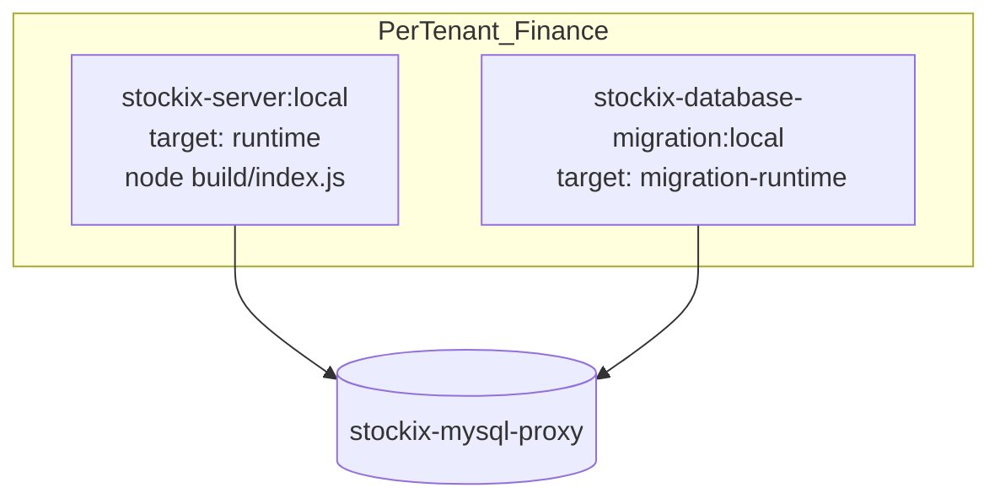

# Stockix Finance — Production Architecture Audit (Post-Stabilization)

**Date:** 2026-06-10  
**Status:** NestJS-only runtime locked in; legacy Express deleted; production gates enforced.

---

## Executive summary

Stockix Finance is a **single-runtime NestJS application** inside Docker tenant containers. Legacy Express + bulk `src/services` have been **removed**. Production images use the **`runtime`** target (no `src/` in the image layer).

| Area | Before | After |
|------|--------|-------|
| HTTP runtime | NestJS + dormant Express | **NestJS only** (`src/main.ts` → `build/index.js`) |
| Legacy code | `src/api` (108), `src/services` (668), `src/subscribers` (29) | **Deleted** |
| typedi | Hybrid on landed-cost service | **Removed** from live Nest modules |
| Docker image | ~2.18 GB, full `src/` + dev deps | **`runtime` target**, prod `node_modules`, no `src/` |
| Shared secrets | Vendored `lib/deployment-secrets.ts` + cpSync | **`@repo/shared/deployment-secrets`** |
| Type safety | `transpileOnly` only | **`tsconfig.typecheck.json`** + CI gates |
| Observability | Basic logging | **Structured logs**, `requestId` / `tenantId` / `userId` in exceptions |
| Migration safety | None | **`MIGRATION_MODE`** write blocking middleware |
| Architecture firewall | None | **`finance:architecture-guard`** in CI |

---

## Final Docker runtime architecture



### Image build (Finance workspace context)

Root `.dockerignore` excludes `services/stockix-finance/`, so builds use **Finance workspace context** with `packages/shared` synced from monorepo root before `pnpm install`:

```
pnpm docker:prebuild
  → cp packages/shared → services/stockix-finance/packages/shared
  → docker build -f packages/server/Dockerfile --target runtime .   (cwd: services/stockix-finance)
  → docker build ... --target migration-runtime .
  → docker:check validates image truth (webapp-dist, no src/api, CMD)
```

| Target | Image | CMD | Ships |
|--------|-------|-----|-------|
| `runtime` | `stockix-server:local` | `node ./packages/server/build/index.js` | `build/`, `webapp-dist/`, `i18n/`, `public/`, prod `node_modules` |
| `migration-runtime` | `stockix-database-migration:local` | `node ./scripts/run-system-migrate.mjs` | Knex scripts + `src/database/system/` only |

**WORKDIR:** `/app` (Finance workspace root inside image)  
**User:** `stockix` (non-root)

---

## Runtime execution tree

```
main.ts
├── bootstrap-decrypt-env.ts  → @repo/shared/deployment-secrets
├── before.ts
├── helmet + body size limits
└── NestFactory.create(AppModule)
    ├── ~60 feature modules
    ├── ServeStaticModule → webapp-dist/
    ├── MigrationModeMiddleware (MIGRATION_MODE)
    ├── RequestContextInterceptor (structured HTTP logs)
    ├── GlobalExceptionFilter (requestId in JSON errors)
    └── global prefix /api

DELETED: src/server.ts, src/api/**, src/services/**, src/subscribers/**, legacy loaders
```

**Constants bridge:** `src/constants/**` — migrated `DEFAULT_VIEWS` from deleted `src/services`; models import `@/constants/...`.

---

## Classification A–E

### A) ACTIVE PRODUCTION

| Component | Location |
|-----------|----------|
| NestJS API | `src/main.ts` → `build/index.js` |
| Feature modules | `src/modules/**` |
| Objection models | `src/models/**` |
| View constants | `src/constants/**` |
| Vite SPA | `webapp-dist/` in runtime image |

### B) SHARED INFRASTRUCTURE

| Component | How shared |
|-----------|------------|
| `@repo/shared` | Host: copied into Finance workspace; Docker: `COPY packages/shared` |
| Finance `shared/` | `@stockix/utils`, email-components, pdf-templates |

### C) DELETED

| Removed | Count |
|---------|-------|
| `src/api/**` | 108 |
| `src/services/**` | 668 |
| `src/subscribers/**` | 29 |
| Express bootstrap chain | `server.ts`, `loaders/**`, legacy repos |

### D) SAFE TO DELETE LATER

| Item | Notes |
|------|-------|
| `src/collection/**` | CLI / SystemUser only |
| Commented `@/services/` imports | Cleanup only |
| typedi in `src/models`, `src/lib/Mail` | Non-Nest paths; migrate when touched |

### E) RISK ZONE

| Risk | Mitigation |
|------|------------|
| ~692 scoped TS errors | CI `typecheck`; use `build:app:strict` locally |
| 238 webapp TS errors | `finance-typecheck.yml` |
| FinancialStatements webpack stubs | Separate migration |
| typedi in model base classes | Not in Nest modules; tracked by dependency audit |

---

## CI / production gates

### Root `deploy.yml` quality gate

| Step | Command |
|------|---------|
| Finance server types | `pnpm --filter @stockix/server typecheck` |
| Finance webapp types | `pnpm --filter @stockix/webapp typecheck` |
| Finance tests | `pnpm --filter @stockix/server test` |
| Architecture firewall | `pnpm finance:architecture-guard` |
| Phase safety | `pnpm finance:phase-safety` |
| Dependency hygiene | `pnpm finance:dependency-audit` |
| Boundaries | `pnpm lint:boundaries` |

### Docker verification (`pnpm docker:check`)

After prebuild, validates inside `stockix-server:local`:

- `webapp-dist/index.html` exists
- `build/index.js` exists
- No `src/api` or `src/services` directories
- CMD references `build/index.js`

### Local mirror

`pnpm quality-gate:local` includes all Finance gates above.

### Performance baseline (optional)

```bash
pnpm finance:perf-baseline -- --record   # first run
pnpm finance:perf-baseline -- --check      # fail if >20% regression
```

---

## Migration roadmap

### Completed (Phases 1–6)

- [x] Phase 1 — `BillAllocatedLandedCostTransactions` Nest DI; constants → `src/constants/`
- [x] Phase 2 — Delete `src/api`, `src/services`, `src/subscribers`, Express bootstrap
- [x] Phase 3 — `typecheck` scripts, `deploy.yml`, `finance-typecheck.yml`
- [x] Phase 4 — Dockerfile `runtime` + `migration-runtime`; prebuild `--target`
- [x] Phase 5 — `@repo/shared`; vendored secrets removed
- [x] Phase 6 — This audit document

### Production hardening gates (plan todos 7–15)

- [x] Observability — `RequestContextInterceptor`, structured `GlobalExceptionFilter`
- [x] Migration safety — `MIGRATION_MODE` middleware
- [x] Tenant isolation tests — `tests/unit/tenancy/tenant-isolation.guard.test.ts`
- [x] Performance baseline — `scripts/finance-performance-baseline.mjs`
- [x] Feature parity scaffold — `tests/unit/architecture/feature-parity-routes.test.ts`
- [x] Compatibility layer — `src/constants/**` (remove after TS burn-down)
- [x] Dependency hygiene — `scripts/finance-dependency-audit.mjs`
- [x] Security baseline — helmet, body limits, existing ThrottlerGuard
- [x] Atomic phase safety — `scripts/finance-phase-safety.mjs`
- [x] Architecture firewall — `scripts/finance-architecture-guard.mjs`

### Remaining incremental work

- [ ] Drive scoped server `tsc` errors to zero (~692)
- [ ] Webapp React types (238 errors)
- [ ] FinancialStatements report migration off webpack stubs
- [ ] Root Docker context (blocked by root `.dockerignore` until negation pattern added)

---

## Rollback strategy

1. Tag image before each phase: `git tag pre-finance-phase-N`
2. Keep previous `stockix-server:local` until new image passes `pnpm docker:check`
3. On failure: revert git tag, redeploy previous image, restore tenant DB snapshot if schema changed

---

## Bottom line

- **Single backend runtime:** NestJS in Docker — no Express HTTP path, no dual bootstrap.
- **Enforceable CI:** architecture guard, phase safety, typecheck, unit tests.
- **Observable production:** correlation IDs and structured error responses.
- **Remaining:** TypeScript error burn-down — CI flags regressions; runtime architecture is locked.

---

*Evidence: Dockerfiles, `prebuild-tenant-images.mjs`, `finance-architecture-guard.mjs`, CI workflows, deleted legacy paths.*
