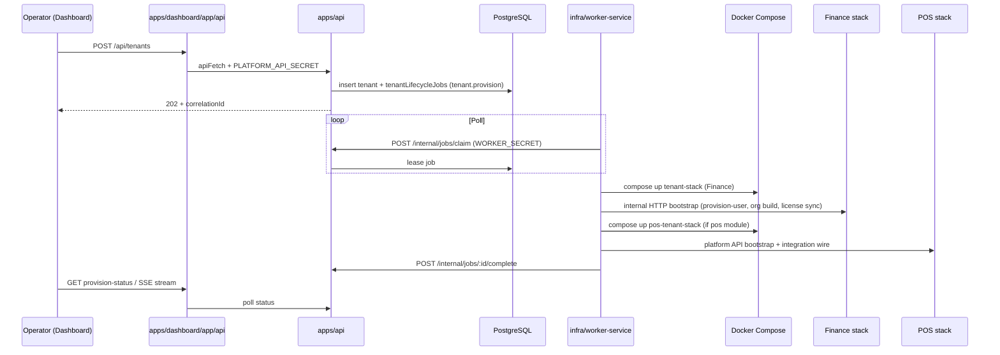

> ⚠️ PARTIALLY STALE — Last updated pre-shared-infra migration.
> Tenant data store sections (MySQL, MongoDB, Redis) described the legacy per-tenant model below.
> The current architecture uses shared infrastructure. See [Architecture2.md](Architecture2.md) for the authoritative source of truth.

# Stockix Repository — Full Architecture Audit

**Last updated:** 2026-05-25 (tenant runtime sections refreshed 2026-06-04)  
**Method:** Evidence from repository layout, manifests, compose files, entry points, and import boundaries. Internal docs (`docs/PLATFORM_REFERENCE.md`, `README.md`) cited only where they match code.

---

## Table of Contents

1. [Architecture classification](#architecture-classification)
2. [Module / service breakdown](#module--service-breakdown)
3. [Data flow explanation](#data-flow-explanation)
4. [Dependency graph (text form)](#dependency-graph-text-form)
5. [Entry points](#entry-points)
6. [Communication patterns](#communication-patterns)
7. [Uncertainties](#uncertainties)
8. [Recommended architecture improvements](#recommended-architecture-improvements)

---

## Architecture classification

| Dimension | Classification | Evidence |
|-----------|----------------|----------|
| **Overall pattern** | **Multi-tenant SaaS control plane + isolated tenant runtimes** | `README.md` (control plane vs Finance runtime); `apps/api`, `infra/worker-service`, per-tenant compose under `infra/*-tenant-stack/` |
| **Monorepo style** | **Polyglot multi-monorepo** (not one unified workspace) | Root: Turborepo + pnpm (`turbo.json`, `pnpm-workspace.yaml` — only `apps/*`, `packages/*`, `services/pms`). POS: separate npm workspaces + Nx (`services/posnew/package.json`). Finance: Lerna (`services/stockix-finance/package.json`, name `bigcapital-monorepo`) |
| **Orchestration** | **Job-driven provisioning** (Postgres queue, not message broker for control plane) | `tenantLifecycleJobs` in `packages/db/src/schema.ts`; worker polls `POST /internal/jobs/claim` in `apps/api/src/index.ts` |
| **Deployment model** | **Docker Compose per layer** (platform prod, per-tenant stacks, optional Terraform for EC2 only) | `infra/prod/docker-compose.yml`, `infra/tenant-stack/docker-compose.yml`, `infra/terraform/README.md` (EC2 only; app deploy is compose on host) |
| **Edge routing** | **Traefik** (TLS, dynamic tenant routes) | `infra/prod/docker-compose.yml` (Traefik service); `infra/worker-service/domain/traefik-config.ts` |
| **Integration style** | **Sync HTTP proxies + async BullMQ bridge (POS→Finance only)** | `apps/api/src/routes/pos-proxy-http.ts`, `pms-proxy-http.ts`; `services/posnew/apps/pos-backend/workers/bigcapitalSyncWorker.js` |

**Not:** a single unified Nx/Turborepo for all products; **not** Kubernetes-native in-repo (compose-first).

---

## Module / service breakdown

### Control plane (pnpm + Turborepo)

| Component | Path | Stack | Role |
|-----------|------|-------|------|
| **Owner API** | `apps/api` | Hono 4, Node, tsup bundle | Tenants, licenses, auth, provisioning API, POS/PMS proxies, Finance internal calls |
| **Owner dashboard** | `apps/dashboard` | Next.js 16, React 19 | Operator UI; BFF under `app/api/*` |
| **Platform DB** | `packages/db` | Drizzle ORM, PostgreSQL | Single schema: owners, tenants, licenses, jobs, PMS tables, etc. (`packages/db/src/schema.ts`) |
| **Config** | `packages/config` | Zod + dotenv | Central env (`packages/config/src/index.ts`) — boundary: no imports from `apps/`, `services/`, `packages/db` (`scripts/lint-boundaries.mjs`) |
| **Product auth** | `packages/auth` | jose JWT | Module-scoped product tokens (`packages/auth/package.json`) |
| **Shared** | `packages/shared` | Types/constants | Roles, audit helpers, finance API normalization |
| **UI primitives** | `packages/ui` | React | Minimal shared components (dashboard has full shadcn set per `docs/PLATFORM_REFERENCE.md`) |
| **Worker** | `infra/worker-service` | Node/tsup | Claims jobs, runs Docker provision, Traefik files, Finance/POS HTTP bootstrap |
| **Dev infra DB** | `infra/dev/docker-compose.yml` | Postgres (+ Redis per docs) | Local platform DB only |

### Tenant runtimes (provisioned by worker)

| Product | Path | Stack | Data store | Compose |
|---------|------|-------|------------|---------|
| **Finance (Stockix)** | `services/stockix-finance` | NestJS 10 (`packages/server/src/main.ts`), React/Vite webapp | Shared **stockix-mysql** (logical DBs `stockix_{slug}_finance`, `stockix_{slug}_{orgId}`); shared **stockix-mongo** (`{slug}_pos`); shared **stockix-redis** (`tenant:{slug}:*` prefix) | `infra/tenant-stack/docker-compose.yml` — `server` + one-shot `database_migration` |
| **POS** | `services/posnew` | Express (`apps/pos-backend/app.js`), Next.js frontend | Shared **stockix-mongo** DB `{slug}_pos`; shared **stockix-redis** with `tenant:{slug}:` prefix | `infra/pos-tenant-stack/docker-compose.yml` — `pos-backend`, `pos-platform-worker`, `pos-bigcapital-worker`, `pos-frontend` |
| **PMS** | `services/pms` + `services/pms/frontend` | Hono API; Next tenant UI | **Same platform Postgres** (`@repo/db` in `services/pms/package.json`) | `infra/pms-tenant-stack/docker-compose.yml` |
| **Chat** | `services/chatlive` (Chatwoot fork) | Rails (image build in prod compose) | Dedicated Postgres/Redis in prod stack | `infra/prod/docker-compose.yml` (`chatwoot` service) — **shared**, not per-tenant compose |

### Legacy / non-integrated (filesystem evidence)

| Path | Status |
|------|--------|
| `services/pmsfull/` | Present at repo root listing; **not** in `pnpm-workspace.yaml`; documented as standalone legacy in `docs/PLATFORM_REFERENCE.md` |
| `services/posnew/apps/saas-dash` | **Absent** — only `pos-backend`, `pos-frontend2` under `services/posnew/apps/` (operator UI consolidated to main dashboard) |

### Workspace membership (hard boundary)

From `pnpm-workspace.yaml`:

```yaml
packages:
  - "apps/*"
  - "packages/*"
  - "services/pms"
  - "services/pms/frontend"
```

`services/posnew` and `services/stockix-finance` are **outside** root pnpm workspace; linked loosely via `stockix: file:../..` in `services/posnew/package.json`.

### Platform Postgres schema (control plane tables)

Defined in `packages/db/src/schema.ts`:

| Table group | Tables (examples) |
|-------------|-------------------|
| **Platform core** | `owners`, `tenants`, `organizations`, `tenant_config`, `tenant_deployments`, `tenant_provision_events`, `tenant_lifecycle_jobs` |
| **API / security** | `api_keys`, `api_idempotency_keys`, `admin_audit_log` |
| **Licensing** | `plans`, `licenses`, `license_history`, `license_activations`, `blacklisted_fingerprints` |
| **PMS** | `pms_properties`, `pms_rooms`, `pms_bookings`, `pms_guests`, `pms_payments`, `pms_ical_channels`, `pms_calendar_events`, `pms_sync_logs`, `pms_staff`, `pms_cleaners`, `pms_cleaning_tasks`, `pms_message_templates`, `pms_guest_form_templates`, `pms_guest_form_submissions`, and related |

### Three-layer environment model

From `README.md`:

| Layer | File | Loaded by | Purpose |
|-------|------|-----------|---------|
| **1 — Platform** | Repo root `.env` (+ optional `.env.local`) | `@repo/config` → API, dashboard, worker | Control plane: Postgres, auth secrets, signup policy, mail/S3 defaults for provisioning |
| **2 — Tenant runtime** | `~/.stockix/tenants/{slug}/.env` (or `TENANT_ENV_ROOT`) | `docker compose --env-file` per tenant | Isolated Finance stack: per-tenant DB passwords, JWT, ports, signup/mail copied at provision time |
| **3 — Finance local dev** | `services/stockix-finance/.env` | NestJS when running `pnpm dev` in `packages/server` | Optional; only for hacking Finance **outside** tenant Docker |

```text
root .env  →  @repo/config  →  worker (provision)
                    ↓
         buildTenantEnvMap() writes ~/.stockix/tenants/{slug}/.env
                    ↓
         docker compose  →  Finance server + webapp containers
```

---

## Data flow explanation

### 1. Tenant provisioning (primary platform flow)



**Evidence:**

- `POST /tenants` and job routes in `apps/api/src/index.ts`
- Job types in `apps/api/src/services/tenant-jobs.ts`: `tenant.provision`, `organization.provision`, `tenant.deprovision`, `tenant.lifecycle`, `add_module`, `remove_module`
- Worker entry: `infra/worker-service/src/worker.ts`
- Compose: `infra/tenant-stack/docker-compose.yml`, `infra/pos-tenant-stack/docker-compose.yml`, `infra/pms-tenant-stack/docker-compose.yml`
- Per-tenant env: `TENANT_ENV_ROOT` (default `~/.stockix/tenants` dev, `/opt/stockix/tenants` prod)

**Worker provision chain:**

```
worker.ts: runProvisionJob
  → domain/provisioner.ts: provisionTenant
    → domain/provisioning/tenant-provision-service.ts
      → src/provision-runtime.ts: executeProvisionRuntime
```

**Provision steps (high level):**

1. Secrets & DB records — `tenants` + `tenantDeployments` with allocated port
2. Module gating — skip Finance if no `accounting` module
3. Write tenant `.env` atomically
4. Docker Compose Finance: shared-mysql → `database_migration` → `server` (Traefik to host port)
5. Finance health `GET /api/ping`, bootstrap admin, org build, warehouses, POS defaults seed
6. Traefik publish `{slug}.{domain}`
7. License sync `POST /api/internal/license/sync`
8. POS stack (if module) + `PUT .../integration/bigcapital`
9. PMS stack (optional) — compose only, no HTTP bootstrap in worker
10. Chat (optional) — Chatwoot platform API
11. Worker calls `POST /internal/jobs/:id/complete`

**Provision progress to UI:** in-process `EventEmitter` in `apps/api/src/provision-bus.ts`, exposed via SSE (`streamSSE` in `index.ts`); dashboard proxies via `apps/dashboard/app/api/tenants/provision-stream/[correlationId]/route.ts`.

### 2. Operator dashboard → control plane API

- UI calls **same-origin** `/api/*` routes (63 route handlers under `apps/dashboard/app/api/`).
- BFF forwards to Hono API with `Authorization: Bearer ${PLATFORM_API_SECRET}` and forwards cookies for session (`apps/dashboard/lib/api-client.ts`).
- Dashboard **must not** import `@repo/db` (`scripts/lint-boundaries.mjs` `[dashboard-db]` rule).
- Auth/session logic must live in API only (`scripts/architecture-validation.mjs` Phase 1–2).

### 3. POS ↔ Finance bridge (async, tenant-scoped)

| Step | Detail |
|------|--------|
| Trigger | Order → `paid` → `fireBigcapitalSync(order)` |
| Queue | BullMQ `bigcapital_sync`, Redis (`services/posnew/apps/pos-backend/services/jobQueue.js`) |
| Worker | `workers/bigcapitalSyncWorker.js` in compose as `pos-bigcapital-worker` |
| Target | Finance `POST /api/internal/pos/receipts` with `x-internal-secret` |
| Module | `services/stockix-finance/packages/server/src/modules/Internal/Internal.module.ts` |
| Wire at provision | Worker `PUT /api/platform/v1/organizations/:id/integration/bigcapital` |

When integration is enabled, POS native GL is skipped; Finance is system of record for revenue/inventory GL on paid orders. See `docs/INTEGRATION_REFERENCE.md`.

**Inventory domains (separate):**

- **POS:** Ingredients, recipes, stock per location
- **Finance:** Items, warehouses, sale receipts, COGS subscribers
- **No shared product master** — manual `IntegrationItemMapping` required

### 4. License / module gating

- Modules stored as JSON text on `tenants.modules` / `licenses.modules` (default `'["accounting"]'`).
- Allowed modules: `accounting`, `pos`, `pms`, `chat`.
- `@repo/auth` issues JWT with `modules[]` for PMS and product gates.
- Finance license sync: `POST .../api/internal/license/sync` from `apps/api/src/finance-license.client.ts`.
- `PROVISION_MODULE_GATING=0` locally, `=1` in prod (documented in `docs/PLATFORM_REFERENCE.md`).

### 5. PMS data

- PMS API reads/writes **platform** Postgres tables `pms_*` in same `schema.ts`.
- Control plane proxies `/pms/api/*` with `x-stockix-internal-secret` and `x-stockix-tenant-id` (`apps/api/src/pms-proxy.ts`).
- PMS entry: `services/pms/src/index.ts` — Hono with `@repo/auth` middleware, routes for properties, rooms, bookings, guests, payments, channels, cleaning, staff, reports, calendar, message templates, guest forms.
- Public routes (no auth): `/api/ical/:token`, `/public/g/:token` for guest forms.

### 6. Control plane API structure

| Area | Location |
|------|----------|
| **Main entry** | `apps/api/src/index.ts` (~5.3k lines) — `serve()` from `@hono/node-server` |
| **Auth routes** | `apps/api/src/routes/auth/index.ts` → `/auth/*` |
| **Licenses** | `apps/api/src/license-http.ts` |
| **Finance users** | `apps/api/src/finance-users-http.ts` |
| **POS proxy** | `apps/api/src/routes/pos-proxy-http.ts` → `/pos/*` |
| **PMS proxy** | `apps/api/src/routes/pms-proxy-http.ts` → `/pms/*` |
| **POS credentials** | `apps/api/src/pos-credentials-http.ts` |
| **Tenant modules** | `apps/api/src/tenant-modules-http.ts` |
| **Unused duplicate** | `apps/api/src/routes/jobs/index.ts` — **not mounted** on live app |

**API auth layers (in `index.ts`):**

1. Auth gate — bypass `/health`, public tenant-orgs, license activate/verify-offline; worker uses `WORKER_SECRET`; else session cookie / API key / platform secret
2. Actor resolution — `actorId` / `actorRole` from session, API key, or platform secret
3. Idempotency — `POST|PATCH|DELETE` on `/owners`, `/tenants` require `Idempotency-Key`
4. RBAC — `apps/api/src/middleware/rbac.ts` (`/pos/*`, `/pms/*` default `read_only`)

### 7. POS backend structure

| Item | Path / value |
|------|----------------|
| Entry | `services/posnew/apps/pos-backend/app.js` |
| HTTP | `http.createServer` + Express |
| Realtime | Socket.IO on same server |
| Platform API | `app.use("/api/platform/v1", require("./routes/platformV1Route"))` |
| Jobs | BullMQ — `platformWorker.js`, `bigcapitalSyncWorker.js` |
| DB | MongoDB (Mongoose) |
| Apps in monorepo | `pos-backend`, `pos-frontend2` only (no `saas-dash`) |

### 8. Finance (Stockix) structure

| Item | Path |
|------|------|
| Monorepo | `services/stockix-finance` — Lerna, `bigcapital-monorepo` |
| Server entry | `packages/server/src/main.ts` — `NestFactory.create` |
| Webapp | `packages/webapp` — React 18, Vite, Blueprint 4 |
| Tenant stack services | `nginx`, `webapp`, `server`, `mysql`, `mongo`, `redis` (`infra/tenant-stack/docker-compose.yml`) |

---

## Dependency graph (text form)

```
┌─────────────────────────────────────────────────────────────────┐
│                     ROOT PNPM WORKSPACE                          │
│  turbo.json orchestrates: apps/*, packages/*, services/pms(*)   │
└─────────────────────────────────────────────────────────────────┘
         │
         ├── packages/config ─────────────────────────────┐
         │         ▲                                        │
         ├── packages/db ────► postgres (platform)        │
         │         ▲                                        │
         ├── packages/auth (jose)                         │
         ├── packages/shared                              │
         ├── packages/ui                                  │
         │                                                │
         ├── apps/api ──────► @repo/{config,db,auth,shared}
         │       │                                          │
         │       ├── HTTP proxy ──► services/pms (Hono)    │
         │       ├── HTTP proxy ──► POS :8010 (external)   │
         │       └── HTTP per-tenant ──► Finance internal  │
         │                                                │
         ├── apps/dashboard ──► @repo/{config,shared,ui}  │
         │       └── BFF fetch ──► apps/api                 │
         │                                                │
         └── services/pms ────► @repo/{config,db,auth}     │
                 └── services/pms/frontend (Next)          │
                                                           │
┌──────────────────────────────────────────────────────────┴───┐
│              ISOLATED: services/posnew (npm + Nx)               │
│  pos-frontend2 ──HTTP──► pos-backend (Express)                │
│  pos-backend ──MongoDB, Redis/BullMQ                          │
│  pos-backend ──HTTP (async)──► Finance internal API           │
│  stockix (file:../..) — loose link to root, not workspace dep   │
└────────────────────────────────────────────────────────────────┘

┌────────────────────────────────────────────────────────────────┐
│         ISOLATED: services/stockix-finance (Lerna)              │
│  Traefik ──► server (NestJS) ──shared-mysql / tenant-redis    │
│  Built into images: stockix-server, stockix-webapp, stockix-nginx│
└────────────────────────────────────────────────────────────────┘

┌────────────────────────────────────────────────────────────────┐
│  infra/worker-service                                           │
│  ──poll──► apps/api (/internal/jobs/*)                         │
│  ──docker──► tenant-stack | pos-tenant-stack | pms-tenant-stack│
│  ──writes──► Traefik dynamic YAML                             │
│  ──HTTP──► Finance + POS bootstrap endpoints                    │
│  Imports compiled from apps/api (mail, license utils) — coupled │
└────────────────────────────────────────────────────────────────┘

┌────────────────────────────────────────────────────────────────┐
│  infra/prod/docker-compose.yml                                  │
│  traefik, postgres, api, dashboard, infra-worker, chatwoot(*)   │
│  socket-proxy for Docker API access from worker                 │
└────────────────────────────────────────────────────────────────┘
```

### Enforced import boundaries

From `scripts/lint-boundaries.mjs` and `scripts/architecture-validation.mjs`:

| Rule | Enforcement |
|------|-------------|
| Apps cannot import `infra/` | `[apps-infra]` |
| Apps cannot cross-import each other | `[apps-cross-app]` |
| Dashboard cannot import `@repo/db` | `[dashboard-db]` |
| `packages/config` is a leaf (no apps/services/db imports) | `[config-leaf]` |
| Runtime code must not use raw `process.env` outside `@repo/config` | `[env-boundary]` |
| Auth/session logic only in `apps/api` | Phase 2 validation |
| DB package must not contain job orchestration | Phase 3 validation |

### Pattern inconsistencies (by design today)

| Concern | Control plane | POS | PMS | Finance |
|---------|---------------|-----|-----|---------|
| Auth | Jose session + product JWT | POS JWT + platform API key | Stockix JWT | Nest JWT + internal secret |
| UI | shadcn + Tailwind 4 | shadcn | shadcn | Blueprint 4 |
| DB | PostgreSQL | MongoDB (`{slug}_pos` on shared mongo) | PostgreSQL (shared control plane) | MySQL (logical DBs on shared stockix-mysql) |

---

## Entry points

| Entry | File / command | Port (defaults) |
|-------|----------------|-----------------|
| **Local full stack** | `pnpm dev` → `scripts/dev-stockix.mjs` | API 4000, dashboard 3000, PMS 3003/3004, POS via `dev-pos-stack.mjs` |
| **Control plane API** | `apps/api/src/index.ts` → `serve()` | `apiConfig.port` |
| **API dev launcher** | `scripts/dev-api.mjs` → `tsx watch src/index.ts` | — |
| **Dashboard** | Next.js `apps/dashboard` (`scripts/dev-next.mjs`) | 3000 |
| **Worker** | `infra/worker-service/src/worker.ts` | N/A (polls API) |
| **Worker bundle** | `pnpm infra:worker:build` → `infra/worker-service/.runtime/worker.js` | — |
| **PMS API** | `services/pms/src/index.ts` → `startPmsServer` | `PMS_PORT` (3003) |
| **PMS tenant UI** | `services/pms/frontend` | 3004 |
| **POS backend** | `services/posnew/apps/pos-backend/app.js` | 8010 in compose / config |
| **POS platform API** | `/api/platform/v1` on same server | Same |
| **POS workers** | `workers/platformWorker.js`, `workers/bigcapitalSyncWorker.js` | Separate processes |
| **Finance server** | `services/stockix-finance/packages/server/src/main.ts` | Nest (3000 behind nginx in stack) |
| **Finance webapp** | Vite in `packages/webapp` | Behind nginx in tenant stack |
| **Chatwoot** | Docker image from `services/chatlive` | Prod compose (~3200 per docs) |
| **DB migrations** | `packages/db` — `pnpm db:migrate` | Postgres 54330 dev (`infra/dev`) |
| **Production platform** | `cd infra/prod && docker compose up` | 80/443 Traefik |
| **Terraform (EC2 only)** | `infra/terraform/` | Does not deploy app — use `scripts/setup-ec2.sh` + prod compose |

### Root package.json scripts (orchestration)

| Script | Purpose |
|--------|---------|
| `pnpm dev` | Full local stack (API, dashboard, worker, PMS, POS) |
| `pnpm dev:pms` / `dev:pms:stack` | PMS only or with API |
| `pnpm dev:pos` | POS stack |
| `pnpm db:up` / `db:migrate` / `db:seed:local` | Platform Postgres |
| `pnpm lint:boundaries` | Import/env boundary checks |
| `pnpm architecture:validate` | Layer purity checks |
| `pnpm pos:images:build` | Build POS tenant Docker images |

### Local dev URLs (from README)

| App | URL | Notes |
|-----|-----|-------|
| Dashboard | http://localhost:3000 | `admin@localhost` / `admin` |
| API | http://localhost:4000 | — |
| PMS API | http://localhost:3003 | Proxied via API `/pms/api/*` |
| PMS tenant app | http://localhost:3004 | — |
| POS platform API | http://localhost:8010 | `POS_PLATFORM_API_KEY` |
| POS restaurant UI | http://localhost:3001 | `{slug}-pos.localhost` with Traefik |

Skip POS locally: `STOCKIX_DEV_SKIP_POS=1 pnpm dev`

---

## Communication patterns

| Pattern | Where | Sync/async | Evidence |
|---------|-------|------------|----------|
| **REST (control plane)** | Dashboard BFF → API → Postgres | Sync | `apps/dashboard/lib/api-client.ts`, Hono routes |
| **REST (tenant POS)** | Frontend → Express `/api/*` | Sync | `pos-backend/app.js` |
| **REST (platform POS ops)** | API `/pos/*` → POS `/api/platform/v1/*` | Sync | `apps/api/src/pos-proxy.ts`, `X-Api-Key` |
| **REST (PMS)** | API `/pms/api/*` → PMS Hono | Sync | `apps/api/src/pms-proxy.ts` |
| **REST (Finance internal)** | API/worker → `{tenantHost}:{internalPort}/api/internal/*` | Sync | `finance-users.client.ts`, worker provision adapters |
| **Job queue (platform)** | `tenant_lifecycle_jobs` + worker poll | Async (poll ~1.5s) | No Redis for control-plane jobs |
| **Job queue (POS)** | BullMQ + Redis | Async | `jobQueue.js`, `pos-redis` in compose |
| **SSE** | Provision stream to dashboard | Async push over HTTP | `provision-bus.ts`, `streamSSE` |
| **WebSocket** | POS floor realtime | Persistent | Socket.IO in `pos-backend/app.js` |
| **Email** | nodemailer from API mail module | Async side effect | Provision complete / welcome emails |
| **Traefik file provider** | Dynamic routes per tenant | Config push (file write) | Worker + `TRAEFIK_DYNAMIC_DIR` |
| **Chatwoot Platform API** | Worker provisions account | Sync HTTP | `infra/worker-service/src/chatwoot-provision.ts` |

### Worker ↔ API internal protocol

| Endpoint | Purpose |
|----------|---------|
| `POST /internal/jobs/claim` | Claim next pending job |
| `POST /internal/jobs/:id/heartbeat` | Lease renewal |
| `GET /internal/jobs/:id/cancel-check` | Cooperative cancel |
| `POST /internal/jobs/:id/complete` | Finish job, update deployments |
| `POST /internal/jobs/:id/fail` | Retry or dead letter |
| `GET /internal/jobs/dead` | List dead jobs |
| `POST /internal/jobs/:id/requeue` | Requeue dead job |
| `PATCH /internal/organizations/:controlPlaneOrgId` | Worker updates org state |

Auth: `Authorization: Bearer ${WORKER_SECRET}`

### Finance internal HTTP endpoints (worker/API)

| Endpoint | Purpose |
|----------|---------|
| `GET /api/ping` | Health |
| `POST /api/internal/provision-user` | Bootstrap admin |
| `POST /api/auth/signin` | Session for org build |
| `POST /api/organization/build` | Org setup |
| `POST /api/internal/tenants/:id/activate-warehouses` | Warehouses |
| `POST /api/internal/tenants/:id/seed-pos-defaults` | POS defaults |
| `POST /api/internal/license/sync` | License sync |
| `GET /api/internal/resolve-tenant` | Resolve finance tenant id |
| `POST /api/internal/pos/receipts` | POS bridge ingress |
| `DELETE /api/internal/pos/receipts/by-reference/:referenceNo` | Void receipt |

Auth header: `x-internal-secret: ${INTERNAL_API_SECRET}`

### POS platform HTTP (worker/API)

| Endpoint | Purpose |
|----------|---------|
| `GET /api/platform/v1/organizations/health-summary` | Health |
| `POST /api/platform/v1/organizations` | Create org |
| `GET /api/platform/v1/organizations/:id/provisioning-status` | Poll bootstrap |
| `PUT /api/platform/v1/organizations/:id/integration/bigcapital` | Wire Finance |

Auth: `X-Api-Key: ${POS_PLATFORM_API_KEY}`

### Traefik routes (worker-written)

| Route file | Host pattern | Backend |
|------------|--------------|---------|
| `tenant-{slug}.yml` | `{slug}.{domain}` | Finance stack port |
| `tenant-pos-{slug}.yml` | `{slug}-pos.{domain}`, `{slug}-pos-api.{domain}` | POS frontend / API |

Skipped on `localhost` dev for POS Traefik (per module-stacks logic).

### Auth patterns (multi-system)

| Layer | Mechanism | Evidence |
|-------|-----------|----------|
| Platform owners | Session cookie `stockix-session` + API keys `sk_live_*` | `apps/api/src/routes/auth/`, auth gate in `index.ts` |
| Worker | `WORKER_SECRET` Bearer | Internal job routes |
| Product modules (PMS) | `@repo/auth` JWT + `modules[]` | `services/pms/src/index.ts` |
| POS staff | POS JWT + PIN | `pos-backend` auth middleware |
| POS platform | `X-Api-Key` / platform JWT | `/api/platform/v1` |
| Finance tenant | Nest JWT + `x-internal-secret` | Internal module |

### Infra compose files reference

| Path | Contents |
|------|----------|
| `infra/dev/docker-compose.yml` | Postgres only (port 54330) |
| `infra/prod/docker-compose.yml` | Traefik, postgres, api, dashboard, worker, Chatwoot |
| `infra/tenant-stack/docker-compose.yml` | Per-tenant **Finance** stack |
| `infra/pos-tenant-stack/docker-compose.yml` | Per-tenant POS + `pos-bigcapital-worker` |
| `infra/pms-tenant-stack/docker-compose.yml` | Per-tenant PMS |
| `infra/terraform/` | EC2 + security group only |

---

## Uncertainties

| Topic | Why uncertain |
|-------|----------------|
| **Exact PMS tenant isolation** | PMS uses shared `DATABASE_URL`; full `tenantId` filtering on every route not verified in this audit |
| **Production Chatwoot routing** | Compose defines service; per-tenant URL mapping in Traefik for chat not verified |
| **`pmsfull` runtime usage** | Directory exists; no workspace or root dev script references |
| **POS_ARCHITECTURE_AUDIT.md freshness** | Doc mentions `saas-dash`; filesystem shows it removed |
| **CI runs boundary/architecture scripts** | `pnpm lint:boundaries` and `architecture:validate` exist; GitHub Actions inclusion not verified |
| **Nx project graph for POS** | `services/posnew/nx.json` exists; full graph not exported |

---

## Recommended architecture improvements

1. **Split `apps/api/src/index.ts` (~5.3k lines)**  
   Extend registrar pattern (licenses, proxies) to tenants and internal jobs to reduce merge risk and ease testing.

2. **Clarify workspace boundaries in tooling**  
   Three package managers (root pnpm, POS npm, Finance Lerna). Document install order; optionally add a root validation script for all three trees.

3. **Reduce worker ↔ API compile coupling**  
   Worker bundles imports from `apps/api` (mail, license utils). Extract `packages/provisioning` or `packages/worker-contracts`.

4. **Mount or delete `apps/api/src/routes/jobs/index.ts`**  
   Duplicate job router not mounted on live app — remove or wire to avoid drift.

5. **PMS on shared Postgres**  
   Add DB-level guards (RLS or mandatory `tenant_id` middleware tests) and document in `services/pms/AGENTS.md`.

6. **Port collision documentation**  
   Finance webapp and platform API both default to 4000 in different contexts. Enforce distinct defaults in `@repo/config` or dev banners.

7. **Archive or quarantine `services/pmsfull`**  
   Add README stating non-integration if folder stays in tree.

8. **Strengthen architecture CI**  
   Run `pnpm lint:boundaries` and `pnpm architecture:validate` on every PR in GitHub Actions.

9. **Update POS operator docs**  
   `services/posnew/POS_ARCHITECTURE_AUDIT.md` still references removed `saas-dash`; align with dashboard + `/api/pos/*` proxy.

10. **Provision observability**  
    Propagate correlation IDs from API → worker → Finance/POS logs; `tenant_provision_events` journal is a good base.

---

## Related documentation

| File | Purpose |
|------|---------|
| [README.md](../README.md) | Quick start, env layers, local URLs |
| [PLATFORM_REFERENCE.md](./PLATFORM_REFERENCE.md) | Platform decisions, service map, module system |
| [INTEGRATION_REFERENCE.md](./INTEGRATION_REFERENCE.md) | POS + Finance bridge |
| [ENV_REFERENCE.md](./ENV_REFERENCE.md) | Environment variables |
| [PROVISIONING_REFERENCE.md](./PROVISIONING_REFERENCE.md) | Tenant provisioning |
| [openapi/stockix-platform.openapi.yaml](./openapi/stockix-platform.openapi.yaml) | Platform API contract |
| [FUNCTIONAL_AUDIT.md](./FUNCTIONAL_AUDIT.md) | Functional audit |

---

*This document consolidates the architecture audit performed 2026-05-25. Re-verify against live staging before production cutover.*
