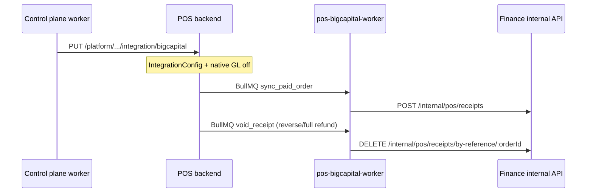

# POS + Bigcapital Integration

Operational guide and verification index for connecting provisioned **POS** tenants to **Stockix Finance** (Bigcapital-compatible internal API).

## Quick links

| Document | Purpose |
|----------|---------|
| [INTEGRATION_REPAIR_REPORT.md](./INTEGRATION_REPAIR_REPORT.md) | Latest full verification, gap table, test results, production readiness |
| [POS_FULL_AUDIT.md](./POS_FULL_AUDIT.md) | Original POS audit |
| [missingfor.md](./missingfor.md) | Gap analysis that drove the auto-wire work |

## Architecture (accounting + POS bundle)



## Provision flow

1. **Preflight** — `POS_PLATFORM_API_KEY` (if `pos` module), `INTERNAL_API_SECRET` (if `accounting` module).
2. **Finance stack** — tenant DB, internal port, seed walk-in customer + deposit accounts.
3. **POS stack** — Docker compose with `pos-backend`, `pos-bigcapital-worker`, `host.docker.internal` for Finance URL.
4. **Wire step** — `tenant.wire_pos_integration` copies Finance IDs into POS Mongo `IntegrationConfig`.
5. **Operator** — map menu items via `POST /api/integrations/item-mappings` (not auto-seeded).

## Required environment

| Variable | Used by |
|----------|---------|
| `POS_PLATFORM_API_KEY` | Worker → platform wire API; POS platform routes |
| `INTERNAL_API_SECRET` | Worker wire payload; Finance internal auth |
| `POS_FINANCE_INTERNAL_HOST` | Optional override (default `host.docker.internal`) |
| `FINANCE_INTERNAL_BASE_URL` | Injected into POS compose for worker/backend |

See `.env.example` and `infra/prod/.env.example`.

## Runtime processes

| Process | How it runs |
|---------|-------------|
| POS API | `pos-backend` container |
| Bigcapital sync | `pos-bigcapital-worker` — `node workers/bigcapitalSyncWorker.js` |
| Finance | Per-tenant `stockix-{slug}-*` compose stack |

Do **not** rely on manually running `npm run worker:bigcapital` on the host in production.

## Key APIs

| Action | Endpoint |
|--------|----------|
| Wire integration (provision) | `PUT /api/platform/v1/organizations/:id/integration/bigcapital` |
| Map item | `POST /api/integrations/item-mappings` |
| Sync status | `GET /api/integrations/sync/status` |
| Reverse + void Finance | `POST /api/accounting/reverse-order/:orderId` (native GL skipped when Finance integration on) |
| Full refund + void Finance | `POST /api/accounting/refunds/:orderId` (amount ≥ order total; native GL skipped when Finance on) |
| Offline pay (sync later) | Queued as `pay_order` in IndexedDB when offline (existing order required) |

## Verification

Run through [INTEGRATION_REPAIR_REPORT.md](./INTEGRATION_REPAIR_REPORT.md) after any change to wire, worker, sync processor, or compose.

**Smoke test (burger scenario):**

1. Provision tenant with `modules: ["accounting", "pos"]`.
2. Confirm `tenant_deployments.finance_tenant_id` and `pos_organization_id` populated.
3. Map one menu item to a Finance item.
4. Sell and pay one line; check `accountingSaleStatus` → `ok` and Finance receipt by `referenceNo`.
5. Reverse order; confirm Finance receipt removed (or 404 if never synced).

## Tests

```bash
cd services/posnew/apps/pos-backend && npm test
cd services/stockix-finance/packages/server && pnpm test
cd apps/api && pnpm test
cd infra/worker-service && npx tsc --noEmit
node domain/provisioning/build-finance-internal-url.node.test.cjs
```
