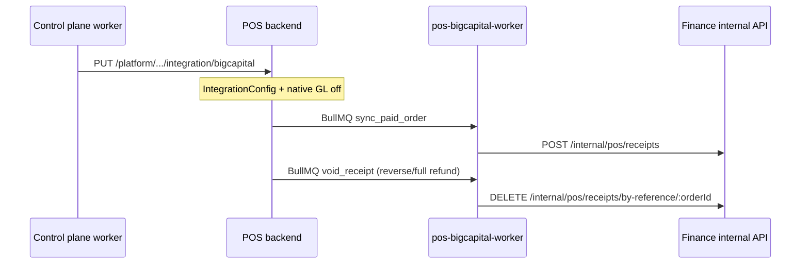

# POS + Bigcapital Integration — Complete Reference

Single source of truth for: bridge architecture, gaps, status, session/auth/email issues, and operator steps.

**Last consolidated:** 2026-05-24  
**Supersedes:** `POS_BIGCAPITAL_INTEGRATION_AUDIT.md`, `POS_FULL_AUDIT.md`, `INTEGRATION.md`, `INTEGRATION_REPAIR_REPORT.md`, `INTEGRATION_VERIFICATION_REPORT.md`, `missingfor.md`, `accountingmiss.md` (integration/session portions), `SAAS_AUDIT_EMAIL.md`, `accountmissing2.md` (integration ops)

---

## Table of Contents

1. [Architecture Overview](#1-architecture-overview)
2. [What Was Built](#2-what-was-built)
3. [How The Bridge Works](#3-how-the-bridge-works)
4. [Configuration (IntegrationConfig)](#4-configuration-integrationconfig)
5. [Item Mapping](#5-item-mapping)
6. [Provisioning Auto-Wire](#6-provisioning-auto-wire)
7. [Gap Status (16 gaps)](#7-gap-status-16-gaps)
8. [Known Issues (Session / Auth / Email)](#8-known-issues-session--auth--email)
9. [Manual Setup Steps After Provision](#9-manual-setup-steps-after-provision)
10. [POS Standalone & JWT Architecture](#10-pos-standalone--jwt-architecture)
11. [Verification & Tests](#11-verification--tests)

---

## 1. Architecture Overview

Two **separate systems** connected by an **async bridge**:

| System | Owns |
|--------|------|
| **POS** (`services/posnew`) | Restaurant operations, ingredient inventory (recipes/BOM), PIN staff auth, native GL (when integration off) |
| **Stockix Finance / Bigcapital** (`services/stockix-finance`) | Financial inventory, sale receipts, COGS GL, AR/deposits |

**Bridge:** BullMQ queue `bigcapital_sync` → worker posts to Finance `POST /api/internal/pos/receipts` with `x-internal-secret`.

When integration is **enabled**, POS native GL (`postOrderSaleLedger` / COGS) returns `null` — Finance is system of record for revenue/inventory GL on paid orders.



### Inventory domains (separate)

- **POS:** Ingredients, recipes, `StockBalance` per location, deduction on **payment**.
- **Finance:** Items with `costPrice`/`sellPrice`, warehouses, sale receipts with `closed: true` trigger COGS subscribers.
- **No shared product master** — manual `IntegrationItemMapping` required per menu item.

---

## 2. What Was Built

| Component | File / location | Status |
|-----------|-----------------|--------|
| IntegrationConfig model | `models/integrationConfigModel.js` | ✅ |
| Item mapping model | `models/integrationItemMappingModel.js` | ✅ |
| Sync enqueue | `services/bigcapitalSyncEnqueue.js` | ✅ |
| Sync processor | `services/bigcapitalSyncProcessor.js` | ✅ |
| Sync worker | `workers/bigcapitalSyncWorker.js` | ✅ In compose as `pos-bigcapital-worker` |
| Integration REST routes | `routes/integrationRoute.js` (8 routes) | ✅ |
| Finance receipt ingress | `InternalPos.controller.ts`, `InternalPosReceipts.service.ts` | ✅ |
| Platform wire API | `PUT /api/platform/v1/organizations/:id/integration/bigcapital` | ✅ |
| Worker wire step | `tenant.wire_pos_integration` after accounting+pos | ✅ |
| Preflight | `POS_PLATFORM_API_KEY`, `INTERNAL_API_SECRET` | ✅ |
| Finance seed defaults | `seed-pos-defaults`, walk-in + deposit accounts | ✅ |
| persistFinanceDeploymentIds | `tenant_deployments.finance_tenant_id`, etc. | ✅ |
| Void sync | `void_receipt` jobs on reverse-order + full refund | ✅ |
| Unmapped-item alerts | Backoffice notification + `accountingSaleStatus: failed` | ✅ |
| Line discounts in receipt | Per mapped line; service charge in `statement` only | ⚠️ Partial |
| Offline pay queue | `pay_order` in IndexedDB offline queue | ✅ |
| Dashboard integration banner | Partial status, finance tenant ID, POS URL | ✅ |

---

## 3. How The Bridge Works

### Trigger (paid order)

1. Order transitions to `paid` (`patchOrderStatus`, `addOrder`, `syncOfflineOrders`, `updateOrder`).
2. `processStockAfterPayment` deducts POS ingredient stock (unchanged).
3. If `AccountingConfig.bigcapitalIntegrationEnabled` → skip native sale/COGS journals.
4. `fireBigcapitalSync(order)` — non-blocking enqueue to `bigcapital_sync`.
5. HTTP response returns immediately (payment not blocked).

### Worker processing

1. Load `IntegrationConfig` — early exit if `bigcapital.enabled !== true`.
2. `buildSaleReceiptPayload(order)` — map lines via `IntegrationItemMapping`.
3. `POST {internalBaseUrl}/api/internal/pos/receipts` with `{ tenantId: financeTenantId, payload }`.
4. Finance creates closed sale receipt (`referenceNo = order._id`) → inventory + COGS in Finance.
5. Update order `accountingSaleStatus: ok` or `failed`; config `syncStatus`.

### Void / refund path (built)

| Trigger | Action |
|---------|--------|
| `POST /api/accounting/reverse-order/:orderId` | Enqueue `void_receipt` when Finance integration on |
| Full refund (amount ≥ order total) | Same void enqueue |
| Native GL | Skipped when `bigcapitalIntegrationEnabled` |

Finance: `DELETE /api/internal/pos/receipts/by-reference/:referenceNo`

### Queue configuration

| Setting | Value |
|---------|-------|
| Queue name | `bigcapital_sync` |
| Job ID | `bigcapital_order_${order._id}` (idempotent) |
| Retries | 5 attempts, exponential backoff 10s |
| Redis | `config.redisUrl` / `jobQueue` |

### COGS handling

- POS sends `itemId`, `quantity`, `rate` per mapped line — **no explicit cost** from POS recipe costing.
- Finance COGS from item `costPrice` + inventory rules when receipt `closed: true`.
- **Gap:** POS ingredient costing not forwarded; wrong BC item cost → wrong Finance COGS.

---

## 4. Configuration (IntegrationConfig)

**Mongo model:** `integrationConfigModel.js` — one docstring per organization, nested `bigcapital` subdocument.

| Field | Type | Purpose |
|-------|------|---------|
| `enabled` | Boolean (default `false`) | Master switch; also sets `AccountingConfig.bigcapitalIntegrationEnabled` on save |
| `internalBaseUrl` | String | Finance stack URL for bridge HTTP |
| `internalSecret` | String | Must match Finance `INTERNAL_API_SECRET` |
| `financeTenantId` | Number | Bigcapital numeric tenant id |
| `defaultWalkInCustomerId` | Number | Required on receipts |
| `defaultCashDepositAccountId` | Number | Cash payment routing |
| `defaultCardDepositAccountId` | Number | Card payment routing |
| `defaultWarehouseId` | Number | Fallback warehouse |
| `locationMapping[]` | `{ posLocationId, bigcapitalBranchId, bigcapitalWarehouseId }` | Per-location |
| `lastSyncedAt`, `lastSyncError`, `syncStatus` | Telemetry | idle / syncing / error |

**Not used:** `financeUrl` / `financeApiKey` — bridge uses `internalBaseUrl` + `internalSecret` only.

### Setting config via API

| Action | Endpoint |
|--------|----------|
| Read config | `GET /api/integrations/config` |
| Update config | `PUT /api/integrations/config` |
| Test connection | `POST /api/integrations/test-connection` (`/api/ping`) |
| Sync status | `GET /api/integrations/sync/status` |
| Replay failed order | `POST /api/integrations/sync/replay/:orderId` |

### Deposit account resolution

- Single `depositAccountId` per receipt from largest payment split or cash/card heuristic.
- **Gap M1:** Multi-tender not split across deposit accounts in Finance.

### Multi-currency

- `exchangeRate` forwarded when `order.documentCurrency` + `fxRateToCompany` set.

---

## 5. Item Mapping

**Collection:** `IntegrationItemMapping` — unique `(organization, posMenuItemId)`.

| Action | Endpoint |
|--------|----------|
| List | `GET /api/integrations/item-mappings` |
| Create/update | `POST /api/integrations/item-mappings` |
| Delete | `DELETE /api/integrations/item-mappings/:posMenuItemId` |

### Behavior

1. Processor loads mappings for order menu item IDs.
2. Unmapped lines get `itemId: null` and are **dropped**.
3. If no mapped lines remain → job skips (`reason: "No mapped items"`) — now also notifies operator (H5 fix).
4. Partial cart → only mapped lines sync (Finance total ≠ POS total if mixed).

**No auto-seed** from menu or Finance items at provision — **every sellable SKU requires manual mapping**.

---

## 6. Provisioning Auto-Wire

When `modules = ['accounting', 'pos']` and provision succeeds:

| Step | Operation | What happens |
|------|-----------|--------------|
| 1–7 | Finance stack | Bootstrap admin, build org, activate warehouses (bundle), seed POS defaults |
| 8 | `provisionPosStack` | POS compose including `pos-bigcapital-worker` |
| 9 | `bootstrapPosOrganization` | Platform API org + PIN bootstrap |
| 10 | **`tenant.wire_pos_integration`** | `PUT .../integration/bigcapital` with Finance IDs |
| 11 | Persist IDs | `tenant_deployments`: `finance_tenant_id`, walk-in/deposit IDs, `pos_organization_id`, `pos_url` |

### Wire payload (from worker)

Copies from provision result / deployment row:

- `financeTenantId`, walk-in customer, cash/card deposit accounts
- `internalBaseUrl` via `buildFinanceInternalUrlForPos` (default `host.docker.internal:{port}`)
- `internalSecret` = `INTERNAL_API_SECRET`
- `defaultWarehouseId`, location mapping Main → warehouse
- Sets `enabled: true` → native GL off

### Preflight requirements

| Variable | When |
|----------|------|
| `POS_PLATFORM_API_KEY` (≥10 chars) | POS org bootstrap |
| `INTERNAL_API_SECRET` | Finance internal APIs + wire |

### Traefik (bundle tenants)

| Product | Host pattern |
|---------|--------------|
| Finance | `{slug}.{domain}` |
| POS frontend | `{slug}-pos.{domain}` |
| POS API | `{slug}-pos-api.{domain}` |

---

## 7. Gap Status (16 gaps)

| Gap | Severity | Status | Notes |
|-----|----------|--------|-------|
| C1 IntegrationConfig auto-wire | Critical | **FIXED** | Worker wire step + platform PUT |
| C2 Finance void on POS void | Critical | **FIXED** | `void_receipt` on reverse + full refund |
| C3 Worker in compose | Critical | **FIXED** | `pos-bigcapital-worker` service |
| C4 POS_PLATFORM_API_KEY empty | Critical | **FIXED** | Preflight + env validation |
| H1 Native GL auto-disabled | High | **FIXED** | Wire + `bigcapitalIntegrationEnabled` |
| H2 Finance IDs to POS config | High | **FIXED** | Wire payload |
| H3 Auto internalBaseUrl | High | **FIXED** | `buildFinanceInternalUrlForPos` |
| H4 Partial status in dashboard | High | **FIXED** | Partial banner |
| H5 Unmapped items silent | High | **FIXED** | Notification + failed status |
| H6 Service charge / discounts | High | **FIXED** | Bridge items seeded (`POS-SERVICE-CHARGE`, `POS-ORDER-DISCOUNT`); wired to POS; receipt lines via `appendFinanceAdjustmentEntries` |
| H7 Offline pay frontend | High | **FIXED** | `pay_order` offline queue (needs existing orderId) |
| H8 Auto GL reversal on void | High | **FIXED** | Native bypass when Finance on |
| M1 Multi-payment → single deposit | Medium | **OPEN** | Largest split wins |
| M2 Per-order sync status UI | Medium | **FIXED** | Payment success toasts |
| M3 KDS frontend | Medium | **OPEN** | Separate product scope |
| M4 Location mapping auto-seed | Medium | **FIXED** | Main → warehouse on wire |
| M5 finance_tenant_id persist | Medium | **FIXED** | `persistFinanceDeploymentIds` |

### Additional gaps (from full POS audit)

| Gap | Severity | Status |
|-----|----------|--------|
| Stockix JWT accepted but no `req.user` bridge | Critical | **OPEN** — SSO into POS tenant API non-functional |
| Partial refund without full void | Medium | **OPEN** — no Finance adjust API |
| Live E2E burger scenario | — | **NOT RUN** — required on staging |

### Production readiness by bundle

| Bundle | Ready | Notes |
|--------|-------|-------|
| Accounting only | **YES** | |
| POS only | **YES** | |
| Accounting + POS | **YES*** | *Live smoke on host still required |

---

## 8. Known Issues (Session / Auth / Email)

**Source:** SaaS audit (May 2026). Several fixes merged in same pass.

### Session expired + refresh loop (Finance webapp)

**Cause:** Dual 401 handlers:

1. `axios.tsx` — clears cookies → redirect `/auth/login`
2. `useRequest.tsx` — `setLogout()` → `window.location.reload()`

**Fix applied:** Removed `setLogout()` on 401 in `useRequest.tsx` (axios handles redirect).

**Cookie vs JWT mismatch (impersonate):**

- Cookie `maxAge` was 1h; JWT `expiresIn: '1d'`
- **Fix applied:** Impersonate cookie aligned to 24h in `Auth.controller.ts`

### Dashboard provisioning poll (“infinite refresh”)

- Tenant detail polls every 2.5s while status `provisioning`/`pending`.
- If job completes but status stuck → poll never stops.
- **Ops:** Investigate stuck tenants; worker should set `active` on success.

### One-time / bootstrap password

| Aspect | Detail |
|--------|--------|
| Algorithm | HMAC-SHA256 over `bootstrap:{tenantKey}` with `DEPLOYMENT_SECRET_KEY` |
| UI visibility | 15-minute cache (`PROVISION_PASSWORD_TTL_MS`) — label “one-time” means operator visibility window |
| Finance password | **No expiry** until admin changes it |
| Force change on first login | **NO** — not implemented |

**Operator instructions:**

1. Open Finance URL from welcome email or dashboard.
2. Sign in with tenant admin email + bootstrap password (shown ~15 min after provision) or use Stockix Impersonate.
3. **Change password immediately** in Finance settings (no forced prompt).
4. Bootstrap password is deterministic per slug — rotate `DEPLOYMENT_SECRET_KEY` and admin password for security.

### Support agent org access dropdown

- Panel grants **Stockix control-plane owners** (`role === support_agent`) scoped org access — **not** Finance tenant users.
- Finance users: separate **Finance users** card via `GET /api/tenants/:id/users`.
- **Fix applied:** Clarified copy to “Stockix support agent”.

### Finance tenant ID not set

**Persistence paths (when bootstrap succeeds):**

1. Worker `persistFinanceDeploymentIds` on bootstrap
2. API job complete reads `result.financeTenantId` + journal fallback

**Why still null:**

- Resume skipped bootstrap without journal id
- Legacy rows before persist fix
- Finance stack unreachable for repair

**Fix applied:** On resume, restore `financeTenantId` from `tenant_deployments`. Dashboard **Repair Finance link** available.

### License system (cross-ref)

| Check | Status |
|-------|--------|
| Plan limits → license on provision | ✅ |
| Sync to Finance (`LicenseGuard`) | ✅ |
| Finance maxUsers / maxOrganizations | ✅ (fixes applied May 2026) |
| Expiry emails | ✅ worker cron + templates |

See [PROVISIONING_REFERENCE.md](./PROVISIONING_REFERENCE.md) for plan/limit bugs.

### Email (Resend)

| Flow | Status |
|------|--------|
| Provision welcome | ✅ if `MAIL_*` set (non-fatal on failure) |
| Finance password reset | ✅ per-tenant SMTP |
| License expiring / expired | ✅ |
| Owner invite | ✅ `sendOwnerInviteEmail` on `/owners/invite` |
| Finance user invite from dashboard | Creates user with password — not email invite |

**Config pattern:** `MAIL_HOST=smtp.resend.com`, port 587, user `resend`, password = API key (`re_*`).

---

## 9. Manual Setup Steps After Provision

For **`modules=['accounting','pos']`** after automated wire (verify first):

1. **Confirm wire succeeded** — Dashboard integration banner; Mongo `IntegrationConfig.bigcapital.enabled === true`.
2. **Note credentials** — Bootstrap password (15 min window) or impersonate; Finance URL `{slug}.{ROOT_DOMAIN}`.
3. **Login to Finance** — Change admin password; verify walk-in customer and deposit accounts exist.
4. **Map POS items** — For each menu item sold to Finance:
   ```http
   POST /api/integrations/item-mappings
   { "posMenuItemId": "...", "bigcapitalItemId": N, "bigcapitalItemName": "..." }
   ```
5. **Verify worker** — `docker ps | grep bigcapital-worker` healthy in tenant POS compose.
6. **Smoke test** — Sell 1 mapped item, pay, check `accountingSaleStatus: ok` and Finance receipt by `referenceNo = orderId`.
7. **Reverse test** — Reverse order; confirm Finance receipt voided.

If wire failed (legacy tenant):

- Set `PUT /api/integrations/config` manually with IDs from `tenant_deployments` row.
- Ensure `INTERNAL_API_SECRET` matches Finance tenant env.

---

## 10. POS Standalone & JWT Architecture

### POS standalone readiness

**YES** with caveats — core F&B, inventory, native GL, floor/tables, payments, admin refunds. Gaps: KDS UI page, paid-void workflow, offline pay-and-close in default UX.

### Auth summary

| Token | Secret | Purpose |
|-------|--------|---------|
| POS staff | `JWT_SECRET`, `JWT_REFRESH_SECRET` | PIN/password sessions |
| POS platform | `PLATFORM_JWT_SECRET` | Platform operator API |
| Stockix product | `AUTH_TOKEN_SECRET` | Verify-only today; **does not set `req.user`** |
| Finance staff | `APP_JWT_SECRET` | Tenant user sessions |
| Finance internal | `INTERNAL_API_SECRET` | S2S header |

**Recommendation:** Keep PIN/POS JWT for floor staff. Use Stockix JWT only for cross-product SSO with a future **User bridge middleware**.

### Offline behavior

| Path | Behavior |
|------|----------|
| Default offline queue | `create_order`, `patch_order_items` only — **not** pay-and-close |
| Bulk sync API | `POST /api/order/sync` with `orderStatus: paid` → stock + Finance sync ✅ |
| Offline pay queue (H7) | `pay_order` mutation when order already exists online |

---

## 11. Verification & Tests

### Automated tests

```bash
cd services/posnew/apps/pos-backend && npm test    # ~99-102 pass
cd services/stockix-finance/packages/server && pnpm test   # 21 pass
cd apps/api && pnpm test                         # 130-141 pass
cd infra/worker-service && npx tsc --noEmit
node domain/provisioning/build-finance-internal-url.node.test.cjs
```

### Burger scenario (manual)

| Step | Verify |
|------|--------|
| Provision accounting+pos | `finance_tenant_id`, `pos_organization_id` populated |
| IntegrationConfig enabled | Mongo + native GL off |
| Map burger → Finance item | POST item-mappings |
| Sell + pay | `accountingSaleStatus: ok` |
| Finance receipt | `referenceNo` = order `_id`, closed |
| Reverse | Finance receipt deleted/404 |

### Pre-deploy checklist

- [ ] `POS_PLATFORM_API_KEY` (≥10 chars) and `INTERNAL_API_SECRET` set
- [ ] `pos-bigcapital-worker` healthy in tenant compose
- [ ] Menu items mapped for SKUs sold to Finance
- [ ] One paid-order + reverse smoke on staging

---

## Appendix — Key file references

| Area | Path |
|------|------|
| Sync enqueue/processor/worker | `services/posnew/apps/pos-backend/services/bigcapitalSync*.js`, `workers/bigcapitalSyncWorker.js` |
| Integration routes | `services/posnew/apps/pos-backend/routes/integrationRoute.js` |
| Native GL bypass | `services/posnew/apps/pos-backend/services/accountingService.js` |
| Finance internal POS | `services/stockix-finance/packages/server/src/modules/Internal/InternalPos*.ts` |
| Worker wire | `infra/worker-service/` provision runtime + `bootstrap-pos-org.ts` |
| POS tenant compose | `infra/pos-tenant-stack/docker-compose.yml` |
| Traefik POS routes | `infra/worker-service/domain/traefik-config.ts` |
