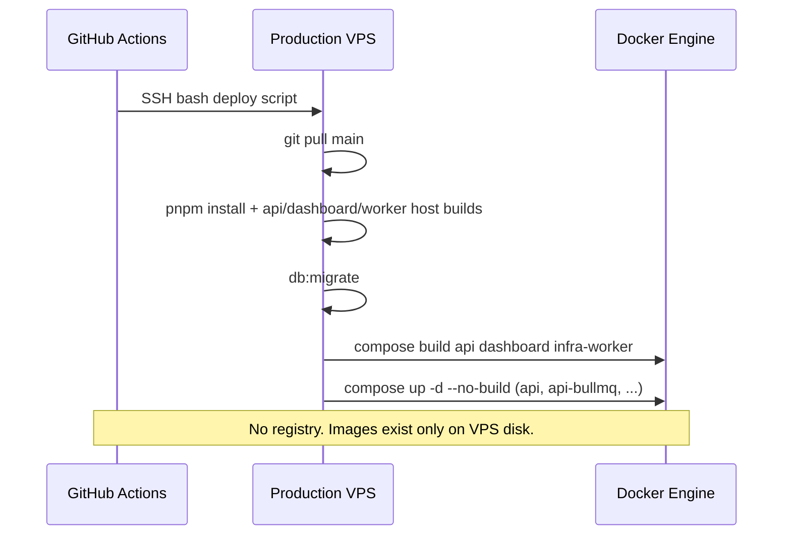

# Stockix Deploy Diagnostic Report

**Date:** 2026-05-28  
**Error:** `No such image: stockix-api:prod` / `Error response from daemon: No such image: stockix-api:prod` (exit code 127 reported alongside)  
**Method:** Read-only audit of all `docker-compose*.yml` files, all `Dockerfile*` files, root `.github/workflows/*`, and deployment scripts/docs.

## Resolution (2026-05-28)

Production deploy was fixed:

| Change | Files |
|--------|--------|
| Image tags `:prod` → `:latest` | `infra/prod/docker-compose.yml` |
| Self-contained Docker builds (no host `dist`/`.next`/`.runtime`) | `apps/api/Dockerfile`, `apps/dashboard/Dockerfile`, `infra/worker-service/Dockerfile` |
| Deploy: drop host artifact builds; verify images before `up --no-build`; safe rollback | `.github/workflows/deploy.yml` |
| Lean build context | `.dockerignore` |

Control-plane images are built on the VPS via `docker compose build api dashboard infra-worker` and tagged `stockix-*:latest`. See `infra/prod/README.md` and `.github/DEPLOYMENT_FULL_GUIDE.md`.

---

*Historical audit below (pre-fix).*

## SECTION 1 — THE EXACT ERROR EXPLAINED

### What Docker is saying

When Compose starts a service that declares `image: stockix-api:prod` **without** a successful prior `docker compose build` (or `docker pull`) for that tag, the engine cannot create the container and reports:

```text
No such image: stockix-api:prod
Error response from daemon: No such image: stockix-api:prod
```

### Where the tag is defined

| Service | File | Line | `image:` | `build:` |
|---------|------|-----:|----------|----------|
| `api` | `infra/prod/docker-compose.yml` | 219 | `stockix-api:prod` | Yes — `context: ../..`, `dockerfile: apps/api/Dockerfile` |
| `api-bullmq` | `infra/prod/docker-compose.yml` | 263 | `stockix-api:prod` | **No** — shares tag from `api` build only |
| `infra-worker` | `infra/prod/docker-compose.yml` | 293 | `stockix-infra-worker:prod` | Yes — `infra/worker-service/Dockerfile` |
| `dashboard` | `infra/prod/docker-compose.yml` | 342 | `stockix-dashboard:prod` | Yes — `apps/dashboard/Dockerfile` |

`api-bullmq` is the fragile piece: it **must** reuse an image already tagged `stockix-api:prod`. It is never listed in the workflow’s explicit `docker compose build` service list; only `api` creates that tag.

### What the workflow is supposed to do (current `main`)

Production deploy (`.github/workflows/deploy.yml`, deploy job, SSH remote script):

1. `git fetch` / `checkout main` / `reset --hard origin/main`
2. `source infra/prod/.env`
3. Host builds: `pnpm install`, `@repo/*` packages, `api build`, `infra:worker:build`, `dashboard build`, DB migrate
4. `cd infra/prod`
5. `docker compose build --no-cache api dashboard infra-worker`  ← **creates** `:prod` tags
6. `docker compose up -d --no-build --wait … api api-bullmq …`  ← **requires** those tags to exist

So the **suspected root cause** (“CI never builds the image”) is **incorrect for the current workflow on `main`**: images are intended to be built **on the VPS**, not in GitHub Actions and not via a registry push.

### Why the image still might not exist at `up` time

| Scenario | Mechanism |
|----------|-----------|
| **Build step failed** | Step 5 never tags `stockix-api:prod`; step 6 fails on `api` / `api-bullmq`. |
| **`up -d --no-build` without a successful build** | Documented in `infra/prod/README.md` (“After changing `.env`” → `up -d` only, line 35). Any operator path that skips build reproduces the error. |
| **Rollback handler after failure** | `deploy.yml` lines 232–236: `trap rollback ERR` runs `docker compose up -d --no-build` — if build failed, images are still missing; rollback **re-triggers** the same error. |
| **Stale docs / manual run** | Many docs still say `docker compose up -d --build` (single step); if someone runs only `up -d` or only `up` without `--build` after pruning images, tags are gone. |
| **`docker image rm` / fresh host** | No registry pull path exists for control-plane images; tags only come from local build. |
| **Old workflow on server** | If the server never received a commit that added the explicit `compose build` step, only `up --no-build` would run. (Verify with `git log -1 --oneline` on the VPS vs GitHub `main`.) |

### Exit code 127 (separate but often co-reported)

In Unix shells, **127 = “command not found”**. That is **not** Docker’s usual exit code for a missing image (typically **1**).

Plausible 127 sources in this stack:

| Source | Evidence |
|--------|----------|
| **`docker compose` CLI missing** | `scripts/setup-ec2.sh` installs `docker-compose-plugin` on **Debian/Ubuntu** only; **Amazon Linux** path installs Docker via `amazon-linux-extras` / `dnf` but **does not** install the Compose v2 plugin → `docker compose` → 127. |
| **`pnpm` before `corepack enable`** | Remote script enables corepack before pnpm (lines 268–269); manual ops that skip this can hit 127. |
| **GitHub Actions aggregates SSH exit code** | If the remote `bash` script exits 127, the job shows 127 even if Docker also logged “No such image” earlier in the log. |

**Fact:** The repository does not contain a logged CI run in this audit; 127 should be confirmed against the **exact failing line** in the Actions log (search for `command not found` above the image error).

---

## SECTION 2 — IMAGE INVENTORY

### 2.1 Images NEEDED — production control plane (`infra/prod/docker-compose.yml`)

| Image | File | Line | Type | Built by compose `build:`? | Built in root GHA workflow? | Pushed to registry? |
|-------|------|-----:|------|------------------------------|-----------------------------|---------------------|
| `tecnativa/docker-socket-proxy:0.1.1` | `infra/prod/docker-compose.yml` | 81 | Public pull | — | — | — |
| `traefik:v3.1.2` | `infra/prod/docker-compose.yml` | 121 | Public pull | — | — | — |
| `postgres:16-alpine` | `infra/prod/docker-compose.yml` | 171 | Public pull | — | — | — |
| `redis:7-alpine` | `infra/prod/docker-compose.yml` | 195 | Public pull | — | — | — |
| **`stockix-api:prod`** | `infra/prod/docker-compose.yml` | 219, 263 | **Custom local tag** | `api` only (263 has no `build:`) | **On VPS via SSH** (`compose build api`) | **No** |
| **`stockix-infra-worker:prod`** | `infra/prod/docker-compose.yml` | 293 | Custom local tag | `infra-worker` | On VPS (`compose build infra-worker`) | **No** |
| **`stockix-dashboard:prod`** | `infra/prod/docker-compose.yml` | 342 | Custom local tag | `dashboard` | On VPS (`compose build dashboard`) | **No** |
| `amazon/aws-cli:2.15.0` | `infra/prod/docker-compose.yml` | 400 | Public pull | — | — | — |

Optional overlay (`infra/prod/docker-compose.chat.yml`, not in deploy workflow):

| Image | Line | Built in prod deploy? |
|-------|-----:|----------------------|
| `stockix-chatlive:local` | 12 | No (manual only) |
| `pgvector/pgvector:pg16` | 58 | Pull |
| `redis:7-alpine` | 79 | Pull |

### 2.2 Images NEEDED — other compose files (not control-plane deploy)

| Compose file | Custom `stockix-*` images | Notes |
|--------------|---------------------------|--------|
| `infra/staging/docker-compose.yml` | (inherits prod) | `include: ../prod/docker-compose.yml`; staging deploy uses `up -d --build` |
| `infra/tenant-stack/docker-compose.yml` | `stockix-nginx:local`, `stockix-webapp:local`, `stockix-server:local`, `stockix-database-migration:local` | Built via `pnpm docker:prebuild` on host, not prod workflow |
| `infra/pos-tenant-stack/docker-compose.yml` | `stockix-pos-backend:local`, `stockix-pos-frontend:local` | `pnpm pos:images:build` |
| `infra/pms-tenant-stack/docker-compose.yml` | `stockix-pms-frontend:local`, `stockix-pms:local` | Local build |
| `infra/dev/docker-compose.yml` | — | Postgres + Redis only |
| `services/stockix-finance/docker-compose.prod.yml` | `ghcr.io/stockixhq/webapp:latest`, `ghcr.io/stockixhq/server:latest` | **Separate** Finance CI (`services/stockix-finance/.github/workflows/build-deploy-container.yml`) — **not** wired to root `deploy.yml` |
| `services/posnew/docker-compose.production.yml` | Build-only (no `stockix-*:prod` tags) | POS’s own deploy scripts |

### 2.3 Images BUILT — Dockerfiles + workflow mapping

| Dockerfile | Purpose | Tag applied (prod) | When / where built | Pushed? |
|------------|---------|-------------------|--------------------|---------|
| `apps/api/Dockerfile` | Control-plane API | `stockix-api:prod` | `docker compose build api` on VPS; requires host `apps/api/dist` or builds inside image | No |
| `apps/dashboard/Dockerfile` | Dashboard | `stockix-dashboard:prod` | VPS; **requires** host `apps/dashboard/.next/standalone/...` (see Dockerfile line 23–24) | No |
| `infra/worker-service/Dockerfile` | Infra worker | `stockix-infra-worker:prod` | VPS; **requires** host `infra/worker-service/.runtime/worker.js` | No |
| `infra/worker-service/Dockerfile` | (same) | — | Preceded by `pnpm infra:worker:build` in deploy script | — |
| Tenant / POS / PMS / Chat Dockerfiles (15 others) | Tenant stacks, chat, finance | `:local` or GHCR for finance only | `scripts/prebuild-tenant-images.mjs`, finance workflows, manual | Finance only (GHCR) |

**Root `.github/workflows/deploy.yml` docker-related commands (facts):**

| Line | Command |
|-----:|---------|
| 293 | `docker builder prune -f` |
| 294 | `docker compose --env-file .env build --no-cache api dashboard infra-worker` |
| 295–296 | `docker compose --env-file .env up -d --no-build --wait traefik postgres …` |
| 236 | Rollback: `docker compose --env-file .env up -d --no-build` |

**No** `docker build`, `docker push`, `docker tag`, `docker pull`, `buildx`, or `ghcr.io` references in root `.github/workflows/`.

### 2.4 THE GAP (control plane)

| Image | Referenced in | Built in | Status |
|-------|---------------|----------|--------|
| `stockix-api:prod` | `infra/prod/docker-compose.yml` (api, api-bullmq) | VPS `compose build api` **if deploy script completes step 5** | ❌ **Missing whenever build skipped/failed or only `up --no-build` runs** |
| `stockix-dashboard:prod` | `infra/prod/docker-compose.yml` | VPS `compose build dashboard` | Same |
| `stockix-infra-worker:prod` | `infra/prod/docker-compose.yml` | VPS `compose build infra-worker` | Same |
| `stockix-api:prod` | — | GitHub Actions runner | ❌ **Never** (no docker steps on runner) |
| `stockix-api:prod` | — | GHCR / ECR / Docker Hub | ❌ **Never** (no push/pull in root workflow) |

**Partial mismatch (design, not omission):** Workflow builds `api` but starts `api-bullmq` without building it — valid **only** if `api` build succeeds and tags `stockix-api:prod`.

---

## SECTION 3 — DEPLOYMENT STRATEGY ANALYSIS

### Current strategy (what the code actually does)



**Classification:** **Strategy A variant — build on server**, split into explicit `build` then `up --no-build` (not pull-from-registry).

### What parts of the repo “think” is happening

| Source | Stated behavior |
|--------|-----------------|
| `.github/DEPLOYMENT_FULL_GUIDE.md` line 146 | `docker compose up -d --build` (single combined step) |
| `infra/prod/README.md` line 27 | First deploy: `up -d --build` |
| `infra/prod/README.md` line 35 | Env change: `up -d` **without** `--build` |
| `.github/workflows/deploy.yml` | `build` then `up --no-build` |
| `.github/DEPLOYMENT_FULL_GUIDE.md` line 7 | “Does not use ECR or Docker Hub” |

### The mismatch

1. **Hybrid compose file:** Services use both `image: stockix-*:prod` **and** `build:` — correct for local tagging, but **`up --no-build` hard-depends** on a prior successful build.
2. **Documentation vs workflow:** Docs emphasize `--build`; workflow uses `--no-build` after a separate build (reasonable, but easy to desync).
3. **No registry fallback:** Cannot recover a missing tag by `docker pull`; must rebuild on VPS.
4. **Finance tenant images use GHCR; control plane does not** — two different deployment models in one monorepo.
5. **`api-bullmq` image-only** — operational footgun if anyone builds only `api-bullmq` or expects `compose up --build` without building `api` first in edge cases.

---

## SECTION 4 — WORKFLOW ANALYSIS

### Quality gate job (`.github/workflows/deploy.yml` lines 24–193)

| Area | Behavior |
|------|----------|
| Runner | `ubuntu-latest` |
| Docker | **Not used** |
| Builds | Node/pnpm only (`api`, `dashboard`, `@repo/*`, worker bundle via `pnpm infra:worker:build`) |
| Tests | API, dashboard, PMS, POS, finance server |
| Purpose | Gate merges/deploy; **does not produce Docker images** |

### Deploy production job (lines 195–327)

| Step | What happens |
|------|----------------|
| Checkout | Repo on GHA runner (not used for docker) |
| SSH agent | `EC2_SSH_PRIVATE_KEY` |
| Verify secrets doc | Warning if `SECRETS ROTATED:` missing in `OPERATIONS.md` |
| Deploy over SSH | Entire production deploy runs **on VPS** |
| Sentry release | Optional; on GHA runner (`npx @sentry/cli`) |

**Remote deploy sequence (ordered):**

1. Locate repo `/opt/stockix/stockixnew` or `/opt/stockix/app`
2. Install `rollback` trap → `compose up -d --no-build` on error
3. Git sync `main`
4. Guard: Dockerfile must contain `@repo/auth build`
5. Guard: `api-bullmq` must not have `build:`
6. `source infra/prod/.env`
7. pnpm + host builds + migrate + schema verify
8. `BACKUP_B2_BUCKET` must be set
9. `cd infra/prod` → prune builder → **build** → **up --no-build** → curl health → ps checks

**Where failure likely surfaces:**

| Failure point | Symptom |
|---------------|---------|
| `docker compose build …` | Build logs; no `stockix-api:prod` tag |
| `docker compose up -d --no-build` | **`No such image: stockix-api:prod`** |
| `rollback` after build failure | Same image error (noise in logs) |
| `curl` health checks | Fails if containers never started |
| Host build before docker | Dashboard Dockerfile `test -f ... standalone` fails if `pnpm --filter dashboard build` failed |

### Staging workflow (`.github/workflows/deploy-staging.yml`)

- Reuses quality gate from `deploy.yml`
- Remote: `docker compose up -d --build --wait` (single step — **differs from prod**)
- No explicit `build` + `--no-build` split

---

## SECTION 5 — EXIT CODE 127 ANALYSIS

| Hypothesis | Likelihood | Evidence |
|------------|------------|----------|
| `docker compose` not installed (Compose v2 plugin) | **High** on Amazon Linux bootstrap | `setup-ec2.sh` `install_amzn()` lacks `docker-compose-plugin` |
| `pnpm` / `corepack` not found | Medium on manual ops | Remote script enables corepack first; manual runs may not |
| Missing image reported as 127 | **Low** | Docker typically exits 1; 127 is shell “command not found” |
| Container entrypoint 127 | Low for “No such image” | Image pull/create fails before container starts |

**Action for operator:** In the failed Actions log, find the **first** `command not found` or `127` line; distinguish it from the Docker image error block.

---

## SECTION 6 — ALL ISSUES FOUND

### CRITICAL (causes or sustains deploy failure)

| # | Issue | File | Line(s) | Impact |
|---|-------|------|--------:|--------|
| 1 | `stockix-api:prod` required but only created when `compose build api` succeeds | `infra/prod/docker-compose.yml`, `deploy.yml` | 219, 263, 294–295 | **Deploy fails** with “No such image” |
| 2 | `api-bullmq` has `image:` but **no** `build:` — depends entirely on `api` build tagging | `infra/prod/docker-compose.yml` | 262–263 | BullMQ fails if API image missing |
| 3 | `compose up -d --no-build` **requires** prior successful build | `deploy.yml` | 295 | Any skipped/failed build → image error |
| 4 | Rollback runs `up -d --no-build` when images may not exist | `deploy.yml` | 232–236 | Masks/fixes nothing; repeats image error |
| 5 | **No registry push/pull** for control-plane images | Root `.github/workflows/*` | — | Fresh VPS or deleted images cannot recover without rebuild |
| 6 | `infra/prod/README.md` documents `up -d` without `--build` after env changes | `infra/prod/README.md` | 35 | Operators can remove running containers/tags and fail on recreate |

### HIGH (unreliable deploys)

| # | Issue | File | Impact |
|---|-------|------|--------|
| 7 | Docs say `up -d --build`; workflow uses `build` + `up --no-build` | `DEPLOYMENT_FULL_GUIDE.md`, `DEPLOYMENT.md`, many `docs/*` | Operators follow wrong sequence |
| 8 | Dashboard image requires pre-built `.next/standalone` on host | `apps/dashboard/Dockerfile` | 23–24 | `compose build dashboard` fails if host `dashboard build` failed |
| 9 | Worker image requires `.runtime/worker.js` on host | `infra/worker-service/Dockerfile` | 12–13 | Build fails if `pnpm infra:worker:build` skipped |
| 10 | `docker builder prune -f` every deploy | `deploy.yml` | 293 | Slower builds; does not remove tags but increases build failure risk under disk pressure |
| 11 | Amazon Linux EC2 bootstrap may lack Compose v2 | `scripts/setup-ec2.sh` | 41–46 | `docker compose` → exit **127** |
| 12 | Staging uses `--build`; production uses `--no-build` | `deploy-staging.yml` vs `deploy.yml` | Behavioral drift between environments |

### MEDIUM (inefficiency / confusion)

| # | Issue | File | Impact |
|---|-------|------|--------|
| 13 | Finance GHCR images (`ghcr.io/stockixhq/*`) unrelated to control-plane deploy | `services/stockix-finance/docker-compose.prod.yml` | 32, 41 | Confusion about which registry prod uses |
| 14 | 14 compose files / 18 Dockerfiles — tenant POS/PMS/chat separate from prod | Various | Cognitive load |
| 15 | `deploy.replicas: 2` on `api` without Swarm | `infra/prod/docker-compose.yml` | 226–227 | Compose may ignore or warn; scaling semantics unclear |
| 16 | Quality gate builds JS but not Docker | `deploy.yml` | — | Docker breakage only discovered on VPS during deploy |

---

## SECTION 7 — TWO POSSIBLE FIX STRATEGIES

*(Documented for planning only — not implemented in this audit.)*

### Strategy A: Build on server (align everything to current VPS build)

**How it works:**

1. Workflow SSHs to server (unchanged).
2. `git pull` + host pnpm builds (unchanged).
3. `docker compose build` for `api`, `dashboard`, `infra-worker` (or single `up -d --build`).
4. `docker compose up -d` (with or without `--build`, but **never** `--no-build` unless build just succeeded).

**Requires:**

- Sufficient VPS RAM/CPU (API + dashboard + worker Docker builds are heavy).
- `api-bullmq` continues to rely on `api` build tagging, **or** add `build:` / include `api-bullmq` in build list with same image tag.
- Fix docs (`README`, `DEPLOYMENT_FULL_GUIDE`) to match workflow.
- Fix rollback to `up -d --build` or skip `up` when build failed.
- Ensure Compose v2 plugin on all hosts (`setup-ec2.sh` Amazon path).

**Minimum compose change (optional):** Add to `api-bullmq`:

```yaml
build:
  context: ../..
  dockerfile: apps/api/Dockerfile
```

…or document that `compose build api` is mandatory before any `api-bullmq` start.

### Strategy B: Build in CI → push to registry (professional)

**How it works:**

1. GHA: `docker build` + `docker push ghcr.io/<org>/stockix-api:<sha>`.
2. SSH: `docker pull` + `compose up` with `image: ghcr.io/...` (or env-substituted tag).
3. VPS does not need full monorepo build context for API/dashboard images.

**Requires:**

- GHCR (or ECR) credentials in GHA + VPS `docker login`.
- Compose `image:` lines updated to registry URLs + tag env (e.g. `${IMAGE_TAG}`).
- Workflow build matrix for api, dashboard, worker.
- Finance already has a partial precedent in `services/stockix-finance/.github/workflows/build-deploy-container.yml`.

**Note:** Root `DEPLOYMENT_FULL_GUIDE.md` explicitly states the workflow does **not** use ECR/Docker Hub today — Strategy B would be a **deliberate architecture change**.

---

## SECTION 8 — RECOMMENDATION

### Facts-first conclusion

| Question | Answer |
|----------|--------|
| Is there a Dockerfile for API? | **Yes** — `apps/api/Dockerfile` |
| Does root workflow have docker steps? | **Yes, on VPS via SSH** — not on GHA runner |
| Is `stockix-api:prod` never built anywhere? | **Incorrect** — built on VPS when `docker compose build api` runs successfully |
| Why “No such image” anyway? | **`up --no-build` (or manual `up -d`) ran without a successful local build**, or build failed, or images were removed |
| Registry strategy for control plane? | **None** — local tags only |

### Minimum change to restore deploys (operator / follow-up fix)

1. On VPS: `cd /opt/stockix/stockixnew/infra/prod && docker compose --env-file .env build api dashboard infra-worker`
2. Verify: `docker image ls | grep stockix-api`
3. Then: `docker compose --env-file .env up -d` (or match workflow: `up -d --no-build` only after verified tags)
4. Confirm `docker compose` exists: `docker compose version` (not 127)

### Long-term

- **Short term:** Align docs + rollback + `infra/prod/README.md` with `build` then `up`, or use `up -d --build` only.
- **Long term:** Strategy B (GHCR) if you want reproducible rollbacks, multiple VPS hosts, and no on-server compilation — matches Finance’s existing GHCR pattern but requires new plumbing for control plane.

---

## SECTION 9 — DO NOT FIX UNTIL CONFIRMED

Operator confirmations needed:

1. **Intended strategy:** Build-on-VPS only (current) vs registry-based (GHCR)?
2. **Exact failing step** in GitHub Actions log: `compose build` vs `compose up` vs `command not found` (127)?
3. **VPS OS:** Ubuntu (Compose plugin installed?) vs Amazon Linux (Compose plugin missing?)?
4. **On-server images:** Output of `docker image ls 'stockix-*'` immediately after failure?
5. **Was `docker compose build api` run successfully** in the same session before `up`?
6. **Disk/RAM:** Did API/dashboard Docker build OOM or exit non-zero (scroll back before “No such image”)?
7. **Git commit on VPS** matches `origin/main` with `deploy.yml` lines 294–295 present?
8. **Manual path:** Did anyone run `infra/prod/README.md` “After changing `.env`” `up -d` without rebuild?

---

## APPENDIX A — Compose files discovered (14)

| Path |
|------|
| `infra/prod/docker-compose.yml` |
| `infra/prod/docker-compose.chat.yml` |
| `infra/staging/docker-compose.yml` |
| `infra/dev/docker-compose.yml` |
| `infra/tenant-stack/docker-compose.yml` |
| `infra/tenant-stack/docker-compose.local-webapp.yml` |
| `infra/tenant-stack/docker-compose.local-server.yml` |
| `infra/pos-tenant-stack/docker-compose.yml` |
| `infra/pms-tenant-stack/docker-compose.yml` |
| `services/stockix-finance/docker-compose.yml` |
| `services/stockix-finance/docker-compose.prod.yml` |
| `services/posnew/docker-compose.production.yml` |
| `services/chatlive/.devcontainer/docker-compose.yml` |
| `services/chatlive/.devcontainer/docker-compose.base.yml` |

## APPENDIX B — Dockerfiles discovered (18)

`apps/api/Dockerfile`, `apps/dashboard/Dockerfile`, `infra/worker-service/Dockerfile`, `services/stockix-finance/packages/webapp/Dockerfile`, `services/stockix-finance/packages/server/Dockerfile`, `services/stockix-finance/docker/redis/Dockerfile`, `services/stockix-finance/docker/migration/Dockerfile`, `services/stockix-finance/docker/mariadb/Dockerfile`, `services/stockix-finance/docker/nginx/Dockerfile`, `services/stockix-finance/docker/mongo/Dockerfile`, `services/posnew/apps/pos-frontend2/Dockerfile`, `services/posnew/apps/pos-backend/Dockerfile`, `services/pms/frontend/Dockerfile`, `services/pms/Dockerfile`, `services/chatlive/docker/Dockerfile`, `services/chatlive/.devcontainer/Dockerfile`, `services/chatlive/.devcontainer/Dockerfile.base`, `infra/pos-tenant-stack/Dockerfile.pos-frontend-stub`

## APPENDIX C — Root GitHub workflows

| Workflow | Docker relevance |
|----------|------------------|
| `.github/workflows/deploy.yml` | VPS SSH build + up |
| `.github/workflows/deploy-staging.yml` | VPS `up -d --build` |
| `.github/workflows/secret-scan.yml` | None |

---

*End of diagnostic — read-only audit complete.*
