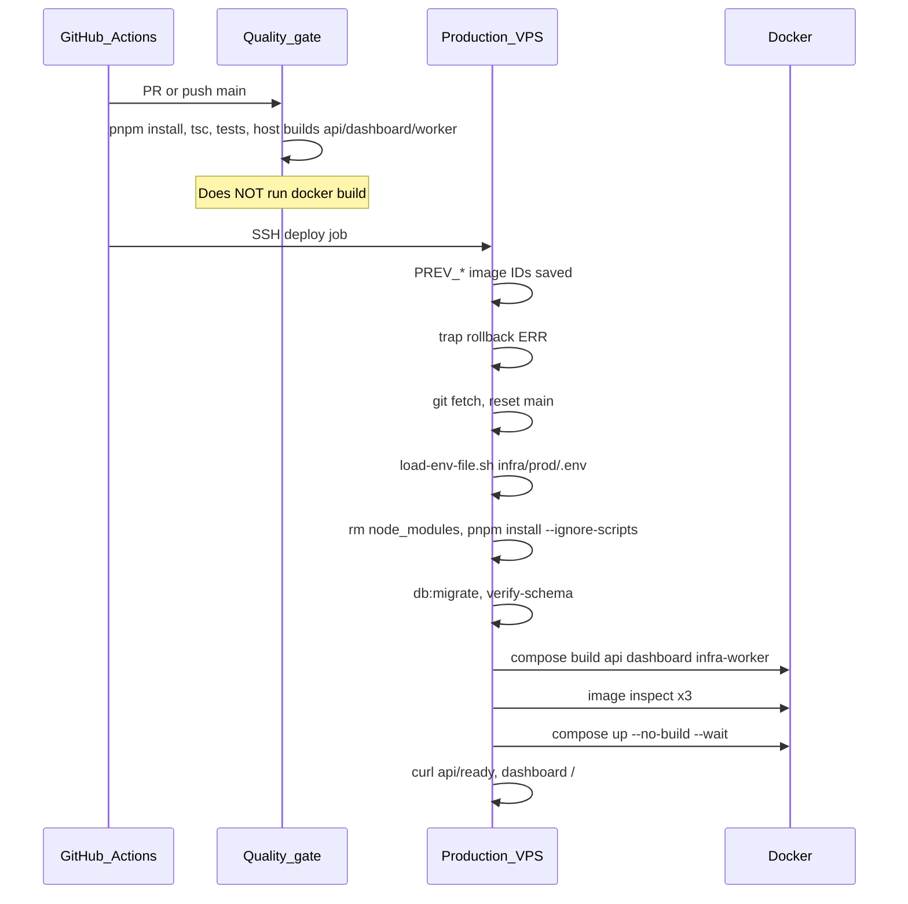

# Stockix — Complete Deployment Audit

**Date:** 2026-05-28  
**Method:** Read-only audit of control-plane Dockerfiles, `infra/prod/docker-compose.yml`, root `.github/workflows/deploy.yml` / `deploy-staging.yml`, build scripts, `.dockerignore`, `scripts/load-env-file.sh`, and related config. No application code was modified.

---

## SECTION 1 — WHAT WE ARE DEPLOYING

| Service | Dockerfile | Compose image tag | Build method (current) |
|---------|------------|-------------------|----------------------|
| **API** (HTTP ×2 + shared image) | [`apps/api/Dockerfile`](../apps/api/Dockerfile) | `stockix-api:latest` | In-Docker: `pnpm install --filter api...`, `@repo/*` + `api` build, `pnpm deploy --filter api --prod` |
| **api-bullmq** | *(none — reuses API image)* | `stockix-api:latest` | Same tag as `api` after `compose build api` |
| **Dashboard** | [`apps/dashboard/Dockerfile`](../apps/dashboard/Dockerfile) | `stockix-dashboard:latest` | In-Docker: `pnpm install --filter dashboard...`, `pnpm --filter dashboard build`, Next `standalone` |
| **Infra worker** | [`infra/worker-service/Dockerfile`](../infra/worker-service/Dockerfile) | `stockix-infra-worker:latest` | In-Docker: `pnpm install --filter api...`, `@repo/*` + `pnpm infra:worker:build` (root script → API tsup worker config) |
| **Postgres / Redis / Traefik / backup** | — | Public images | Pull only |

**Not deployed by root `deploy.yml`:** tenant stacks (`stockix-*:local`), POS/PMS/Finance GHCR images, Chatwoot overlay.

---

## SECTION 2 — DEPLOY PIPELINE FLOW



### Production remote script (exact order in [`.github/workflows/deploy.yml`](../.github/workflows/deploy.yml) lines 228–339)

| Step | Action |
|------|--------|
| 1 | `set -euo pipefail`, `CI=true`, `PNPM_CONFIG_CONFIRM_MODULES_PURGE=false` |
| 2 | `cd` `/opt/stockix/stockixnew` or `/opt/stockix/app` |
| 3 | Save `PREV_API`, `PREV_DASH`, `PREV_WORKER` from existing `:latest` images |
| 4 | Define `rollback()` + `trap rollback ERR` |
| 5 | `git fetch` / `checkout main` / `reset --hard origin/main` |
| 6 | Guards: API Dockerfile has in-image build; `api-bullmq` has no `build:` |
| 7 | `. scripts/load-env-file.sh infra/prod/.env` |
| 8 | `export DATABASE_URL=...` (host Postgres port for migrate) |
| 9 | `corepack` + `rm -rf node_modules` + `pnpm install --frozen-lockfile --ignore-scripts` |
| 10 | `pnpm --filter @repo/db db:migrate` + `verify-schema.ts` |
| 11 | Require `BACKUP_B2_BUCKET` |
| 12 | `cd infra/prod` → `compose build --no-cache api dashboard infra-worker` |
| 13 | `docker image inspect` ×3 |
| 14 | `compose up -d --no-build --wait` (full platform stack) |
| 15 | Health `curl` + `compose ps` checks |
| 16 | `docker image prune` (7d), `trap - ERR` |

### Staging ([`deploy-staging.yml`](../.github/workflows/deploy-staging.yml))

Same safe env + pnpm pattern, but: **host** `pnpm infra:worker:build`, then `compose up -d --build --wait` (no image inspect, no rollback, includes prod compose via `include`).

---

## SECTION 3 — EVERY BUG FOUND

### BUG-1: Live `infra/prod/.env` still has unquoted semicolons (operator / VPS)

| Field | Value |
|-------|--------|
| **Severity** | CRITICAL (if anyone uses `source`) / LOW (deploy workflow fixed) |
| **File** | `infra/prod/.env` lines 240–244 (local clone audited) |
| **Evidence** | `SECURITY_HSTS=max-age=31536000; includeSubDomains` (no quotes); `SECURITY_CSP_BASE=default-src 'self'; script-src...` |
| **What happens** | `source infra/prod/.env` → bash runs `includeSubDomains` etc. as commands → **exit 127** |
| **Why deploy may still work** | Workflow uses [`scripts/load-env-file.sh`](../scripts/load-env-file.sh), which treats the whole RHS as one value |
| **Fix required** | Quote on server: `SECURITY_HSTS="max-age=31536000; includeSubDomains"` (see fixed [`.env.example`](../infra/prod/.env.example) lines 199–203). Do not use `source` for prod `.env`. |

### BUG-2: Documentation still instructs `source infra/prod/.env`

| Field | Value |
|-------|--------|
| **Severity** | HIGH |
| **Files** | [`.github/DEPLOYMENT_FULL_GUIDE.md`](../.github/DEPLOYMENT_FULL_GUIDE.md) line 87; [`infra/prod/OPERATIONS.md`](../infra/prod/OPERATIONS.md) line 58; [`docs/readyforproduction.md`](../docs/readyforproduction.md), [`FAILOVER_RUNBOOK.md`](../infra/prod/FAILOVER_RUNBOOK.md), etc. |
| **What happens** | Operators follow docs → exit 127 or partial env |
| **Fix required** | Replace with `. scripts/load-env-file.sh infra/prod/.env` everywhere |

### BUG-3: `deploy.replicas: 2` on `api` without Swarm/Kubernetes

| Field | Value |
|-------|--------|
| **Severity** | HIGH |
| **File** | [`infra/prod/docker-compose.yml`](../infra/prod/docker-compose.yml) lines 226–227 |
| **What happens** | On plain `docker compose` (non-Swarm), `deploy.replicas` is **ignored** — only one `api` container runs; docs claim 2 HTTP replicas |
| **Fix required** | Use Swarm `docker stack deploy`, or remove `deploy.replicas` and scale via documented alternative, or run two named services |

### BUG-4: Tenant provisioning images never built in deploy pipeline

| Field | Value |
|-------|--------|
| **Severity** | HIGH |
| **Files** | [`.github/workflows/deploy.yml`](../.github/workflows/deploy.yml); [`infra/worker-service/domain/provisioning/required-tenant-images.ts`](../infra/worker-service/domain/provisioning/required-tenant-images.ts) |
| **What happens** | Control plane deploy succeeds; **first tenant/POS provision fails** if `stockix-webapp:local`, `stockix-server:local`, etc. missing |
| **Fix required** | Document/run `pnpm docker:prebuild` on VPS after deploy, or add to deploy script |

### BUG-5: Quality gate does not validate Docker builds

| Field | Value |
|-------|--------|
| **Severity** | HIGH |
| **File** | [`.github/workflows/deploy.yml`](../.github/workflows/deploy.yml) `quality-gate` job |
| **What happens** | Broken Dockerfile/OOM only discovered on VPS during deploy (45m job) |
| **Fix required** | Optional job: `docker compose build` on GHA runner or self-hosted builder |

### BUG-6: Deploy job timeout vs `--no-cache` triple build

| Field | Value |
|-------|--------|
| **Severity** | HIGH |
| **File** | `deploy.yml` `timeout-minutes: 45`; build line 311 |
| **What happens** | API + dashboard + worker **no-cache** builds on small VPS can exceed 45 minutes → job killed mid-build |
| **Fix required** | Increase timeout, drop `--no-cache` for routine deploys, or build serially with cache |

### BUG-7: Staging deploy inconsistent with production

| Field | Value |
|-------|--------|
| **Severity** | MEDIUM |
| **File** | [`.github/workflows/deploy-staging.yml`](../.github/workflows/deploy-staging.yml) |
| **Issues** | Host `pnpm infra:worker:build`; `up -d --build` (not verify + `--no-build`); no `PREV_*` rollback; no `verify-schema`; includes full prod compose (replicas, etc.) |
| **Fix required** | Align staging script with production pattern |

### BUG-8: `pnpm install --ignore-scripts` on VPS may skip required postinstall

| Field | Value |
|-------|--------|
| **Severity** | MEDIUM |
| **File** | `deploy.yml` line 299 |
| **What happens** | Some packages rely on `postinstall` (native bindings, codegen). Migrate/verify-schema may fail intermittently |
| **Fix required** | Drop `--ignore-scripts` if migrate fails; keep `CI=true` + `rm -rf node_modules` |

### BUG-9: Dockerfiles run `pnpm --filter @repo/{config,db,shared} build` but packages have no `build` script

| Field | Value |
|-------|--------|
| **Severity** | LOW (misleading / dead commands) |
| **Files** | `apps/api/Dockerfile` lines 12–15; `infra/worker-service/Dockerfile` lines 11–14 |
| **Evidence** | `pnpm --filter @repo/config build` → `None of the selected packages has a "build" script` (exit 0). Only `@repo/auth` has `"build": "tsup"` |
| **Impact** | No-op today; `@repo/config`, `@repo/db`, `@repo/shared` export **TypeScript source**; tsup bundles via `noExternal: [/^@repo/]` |
| **Fix required** | Remove spurious build lines or add real `build` scripts + `dist` exports for consistency |

### BUG-10: `load-env-file.sh` does not expand `${VAR}` in values

| Field | Value |
|-------|--------|
| **Severity** | MEDIUM |
| **File** | [`scripts/load-env-file.sh`](../scripts/load-env-file.sh); `.env.example` e.g. `CHATWOOT_BRAND_URL=https://${ROOT_DOMAIN}` |
| **What happens** | Literal `${ROOT_DOMAIN}` passed to apps if used in `.env` |
| **Fix required** | Use concrete URLs in `.env` or add controlled expansion |

### BUG-11: Worker image copies entire monorepo (~GB scale)

| Field | Value |
|-------|--------|
| **Severity** | MEDIUM |
| **File** | `infra/worker-service/Dockerfile` line 28 `COPY --from=build /app .` |
| **What happens** | Huge images, slow deploy, disk pressure; mitigated by prune |
| **Fix required** | Slim runtime copy (worker bundle + compose paths only) — larger refactor |

### BUG-12: Node version split (API/dashboard 20, worker 22)

| Field | Value |
|-------|--------|
| **Severity** | LOW |
| **Files** | API/dashboard `node:20-alpine`; worker `node:22-alpine` |
| **Impact** | Usually fine; subtle runtime differences possible |
| **Fix required** | Align versions when convenient |

### BUG-13: Sentry release step `if` condition likely wrong

| Field | Value |
|-------|--------|
| **Severity** | LOW |
| **File** | `deploy.yml` lines 342–343 `if: env.SENTRY_DSN != ''` |
| **What happens** | `SENTRY_DSN` not in job-level `env` → step may always skip |
| **Fix required** | `if: secrets.SENTRY_DSN != ''` |

### BUG-14: Rollback only restarts app services, not full stack

| Field | Value |
|-------|--------|
| **Severity** | LOW |
| **File** | `deploy.yml` rollback lines 259–260 |
| **What happens** | On failure, only `api api-bullmq dashboard infra-worker` restarted; traefik/postgres unchanged (usually desired) |
| **Note** | Document as intentional partial rollback |

### BUG-15: `.dockerignore` excludes `*.md` and `.github` but sends full `services/`

| Field | Value |
|-------|--------|
| **Severity** | LOW |
| **File** | [`.dockerignore`](../.dockerignore) |
| **Impact** | Large build context → slower VPS builds |
| **Fix required** | Exclude unused `services/chatlive`, `services/posnew` from control-plane context if builds allow |

### BUG-16: Duplicate `CORS_ORIGINS` in `.env.example`

| Field | Value |
|-------|--------|
| **Severity** | LOW |
| **File** | `infra/prod/.env.example` lines 29–31 |
| **Impact** | Last key wins in compose/env loaders; confusing |
| **Fix required** | Deduplicate |

---

## SECTION 4 — WORKER BUILD ANALYSIS (CURRENT FAILURE HYPOTHESIS)

| Question | Answer |
|----------|--------|
| **Worker package name** | `infra/worker-service/package.json` has **no `name` field** — not a pnpm workspace package ([`pnpm-workspace.yaml`](../pnpm-workspace.yaml) lists `apps/*`, `packages/*`, `services/*` only) |
| **`pnpm infra:worker:build`** | Root script: `pnpm --filter api exec tsup --config tsup.worker.config.ts` ([`package.json`](../package.json) line 26) |
| **Worker Dockerfile install filter** | `pnpm install --frozen-lockfile --filter api...` (line 10) |
| **Is worker in install filter?** | **No separate worker package** — correct design: worker bundle built via **API** package’s tsup config targeting [`apps/api/tsup.worker.config.ts`](../apps/api/tsup.worker.config.ts) |
| **`@repo/platform-worker-shared`** | Not in `api` dependencies; bundled via tsup **path alias** to `packages/platform-worker-shared/src` (source must be in build context — it is) |
| **Typical failure modes** | (1) **OOM** during in-Docker `next build` / `tsup` on small VPS, (2) **timeout** 45m, (3) **pnpm** interactive (mitigated by `CI` + `rm -rf node_modules`), (4) **missing image** if `compose build` fails before `up --no-build` |

**Conclusion:** The audit script’s “worker not in pnpm filter” is a **false positive**. Real worker risk is **resource/time** on VPS, not filter name.

---

## SECTION 5 — FILE-BY-FILE ASSESSMENT

| File | Purpose | Status | Issues |
|------|---------|--------|--------|
| `apps/api/Dockerfile` | API image | OK | Spurious `@repo/config/db/shared build`; relies on in-Docker build |
| `apps/dashboard/Dockerfile` | Dashboard image | OK | Heavy Next build; needs `output: standalone` (present) |
| `infra/worker-service/Dockerfile` | Worker image | OK | Full repo copy; OOM risk; same spurious `@repo/* build` |
| `infra/prod/docker-compose.yml` | Prod stack | WARN | `:latest` OK; `deploy.replicas: 2` ineffective without Swarm |
| `.github/workflows/deploy.yml` | Prod CI/CD | WARN | Fixed env/pnpm/rollback; timeout; no Docker in QG |
| `.github/workflows/deploy-staging.yml` | Staging | WARN | Drifts from prod |
| `scripts/load-env-file.sh` | Safe env | OK | No `${}` expansion |
| `.dockerignore` | Build context | OK | No host-artifact exceptions (good) |
| `infra/prod/.env` (live) | Secrets | FAIL | Unquoted `SECURITY_*` (lines 240–244) if operator uses `source` |
| `infra/prod/.env.example` | Template | OK | Security vars quoted (post-fix) |
| `.npmrc` | pnpm | OK | `confirm-modules-purge=false` |

---

## SECTION 6 — WHAT IS WORKING (VERIFIED IN REPO)

- Image tags **`stockix-*:latest`** in prod compose (no `:prod` in compose/workflows).
- **No `source .env`** in [`.github/workflows/deploy.yml`](../.github/workflows/deploy.yml) or [deploy-staging.yml](../.github/workflows/deploy-staging.yml).
- **Self-contained Dockerfiles** — build inside image; no host `COPY` of `dist`/`.next`/`.runtime` (only `--from=build`).
- **`scripts/load-env-file.sh`** used in production deploy.
- **Non-interactive pnpm:** `CI=true`, `rm -rf node_modules`, `confirm-modules-purge=false`.
- **`PREV_*` rollback** with per-image re-tag + `exit 1`.
- **Image inspect** before `compose up --no-build`.
- **Next.js** `output: "standalone"` in [`apps/dashboard/next.config.ts`](../apps/dashboard/next.config.ts) line 20.
- **`api-bullmq`** correctly shares `stockix-api:latest` (build `api` only).
- **Local Docker builds** succeeded in prior session for all three `:latest` images.

---

## SECTION 7 — ORDERED FIX PLAN (DO NOT APPLY IN THIS AUDIT)

| Priority | Fix | File | Change |
|----------|-----|------|--------|
| 1 | Quote `SECURITY_*` on VPS `.env` | Server `infra/prod/.env` | Match `.env.example` quoted lines |
| 2 | Replace all `source .env` in docs | `OPERATIONS.md`, `DEPLOYMENT_FULL_GUIDE.md`, runbooks | Use `load-env-file.sh` |
| 3 | Confirm deploy commit on VPS includes load-env + pnpm fixes | Git on server | `git log -1`, `grep load-env-file deploy.yml` |
| 4 | Run `pnpm docker:prebuild` after control-plane deploy | VPS | Tenant images |
| 5 | Resolve `deploy.replicas: 2` | `docker-compose.yml` + docs | Swarm or remove |
| 6 | Increase deploy timeout or use build cache | `deploy.yml` | `timeout-minutes: 90` or drop `--no-cache` |
| 7 | Align staging deploy with prod | `deploy-staging.yml` | Same sequence as prod |
| 8 | Add Docker build to CI (optional) | `deploy.yml` | Catch Dockerfile breaks early |
| 9 | Clean up dead `pnpm --filter @repo/config build` | Dockerfiles | Noise reduction |
| 10 | Slim worker runtime image | `infra/worker-service/Dockerfile` | Optional |

---

## SECTION 8 — VERIFICATION COMMANDS

Run on **VPS** after pulling latest `main`:

```bash
cd /opt/stockix/stockixnew

# 1. Env safe to load (no source)
. scripts/load-env-file.sh infra/prod/.env
echo "API_DOMAIN=${API_DOMAIN:-MISSING}"

# 2. Check SECURITY lines quoted
grep -n '^SECURITY_' infra/prod/.env

# 3. Images after build
docker images 'stockix-*' --format '{{.Repository}}:{{.Tag}}'

# 4. Compose valid
docker compose -f infra/prod/docker-compose.yml config >/dev/null && echo OK

# 5. Full deploy dry-run (operator)
cd infra/prod
docker compose --env-file .env build api dashboard infra-worker
for i in stockix-api:latest stockix-dashboard:latest stockix-infra-worker:latest; do
  docker image inspect "$i" >/dev/null || echo "MISSING $i"
done
```

Run in **CI/local** before merge:

```powershell
# Windows — use Select-String instead of grep
Select-String -Path .github/workflows/deploy.yml -Pattern 'source.*\.env'
Select-String -Path infra/prod/docker-compose.yml -Pattern ':prod'
docker compose -f infra/prod/docker-compose.yml config
pnpm lint:boundaries
```

---

## SECTION 9 — REGRESSIONS ALREADY FIXED (FOR CONTEXT)

These caused past failures; **code on current branch addresses them** (verify on VPS git ref):

| Past failure | Fix in repo |
|--------------|-------------|
| `No such image: stockix-api:prod` | Tags → `:latest`; `compose build` + inspect before `up --no-build` |
| `source .env` exit 127 | `load-env-file.sh` |
| `ERR_PNPM_ABORTED_REMOVE_MODULES_DIR` | `CI=true`, `rm -rf node_modules`, `.npmrc` `confirm-modules-purge=false` |
| Host missing `dist`/`.next`/`.runtime` | In-Docker builds in Dockerfiles |
| Blind rollback `up --no-build` | `PREV_*` image IDs + conditional rollback |

---

## VERDICT

| Area | Status |
|------|--------|
| **Compose / image tags** | OK on current branch |
| **Dockerfiles (control plane)** | OK (self-contained) |
| **Production deploy script** | Mostly OK — timeout and `--no-cache` risk remain |
| **Live VPS `.env`** | **Action required** — quote `SECURITY_*` lines |
| **Documentation** | **Out of date** — still shows `source` in places |
| **Worker “filter” bug** | **Not confirmed** — worker builds via `api` + `infra:worker:build` |
| **End-to-end deploy** | **Will work** after VPS `.env` quotes + successful Docker builds within timeout |

**Overall:** **DEPLOY CAN WORK ON NEXT RUN** if the VPS has latest workflow/scripts, quoted security env vars, and sufficient RAM/time for three Docker builds. Remaining gaps are **operational** (tenant images, docs, replicas semantics), not a missing `stockix-api:latest` tag in compose.

---

*End of audit — read-only. No files were modified except this report.*
