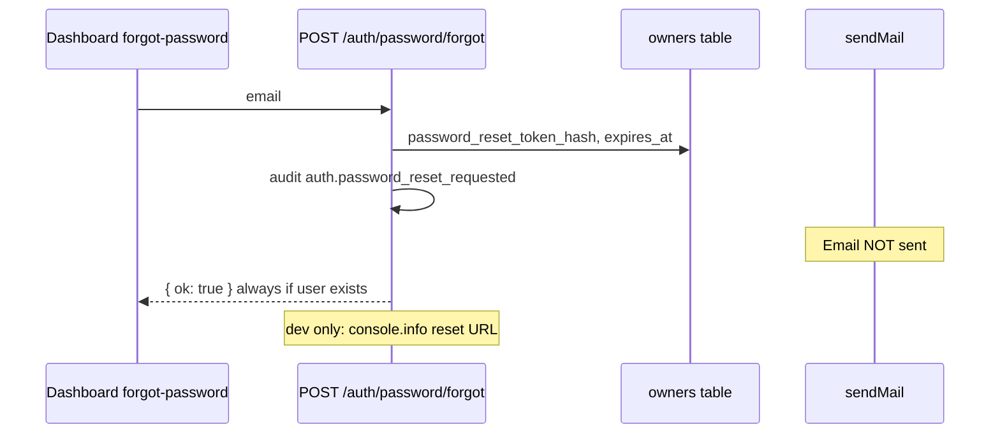
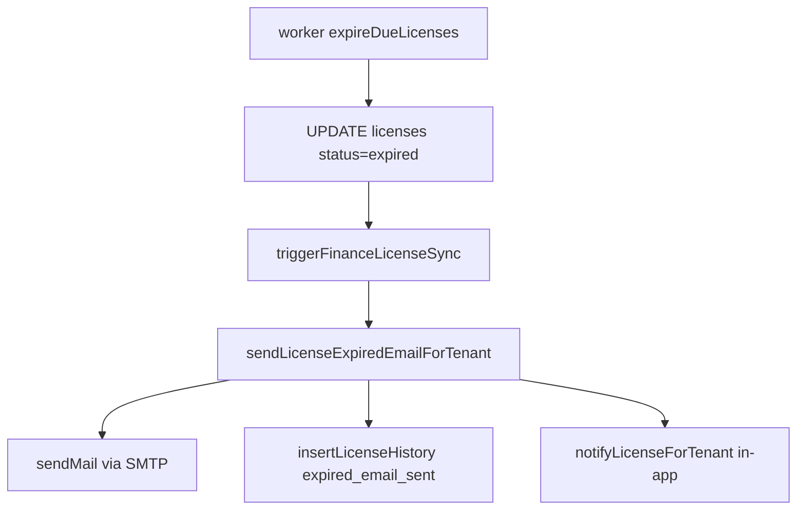
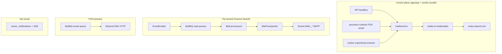

# Email, Resend, Invitation & License System — Full Codebase Audit

**Audit date:** 2026-05-25  
**Scope:** Entire monorepo — control plane (`apps/api`, `apps/dashboard`, `infra/worker-service`, `packages/*`), tenant Finance (`services/stockix-finance`), POS (`services/posnew`), Chat (`services/chatlive`).  
**Method:** Static code trace — no live Resend API calls or production env inspection.

**Related prior docs:** [docs/SAAS_AUDIT_EMAIL.md](docs/SAAS_AUDIT_EMAIL.md) (2026-05-24 repair pass), [docs/notification.md](docs/notification.md) (in-app notifications only).

---

## Executive summary

Stockix uses **two different email integration patterns**:

| Layer | Transport | API key env | Client library |
|-------|-----------|-------------|----------------|
| **Control plane + Finance tenants** | SMTP → `smtp.resend.com` | `MAIL_PASSWORD` (Resend API key) | Nodemailer (`createTransport`) |
| **POS (`posnew`)** | Resend HTTP API | `RESEND_API_KEY` | `resend` npm package |

There is **no** `RESEND_API_KEY` in `apps/api`, `packages/config`, or `infra/worker-service`. Resend is integrated **only via SMTP**, not the official SDK, except in POS.

**Critical gap:** Stockix **owner** forgot-password generates a secure token and stores it in Postgres, but **never sends an email** — only logs the reset URL in development. The dashboard UI promises email delivery.

**Production readiness (email subsystem):** **5/10** — provision/license/invite paths are implemented; password reset for owners is incomplete; no centralized `email_logs`; silent skip when mail env unset.

---

## 1. Resend connection status

### 1.1 Is Resend connected?

**Partially — via SMTP, not SDK (control plane).**

| Check | Finding |
|-------|---------|
| `RESEND_API_KEY` in control plane | **Not used** — grep shows no usage in `apps/`, `packages/`, `infra/` |
| `MAIL_PASSWORD` | **Yes** — documented as Resend API key for SMTP (`infra/prod/.env.example`, `services/stockix-finance/.env.example`) |
| Default host | `smtp.resend.com` when `MAIL_HOST` unset (`apps/api/src/mail/mailer.ts:5`) |
| Default SMTP user | `resend` when `MAIL_USERNAME` unset (`mailer.ts:9`) |
| Idempotency | `Resend-Idempotency-Key` header on outbound mail (`mailer.ts:37-39`, Finance `Mail.ts:36-39`) |
| Domain verification | **Ops-only** — code does not verify domain; comments in Finance UI reference Resend-verified domains |
| Sandbox mode | **No** explicit sandbox flag in code |
| Silent failure | **Yes** — `sendMail()` returns `null` and logs warning if `MAIL_PASSWORD` or `MAIL_FROM_ADDRESS` missing (`mailer.ts:27-30`) |
| Multiple clients | **Yes** — separate Nodemailer transports in API/worker bundle, each Finance tenant stack, and POS Resend SDK instance |

### 1.2 Files that initialize mail

| File | Function / export | Notes |
|------|-------------------|-------|
| `apps/api/src/mail/mailer.ts` | `mailer`, `sendMail()` | Single Nodemailer transport from `@repo/config` `mailConfig` |
| `packages/config/src/index.ts` | `mailConfig` | Reads `MAIL_*` env vars |
| `infra/worker-service/.runtime/worker.js` | Bundled copy of same mailer | Worker imports mail from `apps/api/src/mail/send.js` |
| `services/stockix-finance/packages/server/src/modules/Mail/Mail.module.ts` | `MAIL_TRANSPORTER_PROVIDER` factory | Per-tenant NestJS app |
| `services/stockix-finance/packages/server/src/common/config/mail.ts` | `registerAs('mail', ...)` | Nest config |
| `services/posnew/apps/pos-backend/workers/platformWorker.js` | `sendResendEmail()` | Native `Resend` SDK, `RESEND_API_KEY` |
| `services/posnew/apps/pos-backend/config/config.js` | `resendApiKey`, `resendFromEmail` | Defaults `onboarding@resend.dev` |

### 1.3 Missing / security notes

- **No `email_logs` table** — success/failure only in `console.warn` / `console.error` and `license_history` for license mails.
- **Bootstrap passwords in email HTML** — `sendFinanceWelcomeEmail` embeds one-time password in body (`send.ts:62-108`). Intentional for onboarding; high sensitivity.
- **POS credentials in email** — PINs in table (`sendPosWelcomeEmail`, `provision-runtime.ts:120-125`).
- **Invite URL returned in API response** — `POST /owners/invite` returns `{ inviteToken, inviteUrl, owner }` (`index.ts:2190`) — link leak if response logged.

---

## 2. Email features inventory

| Feature | Exists? | Working? | File locations | Notes |
|---------|---------|----------|----------------|-------|
| Forgot password (Stockix owners) | Partial | **Broken (no send)** | `password-reset.ts`, `routes/auth/index.ts`, dashboard `forgot-password/page.tsx` | Token + audit only; dev console log only |
| Reset password (Stockix owners) | Yes | Yes | `password-reset.ts`, `reset-password/page.tsx` | Token SHA-256, 1h TTL, session invalidation |
| Invite owner (dashboard team) | Yes | Yes (if mail env) | `index.ts` POST `/owners/invite`, `send.ts`, `owner-invite.ts` | Requires `super_admin`; 48h token |
| Accept owner invite | Yes | Yes | `invites.ts`, `accept-invite/page.tsx` | UUID token |
| Invite Finance user (tenant) | Yes | Conditional | `finance-users-http.ts`, Finance `InviteUser.service.ts`, BullMQ | Needs tenant `MAIL_*` + Redis |
| Resend Finance invite | Yes | Conditional | `UsersInvite.controller.ts`, `resendInvite` | Same queue path |
| Email verification (Finance signup) | Yes | **Off by default** | `AuthMail.subscriber.ts`, `SignupVerifyEmail.html` | `SIGNUP_EMAIL_CONFIRMATION=false` in `.env.example` |
| Signup verify resend | Yes | Conditional | `AuthSignupConfirmResend.service.ts`, webapp `RegisterVerify.tsx` | |
| Finance reset password | Yes | Conditional | `AuthSendResetPassword.service.ts`, BullMQ processor | Tenant SMTP required |
| Welcome / provision (tenant admin) | Yes | Conditional | `index.ts` ~1711-1731, `tenant-welcome.ts` | Finance OTP path vs generic welcome |
| Finance bootstrap credentials email | Yes | Conditional | `sendFinanceWelcomeEmail` | Deprecated alias `sendFinanceCredentialsEmail` |
| POS staff credentials email | Yes | Conditional | `provision-runtime.ts`, `sendPosWelcomeEmail` | Worker during provision |
| License expiring warning | Yes | Conditional | `license-expire-followup.ts`, `license-expiring.ts` | Worker cron + dedupe via `hasRecentNotification` |
| License expired email | Yes | Conditional | `sendLicenseExpiredEmailForTenant`, `license-expired.ts` | Writes `license_history` |
| License grace warning (finance sync) | Yes | Conditional | `license-finance-sync.ts` | |
| Invoice email (Finance) | Yes | Conditional | `SendSaleInvoiceMail.ts`, BullMQ | Customer-facing |
| Estimate email | Yes | Conditional | `SendSaleEstimateMail.ts` | |
| Receipt email | Yes | Conditional | `SaleReceiptMailNotification.ts` | |
| Payment received email | Yes | Conditional | `PaymentReceivedMailNotification.ts` | |
| POS org invitation | Yes | Conditional | `platformWorker.js` `org_invitation` | Resend SDK |
| POS suspension warning | Yes | Conditional | `platformWorker.js` `org_suspension_warning` | |
| Payment receipt (SaaS billing) | No | — | — | No Stripe/subscription mail in `apps/api` |
| Trial expiration (SaaS) | Partial | License-based | Worker license scan | Not separate “trial” product email |
| MFA email | No | — | `owners.mfaSecret` exists, no mail flow | |
| Magic link login | No | — | Session/JWT only | |
| Supabase auth emails | No | — | No Supabase in `apps/` | |
| Welcome email (generic owner) | No | — | Tenant admin only | |
| Password changed notification | No | — | Audit log only | |
| Login alert | No | — | — | |
| Contact / support form email | No | — | — | |
| Internal ops alerts | Partial | In-app | `owner_notifications` | Not email |
| School / teacher invites | No | — | — | |
| Tenant invitation (PMS separate) | N/A | — | — | |
| User activation/deactivation email | No | — | Finance may inactivate without mail | |
| Chatlive transactional | Yes | Separate product | `services/chatlive/app/services/email/` | Chatwoot fork — not Stockix control plane |
| React Email / MJML | No | — | Inline HTML + Mustache `.html` | |
| `email_logs` persistence | No | — | — | |
| Dead letter queue (mail) | No | — | BullMQ retries only in Finance | |

---

## 3. Invitation system audit

### 3.1 Stockix platform owners (`owners` table)

**Flow:**

1. `POST /owners/invite` — actor must be authenticated; RBAC requires **`super_admin`** (`middleware/rbac.ts:62-64`).
2. Creates `owners` row with `inviteToken` (UUID), `inviteTokenExpiresAt` (+48h), `invitedById`.
3. Builds `inviteUrl`: `{dashboardUrl}/accept-invite?token={inviteToken}`.
4. Fire-and-forget `sendOwnerInviteEmail()` — failures logged, non-fatal.
5. `GET /auth/invite/:token` — `getInviteByToken()` validates expiry.
6. `POST /auth/invite/accept` — sets `passwordHash`, clears invite fields.

**Security:**

| Item | Status |
|------|--------|
| Token type | UUID in URL (not hashed at rest — stored plaintext in `invite_token`) |
| Expiration | 48 hours |
| RBAC on create | `super_admin` only |
| Duplicate email | 409 `email_already_exists` |
| Resend invite (owner) | **No** dedicated endpoint |
| Tenant isolation | N/A — platform-level |

**UI:** `apps/dashboard/app/(dashboard)/owners/` → `use-owners-page.ts` → `/api/owners/invite`.

### 3.2 Finance tenant users

**Flow:**

1. Dashboard → `POST /tenants/:tenantId/users/invite` → proxies to Finance internal API (`finance-users-http.ts:211-234`).
2. Finance `InviteUser.service` → event `inviteUser.sendInviteTenantSynced` → `InviteSendMailNotification.subscriber` → BullMQ `SendInviteUserMailQueue`.
3. Processor runs `SendInviteUsersMailMessage.sendInviteMail()` — Mustache `mail/UserInvite.html`, accept URL `{baseURL}/auth/invite/{token}/accept`.
4. Resend: `POST /api/invite/users/{id}/resend` → `resendInvite` → same queue.

**Requirements:** Tenant container must have `MAIL_HOST`, `MAIL_PASSWORD`, `MAIL_FROM_ADDRESS` (injected at provision via `infra/worker-service/domain/provisioning/tenant-env.ts`). Redis/BullMQ for queue.

### 3.3 POS organization invitations

**Flow:** `org_invitation` job in `platformWorker.js` — uses **Resend SDK** (`RESEND_API_KEY`), `OrgInvitation` Mongo model, accept URL on `tenantAppOrigin`.

**Isolation:** Checks org license/access state before send.

---

## 4. Forgot password / reset flow (Stockix owners)

| Step | Implementation | Gap |
|------|----------------|-----|
| Frontend | `forgot-password/page.tsx` | UX claims email will be sent |
| Rate limit | `enforceRateLimit` on `/auth/password/forgot` | OK |
| Token | 32-byte base64url, SHA-256 stored | OK |
| TTL | 1 hour (`RESET_TTL_MS`) | OK |
| Email | **Not implemented** | `password-reset.ts:72-74` logs URL only in `development` |
| Reset page | `reset-password/page.tsx` → `POST /auth/password/reset` | OK |
| Template | **None** for Stockix owners | Finance has `ResetPassword.html` |

**Finance (tenant users):** Full flow via `AuthSendResetPassword.service` → event → BullMQ → `AuthenticationMailMesssages.sendResetPasswordMail()`.

---

## 5. Accounting / billing emails

### 5.1 Stockix control plane (SaaS licenses)

- **No** invoice/receipt/Stripe subscription emails in `apps/api`.
- License lifecycle uses **email + in-app notification** (`notifyLicenseForTenant`, `owner_notifications`).

### 5.2 Finance (tenant accounting product)

| Type | Implemented | Queue | Template |
|------|-------------|-------|----------|
| Sale invoice | Yes | BullMQ | Dynamic + PDF attach |
| Sale estimate | Yes | BullMQ | Defaults in constants |
| Sale receipt | Yes | BullMQ | `DEFAULT_RECEIPT_MAIL_*` |
| Payment received | Yes | BullMQ | `DEFAULT_PAYMENT_MAIL_*` |
| Invoice reminders | Yes | Constants in `SaleInvoices/constants.ts` | |
| Stripe/LemonSqueezy | Config present | Webhooks likely | **Not traced as auto-receipt emails in this audit** |

Triggered by user action in Finance UI (send mail), not platform cron.

---

## 6. License system emails

### 6.1 Triggers

| Event | Sender | Dedup |
|-------|--------|-------|
| License passes `expiresAt` | Worker `expireDueLicenses()` every **5 min** | `license_history` + notification |
| Expiring soon (warning window) | `license-expire-followup.ts` | `hasRecentNotification()` 24h |
| Finance grace sync | `license-finance-sync.ts` | `sendLicenseExpiringEmail` |

### 6.2 Flow (expired)

**Recipient:** `tenants.adminEmail` only — not all owners.

**Tests:** `apps/api/tests/license-expiry-email.test.ts`.

---

## 7. Email template system

### 7.1 Control plane (`apps/api/src/mail/templates/`)

| Template | Format | Branding |
|----------|--------|----------|
| `owner-invite.ts` | TS function → HTML string | Stockix, minimal |
| `tenant-welcome.ts` | TS function | Stockix |
| `license-expiring.ts` | TS function | Stockix |
| `license-expired.ts` | TS function | Stockix |
| `sendFinanceWelcomeEmail` | Inline HTML in `send.ts` | `BRAND_NAME` env |
| `sendPosWelcomeEmail` | Inline HTML in `send.ts` | `BRAND_NAME` env |

No i18n, no React Email, no MJML. `escapeHtml()` used in newer templates.

### 7.2 Finance (`packages/server/static/mail/`)

| File | Purpose |
|------|---------|
| `UserInvite.html` | Mustache — still references “Bigcapital” in copy paths |
| `SignupVerifyEmail.html` | Signup verification |
| `ResetPassword.html` | Title still “Bigcapital \| Reset your password” |

Rendering: `Mail.render()` → Mustache (`Mail.ts:135-137`).

### 7.3 White-label / multi-tenant

- **Finance:** `MailTenancy.service.ts` — per-tenant `fromEmailAddress` / `fromEmailName` in tenant metadata; must be Resend-verified domain (documented in DTOs).
- **Control plane:** Single global `MAIL_FROM_*` — no per-tenant from address.

---

## 8. Email architecture

| Aspect | Assessment |
|--------|------------|
| Production-ready | Partial — silent skip if env missing |
| Scalable | Finance queues OK; control plane synchronous `sendMail` |
| Multi-tenant safe | Finance yes (per-tenant SMTP); control plane single sender |
| Secure | OTP/PIN in email bodies; owner reset email missing |
| Enterprise-grade | No centralized logging, DLQ, or observability |

**Event-driven (Finance):** Nest `@OnEvent` → BullMQ → processor → Nodemailer.

**Control plane:** Direct `await sendMail()` / `void sendMail().catch()` — no queue.

**Supabase hooks:** None in Stockix apps.

**Cron:** Worker license scan (5 min interval), not separate cron daemon.

---

## 9. Security audit

| Risk | Severity | Detail |
|------|----------|--------|
| Owner password reset email not sent | **Critical** | Users cannot self-serve reset in production |
| Silent mail skip | **High** | Misconfiguration looks like success to UI |
| One-time passwords in email | **High** | Finance welcome email |
| POS PINs in email | **High** | Operational risk |
| `inviteUrl` in API response | **Medium** | Leak via logs/clients |
| Invite token stored plaintext | **Medium** | DB breach exposes active invites |
| No `email_logs` | **Medium** | No audit trail for delivery |
| API key in `MAIL_PASSWORD` | **Low** (expected) | Must not commit; server-side only |
| Client-side secrets | **None found** | Mail config server-only |
| Rate limits | **Partial** | Auth routes limited; `/owners/invite` relies on RBAC |
| Open invitation abuse | **Low** | Finance invite requires authenticated tenant admin |
| Replay on reset token | **Mitigated** | Cleared after use; session version bumped |
| Duplicate mail implementations | **Low** | SMTP vs Resend SDK increases ops burden |

**No Supabase** — auth is custom JWT/session on `owners` table.

---

## 10. Database audit

| Table | Exists | Email-related columns / usage |
|-------|--------|------------------------------|
| `owners` | Yes | `invite_token`, `invite_token_expires_at`, `password_reset_token_hash`, `password_reset_expires_at`, `email` |
| `tenants` | Yes | `admin_email` — license/welcome mail recipient |
| `licenses` | Yes | Expiry drives email cron |
| `license_history` | Yes | Actions: `expired_email_sent`, `expiry_warning_sent` |
| `owner_notifications` | Yes | In-app only — not SMTP |
| `admin_audit_log` | Yes | `auth.password_reset_*`, `owner.invite` |
| `invitations` | No | Uses `owners.invite_*` |
| `email_logs` | **No** | |
| `password_resets` | **No** | Embedded in `owners` |
| `subscriptions` | No (control plane) | License model instead |
| Finance `users_invites` | Yes (tenant DB) | Via Objection `UserInvite` model |

**Missing constraints:** No FK from invite to prevent reuse after accept (cleared on accept). No unique partial index on active reset tokens.

---

## 11. Worker / queue system

| System | Used for mail? | Retry | Notes |
|--------|----------------|-------|-------|
| BullMQ + Redis | Finance + POS | 3 attempts, exponential 5s (`mail-queue.constants.ts`) | Requires `QUEUE_HOST` / `REDIS_*` |
| Worker job queue (Postgres) | Provision, license expiry | Job-level error logging | Mail is side-effect, not queued |
| Agenda | Config in `.env.example` | Not primary for Stockix mail | |
| Dead-letter | **No** dedicated DLQ for mail | BullMQ default failed jobs | |

**Worker mail calls:** Imports `sendPosWelcomeEmail` from API mail module during provision (`provision-runtime.ts`). Welcome emails for Finance sent from **API** on job completion (`index.ts:1683-1738`), not worker.

---

## 12. Frontend audit

| UI | Path | Status |
|----|------|--------|
| Forgot password | `(auth)/forgot-password/page.tsx` | Complete — **misleading if mail unset** |
| Reset password | `(auth)/reset-password/page.tsx` | Complete |
| Accept invite | `(auth)/accept-invite/page.tsx` | Complete |
| Owner invite | `owners/_components/use-owners-page.ts` | Complete |
| Finance user invite | `tenant-users-panel.tsx` | Invite + break-glass password |
| Resend Finance invite | Finance webapp `UsersDataTable.tsx` | Not in dashboard — tenant Finance UI |
| Email verification | Finance `RegisterVerify.tsx` | Only if signup confirmation enabled |
| License pages | Dashboard licenses | In-app notifications, not email config |
| Notification center | **Missing** | See `docs/notification.md` |
| Resend owner invite button | **Missing** | |

---

## 13. Environment variables

### Control plane / worker (`packages/config`, `infra/prod/.env.example`)

| Variable | Purpose | Required for send |
|----------|---------|-------------------|
| `MAIL_HOST` | SMTP host (default `smtp.resend.com`) | Recommended |
| `MAIL_PORT` | Default `587` | Yes |
| `MAIL_USERNAME` | SMTP user (default `resend`) | Yes |
| `MAIL_PASSWORD` | **Resend API key** | **Yes** |
| `MAIL_SECURE` | TLS | Optional |
| `MAIL_FROM_NAME` | Display name | Yes |
| `MAIL_FROM_ADDRESS` | Verified sender | **Yes** |
| `BRAND_NAME` | POS/Finance welcome copy | Optional |
| `DASHBOARD_URL` | Invite + reset URL base | Yes for links |

### POS only

| Variable | Purpose |
|----------|---------|
| `RESEND_API_KEY` | Resend HTTP API |
| `RESEND_FROM_EMAIL` | Default `onboarding@resend.dev` |

### Finance tenant (copied at provision)

Same `MAIL_*` set written to `~/.stockix/tenants/*/.env` via `tenant-env.ts`.

### Not used

- `RESEND_API_KEY` — control plane
- `LOOPS_API_KEY` — commented optional in Finance `.env.example`

### Duplicates / naming

- `sendFinanceCredentialsEmail` deprecated alias for `sendFinanceWelcomeEmail`
- `TENANT_DB_NAME_PERFIX` typo preserved in config

---

## A. Current working features

- Owner invite email + accept flow (with mail env).
- Tenant provision welcome / Finance OTP welcome emails.
- POS credentials email on provision.
- License expiring/expired emails + in-app notifications.
- Finance user invite + resend (BullMQ + Mustache).
- Finance password reset + signup verify (when enabled).
- Finance transactional document emails (invoice, estimate, receipt, payment).
- POS org invitation + suspension warning (Resend SDK).
- SMTP idempotency keys for Resend.
- Unit tests for finance welcome, POS credentials, license expiry emails.

---

## B. Broken features

- **Stockix owner forgot-password email** — never calls `sendMail()`.
- **Mail silently skipped** when `MAIL_PASSWORD` or `MAIL_FROM_ADDRESS` unset — UI still shows success.
- **POST /owners** (non-invite) logs `owner.invite` audit but does not send email or set invite token — inconsistent with invite flow.

---

## C. Missing features

- `email_logs` / delivery webhooks from Resend.
- Owner invite resend endpoint.
- Password-changed / login-alert emails.
- MFA email flow.
- SaaS billing receipt / failed payment emails (control plane).
- Magic link auth.
- Unified Resend SDK or webhook handler across POS + control plane.
- React Email / design system for templates.
- i18n for mail copy.
- Dead-letter / alerting on mail queue failures.

---

## D. Security issues

See §9. Top priority: implement owner reset email; stop returning raw `inviteUrl` to clients if not needed; reduce secret material in email bodies where possible.

---

## E. Production readiness score

**5 / 10**

Reason: Core provision and license paths exist and are tested, but owner password reset is incomplete, observability is weak, and misconfiguration fails silently.

---

## F. Enterprise readiness

- **Scalable:** Finance BullMQ pattern is sound; control plane synchronous sends won't scale at high volume without a queue.
- **Multi-tenant:** Finance per-tenant SMTP + `fromEmailAddress` is good; control plane is single-tenant sender.
- **Compliance:** No retention of email content/delivery status in DB.

---

## G. Recommended improvements (prioritized)

1. **P0** — Implement `sendOwnerPasswordResetEmail()` in `password-reset.ts` + HTML template; wire to `sendMail()`.
2. **P0** — Fail loudly or surface dashboard warning when `MAIL_PASSWORD` / `MAIL_FROM_ADDRESS` missing.
3. **P1** — Add `email_logs` table (message id, template, recipient hash, status, error).
4. **P1** — Resend webhook handler for bounces/complaints.
5. **P1** — Queue control-plane mail (BullMQ or reuse worker) with same retry policy as Finance.
6. **P2** — Standardize on one integration (SMTP or SDK) + document in `infra/prod/README.md`.
7. **P2** — Remove `inviteUrl` from API response or restrict to admin-only debug.
8. **P2** — Rebrand Finance static templates (Bigcapital → Stockix).
9. **P3** — Owner invite resend; React Email components; i18n.

---

## H. File-by-file analysis (important files)

| File | Role |
|------|------|
| `apps/api/src/mail/mailer.ts` | Nodemailer + Resend SMTP + idempotency |
| `apps/api/src/mail/send.ts` | All control-plane send functions |
| `apps/api/src/mail/templates/*.ts` | HTML renderers |
| `apps/api/src/services/auth/password-reset.ts` | **Missing email send** |
| `apps/api/src/services/invites/invites.ts` | Owner invite token validation |
| `apps/api/src/routes/auth/index.ts` | Auth HTTP including password + invite |
| `apps/api/src/index.ts` | `/owners/invite`, provision welcome mail |
| `apps/api/src/license-expire-followup.ts` | Post-expiry email + notifications |
| `apps/api/src/finance-users-http.ts` | Dashboard → Finance user invite proxy |
| `apps/api/src/notification-service.ts` | In-app notifications (not SMTP) |
| `apps/api/src/middleware/rbac.ts` | `/owners/*` → super_admin for mutations |
| `packages/config/src/index.ts` | `mailConfig` |
| `infra/worker-service/src/worker.ts` | License cron |
| `infra/worker-service/src/provision-runtime.ts` | POS credentials email |
| `infra/worker-service/domain/provisioning/tenant-env.ts` | Inject MAIL_* into tenant stacks |
| `services/stockix-finance/.../Mail/*` | Nest mail abstraction |
| `services/stockix-finance/.../Auth/subscribers/AuthMail.subscriber.ts` | Auth mail queues |
| `services/stockix-finance/.../UsersModule/subscribers/InviteSendMailNotification.subscriber.ts` | Invite queue |
| `services/stockix-finance/static/mail/*.html` | Mustache templates |
| `services/posnew/.../platformWorker.js` | Resend SDK + invitations |
| `apps/dashboard/app/(auth)/*` | Auth UX |
| `apps/api/tests/*-email.test.ts` | Mail unit tests |

---

## I. Full flow diagrams

### I.1 Tenant provision welcome

1. Dashboard creates tenant → worker `tenant.provision` job.
2. On completion, API handler (`index.ts`) loads tenant, builds `financeUrl`.
3. If `oneTimeAdminPassword` and accounting module → `sendFinanceWelcomeEmail`.
4. Else → `sendTenantWelcomeEmail`.
5. `sendMail` → SMTP Resend (or skip with warning).

### I.2 Owner invite

1. `super_admin` → `POST /owners/invite`.
2. DB insert + `sendOwnerInviteEmail`.
3. User opens `/accept-invite?token=`.
4. `POST /auth/invite/accept` sets password.

### I.3 Finance document email

1. User clicks Send in Finance UI.
2. Command emits event / enqueues BullMQ job.
3. Processor builds `Mail` with PDF attachment.
4. `MailTransporter.send` → tenant SMTP.

---

## J. Immediate critical fixes

1. **Send owner password reset email** — production blocker for dashboard operators.
2. **Verify `MAIL_*` in staging** — domain verified in Resend; run `apps/api` tests + one manual send.
3. **Per-tenant MAIL after provision** — spot-check `~/.stockix/tenants/<slug>/.env` (per `docs/SAAS_AUDIT_EMAIL.md`).
4. **Align forgot-password UX** with reality until email ships (or block submit when mail disabled).

---

## System maturity assessments

| Dimension | Score | Summary |
|-----------|-------|---------|
| **Overall email system maturity** | 6/10 | Multi-product coverage; inconsistent transport and gaps |
| **Production readiness** | 5/10 | Silent failures + broken owner reset |
| **Enterprise SaaS readiness** | 4/10 | No delivery logs, DLQ, or compliance trail |
| **White-label readiness** | 6/10 | Finance tenant from-address; control plane global only |
| **Multi-tenant safety** | 7/10 | Finance isolated; platform mail is shared config |
| **Observability** | 3/10 | Console logs + partial `license_history` only |

### Final recommendations for scaling

- Centralize mail behind a single **MailService** package used by API, worker, and optionally Finance.
- Persist **email_logs** and ingest Resend webhooks.
- Move control-plane sends to **BullMQ** with shared Redis.
- Never return pre-signed secrets/URLs in API bodies unless necessary.
- Add staging smoke test: invite, reset, provision welcome, license warning.
- Keep POS on Resend SDK or migrate to SMTP for one operational model.

---

*End of audit. This document supersedes informal assumptions; verify against live env before production sign-off.*
