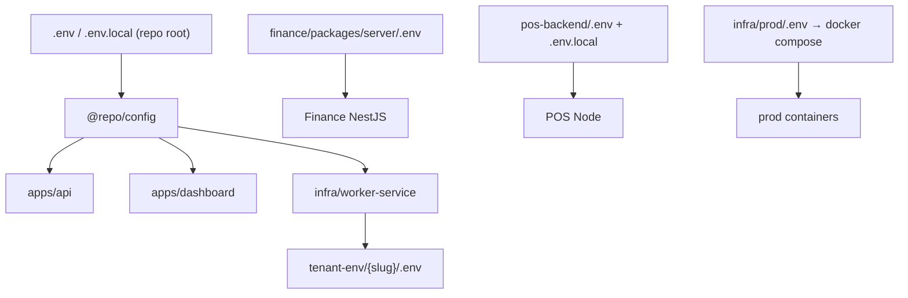

# Stockix Environment Variables Audit

**Date:** 2026-05-27  
**Method:** Enumerate every `.env*` file in the repo; parse keys and classify values as `<SET>`, `<EMPTY>`, or `<PLACEHOLDER>` (no secret values in this document). Cross-check against `packages/config` production requirements.  
**Scope:** Monorepo root, `infra/prod`, Finance, POS, PMS, Chatwoot examples, and local overrides.

---

## Executive summary

| Finding | Severity |
|---------|----------|
| `infra/prod/.env` is **gitignored** (not tracked) | OK |
| **Root `.env` contains production-grade mail/Resend secrets** (copied from prod) | **High** — treat as secrets on dev machines |
| **Three different `LICENSE_SIGNING_SECRET` values** across real env files | **High** — POS STXI validation will break if mismatched |
| **`INTERNAL_API_SECRET` empty in root**, dev value in Finance server, prod value in `infra/prod` | **High** — Finance ↔ API internal calls fail locally unless aligned |
| **POS `.env` still references zerowix** (CORS, owner email, B2 bucket) while mail is Stockix | **Medium** — branding/env drift |
| **POS `.env` contains cloud DB URI with embedded credentials** | **Critical** — rotate if repo or backups are shared |
| `NEXT_PUBLIC_*` vars contain **no** API keys or webhook secrets | OK |
| Mail vars **aligned** on Stockix domain across root, prod, Finance, POS (`noreply@stockix.cloud`) | OK |

**Overall:** Examples are fine for documentation; **real env files are not a single source of truth**. Production truth is `infra/prod/.env` on the server. Local dev should use root `.env` + service-specific `.env` with **explicit sync rules** for shared secrets.

---

## Section 1 — Every `.env` file found (23 files)

### Real env (secrets may be present — gitignored)

| # | Path | Vars | Role |
|---|------|------|------|
| 1 | `.env` | 155 | Primary control-plane + dashboard load (`@repo/config`) |
| 2 | `infra/prod/.env` | 109 | Production Docker Compose `--env-file` |
| 3 | `services/posnew/apps/pos-backend/.env` | 29 | POS API/worker local |
| 4 | `services/stockix-finance/.env` | 36 | Finance monorepo reference |
| 5 | `services/stockix-finance/packages/server/.env` | 60 | NestJS Finance server cwd |
| 6 | `services/posnew/apps/pos-backend/.env.local` | 2 | Overrides POS (`REDIS_URL`, `NODE_ENV`) |
| 7 | `services/posnew/apps/pos-frontend2/.env.local` | 2 | POS Next public API origin |
| 8 | `services/pms/frontend/.env.local` | 2 | PMS Next public API + cookie name |

### Examples only (safe to commit)

| # | Path | Vars |
|---|------|------|
| 9 | `.env.example` | 155 |
| 10 | `infra/prod/.env.example` | 117 |
| 11 | `infra/staging/.env.example` | 8 |
| 12 | `services/posnew/apps/pos-backend/.env.example` | 15 |
| 13 | `services/posnew/apps/pos-frontend2/.env.example` | 1 |
| 14 | `services/posnew/deploy/.env.production.example` | 13 |
| 15 | `services/stockix-finance/.env.example` | 56 |
| 16 | `services/stockix-finance/packages/server/.env.example` | 60 |
| 17 | `services/stockix-finance/packages/webapp/.env.example` | 7 |
| 18 | `services/pms/.env.example` | 16 |
| 19 | `services/pms/frontend/.env.example` | 2 |
| 20 | `services/chatlive/.env.example` | 59 |
| 21 | `apps/api/.env.example` | 0 (pointer to root) |
| 22 | `apps/dashboard/.env.example` | 0 (pointer to root) |

### Generated at runtime (not in repo)

| Location | Notes |
|----------|--------|
| `infra/tenant-env/{slug}/.env` or `TENANT_ENV_ROOT` | Written by worker provision; copies `MAIL_*`, encrypts some secrets |
| `~/.stockix/tenants/{slug}/.env` | Per docs in Finance `.env` header |

---

## Section 2 — Git tracking and security posture

| Check | Result | Evidence |
|-------|--------|----------|
| `infra/prod/.env` tracked in git? | **No** | `git check-ignore` → `.gitignore` rule `**/.env` |
| Root `.env` tracked in git? | **No** | Same |
| `git ls-files infra/prod/.env` | **Not in index** | `pathspec did not match` |
| `NEXT_PUBLIC_*` contains secrets? | **No** | Grep for `re_`, `whsec_`, `sk_` in `NEXT_PUBLIC_*` → 0 matches |
| Examples contain live secrets? | **No** | Placeholders / empty only |

### STOP-condition flags (action required)

1. **Root `.env` contains production mail credentials** — `MAIL_PASSWORD`, `RESEND_API_KEY`, `RESEND_WEBHOOK_SECRET` are `<SET>` with the same material as `infra/prod/.env`. Any laptop backup or accidental commit of `.env` exposes production email capability.
2. **Hardcoded API keys in real `.env` files** — Resend (`re_*`), Cloudflare (`cfut_*`), B2/S3, MongoDB Atlas URI, JWT/session secrets, `PLATFORM_API_SECRET`, `WORKER_SECRET`, etc. **Assume rotation** if this repo was ever shared broadly or `.env` left a machine.
3. **`infra/prod/.env` is not in git** — correct; **must stay server-only**.

---

## Section 3 — Critical variable matrix (real files only)

Status: **SET** = non-empty value · **EMPTY** = key present, no value · **PLACEHOLDER** = `__MUST_OVERRIDE__` or example default

| Variable | `.env` | `infra/prod/.env` | `pos-backend/.env` | `finance/.env` | `finance/server/.env` |
|----------|:------:|:-----------------:|:------------------:|:--------------:|:---------------------:|
| `DATABASE_URL` | SET (local PG) | SET (docker PG) | — | — | — |
| `MAIL_PASSWORD` | SET | SET | — | SET | SET |
| `MAIL_FROM_ADDRESS` | SET (`stockix.cloud`) | SET | — | SET | SET |
| `RESEND_API_KEY` | SET | SET | SET | SET | SET |
| `RESEND_FROM_EMAIL` | SET | SET | SET | SET | SET |
| `RESEND_WEBHOOK_SECRET` | SET | SET | — | — | — |
| `PLATFORM_API_SECRET` | SET (dev hex) | SET (prod hex) | — | — | — |
| `WORKER_SECRET` | SET (dev) | SET (prod) | — | — | — |
| `INTERNAL_API_SECRET` | **EMPTY** | SET | — | — | SET (dev) |
| `SESSION_SECRET` | PLACEHOLDER | SET | — | — | — |
| `AUTH_TOKEN_SECRET` | PLACEHOLDER | SET | SET (POS) | — | — |
| `LICENSE_SIGNING_SECRET` | PLACEHOLDER | SET | SET (**different**) | — | — |
| `DEPLOYMENT_SECRET_KEY` | PLACEHOLDER | SET | — | — | — |
| `POS_PLATFORM_API_KEY` | **EMPTY** | SET | SET | — | — |
| `CONTROL_PLANE_REDIS_URL` | — | SET | — | — | — |
| `POSTGRES_PASSWORD` | PLACEHOLDER | SET | — | — | — |
| `CF_DNS_API_TOKEN` | EMPTY | SET | — | — | — |
| `S3_ACCESS_KEY_ID` | EMPTY | SET | — | — | EMPTY |
| `S3_SECRET_ACCESS_KEY` | EMPTY | SET | — | — | EMPTY |
| `CHATWOOT_API_ACCESS_TOKEN` | EMPTY | **EMPTY** | — | — | — |
| `SENTRY_DSN` | EMPTY | EMPTY | — | — | — |

---

## Section 4 — Duplicates (same secret, multiple keys)

| Duplicate group | Files | Intentional? |
|-----------------|-------|--------------|
| `MAIL_PASSWORD` ≡ `RESEND_API_KEY` | root, prod, Finance, POS | **Yes** — same Resend API key for SMTP and POS SDK |
| `MAIL_FROM_ADDRESS` ≡ `RESEND_FROM_EMAIL` | same | **Yes** — same verified sender |
| `S3_ACCESS_KEY_ID` ≡ `BACKUP_B2_KEY_ID` | `infra/prod/.env` only | **Yes** — backup sidecar reuses B2 app key |
| `S3_SECRET_ACCESS_KEY` ≡ `BACKUP_B2_APP_KEY` | `infra/prod/.env` only | **Yes** |
| `JWT_SECRET` (Finance) ≡ `JWT_SECRET` in `infra/prod` | prod + finance `.env` | **Yes** — shared for Finance stack |
| `AUTH_TOKEN_SECRET` (POS) vs `APP_JWT_SECRET` (Finance server) | POS vs Finance server | **Different purposes** — not duplicates |

---

## Section 5 — Conflicts (different values, same key)

| Variable | Conflict | Impact |
|----------|----------|--------|
| `LICENSE_SIGNING_SECRET` | Root = PLACEHOLDER; prod = SET; POS = SET (**distinct from prod**) | POS offline license / STXI keys from API **fail** against prod unless POS tenants get prod secret |
| `INTERNAL_API_SECRET` | Root EMPTY; prod SET; Finance server SET (**≠ prod**) | Local Finance internal API calls to control-plane **401/403** unless root filled |
| `PLATFORM_API_SECRET` | Root dev 64-char pattern; prod 128-char hex | Expected dev vs prod; **do not mix** |
| `WORKER_SECRET` | Root `dev-worker-secret`; prod long hex | Expected; worker must match API env |
| `DATABASE_URL` | Localhost:54330 vs `postgres:5432` in compose | Expected dev vs prod topology |
| `ROOT_DOMAIN` / URLs | `localhost` vs `stockix.cloud` | Expected |
| Branding (POS) | `RESEND_FROM_EMAIL` = Stockix; `PLATFORM_OWNER_EMAIL` / CORS still **zerowix** | Confusing ops; wrong CORS in hybrid setups |

---

## Section 6 — Missing production variables

From `packages/config` `validateRequiredEnvForProfile("production")`:

| Required in production | In `infra/prod/.env`? |
|------------------------|----------------------|
| `DATABASE_URL` | SET |
| `DB_POOL_MAX` | SET |
| `DB_IDLE_TIMEOUT_SECONDS` | SET |
| `DB_CONNECT_TIMEOUT_SECONDS` | SET |
| `DB_MAX_LIFETIME_SECONDS` | SET |
| `PLATFORM_API_SECRET` | SET |
| `WORKER_SECRET` | SET |
| `SESSION_SECRET` | SET |
| `DASHBOARD_URL` | SET |
| `AUTH_TOKEN_SECRET` | SET |
| `DEPLOYMENT_SECRET_KEY` | SET |
| `LICENSE_SIGNING_SECRET` | SET |
| `CONTROL_PLANE_REDIS_URL` | SET |

**Recommended but not required** (`recommendedByProfile.production`):

| Variable | In `infra/prod/.env`? |
|----------|----------------------|
| `RESEND_WEBHOOK_SECRET` | SET |
| `SENTRY_DSN` | **EMPTY** |

**Operational gaps (not in config validator):**

| Variable | In `infra/prod/.env`? | Notes |
|----------|----------------------|--------|
| `CHATWOOT_API_ACCESS_TOKEN` | **EMPTY** | Chat provisioning API may fail |
| `POSTHOG_API_KEY` | EMPTY | Optional analytics |
| `METRICS_ENDPOINT` | EMPTY | Optional telemetry |

**Missing from root `.env` for full local stack:**

| Variable | Status | Blocks |
|----------|--------|--------|
| `INTERNAL_API_SECRET` | EMPTY | Finance provision / internal routes |
| `POS_PLATFORM_API_KEY` | EMPTY | POS module provision |
| `CONTROL_PLANE_REDIS_URL` | absent | License queue inline only |
| `LICENSE_SIGNING_SECRET` | PLACEHOLDER | POS license signing (dev fallback may apply) |
| `SESSION_SECRET` / `AUTH_TOKEN_SECRET` | PLACEHOLDER | Owner login unless overridden in `.env.local` |

---

## Section 7 — Email / Resend alignment (post-repair)

| File | `MAIL_PASSWORD` | `MAIL_FROM_ADDRESS` | `RESEND_API_KEY` | `RESEND_FROM_EMAIL` | `RESEND_WEBHOOK_SECRET` |
|------|-----------------|---------------------|------------------|----------------------|-------------------------|
| `.env` | SET | SET (stockix.cloud) | SET | SET | SET |
| `infra/prod/.env` | SET | SET | SET | SET | SET |
| `finance/.env` + `server/.env` | SET | SET | SET | SET | — |
| `pos-backend/.env` | — | — | SET | SET | — |

**Evidence:** All Stockix mail paths use the same sender domain. Webhook secret only on control-plane env files.

---

## Section 8 — Security issues

### SEC-ENV-1: Production secrets on developer root `.env`

**Severity:** High  
**Files:** `.env` (mail + webhook block)  
**Issue:** Production Resend and webhook signing material copied into the canonical local file.  
**Impact:** Dev machine compromise = ability to send mail as Stockix and forge webhook updates.  
**Fix:** Use separate Resend **test** keys locally, or `.env.local` overrides; keep prod values only in `infra/prod/.env` on the server.

### SEC-ENV-2: MongoDB Atlas credentials in POS `.env`

**Severity:** Critical  
**File:** `services/posnew/apps/pos-backend/.env` → `MONGODB_URI`  
**Issue:** Full connection string with username/password in a file.  
**Impact:** Database access if file leaks.  
**Fix:** Rotate Atlas user password; use env injection on deploy; never copy prod URI to shared drives.

### SEC-ENV-3: `LICENSE_SIGNING_SECRET` mismatch (POS vs prod)

**Severity:** High  
**Files:** `infra/prod/.env`, `services/posnew/apps/pos-backend/.env`, `.env`  
**Issue:** Three different states/values.  
**Impact:** License JWT validation failures; security boundary confusion.  
**Fix:** Single secret per environment; sync to all POS tenant env files on provision (`LICENSE_SIGNING_SECRET` in worker).

### SEC-ENV-4: Weak dev `PLATFORM_API_SECRET` in root `.env`

**Severity:** Medium (dev only)  
**Issue:** Predictable 64-char hex pattern in root vs strong prod secret.  
**Fix:** Acceptable for local-only; never deploy root `.env` to any host.

### SEC-ENV-5: POS legacy zerowix + Stockix mail mix

**Severity:** Low–Medium  
**Issue:** `CORS_ORIGINS`, `PLATFORM_OWNER_EMAIL`, `B2_BUCKET_NAME` still zerowix-branded while email is Stockix.  
**Fix:** Align POS env to Stockix domains or document intentional multi-brand dev setup.

### SEC-ENV-6: `infra/prod/.env` contains full production secret set

**Severity:** Informational (expected)  
**Issue:** Passwords, API keys, CF token, B2 keys, Chatwoot secrets all present.  
**Fix:** Ensure file permissions `600`, server-only, backup encryption; runbook rotation in `docs/SECRET_ROTATION_RUNBOOK.md`.

---

## Section 9 — Loading order (who reads what)



| Consumer | Primary env source |
|----------|-------------------|
| Control-plane API | Root `.env` / `.env.local` via `@repo/config` |
| Dashboard | Same (Next loads `@repo/config`) |
| Infra worker | Root (often `pnpm env:sync-prod` from prod on server) |
| Finance Nest | `packages/server/.env` (must align `INTERNAL_API_SECRET`, `MAIL_*` with root for internal calls) |
| POS backend | Own `.env` + `.env.local`; compose injects `RESEND_*` at provision |
| Production stack | `infra/prod/.env` only |

---

## Section 10 — Action plan

### Immediate (before next deploy)

1. **Confirm `infra/prod/.env` never committed** — run `git status` and secret scan in CI (already gitignored).
2. **Sync `LICENSE_SIGNING_SECRET`** — prod value → every POS tenant env + local POS `.env` if testing STXI.
3. **Set root `INTERNAL_API_SECRET`** to match Finance server **or** prod, depending on what you are testing locally.
4. **Set root `POS_PLATFORM_API_KEY`** to match prod if provisioning POS locally (copy from `infra/prod/.env`, not invented).
5. **Register Resend webhook** on server; `RESEND_WEBHOOK_SECRET` already SET in prod and root.

### Short term (this week)

6. **Split dev vs prod mail keys** — Resend supports separate API keys; remove prod `re_*` from root `.env`; use test key locally.
7. **Rotate POS MongoDB Atlas password** if `MONGODB_URI` was ever exposed.
8. **Fill `CHATWOOT_API_ACCESS_TOKEN`** in prod or disable chat module until set.
9. **Align POS branding env** — replace zerowix CORS/owner/B2 names with Stockix or document dual-brand.
10. **Run `pnpm env:sync-prod`** on production host only (copies prod → root for worker); do not run on dev laptops with prod secrets unless intentional.

### Medium term

11. **Single sync script** — `scripts/sync-env-from-prod.sh` that copies a defined allowlist (no blind full copy).
12. **Validate on boot** — extend health check to list missing recommended vars (`SENTRY_DSN`).
13. **Tenant env audit** — script to verify each `tenant-env/{slug}/.env` has `MAIL_*` and `LICENSE_SIGNING_SECRET` matching prod.
14. **Remove duplicate documentation** — keep `.env.example` in sync when adding keys (already has `RESEND_*`).

### Do not do

- Commit any real `.env` file.
- Put `MAIL_PASSWORD` or `RESEND_API_KEY` in `NEXT_PUBLIC_*`.
- Assume root `.env` placeholders (`__MUST_OVERRIDE__`) are safe for a demo with real tenants.

---

## Section 11 — Audit checklist

| Requirement | Done |
|-------------|:----:|
| Every `.env` file found and listed | ✅ 23 files |
| Every critical variable mapped across real files | ✅ Section 3 |
| Duplicates identified | ✅ Section 4 |
| Conflicts identified | ✅ Section 5 |
| Missing production vars listed | ✅ Section 6 |
| Security issues flagged | ✅ Section 8 |
| Clear action plan | ✅ Section 10 |
| `docs/env-audit.md` complete | ✅ |
| No secret values printed in document | ✅ |

---

## Appendix — Commands used

```powershell
git check-ignore -v infra/prod/.env .env
git ls-files infra/prod/.env .env
# Glob: **/.env* (23 files)
# Per-file: grep '^[A-Z][A-Z0-9_]*=' with status classification SET/EMPTY/PLACEHOLDER
# packages/config validateRequiredEnvForProfile('production')
```

**Re-run audit after env changes:**

```powershell
cd <repo-root>
# List all env files
Get-ChildItem -Recurse -File -Filter ".env*" | Where-Object { $_.FullName -notmatch 'node_modules' }
```

---

*This audit is read-only documentation. Updating env files does not change runtime until processes are restarted.*
