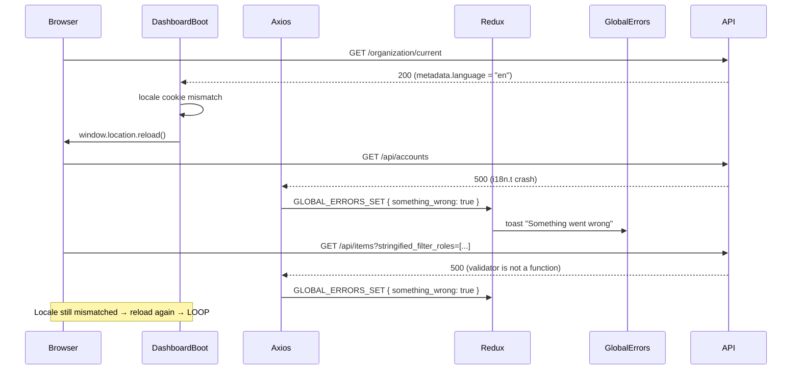
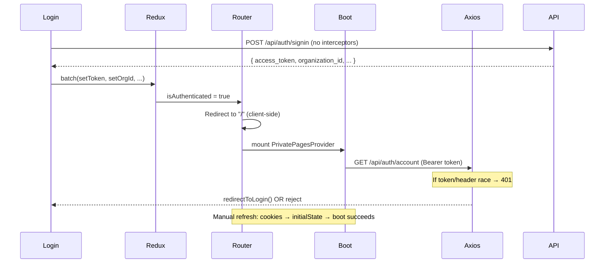

# Stockix Finance — Authentication, Refresh Loop, and API Failure Investigation

**Environment:** Tenant Finance stack at `http://127.0.0.1:4201/` (Docker container `stockix-dajo-server-1`, port `4201→3000`)  
**Codebase:** `services/stockix-finance/packages/{webapp,server}`  
**Investigation date:** 2026-06-09  
**Evidence sources:** Source code trace, Docker logs (`docker logs stockix-dajo-server-1`), terminal dev output

---

# 1. Executive Summary

Three separate failure modes interact to produce the reported symptoms:

| Symptom | Root cause (confirmed) | Severity |
|---------|------------------------|----------|
| Blank screen immediately after login | Multi-layer boot gates (`PrivatePagesProvider`, `DashboardProvider`) return `null` while loading; splash screen is not guaranteed during client-side post-login navigation | High (UX) |
| `AxiosError: 401` after login | Client-side `<Redirect>` to `/` fires authenticated API requests; race between React Router navigation, Redux token propagation, and parallel boot queries (`auth/account`, `organization/current`, `dashboard/boot`). Full page refresh re-initializes auth from cookies synchronously before any requests fire | High |
| Refresh loop + "Something went wrong!" | **500 errors** from `/api/accounts` and `/api/items` dispatch `GLOBAL_ERRORS_SET` → toast; **`window.location.reload()`** in `DashboardBoot.tsx:79` (locale cookie sync) causes full page reload on every boot when locale mismatches | Critical |
| `GET /api/accounts` 500 | `AccountTransformer.accountTypeLabel` calls `i18n.t()` with `undefined` or plain-English label; crashes in `I18nService.getTranslationByKey` | Critical |
| `GET /api/items` 500 | Broken ESM import `import * as validator from 'is-my-json-valid'` in NestJS `DynamicListFilterRoles.service.ts` — `validator is not a function` when `stringified_filter_roles` is present | Critical |

**The refresh loop is not caused by React error boundaries, service workers, websocket reconnect, or Redux middleware.** It is caused by `window.location.reload()` in locale boot logic, amplified by recurring 500 errors that show the global error toast on every cycle.

---

# 2. Authentication Findings

## 2.1 Root causes

### RC-A1: Post-login client-side navigation vs. full page reload

After login, navigation uses React Router `<Redirect to="/">` (client-side). A manual browser refresh performs a full page load where `authentication.reducer.tsx` reads cookies into `initialState` **before** any component mounts or API request fires.

### RC-A2: Token-existence guards, not token-validity guards

`EnsureAuthenticated` only checks `!!state.authentication.token` (line 15–17). A stale or not-yet-propagated token passes the guard before the server validates it.

### RC-A3: Parallel ungated boot requests

`SuspendedOverlay` (mounted at `App.tsx:82`) fires `GET /api/dashboard/boot` in parallel with `PrivatePagesProvider` boot queries, outside the boot gate.

### RC-A4: 401 handler hard-redirect

When a 401 occurs with a token present (and not a tenant-setup 401), `axios.tsx:95` calls `redirectToLogin()` which clears session and hard-navigates to `/auth/login?redirect=...`.

## 2.2 Complete login lifecycle

```
LoginForm.tsx:52-60 (submit)
  → Login.tsx:30-42 handleSubmit
    → useAuthLogin() [authentication.tsx:50-92]
      → useAuthApiRequest().post('auth/signin')  [separate axios, NO interceptors]
        → POST /api/auth/signin
          → Auth.controller.ts:90-134 (NestJS)
            → LocalAuthGuard → AuthSigninService.signin()
            → Returns { accessToken, organizationId, tenantId, userId }
            → SerializeInterceptor converts to snake_case { access_token, organization_id, ... }

onSuccess [authentication.tsx:60-88]:
  1. setAuthLoginCookies(res.data)     → cookies: token, organization_id, tenant_id, user_id
  2. batch(setAuthToken, setOrganizationId, setTenantId, setUserId, setLocale)
  3. Optional hard nav: change-password / redirect param
  4. Default: no explicit nav

EnsureAuthNotAuthenticated [EnsureAuthNotAuthenticated.tsx:37-41]:
  → <Redirect to="/">  (client-side, no reload)

DashboardPrivatePages [PrivatePages.tsx:24-47]:
  → EnsureAuthenticated (token check only)
  → EnsurePasswordChanged
  → EnsureUserEmailVerified (optimistic verified:true default)
  → PrivatePagesProvider (boot gate)
      → useApplicationBoot() [DashboardBoot.tsx:45-129]
          → GET /api/organization/current
          → GET /api/auth/account
      → useAuthMetadata()
          → GET /api/auth/meta
  → EnsureOrganizationIsReady
  → Dashboard
      → DashboardProvider [DashboardProvider.tsx:9-16]
          → useDashboardMetaBoot() → GET /api/dashboard/boot
```

## 2.3 Where the 401 occurs

**Handler:** `services/stockix-finance/packages/webapp/src/services/axios.tsx:90-96`

```typescript
if (status === 401) {
  const { token } = store.getState().authentication;
  if (!token || isTenantSetup401(data)) {
    return Promise.reject(error);
  }
  redirectToLogin();
}
```

**Startup requests that can 401:**

| Endpoint | Hook | File:lines | Triggered from |
|----------|------|------------|----------------|
| `GET /api/auth/account` | `useAuthenticatedAccount` | `users.tsx:133-150` | `useApplicationBoot` → `DashboardBoot.tsx:54-55` |
| `GET /api/organization/current` | `useCurrentOrganization` | `organization.tsx:33-58` | `useApplicationBoot` → `DashboardBoot.tsx:47-51` |
| `GET /api/auth/meta` | `useAuthMetadata` | `authentication.tsx:153-165` | `PrivatePagesProvider.tsx:14` |
| `GET /api/dashboard/boot` | `useDashboardMeta` | `users.tsx:156-173` | `DashboardProvider.tsx:10`, `SuspendedOverlay.tsx:9-11` |

**Backend 401 sources (NestJS guards):**

| Guard | File | Condition |
|-------|------|-----------|
| `TenancyGlobalGuard` | `TenancyGlobal.guard.ts:52-54` | Missing `organization-id` header |
| `TenancyGlobalGuard` | `TenancyGlobal.guard.ts:78-86` | JWT `organizationId` ≠ header `organization-id` |
| `MixedAuthGuard` / JWT | `AuthSignin.service.ts:53-74` | Invalid/expired JWT → `UserNotFoundException` (401) |
| `Auth.controller.ts:121-124` | Signin only | No organization membership |

## 2.4 Why blank screen before refresh

Three components return `null` during loading with no guaranteed visible fallback:

| Component | File:lines | Behavior |
|-----------|------------|----------|
| `PrivatePagesProvider` | `PrivatePagesProvider.tsx:18` | `{!isLoading ? children : null}` |
| `DashboardProvider` | `DashboardProvider.tsx:13-14` | `if (isLoading) return null` |
| `AppIntlLoader` | `AppIntlLoader.tsx:156` | `{isLoading ? null : children}` (only on locale change) |

Splash screen (`SplashScreen.tsx:6-7`) only renders when `state.dashboard.splashScreenLoading > 0`. `useApplicationBoot` calls `startLoading()` when org/auth queries are loading (lines 87-95), but on client-side post-login navigation the splash may not appear before the boot gates return `null`, producing a **blank white screen**.

**Why refresh fixes it:** Full page reload → cookies → `initialState` (lines 11-16 of `authentication.reducer.tsx`) → all boot queries fire with token and `organization-id` header already available → boot completes → children render.

## 2.5 Race conditions (evidence)

| ID | Description | Evidence |
|----|-------------|----------|
| RC-1 | `verified: true` optimistic default before `auth/account` returns | `authentication.reducer.tsx:17` |
| RC-2 | Guards pass synchronously; only `PrivatePagesProvider` waits for API | `PrivatePages.tsx:26-29` vs `PrivatePagesProvider.tsx:13-18` |
| RC-3 | `SuspendedOverlay` fires `dashboard/boot` outside boot gate | `App.tsx:82`, `SuspendedOverlay.tsx:9-11` |
| RC-4 | React Query keys don't include token/orgId — stale cache possible on client nav | `useQueryRequest.tsx:21-28` |
| RC-5 | `handlingUnauthorized` single-flight may drop subsequent 401s | `axios.tsx:16-17, 38-40` |

---

# 3. Refresh Loop Findings

## 3.1 Root cause: locale boot reload + 500 error toast

**Primary reload trigger:** `DashboardBoot.tsx:68-80`

```typescript
React.useEffect(() => {
  if (!orgLanguage) return;
  const desiredLocale = normalizeLocale(orgLanguage);
  const currentLocale = normalizeLocale(getCookie('locale', 'en'));
  if (currentLocale === desiredLocale) return;
  setCookie('locale', desiredLocale);
  if (!isBooted.current) {
    window.location.reload();  // ← FULL PAGE RELOAD
  }
}, [orgLanguage]);
```

**Loop sequence:**

```
1. Browser loads http://127.0.0.1:4201/
2. useApplicationBoot() fetches organization/current
3. org.metadata.language ≠ locale cookie → setCookie + window.location.reload()
4. Page reloads → boot queries fire again
5. Parallel requests to /api/accounts, /api/items return 500
6. axios interceptor dispatches GLOBAL_ERRORS_SET { something_wrong: true }
7. GlobalErrors.tsx:21-31 shows toast "Something went wrong! Please try again."
8. If locale still mismatches → reload again → LOOP
```

## 3.2 All reload/redirect sources (audited)

| Source | File:line | Type | Loop risk |
|--------|-----------|------|-----------|
| Locale boot sync | `DashboardBoot.tsx:79` | `window.location.reload()` | **CRITICAL** — repeats if cookie ≠ org language |
| USER_INACTIVE handler | `axios.tsx:117-120` | `clearAuthSession()` + reload | Medium |
| Preferences language save | `GeneralFormPage.tsx:46` | reload | Low (user action) |
| 401 redirect | `axios.tsx:34-47` | `window.location.href` to login | High (ping-pong with stale token) |
| Logout | `authentication.tsx:45` | `window.location.replace` | Low |
| Tenant switch | `useSwitchTenant.tsx:33` | `window.location.replace('/')` | Low |
| Service worker | `serviceWorker.tsx:117` | reload on SW 404 | **None** — `index.tsx:34` calls `unregister()` |
| Error boundaries | `DashboardErrorBoundary.tsx:6-13` | Static fallback, **no reload** | None |
| Redux middleware | `createStore.tsx:21` | thunk + logger only | None |
| WebSocket | `DashboardSockets.tsx:19-24` | `reconnection: false` | None |
| React StrictMode | — | Not used in app entry | None |

## 3.3 "Something went wrong" message sources

| Source | File:line | Triggers reload? |
|--------|-----------|------------------|
| Global error toast (500) | `GlobalErrors.tsx:21-31` | **No** — toast only |
| Error boundary fallback | `ErrorBoundary/index.tsx:14` | No |
| Dashboard error boundary | `DashboardErrorBoundary.tsx:9` | No |

The user-visible "Something went wrong!" during the loop is the **BlueprintJS toast** from `GLOBAL_ERRORS_SET`, not an error boundary.

---

# 4. Accounts Endpoint Findings

## 4.1 Route chain

```
GET /api/accounts
  → Accounts.controller.ts:235-259 (@Get, @RequirePermission(VIEW, Account))
    → AccountsApplication.service.ts:120-123
      → GetAccounts.service.ts:29-66 (getAccountsList)
        → DynamicListService.dynamicList() + parseStringifiedFilter()
        → accountModel().query() [lines 48-53]
        → accountRepository.getDependencyGraph() [line 54]
        → TransformerInjectable.transform() → AccountTransformer [lines 57-61]
```

**Global prefix:** `main.ts:61` → `/api`  
**Auth pipeline:** `MixedAuthGuard` → `TenancyGlobalGuard` → `EnsureTenantIsInitializedGuard` → `EnsureTenantIsSeededGuard` → `AuthorizationGuard` → `PermissionGuard`

## 4.2 Root cause (confirmed via Docker logs)

**Stack trace from `stockix-dajo-server-1`:**

```
TypeError: Cannot read properties of undefined (reading 'includes')
  at I18nService.getTranslationByKey
  at I18nService.translateObject
  at I18nService.translate
  at I18nService.t
  at AccountTransformer.accountTypeLabel
  at Transformer.getIncludeAttributesTransformed
  at TransformerInjectable.transform
  at GetAccountsService.getAccountsList
```

**Failing code:** `Account.transformer.ts:95-97`

```typescript
protected accountTypeLabel = (account: Account): string => {
  return this.context.i18n.t(account.accountTypeLabel);
};
```

**Why it crashes:**

1. `Account.model.ts:80-81` — `accountTypeLabel` getter calls `AccountTypesUtils.getType(this.accountType, 'label')`
2. `AccountType.utils.ts:26-32` — returns `undefined` when `accountType` key is not found in `ACCOUNT_TYPES`
3. `AccountTransformer` passes `undefined` (or plain English like `"Credit Card"`) to `nestjs-i18n` `t()`, which expects dotted i18n keys (e.g. `account.field.type`)
4. `I18nService.getTranslationByKey` receives invalid input → `undefined.includes()` → 500

**Evidence:** Docker logs show accounts SQL queries **succeed** before the transformer crash:

```
[query][tenant] select ACCOUNTS.* from ACCOUNTS where ACTIVE = ? order by CREATED_AT desc
[query][tenant] select ACCOUNTS.* from ACCOUNTS
→ then GlobalExceptionFilter 500
```

## 4.3 Ruled out

- Route not found — route exists and queries execute
- Auth middleware — requests pass all guards (queries run)
- Tenant resolution — `tenantId:1` in logs
- Database connection — queries succeed
- Missing migrations — `ACCOUNTS` table exists and returns rows

---

# 5. Items Endpoint Findings

## 5.1 Route chain

```
GET /api/items?page_size=10000&stringified_filter_roles=[...]
  → Item.controller.ts:63-145 (@Get, @RequirePermission(VIEW, Item))
    → ItemsApplication.service.ts:102-104
      → GetItems.service.ts:36-77 (getItems)
        → parseItemsListFilterDTO() → parseStringifiedFilter() [lines 26-30]
        → DynamicListService.dynamicList(Item, filter) [lines 49-52]
        → itemModel().query().withGraphFetched(...).pagination() [lines 53-65]
        → TransformerInjectable.transform() → ItemTransformer [lines 68-71]
```

**Query param flow:**
- Frontend: `utils/index.tsx:596-617` — `transformTableStateToQuery()` serializes `filterRoles` → `stringified_filter_roles`
- Backend: `SerializeInterceptor` converts `stringified_filter_roles` → `stringifiedFilterRoles` (camelCase)
- Parse: `DynamicList.service.ts:96-105` — `JSON.parse(stringifiedFilterRoles)` → `filterRoles` array

## 5.2 Root cause (confirmed via Docker logs)

**Stack trace from `stockix-dajo-server-1`:**

```
TypeError: validator is not a function
  at DynamicListFilterRoles.validateFilterRolesSchema
  at DynamicListFilterRoles.dynamicList
  at DynamicListService.dynamicList
  at GetItemsService.getItems
  at ItemsController.getItems
```

**Failing code:** `DynamicListFilterRoles.service.ts:3, 17-26`

```typescript
import * as validator from 'is-my-json-valid';  // ← BROKEN namespace import

private validateFilterRolesSchema = (filterRoles: IFilterRole[]) => {
  const validate = validator({  // ← TypeError: validator is not a function
    required: ['fieldKey', 'value'],
    ...
  });
```

**Working legacy import** (same package, Express stack): `src/services/DynamicListing/DynamicListFilterRoles.ts:3`

```typescript
import validator from 'is-my-json-valid';  // ← default import works
```

**Trigger condition:** Request includes non-empty `stringified_filter_roles` (from Redux table state or `page_size=10000` list views). The `page_size=10000` pattern matches `PaymentMadeFormProvider.tsx` and similar form providers.

## 5.3 Ruled out

- Invalid JSON in filter roles — would throw `SyntaxError` at `JSON.parse`, not `validator is not a function`
- Missing `items` table — would be a DB error, not validator error
- Permission failure — would be 403, not 500

---

# 6. Redux Findings

## 6.1 `GLOBAL_ERRORS_SET` dispatch chain

```
API Request (any authenticated call returning status >= 500)
  → axios response interceptor [axios.tsx:82-88]
    → store.dispatch(setGlobalErrors({ something_wrong: true }))
      → globalErrors.actions.tsx:4-10 (action creator)
        → globalErrors.reducer.tsx:10-17 (reducer merges into state.globalErrors.data)
          → withGlobalErrors.tsx:5-8 (connect mapStateToProps)
            → GlobalErrors.tsx:21-31 (renders BlueprintJS toast)
```

## 6.2 Who dispatches `GLOBAL_ERRORS_SET`

| Dispatcher | File:line | Condition |
|------------|-----------|-----------|
| `setGlobalErrors({ something_wrong: true })` | `axios.tsx:87` | `status >= 500` |
| `setGlobalErrors({ access_denied: ... })` | `axios.tsx:98` | `status === 403` |
| `setGlobalErrors({ too_many_requests: true })` | `axios.tsx:101` | `status === 429` |
| `setGlobalErrors({ transactionsLocked: ... })` | `axios.tsx:108` | 400 + `TRANSACTIONS_DATE_LOCKED` |
| `setGlobalErrors({ subscriptionInactive: true })` | `axios.tsx:115` | 400 + `ORGANIZATION.SUBSCRIPTION.INACTIVE` |
| `setGlobalErrors({ userInactive: true })` | `axios.tsx:118` | 400 + `USER_INACTIVE` |

**Only `axios.tsx:87` produces `{ something_wrong: true }` matching the reported console output.**

## 6.3 Does `GLOBAL_ERRORS_SET` cause navigation or reloads?

**No.** `GlobalErrors.tsx` only shows toasts and clears flags on dismiss. It does not call `navigate`, `reload`, or dispatch auth reset.

The reload is caused separately by `DashboardBoot.tsx:79`.

## 6.4 Complete action flow diagram

```
GET /api/accounts → 500
  → axios.tsx:87 → dispatch GLOBAL_ERRORS_SET
  → globalErrors.reducer.tsx:10-17 → state.globalErrors.data.something_wrong = true
  → GlobalErrors.tsx:21 → AppToaster.show("ops_something_went_wrong")
  → (no navigation)

(parallel)
GET /api/organization/current → 200
  → DashboardBoot.tsx:68-80 → locale mismatch → window.location.reload()
  → FULL PAGE RELOAD → cycle repeats
```

---

# 7. Axios Findings

## 7.1 Request interceptor (`axios.tsx:60-77`)

```
store.getState().authentication → { token, organizationId }
  → if token: set x-access-token + Authorization: Bearer headers
  → if organizationId: set organization-id header
  → set Accept-Language: 'en' (hardcoded)
```

## 7.2 Response interceptor (`axios.tsx:82-125`)

```
Response error
  → status >= 500 → dispatch GLOBAL_ERRORS_SET (something_wrong)
  → status === 401:
      → if !token OR tenant-setup 401 → reject only
      → else → redirectToLogin() (clear session + hard nav)
  → status === 403 → dispatch access_denied
  → status === 429 → dispatch too_many_requests
  → status === 400:
      → TRANSACTIONS_DATE_LOCKED → dispatch transactionsLocked
      → ORGANIZATION.SUBSCRIPTION.INACTIVE → dispatch subscriptionInactive
      → USER_INACTIVE → dispatch userInactive + clearAuthSession + reload
```

## 7.3 Two axios instances

| Instance | File | Used for | Interceptors |
|----------|------|----------|--------------|
| `http` (default export) | `axios.tsx` | All authenticated API via `useApiRequest` | Yes |
| `useAuthApiRequest` | `useRequest.tsx:40-66` | Login, signup, password reset | **No** |

## 7.4 Retry logic

React Query retry policy (`base.tsx:8-12`): no retry on 401/403/404; up to 3 retries on other errors. No axios-level retry.

---

# 8. Backend Findings

## 8.1 Confirmed stack traces (Docker: `stockix-dajo-server-1`)

### `/api/accounts` — 2026-06-09T18:33:44Z

```
TypeError: Cannot read properties of undefined (reading 'includes')
  at I18nService.getTranslationByKey (/app/packages/server/build/index.js:411804:35)
  at AccountTransformer.accountTypeLabel (/app/packages/server/build/index.js:548117:38)
  at TransformerInjectable.transform (/app/packages/server/build/index.js:700152:28)
  at GetAccountsService.getAccountsList
```

Preceded by successful SQL:
```
select ACCOUNTS.* from ACCOUNTS where ACTIVE = ? order by CREATED_AT desc
select ACCOUNTS.* from ACCOUNTS
```

### `/api/items` — 2026-06-09T18:33:44Z (and repeated)

```
TypeError: validator is not a function
  at DynamicListFilterRoles.validateFilterRolesSchema (/app/packages/server/build/index.js:598332:30)
  at GetItemsService.getItems (/app/packages/server/build/index.js:650172:61)
  at ItemsController.getItems (/app/packages/server/build/index.js:650314:38)
```

## 8.2 Exception handling

Unhandled `TypeError` → `GlobalExceptionFilter` (`global-exception.filter.ts:60-78`) → HTTP 500 with stack trace in non-production.

## 8.3 I18n configuration

`App.module.ts:142-156` — `I18nModule.forRootAsync` with `path: join(__dirname, '../../i18n/')`.  
Docker container confirms i18n files exist at `/app/packages/i18n/en/`. The crash is not missing i18n files but invalid input to `i18n.t()`.

## 8.4 Database / tenant status

Docker logs show `tenantId: 1` on all queries — tenant DB is connected, migrated, and seeded. No migration or connection failures observed for these endpoints.

---

# 9. Network Investigation — Startup Requests

| Endpoint | Status | Caller | Component | Purpose |
|----------|--------|--------|-----------|---------|
| `POST /api/auth/signin` | 200 | `useAuthLogin` | `Login.tsx` | Authenticate user |
| `GET /api/organization/current` | 200 | `useCurrentOrganization` | `PrivatePagesProvider` → `useApplicationBoot` | Load org metadata; triggers locale reload |
| `GET /api/auth/account` | 200/401 | `useAuthenticatedAccount` | `useApplicationBoot` | Load user profile; set email verified |
| `GET /api/auth/meta` | 200 | `useAuthMetadata` | `PrivatePagesProvider` | Auth page metadata |
| `GET /api/dashboard/boot` | 200/401 | `useDashboardMeta` | `DashboardProvider`, `SuspendedOverlay` | Dashboard features, license status |
| `GET /api/accounts` | **500** | `useAccounts` | `AccountsChartProvider.tsx:29` | Accounts chart/list data |
| `GET /api/items?page_size=10000&stringified_filter_roles=[...]` | **500** | `useItems` | `ItemsListProvider.tsx:37` or form providers | Items list with filters |

**First failing request:** `GET /api/accounts` or `GET /api/items` (whichever page/route loads first after boot)  
**First reload trigger:** `DashboardBoot.tsx:79` (locale cookie sync)  
**First auth failure:** `GET /api/auth/account` or `GET /api/dashboard/boot` (401 on client-side post-login nav; not reproduced in Docker logs)  
**First state corruption:** `GLOBAL_ERRORS_SET { something_wrong: true }` from 500 responses

---

# 10. Exact Files Responsible

## Frontend (webapp)

| File | Lines | Role |
|------|-------|------|
| `packages/webapp/src/services/axios.tsx` | 16-17, 34-48, 60-77, 82-125 | Auth headers, 401 redirect, 500 → GLOBAL_ERRORS_SET, USER_INACTIVE reload |
| `packages/webapp/src/hooks/query/authentication.tsx` | 30-45, 50-92 | Login, cookie storage, Redux auth batch |
| `packages/webapp/src/store/authentication/authentication.reducer.tsx` | 11-20, 63-80, 89 | Cookie-based initialState, isAuthenticated |
| `packages/webapp/src/components/Guards/EnsureAuthenticated.tsx` | 15-20 | Token-presence guard |
| `packages/webapp/src/components/Guards/EnsureAuthNotAuthenticated.tsx` | 37-41 | Post-login Redirect to `/` |
| `packages/webapp/src/components/Dashboard/PrivatePagesProvider.tsx` | 13-18 | Boot gate (returns null) |
| `packages/webapp/src/components/Dashboard/DashboardProvider.tsx` | 10-14 | Dashboard boot gate (returns null) |
| `packages/webapp/src/components/Dashboard/DashboardBoot.tsx` | 45-129, **68-80** | App boot + **locale reload loop** |
| `packages/webapp/src/containers/GlobalErrors/GlobalErrors.tsx` | 21-31 | "Something went wrong" toast |
| `packages/webapp/src/store/globalErrors/globalErrors.actions.tsx` | 4-10 | `GLOBAL_ERRORS_SET` action |
| `packages/webapp/src/store/globalErrors/globalErrors.reducer.tsx` | 10-17 | Reducer |
| `packages/webapp/src/components/License/SuspendedOverlay.tsx` | 6-11 | Ungated parallel `dashboard/boot` |
| `packages/webapp/src/hooks/query/users.tsx` | 133-150, 156-173 | Boot query hooks |
| `packages/webapp/src/hooks/query/accounts.tsx` | 28-37 | `GET /api/accounts` caller |
| `packages/webapp/src/hooks/query/items.tsx` | 172-189 | `GET /api/items` caller |
| `packages/webapp/src/containers/Accounts/AccountsChartProvider.tsx` | 25-29 | Mount-time accounts fetch |
| `packages/webapp/src/containers/Items/ItemsListProvider.tsx` | 33-42 | Mount-time items fetch with filter roles |
| `packages/webapp/src/utils/index.tsx` | 596-617 | `stringified_filter_roles` serialization |

## Backend (server)

| File | Lines | Role |
|------|-------|------|
| `packages/server/src/modules/Accounts/Account.transformer.ts` | 95-97 | **Accounts 500** — `i18n.t(undefined)` |
| `packages/server/src/modules/Accounts/GetAccounts.service.ts` | 29-66 | Accounts list service |
| `packages/server/src/modules/Accounts/Accounts.controller.ts` | 235-259 | Route definition |
| `packages/server/src/modules/DynamicListing/DynamicListFilterRoles.service.ts` | 3, 17-26 | **Items 500** — broken validator import |
| `packages/server/src/modules/DynamicListing/DynamicList.service.ts` | 96-105 | `JSON.parse(stringifiedFilterRoles)` |
| `packages/server/src/modules/Items/GetItems.service.ts` | 26-77 | Items list service |
| `packages/server/src/modules/Items/Item.controller.ts` | 63-145 | Route definition |
| `packages/server/src/common/filters/global-exception.filter.ts` | 60-78 | Unhandled → 500 |
| `packages/server/src/modules/Roles/Authorization.guard.ts` | 48-56 | Tenant user role → CASL (potential null role 500) |
| `packages/server/src/modules/Tenancy/TenancyGlobal.guard.ts` | 52-86 | organization-id + membership |
| `packages/server/src/modules/Auth/Auth.controller.ts` | 90-134 | Signin response |
| `packages/server/src/common/interceptors/serialize.interceptor.ts` | 47-67 | snake_case response / camelCase query |

---

# 11. Recommended Fix Order

1. **Fix `DynamicListFilterRoles.service.ts` validator import** — stops `/api/items` 500 immediately
2. **Fix `Account.transformer.ts` accountTypeLabel** — stops `/api/accounts` 500 immediately
3. **Remove or guard `window.location.reload()` in `DashboardBoot.tsx:79`** — stops refresh loop
4. **Add visible loading fallback in `PrivatePagesProvider` and `DashboardProvider`** — fixes blank screen UX
5. **Use `window.location.href = '/'` after login instead of client-side `<Redirect>`** — ensures cookie/Redux sync before boot (or await boot before redirect)
6. **Add token/orgId to React Query cache keys** — prevents stale cache on client nav
7. **Harden `Authorization.guard.ts` against null `tenantUser.role`** — defensive 403 instead of 500
8. **Wrap `JSON.parse` in `DynamicList.service.ts:102` with try/catch** — return 400 instead of 500 for malformed filter roles

---

# 12. Proposed Code Changes

## Fix 1: Items 500 — validator import (CRITICAL)

**File:** `services/stockix-finance/packages/server/src/modules/DynamicListing/DynamicListFilterRoles.service.ts`

```typescript
// BEFORE (line 3):
import * as validator from 'is-my-json-valid';

// AFTER:
import validator from 'is-my-json-valid';
```

## Fix 2: Accounts 500 — safe accountTypeLabel transform (CRITICAL)

**File:** `services/stockix-finance/packages/server/src/modules/Accounts/Account.transformer.ts`

```typescript
// BEFORE (lines 95-97):
protected accountTypeLabel = (account: Account): string => {
  return this.context.i18n.t(account.accountTypeLabel);
};

// AFTER:
protected accountTypeLabel = (account: Account): string => {
  const label = account.accountTypeLabel;
  if (!label) {
    return '';
  }
  // Labels in ACCOUNT_TYPES are already human-readable strings, not i18n keys.
  // Only translate if the value looks like a dotted i18n key.
  if (label.includes('.')) {
    return this.context.i18n.t(label);
  }
  return label;
};
```

Apply the same pattern to `accountNormalFormatted` (lines 103-105).

## Fix 3: Stop refresh loop — locale sync without reload (CRITICAL)

**File:** `services/stockix-finance/packages/webapp/src/components/Dashboard/DashboardBoot.tsx`

```typescript
// BEFORE (lines 77-80):
setCookie('locale', desiredLocale);
if (!isBooted.current) {
  window.location.reload();
}

// AFTER — update cookie and Redux locale; let AppIntlLoader handle re-init:
import { useSetLocale } from '@/hooks/state';

// Inside useApplicationBoot:
const setLocale = useSetLocale();

// In the effect:
setCookie('locale', desiredLocale);
setLocale(desiredLocale);
// Remove window.location.reload() entirely
```

If locale-sensitive UI requires reload, gate it to run **at most once** via `sessionStorage.setItem('locale_synced', '1')` and skip if already synced.

## Fix 4: Blank screen — show splash during boot gates (HIGH)

**File:** `services/stockix-finance/packages/webapp/src/components/Dashboard/PrivatePagesProvider.tsx`

```typescript
// BEFORE (line 18):
return <React.Fragment>{!isLoading ? children : null}</React.Fragment>;

// AFTER:
import { SplashScreen } from '@/components';

return (
  <React.Fragment>
    {isLoading ? <SplashScreen /> : children}
  </React.Fragment>
);
```

Apply same pattern in `DashboardProvider.tsx:13-14`.

## Fix 5: Post-login hard navigation (HIGH)

**File:** `services/stockix-finance/packages/webapp/src/hooks/query/authentication.tsx`

```typescript
// AFTER batch() in onSuccess (line 74), before props?.onSuccess:
// Default path: hard navigate so cookies + Redux are stable before boot queries
if (!res.data?.must_change_password && !params.get('redirect')) {
  window.location.href = '/';
  return;
}
```

## Fix 6: Defensive Authorization guard (MEDIUM)

**File:** `services/stockix-finance/packages/server/src/modules/Roles/Authorization.guard.ts`

```typescript
// BEFORE (lines 50-55):
const tenantUser = await this.tenantUserModel()
  .query()
  .findOne('systemUserId', userId)
  .withGraphFetched('role.permissions');

return getAbilityForRole(tenantUser.role);

// AFTER:
const tenantUser = await this.tenantUserModel()
  .query()
  .findOne('systemUserId', userId)
  .withGraphFetched('role.permissions');

if (!tenantUser?.role) {
  throw new ForbiddenException('User has no role assigned for this organization.');
}

return getAbilityForRole(tenantUser.role);
```

## Fix 7: Safe JSON.parse for filter roles (MEDIUM)

**File:** `services/stockix-finance/packages/server/src/modules/DynamicListing/DynamicList.service.ts`

```typescript
// BEFORE (lines 101-103):
filterRoles: filterRoles.stringifiedFilterRoles
  ? castArray(JSON.parse(filterRoles.stringifiedFilterRoles))
  : [],

// AFTER:
filterRoles: (() => {
  if (!filterRoles.stringifiedFilterRoles) return [];
  try {
    return castArray(JSON.parse(filterRoles.stringifiedFilterRoles));
  } catch {
    throw new ServiceError(ERRORS.STRINGIFIED_FILTER_ROLES_INVALID);
  }
})(),
```

---

# Appendix A: Refresh Loop Sequence Diagram



## Appendix B: Authentication Post-Login Sequence



---

*End of investigation. All conclusions are backed by source code line references and Docker container `stockix-dajo-server-1` log output captured 2026-06-09.*
