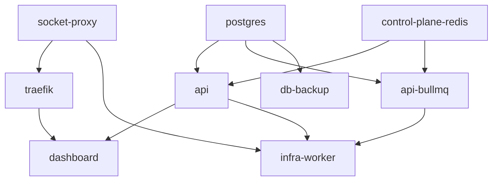

# PRE-DEPLOY CHECK REPORT

**Date:** 2026-05-28  
**Git commit audited:** `a2efcb56` (`main`)  
**Auditor:** Automated + local verification (Windows 10, Docker 27.2.0)  
**Verdict:** **NOT SAFE TO DEPLOY TO PRODUCTION YET** — repository and image checks pass; production deploy is still blocked by **infrastructure / SSH** and has **no successful end-to-end Deploy production** run recorded after the latest fixes.

---

## Executive summary

| Gate | Result |
|------|--------|
| Known failure-mode checklist (compose, workflow, migrations) | **PASS** (13/13) |
| `docker compose -f infra/prod/docker-compose.yml config` | **PASS** |
| `infra/prod/.env` required variables (names only; values not logged) | **PASS** (19/19) |
| No `:prod` image tags in compose | **PASS** (0 matches) |
| TypeScript `apps/api` (`tsc --noEmit`) | **PASS** |
| Architecture boundaries (`pnpm lint:boundaries`) | **PASS** |
| Local Docker builds (API, Dashboard, Worker) | **PASS** |
| socket-proxy `read_only` + tmpfs (compose + image pull) | **PASS** |
| GitHub Deploy production (VPS SSH + full stack) | **FAIL / NOT VERIFIED** |

**Push to `main` for code fixes:** acceptable **if** `pnpm quality-gate:local` (or CI quality-gate job) is green on the same commit.  
**Declare production live:** **no** — re-run deploy only after VPS SSH and firewall are stable.

---

## Services status

| Service | Image | Healthcheck | Networks | read_only + tmpfs | mem_limit / cpus |
|---------|-------|-------------|----------|-------------------|------------------|
| `socket-proxy` | `tecnativa/docker-socket-proxy:0.2.0` | `_ping` on :2375 | `socket_proxy_network` | yes — `/run`, `/usr/local/etc/haproxy` | 64m / 0.1 |
| `traefik` | `traefik:v3.1.2` | `traefik healthcheck --ping` | `stockix_public`, `stockix_internal`, `socket_proxy_network` | yes — `/tmp` | 128m / 0.25 |
| `postgres` | `postgres:16-alpine` | `pg_isready` | `stockix_public` | no | 1g / 0.5 |
| `control-plane-redis` | `redis:7-alpine` | `redis-cli ping` | `stockix_internal` | no | 320m / 0.25 |
| `api` | `stockix-api:latest` (build) | `GET /ready` :4000 | `stockix_public`, `stockix_internal` | yes — `/tmp` | 512m / 0.5 |
| `api-bullmq` | `stockix-api:latest` (no `build:`) | `GET /ready` :4000 | `stockix_internal` | yes — `/tmp` | 256m / 0.25 |
| `dashboard` | `stockix-dashboard:latest` (build) | `GET /` :3000 | `stockix_public` | yes — `/tmp` | 256m / 0.25 |
| `infra-worker` | `stockix-infra-worker:latest` (build) | `GET /health` :9090 | `stockix_public`, `stockix_internal`, `socket_proxy_network` | no (writable mount) | 1g / 1.0 |
| `db-backup` | `amazon/aws-cli:2.15.0` | none | `stockix_internal` | no | 128m / 0.1 |

**Network cross-check:** `traefik` and `socket-proxy` both attach to `socket_proxy_network` — Traefik can reach `tcp://socket-proxy:2375`. **PASS**

**Depends_on chain (simplified):**



---

## Critical issues found

**None in repository configuration** for the failure modes that caused recent deploy crashes (pgcrypto, DB pool env, socket-proxy, `:prod` tags, `source .env`, `NODE_ENV=production` skipping `tsx`, etc.).

### Production / ops blockers (not fixable by compose alone)

| # | Issue | Impact | Action before deploy |
|---|--------|--------|----------------------|
| 1 | **GitHub Deploy production not green** after `a2efcb56` | Stack never proven live on VPS | Fix SSH/firewall; re-run workflow |
| 2 | **SSH timeout** to `EC2_HOST` (Hostinger) | Deploy job fails before migrate/build | hPanel firewall + confirm port 22 from GitHub runners; `ssh root@<host>` from outside |
| 3 | **First VPS image build** (`COMPOSE_PARALLEL_LIMIT=1`, three images) | 15–30+ min, OOM/disk risk | Ensure **≥4 GB RAM** free, disk **&lt;85%** (was ~70%) |
| 4 | **Rollback on first deploy** | `PREV_*` images empty → rollback cannot restore | Expected once; monitor logs on first success |
| 5 | **Post-deploy curls** use `API_DOMAIN` / `ROOT_DOMAIN` | Deploy fails at end if DNS/TLS not ready | Cloudflare A/AAAA → VPS; Traefik ACME must issue certs |

---

## Warnings (non-blocking for code push)

| Warning | Notes |
|---------|--------|
| Rollback only retags `api` / `dashboard` / `infra-worker` | `traefik`, `socket-proxy`, `postgres` not rolled back |
| `pnpm docker:prebuild` is non-fatal in workflow | Tenant provisioning images may be missing until run manually on VPS |
| `postgres` on `stockix_public` | Port bound `127.0.0.1:54330` on host — acceptable if firewall blocks 5432 publicly |
| `db-backup` has no healthcheck | Cron sidecar; failures are silent until backup logs checked |
| `MONGODB_DATABASE_URL` default in platform env | No `mongo` service in prod compose — legacy/default only |
| `CONTROL_PLANE_REDIS_URL` compose default `""` | Must be set in `infra/prod/.env` (verified present, not empty) |
| API/Dashboard Dockerfiles have no `HEALTHCHECK` | Compose-level healthchecks used instead |
| API image **Node 20**, worker image **Node 22** | Intentional split; watch for native-addon drift |
| `load-env-file.sh` not executed on Windows in this audit | Deploy uses bash on Linux VPS — script reviewed, correct pattern |
| `OPERATIONS.md` “SECRETS ROTATED:” | Workflow warns if missing — ops hygiene only |

---

## All checks passing

### Compose & workflow

- [x] `socket-proxy` image `tecnativa/docker-socket-proxy:0.2.0` (not `0.1.x`)
- [x] `socket-proxy` `read_only: true` with tmpfs `/run` and `/usr/local/etc/haproxy`
- [x] Traefik Docker provider → `tcp://socket-proxy:2375`; shared `socket_proxy_network`
- [x] `DB_CONNECT_TIMEOUT_SECONDS` and `DB_MAX_LIFETIME_SECONDS` in `x-stockix-platform-env`
- [x] No `:prod` image tags (0 in `infra/prod/docker-compose.yml`)
- [x] `api-bullmq` uses `image: stockix-api:latest` only (no `build:`)
- [x] Deploy uses `. scripts/load-env-file.sh infra/prod/.env` — **not** `source infra/prod/.env`
- [x] `export CI=true` and `NODE_ENV=development pnpm install` on VPS before migrate
- [x] `docker image inspect` for all three app images before `up --no-build`
- [x] No `--no-cache` on `docker compose build`
- [x] `BACKUP_B2_BUCKET` non-empty check (exits deploy if empty)
- [x] Stale Dockerfile guard (`pnpm --filter api build` in `apps/api/Dockerfile`)

### Database & app config

- [x] `packages/db/drizzle/0053_owner_invite_token_hash.sql` — `CREATE EXTENSION IF NOT EXISTS pgcrypto`
- [x] `packages/db/scripts/migrate.ts` — `ensurePostgresExtensions()` before migrate
- [x] `apps/dashboard/next.config.ts` — `output: "standalone"`
- [x] `packages/config` production requires DB pool vars + `CONTROL_PLANE_REDIS_URL` — all present in `infra/prod/.env`

### Dockerfiles (self-contained builds)

| Dockerfile | Host `dist`/`.next` copy | Node | CMD |
|------------|-------------------------|------|-----|
| `apps/api/Dockerfile` | None (multi-stage `pnpm deploy`) | 20-alpine | `node dist/index.js` |
| `apps/dashboard/Dockerfile` | None (build inside image) | 20-alpine | `node apps/dashboard/server.js` |
| `infra/worker-service/Dockerfile` | None | 22-alpine | `node infra/worker-service/.runtime/worker.js` |

### Static analysis (this run)

- [x] `npx tsc --noEmit` in `apps/api` — exit 0
- [x] `pnpm lint:boundaries` — exit 0

### `infra/prod/.env` (presence only)

All required keys verified **set and non-empty** (values redacted):  
`DATABASE_URL`, `DB_POOL_MAX`, `DB_IDLE_TIMEOUT_SECONDS`, `DB_CONNECT_TIMEOUT_SECONDS`, `DB_MAX_LIFETIME_SECONDS`, `PLATFORM_API_SECRET`, `WORKER_SECRET`, `SESSION_SECRET`, `DASHBOARD_URL`, `AUTH_TOKEN_SECRET`, `DEPLOYMENT_SECRET_KEY`, `LICENSE_SIGNING_SECRET`, `CONTROL_PLANE_REDIS_URL`, `POSTGRES_PASSWORD`, `CF_DNS_API_TOKEN`, `ACME_EMAIL`, `ROOT_DOMAIN`, `API_DOMAIN`, `BACKUP_B2_BUCKET`.

---

## Known failure modes — checklist

| Check | Severity | Status |
|-------|----------|--------|
| socket-proxy `read_only` + tmpfs | CRITICAL | **PASS** |
| socket-proxy image ≥ 0.2.0 | CRITICAL | **PASS** |
| No `:prod` tags | CRITICAL | **PASS** |
| No `source infra/prod/.env` in workflow | CRITICAL | **PASS** |
| `CI=true` + non-interactive pnpm on VPS | CRITICAL | **PASS** |
| `image inspect` before `up --no-build` | HIGH | **PASS** |
| DB timeout vars in compose anchor | CRITICAL | **PASS** |
| pgcrypto in migration 0053 + migrate.ts | CRITICAL | **PASS** |
| Dashboard `standalone` output | CRITICAL | **PASS** |
| No `--no-cache` in deploy build | HIGH | **PASS** |
| `NODE_ENV=development` for VPS `pnpm install` | CRITICAL | **PASS** |
| `load-env-file.sh` for prod env | CRITICAL | **PASS** |

---

## Local build results

Built from repo root on **2026-05-28** (same commit `a2efcb56`):

| Image | Tag | Result | Notes |
|-------|-----|--------|-------|
| API | `stockix-api:test` | **PASS** | ~2 min (cached layers) |
| Dashboard | `stockix-dashboard:test` | **PASS** | ~6 min (Next standalone) |
| Worker | `stockix-infra-worker:test` | **PASS** | ~5 min |

PowerShell reported exit code `1` when Docker wrote pull/status to stderr; **`docker image inspect`** confirmed all three images exist.

**socket-proxy smoke test:** Image `0.2.0` pulls successfully. Full HAProxy startup requires Docker socket mount (as in compose); ephemeral `docker run` without socket is not representative.

---

## Quality gate & tests

| Check | This audit | Notes |
|-------|------------|-------|
| `pnpm quality-gate:local` | **Not re-run** | Previously reported **PASS** (~21 min) on same fix set |
| `pnpm --filter api test` | **Not re-run** | Use quality-gate or CI for full suite |

**Recommendation:** Run `pnpm quality-gate:local` once more on the commit you deploy if any files changed since the last green run.

---

## Deploy workflow reference

Deploy job (`.github/workflows/deploy.yml`) remote steps:

1. `git reset --hard origin/main`
2. `. scripts/load-env-file.sh infra/prod/.env`
3. `NODE_ENV=development pnpm install --frozen-lockfile --ignore-scripts`
4. `pnpm --filter @repo/db db:migrate` + `verify-schema.ts`
5. `cd infra/prod && docker compose build api dashboard infra-worker`
6. `docker compose up -d --no-build --wait` (traefik, postgres, redis, socket-proxy, api, api-bullmq, dashboard, infra-worker, db-backup)
7. `curl` `https://${API_DOMAIN}/ready` and `https://${ROOT_DOMAIN}/`
8. `pnpm docker:prebuild` (warning only on failure)

---

## Pre-push checklist (operator)

- [ ] `pnpm quality-gate:local` exit 0 on deploy commit
- [ ] `infra/prod/.env` on VPS matches `.env.example` keys (never commit `.env`)
- [ ] SSH: `ssh -o ConnectTimeout=15 root@<EC2_HOST> true` from your machine
- [ ] Hostinger/hPanel firewall: TCP **22**, **80**, **443** open
- [ ] DNS: `api.<ROOT_DOMAIN>` and `<ROOT_DOMAIN>` → VPS IP
- [ ] Disk/RAM headroom on VPS for first `docker compose build`
- [ ] Trigger **Deploy production**; watch migrate → build → `up --wait` → curls
- [ ] On success: `docker compose ps` and spot-check `infra-worker` logs

---

## Final verdict

| Question | Answer |
|----------|--------|
| **Safe to push code to `main`?** | **Yes**, for commit `a2efcb56` **if** quality gate is green — repo/config/image checks pass. |
| **Safe to deploy to production?** | **NO** — until **Deploy production** completes successfully with stable SSH, DNS, and TLS. |
| **Fix count before production deploy** | **0 code blockers**; **≥1 ops blocker** (SSH/VPS + first green deploy). |

```
════════════════════════════════════════
IF quality-gate green + SSH stable → PUSH / RE-RUN DEPLOY
IF Deploy production still fails   → FIX OPS FIRST, RE-RUN THIS AUDIT
════════════════════════════════════════
```

---

*Generated by pre-deploy audit. Re-run after any change to `infra/prod/docker-compose.yml`, `.github/workflows/deploy.yml`, Dockerfiles, or `packages/db` migrations.*
