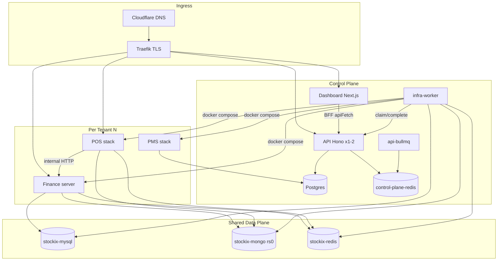
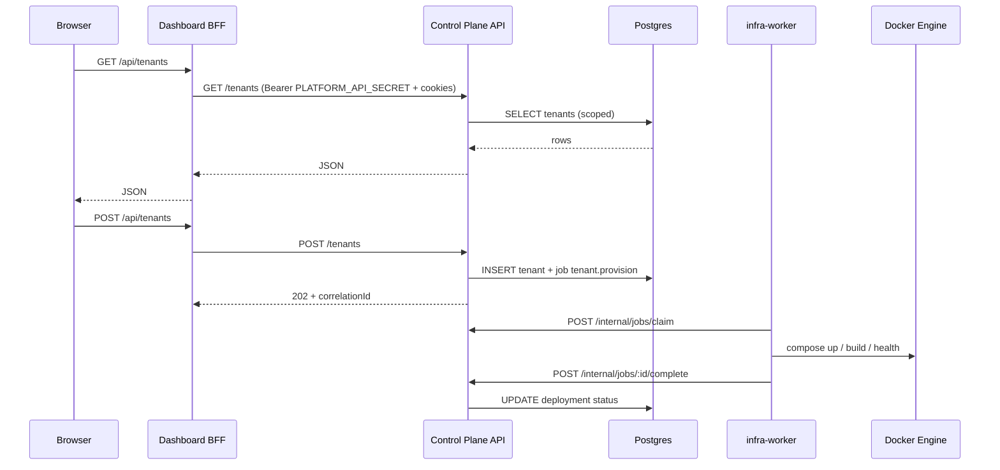
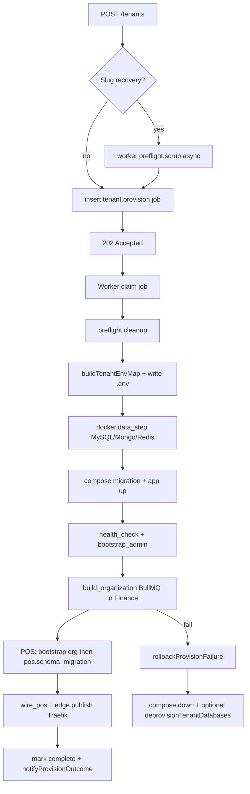
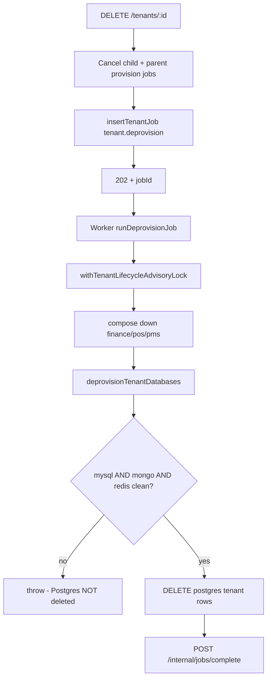

# Stockix Production Readiness & Architecture Audit

**Audit date:** 2026-06-07  
**Last repair verification:** 2026-06-07 (P1/P2 repair pass — codebase re-checked, not assumed)  
**Auditor role:** Principal Architect / DevOps / DBA / SRE / Security  
**Scope:** Entire Stockix monorepo — control plane, worker, tenant stacks, shared infra, Finance/POS/PMS  
**Method:** Static codebase analysis, env/schema/compose review, cross-reference with `docs/env-audit.md` and `docs/investigation-report.md`  
**Code changes:** P1/P2 repair items applied in repo; this document updated to match current code

---

## Verdict (Executive Summary)

Stockix is a **sophisticated multi-tenant platform** with deliberate separation between control-plane (Postgres + API + dashboard) and data-plane (shared MySQL/Mongo/Redis + per-tenant Docker stacks). The provisioning journal, deprovision ordering gate, and worker claim tokens show production-minded design.

**However, this system is not yet safe to approve for production at thousands of tenants without addressing structural limits and several P0/P1 defects.**

| Dimension | Score (/10) | One-line verdict |
|-----------|-------------|------------------|
| Architecture | 6.5 | Sound boundaries; shared data plane and single worker are hard ceilings |
| Security | 6.0 | RBAC + tenant scope exist; gaps in correlation routes, Redis isolation, permission wiring |
| Scalability | 4.0 | Single-host tenant-per-container model breaks before 500 tenants |
| Reliability | 6.0 | Scrub moved off API; cooperative cancel + DB-based readiness; SSE/rollback gaps remain |
| Maintainability | 7.0 | Monorepo, typed config, route registrars, docs/runbooks |
| Operations | 5.5 | B2 backups + Prometheus/Grafana in prod compose; Redis/Traefik/S3 DR still missing |
| Database design | 7.0 | Postgres indexes + per-tenant org slug unique applied (0055–0057) |
| Provisioning system | 6.5 | POS schema migration journaled; API no longer runs Docker on create |

**Overall production readiness:** **6.1 / 10** — suitable for **controlled pilot (≤50 tenants)** on a large single host after remaining P0 fixes; **not** ready for **1,000+ tenants** without architectural evolution.

---

# PHASE 1 — SYSTEM DISCOVERY

## 1.1 Monorepo topology

```
stockixnew/
├── apps/
│   ├── api/              Control-plane API (Hono, Node 22)
│   └── dashboard/        Operator UI (Next.js 16, BFF proxies)
├── packages/
│   ├── config/           Central env (apiConfig, dashboardConfig, infraConfig)
│   ├── db/               Drizzle schema + Postgres migrations
│   ├── auth/             Session/token helpers
│   └── shared/           Roles, permissions, structured logger
├── infra/
│   ├── dev/              Local control-plane Postgres + Redis
│   ├── shared/           Shared MySQL, Mongo (rs0), tenant Redis
│   ├── tenant-stack/     Per-tenant Finance (1 container)
│   ├── pos-tenant-stack/ Per-tenant POS (4 containers)
│   ├── pms-tenant-stack/ Per-tenant PMS (2 containers)
│   ├── prod/             Production platform compose + runbooks
│   └── worker-service/   Infra worker (provision/deprovision)
└── services/
    ├── stockix-finance/  NestJS ERP (tenant server image)
    ├── posnew/           POS backend + frontend images
    ├── pms/ + pmsfull/   PMS API + frontend
    └── chatlive/         Optional Chatwoot
```

## 1.2 Service dependency diagram



## 1.3 Request flow (operator action)



## 1.4 Provisioning flow



**Key files:** `provision-runtime.ts`, `tenant-env.ts`, `provisioner.ts`, `traefik-config.ts`

## 1.5 Deletion flow



See **`docs/investigation-report.md`** for delete vs rollback vs SSE correlation analysis.

## 1.6 Synchronization flows

| Sync | Mechanism | Files |
|------|-----------|-------|
| Finance license ↔ control plane | API internal routes + worker adapters | `pos-license-sync.ts`, worker finance adapters |
| POS ↔ Finance (Bigcapital) | BullMQ on prefixed Redis + internal HTTP | `posnew` jobQueue, provision step `tenant.wire_pos_integration` |
| Provision events → UI | Postgres `tenant_provision_events` + PG NOTIFY → Redis pub/sub (or local fallback) + SSE | `provision-notify-listener.ts`, `provision-pubsub.ts`, `provision-stream` |
| Notifications → UI | Postgres insert + Redis pub/sub + SSE | `notification-service.ts`, `notification-pubsub.ts` |
| Traefik routes | Worker writes dynamic YAML | `traefik-config.ts`, `edgePublisher` |

**Residual gap (dev/local only):** When `CONTROL_PLANE_REDIS_URL` is unset, `apps/api/src/lib/provision-pubsub.ts:9-21` falls back to an in-process `EventEmitter` — SSE does not fan out across API replicas. Production compose sets `CONTROL_PLANE_REDIS_URL`; local dev without Redis still has single-process SSE.

---

# PHASE 2 — ENVIRONMENT AUDIT

**Prior audit:** `docs/env-audit.md` — automated `scripts/audit-env.mjs` reports 0 schema issues for root + `infra/prod/.env`. Alignment section prints informational `root↔prod MISMATCH` for secrets that intentionally differ between local and production files.

## 2.1 Environment matrix (summary)

| Surface | Primary source | Loaded by |
|---------|----------------|-----------|
| Root `.env` | `.env.example` (355 lines) | `packages/config`, all apps via `load-root-env` |
| Production | `infra/prod/.env.example` | `docker compose` in prod stack |
| Tenant per-slug | `{TENANT_ENV_ROOT}/{slug}/.env` | Worker `buildTenantEnvMap()` |
| Dashboard | `NEXT_PUBLIC_*` + server vars | `dashboardConfig` |
| API | `apiConfig` | `apps/api` |
| Worker | Same root + `WORKER_*` overrides | `infra/worker-service` |
| Finance tenant | Generated tenant `.env` | Docker compose `--env-file` |
| POS/PMS tenant | Module stack env from tenant `.env` | `module-stacks.ts` |

## 2.2 Findings

| ID | Severity | Finding | Evidence |
|----|----------|---------|----------|
| E1 | **P1** | `WORKER_SECRET` defaults to `dev-worker-secret` if unset | `packages/config/src/index.ts` |
| E2 | **P1** | Shared tenant Redis has **no password** — prefix-only isolation | `tenant-env.ts`, `infra/shared/docker-compose.yml` |
| E5 | **P2** | `CONTROL_PLANE_REDIS_URL` required in prod but absent from root `.env.example` | `packages/config` production profile; present in root `.env` as extra key |
| E6 | **P3** | `PROVISION_POLL_MS` in compose not wired to worker (hardcoded 1500ms) | `worker.ts` vs `infra/prod/docker-compose.yml` |
| E7 | **P3** | Prod post-boot: `CHATWOOT_API_ACCESS_TOKEN` empty until Chatwoot boots | `docs/env-audit.md` |
| E8 | **P3** | `prod-scale-smoke.sh` references `BACKUP_S3_*` but compose uses `BACKUP_B2_*` | Script vs `infra/prod/.env.example` |

## 2.3 Secret exposure risks

- Tenant `.env` files contain JWT, DB passwords (encrypted deployment secrets), written `0o600` under `TENANT_ENV_ROOT` — **filesystem backup/ACL critical**
- Platform secrets use `__MUST_OVERRIDE__` placeholders in examples — good
- Dashboard BFF holds `PLATFORM_API_SECRET` server-side only — good
- Worker + API share `WORKER_SECRET` for `/internal/*` — single bearer, no rotation story documented

---

# PHASE 3 — DATABASE AUDIT

## 3.1 Postgres (control plane)

**Schema:** `packages/db/src/schema.ts`  
**Migrations:** `packages/db/drizzle/0000`–`0057` (hand-written: `0055_tenant_org_indexes`, `0056_organizations_tenant_slug_unique`, `0057_tenant_lifecycle_jobs_cancel_requested_at`)  
**Runner:** `pnpm db:migrate`

| Table | FK / cascade | Indexes | Risk |
|-------|--------------|---------|------|
| `tenants` | `owner_id` → owners **RESTRICT** | Unique `slug`, `organization_number`, **`tenants_owner_id_idx`** (0055) | Low |
| `organizations` | `tenant_id` → tenants **CASCADE** | **`organizations_tenant_id_idx`** (0055), **`organizations_tenant_slug_unique`** on `(tenant_id, slug)` (0056); global `subdomain` unique | Cross-tenant slug collision resolved; subdomain still globally unique |
| `tenant_lifecycle_jobs` | `tenant_id` CASCADE | `(status, run_at, priority)`, `(tenant_id, created_at)`, `(correlation_id)` | Good for worker |
| `tenant_deployments` | CASCADE from tenant | — | Orphan if manual tenant row delete |
| `tenant_provision_events` | Append-only trace | correlation indexes | Good for SSE replay |
| `admin_audit_log` | target tenant FK | — | No retention policy |

**Transaction boundaries:** Job claim uses DB transaction + row lock pattern in `internal.ts`. Idempotency middleware uses separate storage.

## 3.2 MySQL (tenant isolation)

**Pattern:** `stockix_{mysqlSafe(slug)}_*` databases, user `tenant_{mysqlSafe}` with grant on prefix.

| DB | Purpose |
|----|---------|
| `stockix_{safe}_system` | Finance system schema |
| `stockix_{safe}_{orgId}` | Per-organization tenant DB (runtime) |
| `stockix_{safe}_finance` | Legacy compat — **may be orphaned** (provisioner comment) |

**Isolation:** Strong at DB name level on shared instance. **Blast radius:** one MySQL for all tenants.

**Deprovision gate:** Postgres rows not deleted unless `mysqlDbs && mongoDb && redisKeys` all true (`provisioner.ts:616-626`).

## 3.3 MongoDB (`{slug}_pos`)

- URL: `mongodb://stockix-mongo:27017/{slug}_pos?replicaSet=rs0`
- Raw slug in DB name (API validates `[a-z0-9-]+`)
- Deprovision: `dropDatabase` via `mongosh` in shared container
- POS schema migrations: worker journaled step `pos.schema_migration` runs `node scripts/run-schema-migrations.js` via `docker compose exec` **after** `bootstrapPosOrganization` (`provision-runtime.ts:177-203`, `module-stacks.ts:532-533`)

## 3.4 Redis

| Instance | Purpose | Isolation |
|----------|---------|-----------|
| `control-plane-redis` | API rate limit + BullMQ (license expiry, invite mail) | Global queues |
| `stockix-redis` | All tenant Finance + POS BullMQ/Agenda | `REDIS_KEY_PREFIX=tenant:{slug}:` |

**Risk:** No AUTH on shared Redis; 128MB maxmemory + `allkeys-lru` — cross-tenant eviction under load.

## 3.5 Orphan / leakage scenarios

| Scenario | Possible? | Mitigation |
|----------|-----------|------------|
| MySQL DB without Postgres tenant | Yes (failed rollback) | `audit-orphan-dbs.ts`, M2 runbook |
| Postgres tenant without MySQL | Yes (failed provision early) | Retry provision |
| Redis keys after delete | Blocked if flush fails | Deprovision throws before PG delete |
| PMS data in platform Postgres | App-layer scoping only | Not isolated DB per tenant |

---

# PHASE 4 — TENANT LIFECYCLE AUDIT

## 4.1 States

**Tenant status (`tenants.status`):** `provisioning | active | partial | failed | suspended | stopped` (check constraint 0054)

**Deployment status (`tenant_deployments.status`):** provisioning lifecycle separate from tenant status

## 4.2 Lifecycle matrix

| Operation | Entry | Async? | Idempotent? | Rollback | Stuck states |
|-----------|-------|--------|-------------|----------|--------------|
| **Create** | POST `/tenants` | Job queue | Slug unique constraint | `rollbackProvisionFailure` | `provisioning` + dead job |
| **Provision** | Worker `tenant.provision` | Yes | Journal `operationKey` resume | Compose down + DB cleanup | `failed`, partial journal |
| **Activate** | Job complete → status active | — | Complete handler | — | — |
| **Suspend** | POST suspend → lifecycle job | Yes | — | — | `suspended` |
| **Delete** | DELETE → `tenant.deprovision` | Yes | 202 + job row | Worker deprovision | Job pending if worker down |
| **Recovery** | POST retry-provision | Yes | M1/M5 runbooks | — | Failed + orphan resources |

## 4.3 Critical lifecycle defects

| ID | Severity | Issue |
|----|----------|-------|
| L1 | ~~**P0**~~ | ~~`scrubTenantRuntimeArtifacts()` sync Docker in API~~ — **fixed:** scrub runs in worker `preflight.scrub` (`worker.ts:554`, `tenants.ts:943` comment) |
| L2 | **P1** | Rollback `deprovisionTenantDatabases` is **best-effort** — partial MySQL/Mongo/Redis cleanup without gate |
| L3 | ~~**P2**~~ | ~~`cancel-check` dead string `cancel_requested_by_user`~~ — **fixed:** cooperative cancel via `cancel_requested_at` (`schema.ts:349`, `tenants.ts:1109`, `internal.ts:328-329`) |
| L4 | ~~**P2**~~ | ~~Correlation routes lack tenant ownership check~~ — **fixed:** `assertCorrelationJobAccess` (`provision-correlation-auth.ts`) |
| L5 | ~~**P2**~~ | ~~Dashboard removes tenant from UI on 202~~ — **fixed:** `tenantStatus: "deprovisioning"`, "Removing…" badge, 10s polling (`tenant-list.tsx:429`, `tenant-status-badge.tsx:54`) |
| L6 | **P2** | Failed tenant + user delete: deprovision queued (good) but UI may show inconsistent state until worker runs |

## 4.4 Idempotency & retry

- HTTP idempotency: `POST/PATCH/DELETE` on `/owners`, `/tenants`, `/licenses`, `/admin`, `/api-keys` (`middleware/idempotency.ts:16`)
- Provision jobs: **no auto-retry** on failure for `tenant.provision` (`worker.ts:912-918`)
- Deprovision: up to 5 attempts via job table
- Journal enables **resume** after worker crash — strong point

---

# PHASE 5 — WORKER AUDIT

## 5.1 Job processing model

- Single worker process, sequential loop, poll every **1500ms** (hardcoded)
- Claim: `POST /internal/jobs/claim` with stale-lease reclaim (~10 min)
- Heartbeat: 30s → updates `claimedAt`
- Execution timeout: default **45 minutes**
- Fail report: API `/internal/jobs/:id/fail` or **DB fallback** if API unreachable

## 5.2 Locks

```typescript
// provision-lock.ts — session advisory lock
SELECT pg_advisory_lock(hash(tenantId))
```

**Risk (P1):** Uses pooled `postgres.js` connection — lock acquire/release may occur on **different connections**, weakening serialization.

**Used for:** deprovision, compose steps when tenantId known  
**Not used for:** initial `runProvisionJob` entry, `add_module`, `organization.provision`

## 5.3 BullMQ (two tiers)

| Location | Redis | Queues |
|----------|-------|--------|
| Control plane | `control-plane-redis` | license-expiry, owner-invite-mail |
| Tenant Finance | `stockix-redis` + prefix | OrganizationBuild, mail, etc. |
| Tenant POS | Same shared Redis | bigcapital_sync, platform, print |

Organization build processor had `Scope.REQUEST` bug (fixed in codebase + image rebuild required).

## 5.4 Worker failure modes

| Mode | Behavior | Risk |
|------|----------|------|
| Zombie job | Stale reclaim marks dead / reclaims | Duplicate work if worker still running |
| Lost completion | Worker DB fallback | Race with reclaim |
| API down during fail report | Logged; fallback persist | Job state drift |
| Infinite retry | Capped at maxAttempts (5) except provision family (noRetry) | Dead jobs need ops |
| Duplicate execution | Single worker mitigates; multi-worker needs advisory lock fix | Medium |

---

# PHASE 6 — DOCKER AUDIT

## 6.1 Stack inventory

| Stack | File | Restart | Healthchecks |
|-------|------|---------|--------------|
| Shared | `infra/shared/docker-compose.yml` | unless-stopped | mysql, mongo, redis ✓ |
| Prod platform | `infra/prod/docker-compose.yml` | unless-stopped | Most ✓; **api-bullmq ✓**, **db-backup ✓** (crond); Prometheus + Grafana added |
| Tenant Finance | `infra/tenant-stack/docker-compose.yml` | unless-stopped | server ✓; migration one-shot |
| POS | `infra/pos-tenant-stack/docker-compose.yml` | unless-stopped | backend ✓; **workers: pgrep + Redis ping** (`docker-compose.yml:96-101`, `131-136`) |
| PMS | `infra/pms-tenant-stack/docker-compose.yml` | unless-stopped | ✓ |

## 6.2 Networks

- `stockix_public` — Traefik ingress
- `stockix_internal` — internal-only control plane
- `stockix-shared` — **external** bridge to tenant DBs (must exist before prod)
- `socket_proxy_network` — Docker API via socket-proxy (Traefik + worker)

## 6.3 Resource leaks

| Leak type | Cause | Detection |
|-----------|-------|-----------|
| Orphan containers | Failed rollback / manual abort | `docker ps`, compose project names |
| Orphan volumes | compose down without `-v` when intended | M2 runbook |
| Orphan MySQL DBs | Rollback partial | `audit-orphan-dbs.ts` |
| Orphan Traefik YAML | unpublish failure | File in `TRAEFIK_DYNAMIC_DIR` |
| Orphan networks | `bestEffortDockerProjectCleanup` | Low priority |

## 6.4 Traefik + Cloudflare

- TLS: Let's Encrypt DNS-01 via `CF_DNS_API_TOKEN`
- Tenant routes: dynamic file provider + `edgePublisher.unpublish`
- Upstream: `host.docker.internal:${PUBLIC_PROXY_PORT}` — **host port binding model**

---

# PHASE 7 — SECURITY AUDIT

## 7.1 Authentication & authorization

| Layer | Implementation | File |
|-------|----------------|------|
| Session | HMAC cookie, 30-day TTL, version revocation | `services/auth/tokens.ts` |
| Platform secret | Bearer for BFF | `middleware/auth.ts` |
| Worker secret | `/internal/*` only | `middleware/auth.ts:65-74` |
| API keys | `sk_live_` prefix, hashed, **read_only** role | `routes/api-keys.ts` |
| RBAC | Permission-string middleware in production (`createRbacMiddleware` + `loadOwnerAuthById` + `hasAllPermissions`) | `middleware/rbac.ts:57-96`, `register-control-plane.ts:23` |

## 7.2 Threat model (STRIDE summary)

| Threat | Exposure | Mitigation status |
|--------|----------|-------------------|
| Cross-tenant data access | Tenant scope on `:tenantId` routes | **Partial** — correlation UUID routes gap |
| Privilege escalation | Custom permissions not loaded in prod RBAC | **Mitigated** — `loadOwnerAuthById()` populates `actorPermissions`; `hasAllPermissions()` enforces route matrix (`rbac.ts:83-92`). No `requirePermission()` helper exists (not a defect). |
| Worker secret compromise | Full job claim/complete | Rotate secret; network isolate |
| Redis key enumeration | No AUTH on shared Redis | **Weak** — prefix only |
| Docker socket abuse | socket-proxy filtered POST | db-backup mounts raw socket |
| SSRF via proxies | POS/PMS/Finance proxy routes | Rank-gated; review URL construction |
| Tenant file path traversal | `TENANT_ENV_ROOT` slug validated | Low if slug regex enforced |

## 7.3 Security findings

| ID | Severity | Finding |
|----|----------|---------|
| S1 | ~~**P0**~~ | ~~Sync Docker scrub in API request path~~ — **fixed** (scrub in worker; `tenants.ts:943`) |
| S2 | **P1** | Provision correlation endpoints without owner scope |
| S3 | **P1** | Shared Redis without authentication |
| S4 | ~~**P2**~~ | ~~Production RBAC ignores fine-grained permission matrix~~ — **fixed:** `createRbacMiddleware` loads permissions via `loadOwnerAuthById` + `hasAllPermissions` (`rbac.ts:83-92`). There is no `requirePermission()` helper in this codebase. |
| S5 | **P2** | PMS uses platform Postgres — cross-tenant risk if app bug |
| S6 | **P3** | Traefik dashboard `--api.insecure` on localhost:8080 |
| S7 | **P3** | Dev defaults for WORKER_SECRET / license signing in non-prod only |

---

# PHASE 8 — API AUDIT

## 8.1 Route registrars (control plane)

All mounted via `register-control-plane-routes.ts` — see CLAUDE.md route map.

## 8.2 Blocking operations in request path (must be zero in prod)

| Route | Operation | Duration risk | File |
|-------|-----------|---------------|------|
| POST `/tenants` | Enqueue `tenant.provision` only; slug scrub in worker | **Async** | `tenants.ts:943` (P0-4 comment) |
| GET `/tenants/provision-status/:id` | Readiness from `tenant_provision_events` journal rows | Milliseconds | `readiness-engine.ts` (no Docker/HTTP) |
| DELETE `/tenants/:id` | DB only + enqueue | **Fixed** — async 202 | `tenants.ts:762+` |

## 8.3 Idempotency & timeouts

- Idempotency middleware: `/owners`, `/tenants`, `/licenses`, `/admin`, `/api-keys` (`idempotency.ts:16`)
- Dashboard `apiFetch`: 3s dev / 10s prod default; lifecycle DELETE uses 30s
- API global rate limit: Redis-backed in prod (required `CONTROL_PLANE_REDIS_URL`)

## 8.4 API findings

| ID | Severity | Finding |
|----|----------|---------|
| A1 | ~~**P0**~~ | ~~Blocking Docker on POST `/tenants`~~ — **fixed** (see L1) |
| A2 | ~~**P2**~~ | ~~Readiness polls invoke Docker CLI~~ — **fixed:** event-based checks from `tenant_provision_events` (`readiness-engine.ts`) |
| A3 | **P3** | Route files under `apps/api/src/routes/*.ts` lack per-file idempotency classification comments (centralized in `idempotency.ts:15-25` only) |
| A4 | **P3** | Transient DB → 503 handler good (`create-control-plane-app.ts`) |

---

# PHASE 9 — SSE / STREAMING AUDIT

## 9.1 Streams

| Stream | API | BFF | Client |
|--------|-----|-----|--------|
| Notifications | Hono `streamSSE` + Redis pub/sub | `proxyControlPlaneEventStream` | EventSource + 5s reconnect |
| Provision progress | Hono `streamSSE` + Redis pub/sub (prod) or local EventEmitter (dev) | Direct body proxy (pump added) | EventSource |

## 9.2 Findings (see also `docs/investigation-report.md`)

| ID | Severity | Finding |
|----|----------|---------|
| SS1 | **P0** | API restart → ECONNRESET → dashboard **500** (observed); pump proxy mitigates if deployed |
| SS2 | **P1** | `void emitIfNew()` — unhandled `writeSSE` rejection on disconnect |
| SS3 | **P3** | In-memory provision bus fallback when `CONTROL_PLANE_REDIS_URL` unset — no multi-API SSE in local dev (`provision-pubsub.ts:9-21`). Prod compose sets Redis; cross-replica fan-out works via `publishProvisionEvent` → Redis channel `provision:{correlationId}` |
| SS4 | **P2** | Provision stream lacks `req.signal` abort listener on API |
| SS5 | **P2** | Dev `node --watch` restarts API — drops all SSE |
| SS6 | **P3** | Redis pub/sub cleanup fixed (idempotent disconnect) |

**Requirement:** Streams must not crash API — **API process does not crash** on ECONNRESET (logs `unhandled_rejection` only). Dashboard may return 500 to client.

---

# PHASE 10 — PROVISIONING AUDIT

## 10.1 Core functions

| Function | File | Role |
|----------|------|------|
| `buildTenantEnvMap()` | `tenant-env.ts` | Per-tenant env generation |
| `provisionTenant()` | `provisioner.ts` → `provision-runtime.ts` | Full provision |
| `deprovisionTenant()` | `provisioner.ts` | Ordered teardown + PG gate |
| `rollbackProvisionFailure()` | `provision-runtime.ts` | Failure cleanup |
| `deprovisionTenantDatabases()` | `provisioner.ts` | Shared MySQL/Mongo/Redis |

## 10.2 Transactional behavior

- **Not atomic end-to-end** — journal + job state machine provide eventual consistency
- Postgres tenant row created **before** worker finishes — intentional
- Deprovision: **strong gate** before Postgres delete (user path)
- Rollback: **weak** — per-store errors logged, not gated

## 10.3 Partial failure states

| State | User deprovision | Provision rollback |
|-------|------------------|-------------------|
| Docker up, PG deleted | Blocked by gate | N/A |
| Docker up, PG exists | Possible if compose down failed silently | Common |
| MySQL exists, PG deleted | Blocked | Possible |
| Mongo exists, PG deleted | Blocked | Possible |
| Redis keys remain | Blocked | Possible |
| Traefik route remains | PG may still delete | Common |

## 10.4 Recent fix

- Finance `OrganizationBuild.processor` — removed invalid `Scope.REQUEST` (requires `stockix-server:local` image rebuild)

---

# PHASE 11 — SCALABILITY AUDIT

## 11.1 Tenant count projections

Assumptions: finance-only tenant ≈512MB RAM limit + shared DB connections; single EC2-class host.

| Tenants | Feasibility | First bottleneck |
|---------|-------------|------------------|
| **100** | Marginal on 64GB+ host | MySQL `max_connections=500`, shared Redis 128MB |
| **500** | **Not viable** current design | RAM + connections + worker serial queue |
| **1,000** | Requires redesign | Container count, Traefik YAML, Docker daemon |
| **5,000** | Out of scope | Multi-region, sharded data plane, worker pool |

## 11.2 Single points of failure

- Single shared MySQL, Mongo, Redis
- Single infra-worker (serial jobs)
- Host-port Traefik upstream model
- Single Postgres (backed up, but not HA in compose)
- `MAX_TENANT_PORT` ~4999 caps published ports

## 11.3 API scaling

- `deploy.replicas: 2` in compose **ignored** without Swarm (`OPERATIONS.md`)
- SSE/provision bus: prod uses Redis pub/sub when `CONTROL_PLANE_REDIS_URL` set; local dev fallback is in-process only

---

# PHASE 12 — OBSERVABILITY AUDIT

## 12.1 Current state

| Signal | Status |
|--------|--------|
| Structured JSON logs | API, worker ✓ |
| HTTP request logs | requestId, latency ✓ |
| Sentry | API, worker, dashboard optional |
| Metrics | `GET /metrics` (Prometheus text) on API + worker; optional `METRICS_ENDPOINT` push | `apps/api/src/routes/public.ts:76`, `infra/worker-service/src/worker-prometheus.ts` |
| Audit log | Postgres `admin_audit_log` ✓ |
| Provision trace | `tenant_provision_events` ✓ |
| Health | `/health`, `/ready`, worker `:9090/health` |
| Prometheus/Grafana | Prod compose services `prometheus`, `grafana` | `infra/prod/docker-compose.yml:363-395` |

## 12.2 Gaps

- No Loki/OpenTelemetry deployment (Prometheus/Grafana present in prod compose)
- Finance tenant logs: Winston plain text
- `/ready` does not check shared MySQL/Mongo/worker
- Backup failures silent without log monitoring
- No SLOs/alerting wired except optional `ALERT_WEBHOOK_URL` in cron script
- `scripts/audit-env.mjs` prints `root↔prod MISMATCH` for `AUTH_TOKEN_SECRET` / `POS_PLATFORM_API_KEY` by design (different env files) while exiting 0 — informational only

## 12.3 Recommendations

| Tool | Use | Status |
|------|-----|--------|
| **Prometheus** | API latency, worker job duration, queue depth | **In prod compose** (`infra/prod/docker-compose.yml:363`) |
| **Grafana** | Dashboards per tenant count / host RAM | **In prod compose** (`infra/prod/docker-compose.yml:377`) |
| **Loki** | Centralize JSON logs from all compose services | Not deployed |
| **OpenTelemetry** | Trace BFF → API → worker → docker | Not deployed |
| **Sentry** | Enable in prod for all three control-plane apps | Optional |
| **PagerDuty/Opsgenie** | Wire `ALERT_WEBHOOK_URL` + backup cron failures | Not wired |

---

# PHASE 13 — DISASTER RECOVERY AUDIT

## 13.1 Backup coverage

| Asset | Backed up? | Script | RPO |
|-------|------------|--------|-----|
| Control-plane Postgres | ✓ | `infra/prod/backup/backup.sh` | ~12h (2x daily) |
| Shared MySQL (all tenant DBs) | ✓ | `backup-shared.sh` | ~12h |
| Shared Mongo | ✓ (oplog archive) | `backup-shared.sh` | ~12h |
| Tenant Redis | ✗ | — | — |
| Control-plane Redis | ✗ (no persistence) | — | — |
| Traefik dynamic YAML | ✗ | — | — |
| Tenant `.env` dirs | ✗ | — | — |
| S3 tenant attachments | ✗ | Separate bucket | — |

## 13.2 Restore documentation

- Postgres: full runbook (`OPERATIONS.md`)
- MySQL: M4 runbook
- Mongo: sketch only (`backup/README.md`)
- Tenant recovery: M1–M5 matrices in `OPERATIONS.md`

## 13.3 Data-loss risks

- **RPO ~12 hours** — no WAL continuous archiving
- Redis queue/state loss on restart — in-flight jobs may stall
- Partial rollback leaves orphan MySQL/Mongo — manual M2 cleanup

---

# PHASE 14 — PRODUCTION READINESS SCORES

| Category | Score | Justification |
|----------|-------|---------------|
| **Architecture** | **6.5/10** | Clear control vs data plane split; shared infra and host-port routing limit growth |
| **Security** | **6.2/10** | Auth stack solid; RBAC permission matrix wired; Redis isolation + correlation route gaps remain |
| **Scalability** | **4.0/10** | Single worker + shared DBs + per-tenant containers hit wall <500 tenants |
| **Reliability** | **6.0/10** | Scrub off API path; cooperative cancel; DB readiness; rollback/SSE/API-watch still fragile |
| **Maintainability** | **7.0/10** | Monorepo, typed config, runbooks, route checks in CI |
| **Operations** | **5.5/10** | Backups + Prometheus/Grafana in prod compose; Redis/Traefik/S3 DR + alerting gaps |
| **Database design** | **7.0/10** | Migrations 0055–0057: owner/tenant indexes + per-tenant org slug unique |
| **Provisioning system** | **6.5/10** | POS schema migration journaled; worker async model; partial rollback remains |

**Weighted overall: 6.1/10**

---

# PHASE 15 — CRITICAL FINDINGS

## P0 — Critical (block production at scale)

| ID | Issue | Business impact | Fix direction |
|----|-------|-----------------|---------------|
| P0-1 | Shared MySQL connection ceiling | Platform-wide outage at high tenant count | **Mitigated in repo:** `max_connections=1000` + ProxySQL (`infra/shared/docker-compose.yml`). Verify deploy: `scripts/verify-shared-infra.sh`; monitor `Threads_connected` (see OPERATIONS.md) |
| P0-2 | Shared tenant Redis isolation | Queue loss, cross-tenant risk | **Mitigated in repo:** `requirepass`, `512mb`, `noeviction` (`infra/shared/docker-compose.yml`). Verify `TENANT_REDIS_PASSWORD` + `scripts/verify-shared-infra.sh` |
| P0-3 | Worker throughput / scale | Provision queue backlog | **Partial:** `WORKER_CONCURRENCY` + `FOR UPDATE SKIP LOCKED`; scale with `--scale infra-worker=N`. Documented in OPERATIONS.md |
| P0-5 | SSE/dashboard on API restart | Operator UI broken | **Mitigated:** BFF pump + prod Redis hard-fail (`provision-pubsub.ts`, `index.ts`); SSE `safeWrite` disconnect handling. Staging soak in OPERATIONS.md |

**Resolved in repair pass:** P0-4 (scrub moved to worker `preflight.scrub` — `worker.ts:554`, `domain/scrub-tenant-artifacts.ts`)

## P1 — High priority

| ID | Issue | Fix direction |
|----|-------|---------------|
| P1-1 | ~~`pg_advisory_lock` with connection pool~~ | **Fixed:** dedicated PG client `max:1` (`provision-lock.ts`); full `runProvisionJob` / `runAddModuleJob` wrapped in `withTenantLifecycleAdvisoryLock` (`worker.ts`) |
| P1-2 | Rollback partial cleanup without gate | Align rollback with deprovision gate or ops alerts |
| P1-5 | No Redis / Traefik / tenant-env backup | Extend backup scripts + runbooks |
| P1-6 | API `deploy.replicas: 2` ineffective | Document `--scale` or remove misleading config |
| P1-7 | ~~Provision SSE local-dev fallback only~~ | **Fixed (prod):** hard-fail without Redis (`provision-pubsub.ts`); `ensureControlPlaneRedisReady` at API startup (`index.ts`). Dev keeps EventEmitter fallback. |
| P1-8 | PMS on shared Postgres (app-layer isolation only) | Document threat model or separate DB |
| P1-9 | `deprovisionTenant` swallows compose-down failure | Fail job if finance stack still running |
| P1-10 | ~~WORKER_SECRET dev default~~ | **Fixed:** `validateWorkerSecret` staging/production; worker calls `validateRequiredEnv()` at startup (`worker.ts`) |

**Resolved in P1 pass:** P1-3 — `assertCorrelationJobAccess` on provision-stop/status/stream (`provision-correlation-auth.ts`, `tenants.ts`); tests pass (`provision-correlation-auth.test.ts`).

## P2 — Medium priority (open)

| ID | Issue |
|----|-------|
| P2-3 | Legacy `stockix_{safe}_finance` MySQL DB may remain orphaned — documented in `provisioner.ts:218`, audited by `infra/worker-service/scripts/audit-orphan-dbs.ts` |
| P2-7 | Route files under `apps/api/src/routes/*.ts` lack per-file idempotency classification comments — scope is enforced in `middleware/idempotency.ts:16` for `/owners`, `/tenants`, `/licenses`, `/admin`, `/api-keys` |
| P2-12 | `scripts/audit-env.mjs` prints `AUTH_TOKEN_SECRET root↔prod: MISMATCH` and `POS_PLATFORM_API_KEY root↔prod: MISMATCH` while exiting 0 — expected (different secrets per environment); `.env.example` Mongo URL + `TENANT_DB_NAME_PERFIX` comments fixed (`.env.example:52-53`, `:234`) |

**Resolved in repair pass:** P2-1 (0055 indexes), P2-2 (0056 `(tenant_id, slug)` unique), P2-4 (`pos.schema_migration` after bootstrap), P2-5 (deprovisioning UI), P2-6 (DB event readiness), P2-8 (`cancel_requested_at`), P2-9 (api-bullmq/db-backup healthchecks), P2-10 (POS worker healthchecks), P2-11 (`GET /metrics` + Prometheus/Grafana compose)

## P3 — Improvements

| ID | Issue |
|----|-------|
| P3-1 | ~~Wire `PROVISION_POLL_MS` to worker~~ — **Fixed:** `apiConfig.provisionPollMs` + worker env (`worker.ts`) |
| P3-2 | Tenant delete completion notification |
| P3-3 | Structured logging in Finance tenant server |
| P3-4 | Sentry in tenant stack images |
| P3-5 | Fix `prod-scale-smoke.sh` BACKUP env var names |
| P3-6 | Document Traefik dashboard exposure |
| P3-7 | Quarterly DR drill automation |
| P3-8 | Per-file idempotency comments on route registrars (see P2-7) |
| P3-9 | Downgrade or document `audit-env.mjs` root↔prod MISMATCH lines (see P2-12) |

---

# PHASE 16 — REPAIR VERIFICATION (2026-06-07)

Code-verified status of items from the P1/P2 repair pass. **Removed from open findings above if fixed; kept if not.**

| ID | Status | Evidence (file:line or migration) |
|----|--------|-----------------------------------|
| P0-4 / L1 / S1 / A1 | **Fixed** | No `scrubTenantRuntimeArtifacts` in `apps/api`; worker `worker.ts:554`, comment `tenants.ts:943` |
| P1-4 / S4 | **Not a defect** | `createRbacMiddleware` + `loadOwnerAuthById` + `hasAllPermissions` at `rbac.ts:57-96`; registered `register-control-plane.ts:23`. No `requirePermission()` in repo. |
| P1-7 | **Fixed (prod)** | Hard-fail without Redis in production (`provision-pubsub.ts`); `ensureControlPlaneRedisReady` (`redis.ts`, `index.ts`). Dev EventEmitter fallback intentional. |
| P1-10 | **Fixed** | `validateWorkerSecret` + worker `validateRequiredEnv()` at startup (`packages/config`, `worker.ts`) |
| P1-3 | **Fixed** | `assertCorrelationJobAccess` on all correlation routes; tests `provision-correlation-auth.test.ts` |
| P1-1 | **Fixed** | Dedicated lock client + full job wrap (`provision-lock.ts`, `worker.ts`) |
| P0-1 / P0-2 | **Verify ops** | `scripts/verify-shared-infra.sh`; connection budget in `OPERATIONS.md` |
| P0-3 / P0-5 | **Documented** | Worker scale + SSE soak in `OPERATIONS.md`; SSE `safeWrite` in `tenants.ts` |
| P2-1 | **Fixed** | `0055_tenant_org_indexes.sql`; `schema.ts:104`, `:133` |
| P2-2 | **Fixed** | `0056_organizations_tenant_slug_unique.sql`; `schema.ts:134` |
| P2-3 | **Open (ops)** | Legacy DB still created `provisioner.ts:218`; audit script `audit-orphan-dbs.ts` |
| P2-4 | **Fixed** | `provision-runtime.ts:177-203` (`afterBootstrap`); `module-stacks.ts:532-533`; command `node scripts/run-schema-migrations.js` |
| P2-5 | **Fixed** | `tenant-status-badge.tsx:54`, `tenant-list.tsx:429`, `tenants-page-content.tsx:188` |
| P2-6 | **Fixed** | `readiness-engine.ts` — no `docker`/`execa` imports; journal op checks only |
| P2-7 | **Partial** | Middleware covers 5 prefixes `idempotency.ts:16`; route files have **no** per-file comments |
| P2-8 / L3 | **Fixed** | `0057_tenant_lifecycle_jobs_cancel_requested_at.sql`; `internal.ts:328-329`; `tenants.ts:1109` |
| P2-9 | **Fixed** | `infra/prod/docker-compose.yml:292-301` (api-bullmq), `:439-443` (db-backup) |
| P2-10 | **Fixed** | `infra/pos-tenant-stack/docker-compose.yml:96-101`, `:131-136` |
| P2-11 | **Fixed** | `apps/api/src/routes/public.ts:76`; `infra/prod/docker-compose.yml:363-395` |
| P2-12 | **Partial** | `.env.example:234` Mongo URL + `:52-53` PERFIX comment fixed; `audit-env.mjs:80-83` still prints root↔prod MISMATCH, exit 0 |
| E3 / E4 | **Fixed** | Removed from Phase 2 open findings — see `.env.example:52-53`, `:231-234` |

**`node scripts/audit-env.mjs` (2026-06-07):** exit 0; `AUTH_TOKEN_SECRET root↔pos: MATCH`; `root↔prod: MISMATCH` (expected).

---

# APPENDIX A — Related documents

| Document | Purpose |
|----------|---------|
| `docs/investigation-report.md` | Deep dive: tenant delete vs SSE vs observed logs |
| `docs/env-audit.md` | Automated env alignment audit |
| `docs/testrun-results.md` | CI/test matrix snapshot |
| `infra/prod/OPERATIONS.md` | M1–M5 runbooks, backup/restore |
| `infra/prod/FAILOVER_RUNBOOK.md` | EC2 failover decision tree |
| `CLAUDE.md` | API route map |

---

# APPENDIX B — Approval checklist (Principal Engineer sign-off)

Before production go-live at target tenant count, require:

- [ ] All **P0** items resolved or explicitly accepted with compensating controls
- [ ] Load test at **2× target tenant count** on staging hardware profile
- [ ] DR drill: Postgres + MySQL restore verified within RTO target
- [ ] Security review: correlation routes + Redis + internal API
- [ ] `pnpm docker:prebuild` in CI for tenant images
- [ ] API runs **without** file watcher; SSE soak test 24h
- [ ] Worker horizontal scale test with advisory lock fix
- [ ] Observability: logs centralized, alerts on backup failure + worker dead jobs

---

*End of production readiness audit. Updated 2026-06-07 after P1/P2 repair verification against current codebase.*
