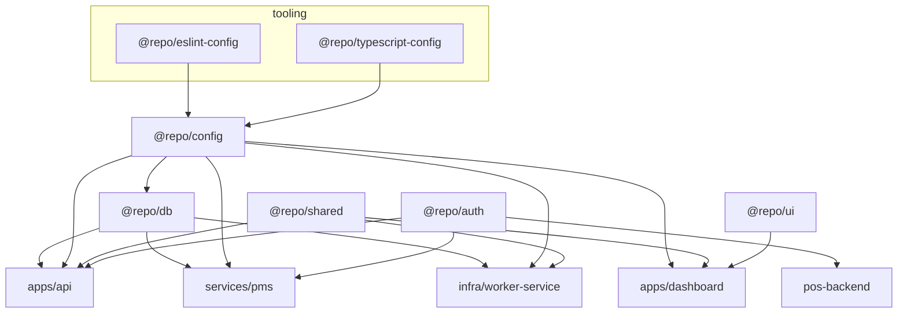

# Stockix Monorepo — Production Audit

**Audit date:** 2026-05-27  
**Repository:** `stockixnew`  
**Method:** Static analysis of workspace layout, `package.json` graphs, CI/CD, infra compose, boundary scripts, auth/env patterns, and representative large modules. Evidence paths cited inline.

---

## 1. Architecture Overview

### 1.1 Folder tree (operational layout)

Omitted: `.git`, `node_modules`, `.next`, `.turbo`, `.claude` (agent tooling — not product runtime).

```
stockixnew/
├── apps/
│   ├── api/                    # Control-plane HTTP API (Hono)
│   │   └── src/                # index.ts (~5.7k LOC), routes/, services/, jobs/
│   └── dashboard/              # Operator UI (Next.js 16 App Router)
│       ├── app/                # (auth), (dashboard), api/ BFF
│       ├── components/
│       └── e2e/
├── packages/
│   ├── auth/                   # Product JWT (@repo/auth)
│   ├── config/                 # Zod env loaders (@repo/config)
│   ├── db/                     # Drizzle schema + migrations (@repo/db)
│   ├── shared/                 # Roles, licenses, audit helpers (@repo/shared)
│   ├── ui/                     # Shared React primitives (@repo/ui)
│   ├── eslint-config/
│   └── typescript-config/
├── services/
│   ├── stockix-finance/        # Vendored accounting runtime (Lerna; own pnpm workspace)
│   │   ├── packages/server/    # NestJS API
│   │   ├── packages/webapp/    # React tenant UI
│   │   └── shared/             # @stockix/* utilities
│   ├── posnew/                 # Restaurant POS (nested pnpm workspace)
│   │   ├── apps/pos-backend/   # Express + MongoDB
│   │   └── apps/pos-frontend2/ # Next.js (studio-admin)
│   ├── pms/                    # Property management API (Hono)
│   │   └── frontend/           # PMS Next.js UI
│   ├── chatlive/               # Vendored Chatwoot (Rails + Vue)
│   └── pmsfull/                # Legacy standalone PMS (not in root workspace)
├── infra/
│   ├── prod/                   # Production Docker Compose + Traefik
│   ├── dev/                    # Local Postgres
│   ├── tenant-stack/           # Per-tenant Finance compose
│   ├── pos-tenant-stack/       # Per-tenant POS compose
│   ├── pms-tenant-stack/       # Per-tenant PMS compose
│   ├── worker-service/         # Provisioning worker (bundled to .runtime/)
│   └── terraform/              # Optional EC2 + EIP
├── scripts/                    # Dev orchestration, boundary lint, env bootstrap
├── docs/                       # Platform, env, provisioning references
├── .github/workflows/          # deploy.yml, secret-scan.yml
├── package.json                # Root orchestration (Turborepo)
├── pnpm-workspace.yaml
└── turbo.json
```

### 1.2 Layers

| Layer | Paths | Role |
|-------|--------|------|
| **Control plane** | `apps/api`, `apps/dashboard`, `packages/db`, `packages/config`, `packages/auth`, `packages/shared` | Single Postgres (`stockix_platform`); tenants, licenses, owners, provisioning jobs |
| **Orchestration** | `infra/worker-service` | Async `tenant.provision`, Docker Compose, Traefik dynamic routes, per-tenant env under `TENANT_ENV_ROOT` |
| **Tenant runtimes** | `infra/tenant-stack`, `infra/pos-tenant-stack`, `infra/pms-tenant-stack` | Isolated product stacks per customer slug |
| **Vendored products** | `services/stockix-finance`, `services/posnew`, `services/pms`, `services/chatlive` | Finance (MySQL/Mongo/Redis per tenant), POS (Mongo), PMS (platform Postgres), Chatwoot (shared prod stack) |
| **IaC / edge** | `infra/terraform`, `infra/prod` (Traefik, socket-proxy) | EC2 bootstrap; TLS via Cloudflare DNS-01 |

### 1.3 System architecture (plain terms)

Stockix is a **multi-tenant SaaS control plane**. Operators use the dashboard to create tenants, assign modules (accounting, POS, PMS, chat), and issue licenses. The API persists state in Postgres and enqueues provisioning work. The **worker** writes per-tenant `.env` files and starts **Docker Compose** stacks on the host; **Traefik** routes `{slug}-*.domain` to the correct internal ports. **Stockix Finance** is the primary tenant runtime (vendored Bigcapital fork). **POS** and **PMS** are additional products integrated via proxies and module gating. **Chatwoot** runs as a shared service in production with per-tenant accounts when the `chat` module is enabled.

```
┌─────────────────────────────────────────────────────────────────┐
│ CONTROL PLANE (Postgres: stockix_platform)                       │
│  dashboard :3000 ──BFF/cookies──► api :4000                      │
│       │                              │                           │
│       │                    packages/db (37 tables, 53 migrations) │
│       │                              │                           │
│       │         POST /internal/jobs/* ◄── infra-worker           │
└───────┼──────────────────────────────┼───────────────────────────┘
        │                              │ docker compose + traefik
        ▼                              ▼
 ┌─────────────┐  ┌─────────────┐  ┌─────────────┐  ┌──────────┐
 │ Finance     │  │ POS stack   │  │ PMS stack   │  │ Chatwoot │
 │ MySQL+Mongo │  │ Mongo+API+UI│  │ API+UI      │  │ (shared) │
 └─────────────┘  └─────────────┘  └─────────────┘  └──────────┘
```

---

## 2. App Breakdown

### 2.1 `apps/api` (`api`)

| Attribute | Detail |
|-----------|--------|
| **Purpose** | Platform API: owner auth (session + MFA), tenants, licenses, orgs, provisioning lifecycle, POS/PMS proxies, internal worker jobs, webhooks |
| **Stack** | Hono 4, Drizzle ORM, Postgres, BullMQ + Redis (optional), jose, bcryptjs, zod, Sentry |
| **Entry** | `apps/api/src/index.ts` → `tsup` → `dist/index.js` (`node dist/index.js`) |
| **Deploy** | `apps/api/Dockerfile`; prod: `infra/prod/docker-compose.yml` services `api` (2 replicas, `RUN_BULLMQ_CONSUMERS=false`) + `api-bullmq` (1 replica) |
| **Tests** | Vitest (`pnpm --filter api test`); `check:tenant-scope` audit script |

**Risk:** Monolithic `index.ts` (~5,656 lines) — all HTTP routes in one file; `license-http.ts` ~1,825 lines.

### 2.2 `apps/dashboard` (`dashboard`)

| Attribute | Detail |
|-----------|--------|
| **Purpose** | Operator UI: tenants, licenses, users, audit log, PMS entry, settings; BFF under `app/api/*` |
| **Stack** | Next.js 16.2.4, React 19, Tailwind 4, shadcn, TanStack Table, Recharts |
| **Entry** | Next App Router — `app/layout.tsx`, route groups `(auth)`, `(dashboard)` |
| **Deploy** | `apps/dashboard/Dockerfile`; prod service `dashboard` behind Traefik; `NEXT_PUBLIC_*` baked at build via compose `build.args` |
| **Tests** | Vitest unit; Playwright e2e (`test:e2e`) |

**Note:** Declares `@repo/ui` but **zero imports** from `@repo/ui` in app source — UI is local `components/ui/`.

### 2.3 `services/pms` (`@stockix/pms`)

| Attribute | Detail |
|-----------|--------|
| **Purpose** | Property-management API on **platform Postgres** (not per-tenant DB) |
| **Stack** | Hono, Drizzle, `@repo/db`, `@repo/auth`, `@repo/config` |
| **Entry** | `services/pms/src/index.ts` → `dist/index.js` |
| **Deploy** | Dev via `scripts/dev-pms.mjs`; tenant stack `infra/pms-tenant-stack/` when module-gated; proxied from control-plane API `/pms/api/*` |
| **Tests** | Vitest |

### 2.4 `services/pms/frontend` (`@stockix/pms-frontend`)

| Attribute | Detail |
|-----------|--------|
| **Purpose** | Full PMS UI for tenant users |
| **Stack** | Next.js 15, React 19 |
| **Entry** | `next dev` / `next start -p 3004` |
| **Deploy** | PMS tenant stack / local dev on port 3004 |

### 2.5 `services/posnew` (`restaurant-pos-monorepo`)

| Attribute | Detail |
|-----------|--------|
| **Purpose** | Restaurant POS: floor operations, inventory, accounting bridge to Finance |
| **Stack** | Nested workspace: Express + Mongo (`pos-backend`), Next 16 (`studio-admin`), shared `@restaurant-pos/*` packages |
| **Entry** | Backend: `apps/pos-backend/app.js`; Frontend: `apps/pos-frontend2` (package name `studio-admin`) |
| **Deploy** | `infra/pos-tenant-stack/docker-compose.yml`; images via `scripts/build-pos-tenant-images.mjs`; prod routing via Traefik |
| **Tests** | Backend Vitest; CI in `services/posnew/.github/workflows/` (separate from root deploy) |
| **Coupling** | Root dep `stockix: workspace:*` pulls `@repo/db`, `@repo/config`, `@repo/shared` into POS subtree |

### 2.6 `services/stockix-finance` (`bigcapital-monorepo`)

| Attribute | Detail |
|-----------|--------|
| **Purpose** | Tenant accounting: GL, invoices, inventory, multi-org — **primary tenant runtime** |
| **Stack** | Lerna; NestJS 10 (`@stockix/server`), React 18 webapp, MySQL + Mongo + Redis per tenant stack |
| **Entry** | Server: `packages/server` → `dist/main`; Webapp: CRA/Vite build served via nginx in tenant compose |
| **Deploy** | `infra/tenant-stack/docker-compose.yml`; build context `STOCKIX_TENANT_APP_ROOT` (default `services/stockix-finance`) |
| **Workspace** | **Outside** root `pnpm-workspace.yaml` — separate install/build in CI (`pnpm --filter @stockix/server test`) |
| **Pin** | Vendored tag `v0.9.9` (see `services/README.md`) |

### 2.7 `services/chatlive` (`@chatwoot/chatwoot`)

| Attribute | Detail |
|-----------|--------|
| **Purpose** | Customer messaging (Chatwoot fork) |
| **Stack** | Rails, Sidekiq, Vue 3/Vite frontend |
| **Entry** | `Procfile.dev`, `bundle exec rails` |
| **Deploy** | Prod: `infra/prod/docker-compose.yml` services `chatwoot`, `chatwoot-postgres`, `chatwoot-redis` — **not** per-tenant compose |
| **Workspace** | **Outside** root pnpm workspace; upstream Chatwoot CI under `services/chatlive/.github/` |

### 2.8 `services/pmsfull`

Legacy standalone PMS tree. **Not** in `pnpm-workspace.yaml`. Platform docs state active PMS is `services/pms`. Treat as **archive / do not provision**.

### 2.9 `infra/worker-service`

| Attribute | Detail |
|-----------|--------|
| **Purpose** | Provisioning worker: poll jobs, Docker Compose, Traefik labels, Finance/POS/PMS adapters |
| **Stack** | TypeScript bundled via `pnpm infra:worker:build` → `infra/worker-service/.runtime/worker.js` |
| **Entry** | `infra/worker-service/src/worker.ts` |
| **Deploy** | Prod service `infra-worker`; mounts Docker socket via `socket-proxy`, repo root, `traefik-dynamic`, tenant env root |

---

## 3. Shared Packages Analysis

| Package | Responsibility | Dependents | Abstraction quality |
|---------|----------------|------------|---------------------|
| `@repo/config` | Central Zod env: `apiConfig`, `dashboardConfig`, mail, CORS, secrets validation | `@repo/db`, `api`, `dashboard`, `pms`, worker bundle | **Good** — intended leaf; lint forbids importing db/apps |
| `@repo/db` | Platform schema (37 `pgTable` definitions), Drizzle migrations (`packages/db/drizzle/`, 53 SQL files) | `api`, `pms`, worker | **Good** for data layer; must not own queue orchestration (enforced by architecture script) |
| `@repo/auth` | Product JWT sign/verify (jose), middleware for Hono/Express | `api`, `pms`, `pos-backend` | **Good** — narrow, built to CJS for POS |
| `@repo/shared` | Roles, permissions, license keys, deployment secret crypto, structured logger | `api`, `dashboard`, worker | **Mostly good**; `structured-logger` reads `process.env` directly to avoid `shared → config` cycle |
| `@repo/ui` | Minimal shared React components | `dashboard` (package.json only) | **Poor utilization** — no runtime imports; duplicate local shadcn in dashboard |
| `@repo/eslint-config` / `@repo/typescript-config` | Tooling presets | All TS packages | **Good** |
| `@restaurant-pos/*` | POS UI, domain-access, OpenAPI types | `pos-backend`, `pos-frontend2` | **Good** within POS subtree |
| `@stockix/*` (finance) | Utils, SDK, PDF, email components | Finance server/webapp only | **Isolated** — correct boundary vs control plane |
| Finance `packages/shared` | Named `@repo/shared` with **same export map** as root `@repo/shared` | Finance only | **Name collision risk** if ever merged into root workspace |

**Leaking business logic?**

- **Acceptable:** `@repo/shared` contains license key formats and deployment secrets — platform domain, not tenant accounting rules.
- **Concern:** Worker bundles code from `apps/api/src/` (mail, license follow-up) via `tsup.worker.config.ts` — blurs worker/API boundary (operational, not package-cycle).
- **Concern:** `posnew` → root `stockix` workspace package pulls control-plane DB into POS — intentional for SaaS integration but increases blast radius.

---

## 4. Dependency Graph

### 4.1 Workspace dependency map



### 4.2 Circular dependencies

| Check | Result |
|-------|--------|
| `@repo/config` → `@repo/db` | **Blocked** by `lint-boundaries.mjs` |
| `@repo/db` → `@repo/config` | **Allowed** (acyclic: config is leaf) |
| `@repo/shared` → `@repo/config` | **Avoided** via direct `process.env` in logger |
| Apps cross-import | **Blocked** |
| packages → infra | **Blocked** (except config) |

**No workspace circular dependency detected** among root `apps/*` and `packages/*`.

### 4.3 Overly coupled modules

| Coupling | Severity | Notes |
|----------|----------|-------|
| `apps/api/src/index.ts` | High | God file; all routes |
| Worker ↔ API source imports | Medium | Shared mail/license logic via relative paths into `apps/api` |
| `posnew` → root `stockix` | Medium | POS depends on platform DB package |
| Finance `@repo/shared` name vs root | Low (latent) | Drift if workspaces merge |
| Dashboard `DATABASE_URL` in prod compose | Medium | Dashboard container gets Postgres URL — verify only BFF/server routes use it, not client bundles |

---

## 5. Infrastructure & DevOps

### 5.1 CI/CD

| Workflow | Path | Trigger | Role |
|----------|------|---------|------|
| **Quality gate + deploy** | `.github/workflows/deploy.yml` | PR + push `main`; deploy on `main` / `workflow_dispatch` | TSC (api, worker, dashboard, packages, pms), API/POS/Finance tests, dashboard build, bundle size warn, `lint:boundaries`, `architecture:validate` |
| **Secret scan** | `.github/workflows/secret-scan.yml` | PR + `main` | Gitleaks full history |
| **POS / Finance / Chatwoot** | `services/*/.github/workflows/` | Various | Subtree-specific; **not** all run on root PR by default |

**Deploy flow (production):**

1. Quality gate passes on `main`.
2. Job `deploy` uses `webfactory/ssh-agent` + `EC2_SSH_PRIVATE_KEY`.
3. Remote: `git pull`, `source infra/prod/.env`, `pnpm install`, `pnpm infra:worker:build`, `pnpm --filter @repo/db db:migrate`.
4. `cd infra/prod && docker compose --env-file .env up -d --build --wait`.
5. Health: `curl` `{PUBLIC_BASE_URL_SCHEME}://{API_DOMAIN}/ready`; verify `api` container running.
6. On failure: `git reset --hard` previous commit + compose rollback (trap in workflow).

### 5.2 Docker

| Image / stack | Dockerfile / compose |
|---------------|---------------------|
| API | `apps/api/Dockerfile` |
| Dashboard | `apps/dashboard/Dockerfile` |
| Worker | `infra/worker-service/Dockerfile` |
| Finance tenant | Built from `STOCKIX_TENANT_APP_ROOT` (server, webapp, nginx, mariadb, redis, mongo) |
| POS tenant | `services/posnew/apps/pos-backend/Dockerfile`, `pos-frontend2/Dockerfile`; stub `infra/pos-tenant-stack/Dockerfile.pos-frontend-stub` |
| PMS | `services/pms/Dockerfile`, `services/pms/frontend/Dockerfile` |
| Chatwoot | `services/chatlive/docker/Dockerfile` |
| Local DB | `infra/dev/docker-compose.yml` |

### 5.3 Kubernetes / Terraform

| Tool | Usage |
|------|--------|
| **Kubernetes** | Not used for control plane — **Docker Compose on EC2** |
| **Terraform** | `infra/terraform/` — optional EC2 + security group + Elastic IP in existing VPC; does **not** install app |
| **Traefik** | v3.1.2 in prod — TLS, routing, dynamic tenant routes from worker |

### 5.4 End-to-end deployment

```
Developer → PR → GitHub Actions (quality-gate) → merge main
    → SSH to EC2 → git pull → migrate Postgres → docker compose build/up
    → Traefik serves dashboard + API
    → Worker provisions tenant stacks on host (Docker via socket-proxy)
    → Per-tenant URLs via dynamic Traefik config + internal ports
```

**Backups:** `db-backup` service in prod compose (`infra/prod/backup/backup.sh` → S3).

---

## 6. Security Review

### 6.1 Secrets & exposure

| Item | Status |
|------|--------|
| `.env` in `.gitignore` | Yes (root, `infra/prod/.env`, `services/**/.env`) |
| Gitleaks CI | Yes |
| Hardcoded keys in app source (sk-/AKIA patterns) | **Not found** in control-plane TS (grep clean) |
| `provision-jad-orgs.mjs` | Requires `FINANCE_PROVISION_SECRET` / `FINANCE_PROVISION_PASSWORD` from env — **no inline secrets** (verified 2026-05-27) |
| `infra/prod/.env` in repo | **Must not be committed** — listed in `.gitignore`; rotate if ever in git history (`docs/SECRET_ROTATION_RUNBOOK.md`) |

### 6.2 Auth patterns

| Surface | Mechanism |
|---------|-----------|
| Owner / operator | Session cookie (`SESSION_SECRET`), MFA (otplib), role + permission JSON on `owners` / `platform_roles` |
| Product apps (POS/PMS) | `@repo/auth` JWT with `modules[]` claim |
| Worker ↔ API | `WORKER_SECRET` on `/internal/jobs/*` |
| Dashboard ↔ API | `PLATFORM_API_SECRET` bearer from BFF |
| Finance internal | `INTERNAL_API_SECRET` |
| Tenant impersonation | `POST /tenants/:id/impersonate` — uses `tenantWithinOwnerScope` → `assertTenantInOwnerScope` (scoped owners restricted) |
| POS floor | PIN + POS JWT (separate from Stockix product JWT) |

### 6.3 Gaps & unsafe patterns

| Issue | Severity | Detail |
|-------|----------|--------|
| Resend webhook without secret | Low in prod | `apps/api/src/routes/webhooks/resend.ts`: production **rejects** if `RESEND_WEBHOOK_SECRET` unset; dev accepts unsigned (logged warning) |
| `process.env` outside `@repo/config` | Medium | Boundary lint forbids in apps/packages except allowlists; legacy `stockix-finance`, `posnew`, `chatlive` exempt |
| Docker socket via proxy | Medium | Worker can create containers — `socket-proxy` limits API surface but POST/build still enabled |
| Dashboard prod env includes `DATABASE_URL` | Medium | Ensure no secret leakage to client; architecture script restricts dashboard DB imports |
| No staging environment in CI | Medium | Deploy goes straight to production after gate |
| Submodule vendored trees | Low | Large attack surface (Chatwoot, Finance) — track upstream CVEs manually |

### 6.4 Environment variable model

Three layers (documented in `README.md`):

1. **Platform** — repo root `.env` / `.env.local` → `@repo/config`
2. **Tenant** — `~/.stockix/tenants/{slug}/.env` (provisioner-generated)
3. **Finance local dev** — `services/stockix-finance/.env` only

Prod containers set `STOCKIX_LOAD_ROOT_ENV=0` and receive explicit env from `infra/prod/docker-compose.yml` anchors.

---

## 7. Code Quality & Maintainability

### 7.1 Duplication

| Area | Observation |
|------|-------------|
| `@repo/shared` vs Finance `packages/shared` | Duplicate package name/exports — drift risk |
| Dashboard vs POS UI | Parallel shadcn stacks; `@repo/ui` unused |
| Auth / tenant checks | Repeated `tenantWithinOwnerScope` calls — could be middleware (partially addressed via comments at line ~3337) |
| Env loading | Centralized in `@repo/config` + `scripts/load-root-env.mjs` — **good** |

### 7.2 Large modules (>500 lines)

| LOC | File |
|-----|------|
| ~5,656 | `apps/api/src/index.ts` |
| ~1,825 | `apps/api/src/license-http.ts` |
| ~501 | `apps/api/src/mail/send.ts` |
| 916 | `apps/dashboard/components/tenant-users-panel.tsx` |
| 802 | `apps/dashboard/app/(dashboard)/tenants/_components/tenants-page-content.tsx` |
| 672 | `apps/dashboard/components/tenant-create-wizard.tsx` |
| 627 | `apps/dashboard/components/tenant-list.tsx` |

Repo rule in `docs/CLAUDE.md`: keep files under 500 lines — **violated** in API and several dashboard components.

### 7.3 Layer boundaries

**Enforced by automation:**

- `pnpm lint:boundaries` — env, config-leaf, dashboard-no-db, no cross-app imports
- `pnpm architecture:validate` — auth only in API, no queue logic in db package, dashboard UI must not orchestrate MFA/login

**Weak spots:**

- Single-file API router
- Worker importing API implementation files
- PMS data on platform DB while Finance uses per-tenant MySQL — correct product split but operators must understand two data models

### 7.4 Missing abstractions

- Route modules under `apps/api/src/routes/` exist for some areas but most routes remain in `index.ts`
- `@repo/ui` should be adopted or removed from dashboard `package.json`
- Staging environment / preview deploys not codified in root CI

---

## 8. Scalability Assessment

### 8.1 Multi-team / multi-service readiness

| Dimension | Assessment |
|-----------|------------|
| **Monorepo boundaries** | Moderate — scripts enforce layers; vendored trees are semi-independent |
| **Horizontal scale (control plane)** | Partial — API 2 replicas; single `api-bullmq`; single worker; Postgres single instance |
| **Tenant isolation** | Strong — per-tenant Docker stacks and env |
| **Team ownership** | Finance/POS/Chatwoot could be separate teams; control plane is one codebase |
| **CI fan-out** | Turbo caches builds; Finance/POS tests included in main gate but subtrees have extra workflows |

### 8.2 Bottlenecks

| Bottleneck | Impact |
|------------|--------|
| Single EC2 + Docker Compose | HA limited; host is SPOF |
| Provisioning worker (1 replica) | Tenant create throughput bounded by Docker build/start |
| `MAX_TENANT_PORT` port allocation | Upper bound on tenants per host |
| Large `index.ts` | Developer velocity, merge conflicts |
| Per-tenant MySQL/Mongo | Memory/disk per tenant — hard vertical limit on one machine |
| Chatwoot shared instance | All chat tenants share one Rails stack |

### 8.3 Structural risks

- Moving to Kubernetes would require replacing socket-proxy + compose provisioning model
- Merging Finance into root pnpm without renaming `@repo/shared` would break isolation
- `pmsfull` folder confusion for new engineers
- No blue/green beyond git reset rollback on deploy failure

---

## 9. Tooling Detection

| Tool | Detection |
|------|-----------|
| **Monorepo** | Turborepo 2.x (`turbo.json`) |
| **Package manager** | pnpm 9.15.9 (`packageManager` field, `pnpm-workspace.yaml`) |
| **Node** | `>=20.9.0` (root) |
| **TypeScript** | 5.9.2 (root); presets in `packages/typescript-config` |
| **API framework** | Hono 4 |
| **ORM** | Drizzle (platform Postgres); Knex/MySQL in Finance |
| **Testing** | Vitest (api, dashboard, pms); Jest (Finance server); Playwright (dashboard e2e, chatlive); POS backend Vitest |
| **Lint** | ESLint 9 via `@repo/eslint-config`; `lint:boundaries` custom script |
| **Format** | Prettier (`pnpm format`) |
| **E2E** | Playwright (`apps/dashboard`) |
| **Secret scan** | Gitleaks |
| **Dependabot** | `.github/dependabot.yml` (per README) |
| **License scan** | `license-checker` script at root |
| **Observability** | Sentry (`@sentry/node` in API); optional `METRICS_ENDPOINT` |

**Not detected:** Nx (Nx MCP may be configured in IDE but repo uses Turborepo, not `nx.json`).

---

## 10. Final Summary

### What this system is

**Stockix** is a **multi-tenant SaaS control plane** that sells and operates modular business software: accounting (vendored Stockix Finance), restaurant POS, property management, and customer chat. One Postgres database holds platform state; a background worker provisions **per-tenant Docker stacks** on the host and configures **Traefik** routing. Operators manage customers through a **Next.js dashboard**; tenants use isolated product UIs on subdomain URLs.

### Maturity level

| Tier | Fit |
|------|-----|
| MVP | Surpassed |
| Startup / controlled beta | **Current** — licensing, provisioning journals, module gating, CI quality gate, prod compose documented |
| Production (single-tenant operator) | **Achievable** with runbooks (`infra/prod/OPERATIONS.md`, `docs/PRODUCTION_CHECKLIST.md`) |
| Enterprise-ready | **Not yet** — monolithic API, single-host compose, no staging pipeline, large vendored deps, operational HA limits |

### Top 5 critical improvements

1. **Split `apps/api/src/index.ts`** into domain routers (tenants, licenses, auth, internal, proxies) — reduce merge risk and enable targeted testing; extract `license-http.ts` similarly.

2. **Harden operational HA** — document and implement staging deploy; consider second worker or job lease tuning (stale lease vs `PROVISION_MAX_MS`); validate multi-replica API idempotency for all write paths.

3. **Resolve package/UI debt** — either wire `@repo/ui` into dashboard or remove dependency; rename or namespace Finance `@repo/shared` to prevent future workspace merge accidents.

4. **Decouple POS from root `stockix` meta-package** — depend only on `@repo/auth` + narrow API client types; avoid pulling full `@repo/db` into POS unless strictly required.

5. **Capacity planning for tenant density** — define max tenants per EC2 (ports, RAM for MySQL/Mongo stacks), automate monitoring on `MAX_TENANT_PORT`, disk, and provisioning queue depth; plan migration path off single-host Compose before sales scale.

---

## Appendix: Enforcement commands

```bash
pnpm lint:boundaries          # scripts/lint-boundaries.mjs
pnpm architecture:validate    # scripts/architecture-validation.mjs
pnpm run check-types          # turbo check-types
pnpm --filter api check:tenant-scope
```

## Appendix: Related internal docs

- `README.md` — quick start, env layers
- `docs/PLATFORM_REFERENCE.md` — architecture decisions
- `docs/ENV_REFERENCE.md`, `docs/PROVISIONING_REFERENCE.md`
- `PRODUCTION_READINESS_AUDIT.md` — prior deep audit (2026-05-26); verify findings against current tree before treating as authoritative
- `infra/prod/OPERATIONS.md` — scaling, Redis, BullMQ

---

*Generated by static repo audit. Re-run after major structural changes or before enterprise sales/security reviews.*
