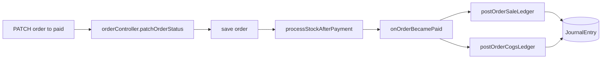
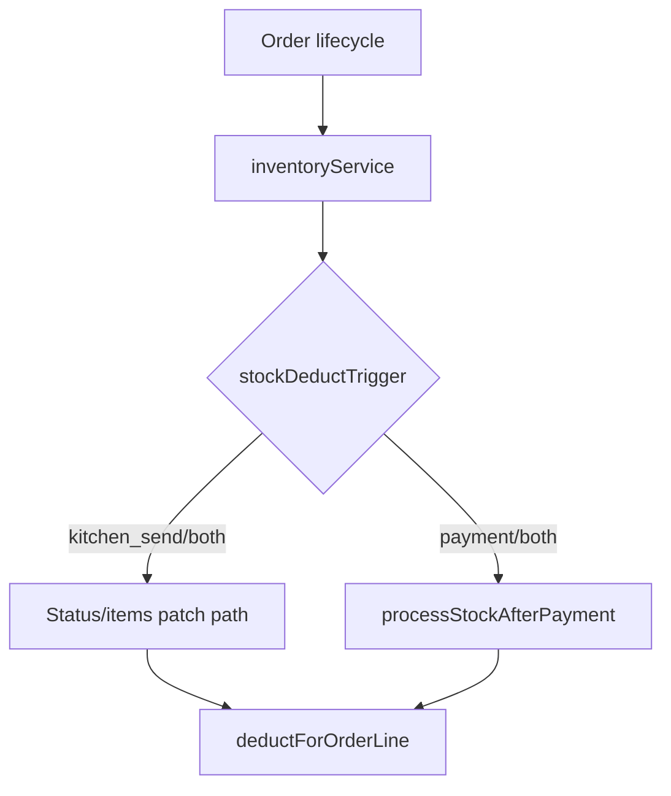

# SYSTEM_AUDIT_MASTER

**Repository:** `posnew` (monorepo)  
**Primary product surfaces:** `apps/pos-backend` (Express + Mongoose + MongoDB), `apps/pos-frontend2` (Next.js App Router — Studio back office + staff POS shell), `apps/saas-dash` (platform operator UI — global section only).  
**Tenancy:** Organization-scoped Mongoose models (`orgScopePlugin`); authenticated `/api/*` with RBAC from `apps/pos-backend/constants/permissionsCatalog.js` and `GET /api/rbac/me`.  
**Audit method:** Static code review **2026-04-16**. All prior `*.md` docs in the repo (except `node_modules`, `.git`, `test-results`) were **deleted** and replaced by this file.

**Emoji badges:** ✅ Fully implemented · ⚠️ Partially implemented · ❌ Missing · 🛑 Broken / integrity risk

**Status tags:** `FULL` = fully implemented · `PARTIAL` = incomplete or risky · `MISSING` = not present · `BROKEN` = incorrect or integrity failure

---

# ACCOUNTING

## 1. What it stands for

General ledger and sub-ledgers: chart of accounts, journals, TB / P&L / balance sheet / cash flow, AR/AP, cash sessions, FX, budgets, bank reconciliation, and **auto-posting from POS** when orders become `paid` (revenue, tax lines, tenders, COGS).

## 2. Business Purpose

| Aspect | Detail |
|--------|--------|
| **Why** | Statutory and management reporting, audit trail, tie POS activity to books, COGS, AP/AR. |
| **Who** | Roles with `backoffice.accounting.*` (see `accountingRoute.js` middleware). |
| **Cross-module** | **Inventory** (cost layers, recipes for COGS; `AccountingConfig.stockDeductTrigger`); **POS** paid orders; procurement **vendor bills**. |
| **Examples** | Period close; invoice from order; bank CSV import; gift cards; AR payment allocation. |

## 3. Current Backend Status

**Overall:** `FULL` — large surface with **`PARTIAL` integrity** on auto-post vs POS (§7).

| Area | Status | Evidence |
|------|--------|----------|
| HTTP API | FULL | `routes/accountingRoute.js` → `/api/accounting/*` (accounts, config, journals, reports, exports, FX, periods, invoices, sessions, gift cards, bank import/match, recurring, budgets, vendor bills, credit notes; ops: post/reverse order, refunds, sync/ack, bootstrap cost layers). |
| Models | FULL | `accountingAccountModel`, `journalEntryModel`, `accountingConfigModel`, `accountingSessionModel`, `accountingSequenceModel`, `journalAuditLogModel`, `accountingPeriodModel`, `accountingInvoiceModel`, `fxRateModel`, `budgetModel`, recurring + bank + sync models; ties to `orderModel`, `customerModel`, `vendorBillModel`, `creditNoteModel`, `giftCardModel`, etc. |
| Services | FULL | `accountingService.js`, `categoryRevenueResolveService.js`, `threeWayMatchService.js`. |
| Business logic | PARTIAL | `onOrderBecamePaid` swallows `postOrderSaleLedger` errors — order can be `paid` without books (§7). |
| Validation | PARTIAL | Strong controller validation; `postOrderSaleLedger` checks tax line sums vs `bills.tax`. |
| Permissions | FULL | `backofficeAccounting` slices (GL/AR/AP/bank/periods). |

**Product gaps:** OFX/multi-bank (optional); no Studio for `POST /sync/ack`.

## 4. Current Frontend Status

**Overall:** `FULL` — extensive Studio under `apps/pos-frontend2/src/app/(main)/dashboard/accounting/`.

| Area | Status | Notes |
|------|--------|-------|
| Pages | FULL | Hub, accounts, ledger, journals, TB, P&L, BS, cash flow, BvA, budgets, periods, FX, exports, audit, sessions, invoices, credit notes, recurring, vendor bills, AR aging, bank, gift cards, order GL. |
| Components / forms | FULL | Manual journal, invoice from order, AR payment, credit note, vendor bill from PO, etc. |
| sync/ack UI | MISSING | API only. |
| Regression test | PARTIAL | Not browser-verified here; align `posCan` with route middleware. |

## 5. Data Flow Logic

### Order to GL



### Manual AR/AP

Studio → `/api/accounting/*` → RBAC → controllers → `accountingService` → `JournalEntry`.

## 6. Missing Features

| Feature | Priority |
|---------|----------|
| Fail or surface error when auto-post fails | Critical |
| Alerting / dead-letter for failed journals | Important |
| OFX bank import | Optional |
| sync/ack UI | Optional |

## 7. Broken Logic

| Issue | Severity |
|-------|----------|
| Paid order ↔ sale journal: HTTP still **200** on failure (non-breaking contract) but **mitigated** — `Order.accountingSaleStatus` / `accountingCogsStatus` + errors persisted; responses include **`accountingPosting`** (see `orderController` + `accountingService.onOrderBecamePaid`). | PARTIAL — ops visibility restored; strict HTTP failure still optional |
| `inventoryService.buildSlowMovingReport` uses movement reasons `sale`/`consume` not in `stockMovementModel` enum | BROKEN — reporting (inventory code) |

## 8. Required Validation Checks

- Paid order ↔ journal existence under org config flags.
- Tax lines sum vs `bills.tax` vs GL.
- Payment splits vs `bills.totalWithTax` after discount/tip.
- Period close vs back-dated posts.
- AR allocations vs customer balance.
- Reversal entries vs originals.

## 9. Dependencies

- **Depends on:** paid orders, categories (revenue accounts), recipes/ingredients/cost layers, customers, vendor bills, `AccountingConfig`.
- **Dependents:** inventory settings, POS checkout, procurement posting, exports.

## 10. Recommended Fix Plan

1. **Immediate:** ~~Make GL failure visible~~ Done at order/API level; optional: strict HTTP + staff toast + dead-letter queue.  
2. **Medium:** Fix slow-moving query; log/metrics on `[accounting]`.  
3. **Long-term:** Deeper bank rec and multi-entity reporting.

---

# INVENTORY

## 1. What it stands for

Ingredient and recipe-based stock: balances, movements, procurement (PO/GRN), returns, stock take, reservations, costing layers, POS availability and oversell policy.

## 2. Business Purpose

| Aspect | Detail |
|--------|--------|
| **Why** | Stock accuracy, food cost, traceability, COGS input. |
| **Who** | `backoffice.inventory.*` (+ cost read where enforced). |
| **Cross-module** | **POS** fulfillability + deduction timing; **Accounting** config + COGS. |
| **Examples** | Deduct on kitchen send vs payment; low stock → PO; stock take variance. |

## 3. Current Backend Status

**Overall:** `FULL` core + **`BROKEN` slow-moving analytics** (§7).

| Area | Status | Evidence |
|------|--------|----------|
| APIs | FULL | `inventoryRoute.js` + `app.js` mounts: stock-take, PO, GRN, vendor returns, RFQ, warehouse, reconciliation, serials. |
| Models | FULL | `stockBalanceModel`, `stockMovementModel`, ingredients, recipes, PO/GRN, layers, reservations, serials, bins/zones, etc. |
| Services | FULL | `inventoryService.js`, `inventorySettingsService.js` (reads `AccountingConfig`), alerts, costing. |
| Dual quantity fields | PARTIAL | `Ingredient.currentStock` vs `StockBalance` — clarify source of truth. |

## 4. Current Frontend Status

**Overall:** `FULL` hub + related dashboard routes.

| Area | Status | Paths |
|------|--------|-------|
| Hub / admin | FULL | `dashboard/inventory/*`, ingredients, categories, recipes, PO, GRN, warehouse. |
| POS | PARTIAL | Uses APIs from session; no dedicated inventory screen on POS. |

**UX:** Offline queue vs concurrent edits — race risk.

## 5. Data Flow Logic



Procurement: PO → GRN → optional bill → receive movements → layers.

## 6. Missing Features

| Feature | Priority |
|---------|----------|
| Concurrency control on orders/stock | Important |
| One on-hand definition for reporting | Important |
| Lot/expiry UI | Optional |

## 7. Broken Logic

- `buildSlowMovingReport`: invalid `reason` values — see Accounting §7.
- Ingredient vs balance reconciliation not enforced in code.

## 8. Required Validation Checks

- Single `stockDeductedAt` per line.
- Non-negative balances.
- Stock take reasons; return quality flags.
- PO/GRN/bill quantities.
- Cost method vs layer consumption.

## 9. Dependencies

- **Depends on:** locations, ingredients, recipes, menu items, accounting config.
- **Dependents:** POS, accounting COGS, procurement UI.

## 10. Recommended Fix Plan

1. Fix slow-moving filter + tests.  
2. Standardize reports on `StockBalance`.  
3. Consider optimistic locking on orders.

---

# POS (Point of Sale)

## 1. What it stands for

Staff floor: tables, checks, kitchen statuses, pay, discounts, printing, loyalty, offline sync; guest **self-order** via public API.

## 2. Business Purpose

| Aspect | Detail |
|--------|--------|
| **Why** | Capture sales; drive kitchen/inventory; trigger accounting on pay. |
| **Who** | `pos.order.*`, `pos.payment.use`, `pos.kitchen.*`; guests unauthenticated on `/api/public/self-order`. |
| **Cross-module** | Inventory, accounting, loyalty, printers. |

## 3. Current Backend Status

**Overall:** `FULL` order/table/kitchen/catalog; **`PARTIAL` payment** (Razorpay exists but not used in `pos-frontend2`).

| Area | Status | Evidence |
|------|--------|----------|
| Orders | FULL | `orderRoute.js` — CRUD, patch items/status, pay, transfer, discount, delete, kitchen, offline sync, reprint. |
| Payments | PARTIAL | `paymentRoute.js` Razorpay create/verify/webhook — **no client usage in POS frontend** (grep). |
| Self-order | FULL | `publicRoute.js` + `selfOrderController.js`. |
| Realtime | FULL | Socket emits from controllers. |

Guest orders: `in-progress`, lines `sent`; **no** guest payment in controller — staff must settle.

## 4. Current Frontend Status

**Overall:** `PARTIAL` vs full retail POS — solid shell; **no integrated PSP** in observed UI.

| Area | Status | Notes |
|------|--------|-------|
| POS routes | FULL | `(main)/pos/*` — floor, table session, payment dialog, refund. |
| Payment UX | PARTIAL | `pos-payment-dialog.tsx` — cash/card/manual; card is reference, not Razorpay SDK. |
| Offline | PARTIAL | `pos-check-sync.ts` + queue — needs conflict testing. |
| Guest | FULL | `self-order/page.tsx`. |
| Floor | PARTIAL | Table-oriented UI (`floor-tables-data-table.tsx`); canvas floor removed in working tree. |

## 5. Data Flow Logic

Staff pay: POS UI → `PATCH .../status` paid → inventory → `onOrderBecamePaid` → response.

Guest: `POST /api/public/self-order` → order + table + sockets (no GL until paid).

## 6. Missing Features

| Feature | Priority |
|---------|----------|
| Wire PSP in POS or remove orphan backend | Critical if cards required |
| Guest pay | Important for QR venues |
| Offline conflict UX | Important |

## 7. Broken Logic

- Silent accounting failure (Accounting §7).
- Razorpay backend without matching POS initiation.
- Self-order line status assumptions vs kitchen/print pipeline — verify in QA.

## 8. Required Validation Checks

- RBAC on every order/payment/kitchen route.
- Split tender math.
- Manual discount caps.
- Table release idempotency.
- Offline replay idempotency.

## 9. Dependencies

- **Depends on:** tables, catalog, users, locations, inventory policy, printers.
- **Dependents:** accounting, inventory, usage entitlements.

## 10. Recommended Fix Plan

1. Single payment architecture.  
2. Couple pay with accounting outcomes.  
3. Guest pay if in roadmap.

---

# GLOBAL SYSTEM HEALTH REPORT

## Overall Status

| Dimension | Rating (1–10) | Note |
|-----------|----------------|------|
| Backend | 7 | APIs broad; pay/GL gap; slow-moving bug. |
| Frontend | 7 | Studio strong; POS PSP gap. |
| Database | 8 | Mongoose + org scope coherent. |
| API layer | 8 | Routers + OpenAPI `tenant-pos-v1.yaml`. |
| Security | 7 | RBAC + rate limits; public menu/self-order needs ongoing review. |
| Scalability | 6 | Sockets + jobs need ops patterns. |

## Critical Problems

1. Paid orders without guaranteed journals.  
2. Razorpay backend vs POS UI mismatch.  
3. Slow-moving inventory report logic.

## Missing Core APIs

- Guest payment to `paid` (if required).  
- Optional per-order accounting health endpoint.

## Missing Core UI

- PSP checkout in POS (if not cash-only).  
- Accounting error surface on closed checks.  
- Optional `sync/ack` screen.

## Risk Areas

- **Financial:** silent GL failure.  
- **Stock:** concurrent edits; deduct timing confusion.  
- **Transaction:** offline replay; splits.  
- **Data:** retry without idempotency.

## Recommended Development Order

1. Harden pay ↔ accounting.  
2. Unify or remove Razorpay stack.  
3. Fix slow-moving + document on-hand truth.  
4. Load-test offline + sockets; add observability.

---

## Appendix: Key paths

| Topic | Path |
|-------|------|
| Accounting routes | `apps/pos-backend/routes/accountingRoute.js` |
| Accounting service | `apps/pos-backend/services/accountingService.js` |
| Inventory routes | `apps/pos-backend/routes/inventoryRoute.js` |
| Inventory service | `apps/pos-backend/services/inventoryService.js` |
| Orders | `apps/pos-backend/controllers/orderController.js` |
| Self-order | `apps/pos-backend/controllers/selfOrderController.js` |
| App bootstrap | `apps/pos-backend/app.js` |
| POS UI | `apps/pos-frontend2/src/app/(main)/pos/` |

---

*Prior repository Markdown documentation was removed per consolidation request; this file is the single documentation source.*

---

## Backend route inventory (from source)

The following tables mirror `router.*` registrations in `apps/pos-backend` so the audit stays **grounded in shipped paths**.

### Accounting — base path `/api/accounting`

| Method | Path |
|--------|------|
| POST | `/ensure-defaults` |
| GET | `/accounts` |
| POST | `/accounts` |
| PATCH | `/accounts/:id` |
| GET | `/accounts/:id/ledger` |
| GET | `/config` |
| PUT | `/config` |
| GET | `/journal-entries` |
| GET | `/journal-entries/:id` |
| POST | `/journal-entries` |
| GET | `/trial-balance` |
| GET | `/reports/pnl` |
| GET | `/reports/cash-flow` |
| GET | `/reports/balance-sheet` |
| GET | `/reports/budget-vs-actual` |
| GET | `/reports/ar-aging` |
| GET | `/reports/session-summary` |
| GET | `/export/journals.csv` |
| GET | `/export/journals.pdf` |
| GET | `/export/integration.json` |
| GET | `/export/trial-balance.xlsx` |
| GET | `/export/trial-balance.pdf` |
| GET | `/audit-log` |
| POST | `/sync/ack` |
| POST | `/post-order/:orderId` |
| POST | `/reverse-order/:orderId` |
| POST | `/refunds/:orderId` |
| POST | `/ar/payments` |
| GET | `/fx/rates` |
| POST | `/fx/rates` |
| DELETE | `/fx/rates/:id` |
| GET | `/fx/resolve` |
| POST | `/inventory/bootstrap-cost-layers` |
| GET | `/periods` |
| POST | `/periods/close` |
| POST | `/closing/retained-earnings` |
| GET | `/invoices` |
| POST | `/invoices/from-order/:orderId` |
| PATCH | `/invoices/:id/void` |
| GET | `/sessions` |
| POST | `/sessions/open` |
| POST | `/sessions/:id/close` |
| GET | `/gift-cards` |
| POST | `/gift-cards/issue` |
| POST | `/gift-cards/redeem` |
| GET | `/bank/statements` |
| POST | `/bank/match` |
| GET | `/bank/match-suggestions/:id` |
| GET | `/bank/reconciliation-report` |
| POST | `/bank/statements/import` |
| GET | `/recurring-templates` |
| POST | `/recurring-templates` |
| PATCH | `/recurring-templates/:id` |
| DELETE | `/recurring-templates/:id` |
| POST | `/recurring-templates/:id/run` |
| GET | `/budgets` |
| POST | `/budgets` |
| PATCH | `/budgets/:id` |
| DELETE | `/budgets/:id` |
| GET | `/recurring-invoices` |
| POST | `/recurring-invoices` |
| PATCH | `/recurring-invoices/:id` |
| DELETE | `/recurring-invoices/:id` |
| POST | `/recurring-invoices/:id/run` |
| GET | `/vendor-bills` |
| GET | `/vendor-bills/:id` |
| POST | `/vendor-bills/from-po` |
| POST | `/vendor-bills/:id/post` |
| POST | `/vendor-bills/:id/payments` |
| POST | `/vendor-bills/:id/void` |
| GET | `/credit-notes` |
| GET | `/credit-notes/:id` |
| POST | `/credit-notes` |

### Inventory — base path `/api/inventory`

| Method | Path |
|--------|------|
| GET | `/low-stock` |
| GET | `/report` |
| GET | `/report/valuation` |
| GET | `/report/slow-moving` |
| GET | `/forecast` |
| GET | `/scan/:barcode` |
| GET | `/movements` |
| GET | `/pos-policy` |
| GET | `/menu-availability` |
| GET | `/analytics/waste` |
| GET | `/analytics/price-history` |
| GET | `/balances` |
| POST | `/adjust` |
| POST | `/returns` |
| POST | `/bootstrap-balances` |
| POST | `/transfer` |
| PATCH | `/balances/planning` |
| POST | `/alerts/run` |

**Related mounts (same app):** `/api/inventory/stock-take`, `/api/stock-takes`, `/api/purchase-orders`, `/api/goods-receipt-notes`, `/api/vendor-returns`, `/api/request-for-quotations`, `/api/warehouse`, `/api/reconciliation`, `/api/serials` (see `apps/pos-backend/app.js`).

### POS / orders — base paths `/api/order`, `/api/orders`

| Method | Path |
|--------|------|
| GET | `/kitchen` |
| GET | `/for-table/:tableId` |
| POST | `/` |
| POST | `/sync` |
| GET | `/` |
| PATCH | `/:id/items/:itemId/status` |
| PATCH | `/:id/items` |
| PATCH | `/:id/status` |
| PATCH | `/:id/transfer` |
| POST | `/:id/manual-discount` |
| DELETE | `/:id` |
| POST | `/:id/reprint/:printerId` |
| GET | `/:id` |
| PUT | `/:id` |

### Payments — `/api/payment`

| Method | Path |
|--------|------|
| POST | `/create-order` |
| POST | `/verify-payment` |
| POST | `/webhook-verification` |

### Public guest — `/api/public`

| Method | Path |
|--------|------|
| POST | `/self-order` |

*(Plus unauthenticated menu/branding endpoints — see `publicRoute.js` and OpenAPI.)*

### Auto-post hook (reference)

Order payment path calls `onOrderBecamePaid` after persistence; implementation swallows journal errors:

```1530:1546:apps/pos-backend/services/accountingService.js
async function onOrderBecamePaid(order, previousStatus, userId) {
  const prev = normalizeOrderStatus(previousStatus);
  const cur = normalizeOrderStatus(order.orderStatus);
  if (cur !== "paid" || prev === "paid") return null;
  try {
    const sale = await postOrderSaleLedger(order._id, userId);
    let cogs = null;
    try {
      cogs = await postOrderCogsLedger(order._id, userId);
    } catch (e) {
      console.error("[accounting] postOrderCogsLedger failed:", e.message);
    }
    return { sale, cogs };
  } catch (e) {
    console.error("[accounting] postOrderSaleLedger failed:", e.message);
    return { error: e.message };
  }
}
```

### Slow-moving report filter (reference)

`buildSlowMovingReport` queries reasons `sale` and `consume`, which are **not** valid enum values on `StockMovement`:

```598:614:apps/pos-backend/services/inventoryService.js
  const movingIds = await StockMovement.distinct("ingredient", {
    organization: organizationId,
    reason: { $in: ["sale", "consume", "order_deduction"] },
    createdAt: { $gte: cutoff }
  });
  // ...
    const lastMove = await StockMovement.findOne({
      organization: organizationId,
      ingredient: ing._id,
      reason: { $in: ["sale", "consume", "order_deduction"] }
    }).sort({ createdAt: -1 }).lean();
```

Authoritative reasons include `order_deduction` (see `stockMovementModel.js` `REASONS` array).

